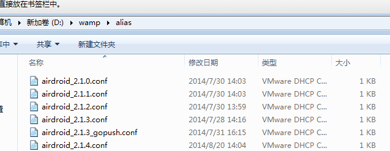
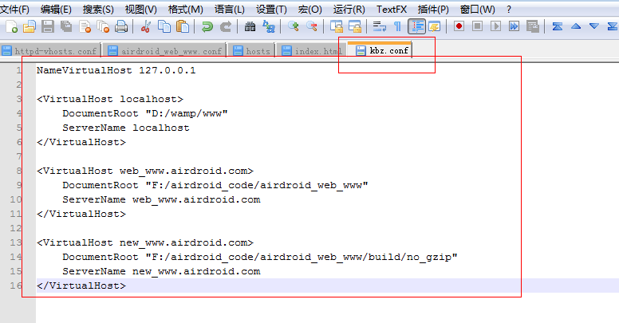

## 前言
我们在进行前端开发的时候，有时候在本地开发的时候，会进行域名host，以便进行绕过服务端的一些CORS校验，这时候我们只需要在hosts文件进行域名host指定即可。
比如本地开发的html路径是：
```html
http://127.0.0.1/airdroid_user/intl_web.htm
```
然后这个页面涉及到登录，然后服务端要求ajax post 的时候，会进行 cors 校验，要求origin一定要 airdroid.com 开头的，这样子开发的时候，就会遇到问题。因此我们需要在hosts进行指向，将 127.0.0.1 改成是 airdroid.com 结尾的，比如：
```html
127.0.0.1 zach.airdroid.com
```
这样就会将本地的 127.0.0.1 指向你设置的那个域名。 就可以登录成功了。
<!--more-->
但是有时候我们不仅仅只是域名指向，甚至还包括目录指向，比如我的开发目录就是：
```html
http://127.0.0.1/airdroid_user/workspace/intl_web.htm
```
但是我需要将其映射成：
```html
http://zach.airdroid.com/intl_web.htm
```
这个地址，这种情况一般是出现在线上调试的时候会有，比如线上就是这个页面，然后调试的时候，需要把这个页面指向我们的开发目录的对应的页面。但是很明显目录是不一样的，这时候就没办法简单的直接用hosts来执行，因为hosts文件只能起到对域名的映射，没法对目录进行映射。
当然，还是有很多的方式可以做到这种映射，比如 nginx 的配置， Apache 的虚拟主机配置， node 的反向代理等等。这边讲的是怎么用Apache 配置虚拟主机的方式来实现。
## 配置过程
### 修改httpd.conf文件
打开appserv的安装目录，找到httpd.conf文件，分别去掉下面两行文字前面的#号。 
```html
#LoadModule vhost_alias_module modules/mod_vhost_alias.so  
```
去掉#意思是启用apache的虚拟主机功能。 
```html
#Include conf/extra/httpd-vhosts.conf  
```
去掉这一行的#意思是从conf/extra/httpd-vhosts.conf这个文件导入虚拟主机配置
### 配置httpd-vhosts.conf
直接对这个文件进行编辑，默认这个文件只会有一些注释，还没有实质内容：
```html
NameVirtualHost 127.0.0.1

<VirtualHost localhost>
    DocumentRoot "D:/wamp/www"
    ServerName localhost
</VirtualHost>

<VirtualHost web_www.airdroid.com>
    DocumentRoot "F:/airdroid_code/airdroid_web_www"
    ServerName web_www.airdroid.com
</VirtualHost>

<VirtualHost new_www.airdroid.com>
    DocumentRoot "F:/airdroid_code/airdroid_web_www/build/no_gzip"
    ServerName new_www.airdroid.com
</VirtualHost>
```
可以看到我这边有进行了两个指向，其中一个还包括开发目录的路径。
### 修改hosts地址
接下来就在 hosts 文件增加这几行：
```html
127.0.0.1       localhost
127.0.0.1 web_www.airdroid.com
127.0.0.1 new_www.airdroid.com
```
<font color=red>注意，这边有个细节，就是这边也要同时设置，localhost，不然你输localhost 的时候，就会指向到 其他两个去</font>
这样就ok了，截图如下：


看起来没问题。
### 优化，写在 alias 更好
后面发现，不需要写在 httpd-vhosts.conf 文件里面。写在这里面任意一个别名文件都可以

比如，我新建了一个 kbz.conf 文件，然后把 hpptd-vhost.conf 的内容移进去

最后重启下 Apache ，发现也是可以的。而且还不污染那个总的 httpd-vhosts.conf 文件。


