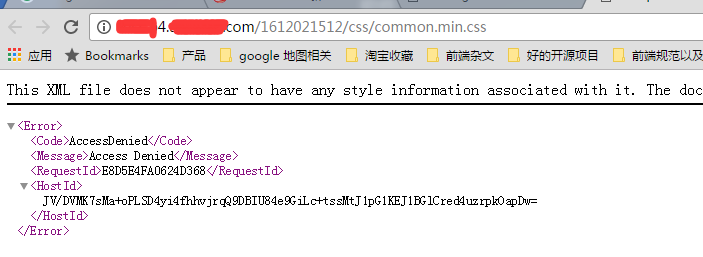
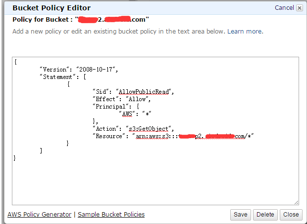
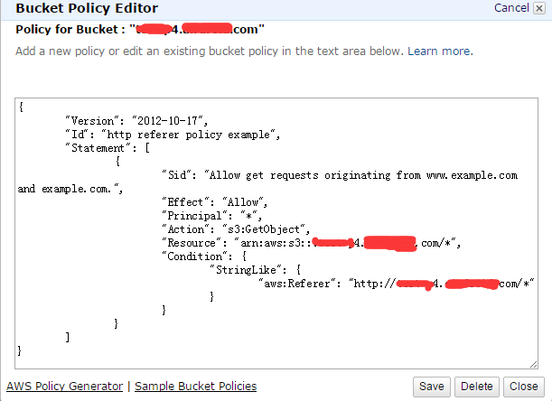
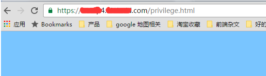

## 前言
之前在配置一个s3 bucket站点的时候，有报了一个 **AccessDenied** 错误：

<!--more-->
后面看了一下，发现应该是 s3 bucket的权限问题。
而类似的 bucket xx2.xxx.com 却一切正常，无论是http 还是 https, 后面查了一下，应该是 bucket policy 设置有问题。
我们正常的bucket的policy是这样子的：

出问题的bucket是这样子的：

很显然，直接将有问题的policy改成跟正常的那个一样就行了，当然resource要换成对应的bucket的名字。
这时候重新将文件上传一份，就可以了(原来的代码还是会有问题，直接删掉就行了)

