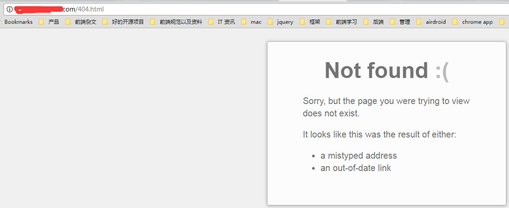
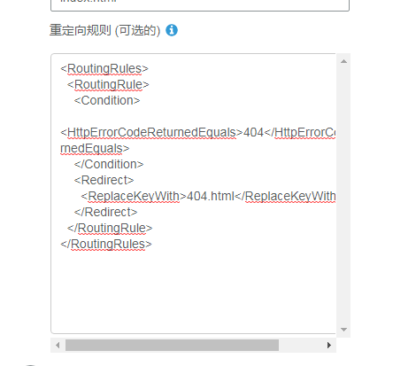
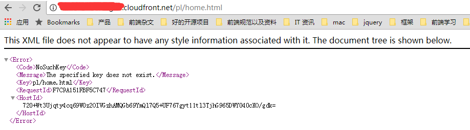
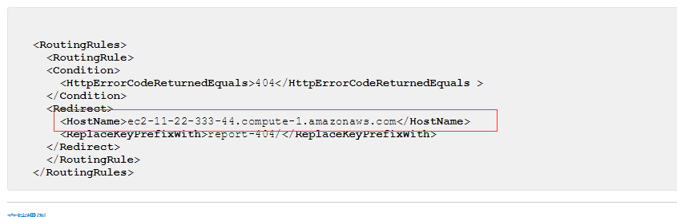
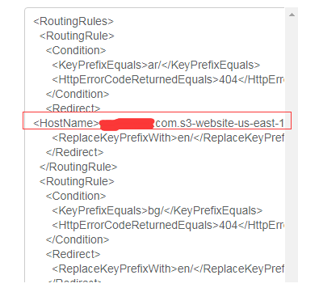

## 前言
事情是这样的，我们有一个在线的站点，这个站点支持多语言。 但是后面发现当这个站点的主页也要放到手机端上显示的时候，这时候就会有一个问题：
因为这个站点的页面同时也是我们手机端APP的内嵌页，但是手机端的APP也有多语言，而且有三十几种多语言，所以就会出现手机端传过来的语言是网页端没有的，比如这时候手机端的语言是 **ka**， 这时候手机端显示首页的url就是： **http://xx.xxx.com/ka/home.html**，但是因为 xx.xxx.com 所在的s3上并没有这种语言的页面，所以就会变成 404 页面：
<!--more-->

## 设置S3重定向规则
因为我们的这个页面是放在AWS的S3 bucket的，因此如果要不显示404页面，而是要显示已存在的语种的对应相同页面的话，比如本来这个页面 ka/home.html 是 404 页面， 然后我们通过规则设置为，如果是这种情况的话，那么就重定向到 en/home.html 页面，这个页面刚才是存在的。
所以我们找到S3 对应bucket的 重定向规则配置页面：

可以看到我们目前的配置是，如果找不到的话，才会跳到 404 页面：
```
<RoutingRules>
  <RoutingRule>
    <Condition>
      <HttpErrorCodeReturnedEquals>404</HttpErrorCodeReturnedEquals>
    </Condition>
    <Redirect>
      <ReplaceKeyWith>404.html</ReplaceKeyWith>
    </Redirect>
  </RoutingRule>
</RoutingRules>
```
但是单单这个规则还不够，还要再加强，所以后面改成所有的语种全部做 rewrite的，但是会有一个条件，就是当为 404 的时候才会触发，并且跳转到对应的en语种对应的页面:
```
<RoutingRules>
  <RoutingRule>
    <Condition>
      <KeyPrefixEquals>ar/</KeyPrefixEquals>
      <HttpErrorCodeReturnedEquals>404</HttpErrorCodeReturnedEquals>
    </Condition>
    <Redirect>
      <ReplaceKeyPrefixWith>en/</ReplaceKeyPrefixWith>
    </Redirect>
  </RoutingRule>
  ... 以下省略N个类似语言的配置
  <RoutingRule>
    <Condition>
      <HttpErrorCodeReturnedEquals>404</HttpErrorCodeReturnedEquals>
    </Condition>
    <Redirect>
      <ReplaceKeyWith>404.html</ReplaceKeyWith>
    </Redirect>
  </RoutingRule>
</RoutingRules>
```
可以看到一个RoutingRule包含的，就是一条规则，每一个rule块都包含两个元素：
- Condition 块就是触发条件
- Redirect 块就是重定向操作

以第一个rule块来说，就是当路径前缀为 **ar/** 字符串开头的页面，并且这个页面的返回值为404的时候(这个时候就说明这个页面找不到了)，刚好满足条件，这时候就触发Redirect块， 这时候就会重定向到以 **en/** 为前缀开头的相同页面。
也就是如果是 ar/home.html 这个页面找不到的话，就会重定向到 en/home.html, 其实就是针对这个页面先replace一下，然后再重定向：
```
rewrite path.replace("ar/","en/")
```
如果是已经存在的页面请求的话，那么Condition块条件不符合，因为返回的是 200，而不是 404。
注意，最后我们还是加上了之前最早的那个 404 的跳转rule，这个还是要加的，因为 rule 规则是自上而下执行的， 也就是如果有一个语言前缀不在这里面，并且还是404 code 返回，那么最后还是会返回到 404页面。
## 设置cloudFront重定向规则
我们已经通过设置S3的重定向规则来支持不存在的语种的情况了，但是后面我们的需求又变了，我们的页面后面要支持https了，为了支持https，我们就换成AWS的cloudFront,但是问题就出现了，换成cloudFront之后固然可以完美支持https，并且还可以用原来的自定义域名(s3 上的资源也可以用https访问，但是如果还是要用自定义域名访问的话，那么只能切换为cloudFront)，但是在测试的过程中，发现之前在s3上设置的 重定向规则全部都没有用了：

直接返回 404 错误，而且还不是出现了 404 页面？？？
后面查了一下网上的答案： [传送门](https://serverfault.com/questions/450940/why-s3-website-redirect-location-is-not-followed-by-cloudfront)
发现如果在s3的重定向规则里面指定hostName的话，是可以解决的,比如这个：

但是我试了一下，发现还是有问题：

后面查了一下， 原来还是 **host name** 配置不对，如果这样配，就可以：
```
<RoutingRules>
  <RoutingRule>
    <Condition>
      <KeyPrefixEquals>ar/</KeyPrefixEquals>
      <HttpErrorCodeReturnedEquals>404</HttpErrorCodeReturnedEquals>
    </Condition>
    <Redirect>
      <Protocol>https</Protocol>
      <HostName>xx.xxx.com</HostName>
      <ReplaceKeyPrefixWith>en/</ReplaceKeyPrefixWith>
    </Redirect>
  </RoutingRule>
  ... 以下省略N个类似语言的配置
  <RoutingRule>
    <Condition>
      <HttpErrorCodeReturnedEquals>404</HttpErrorCodeReturnedEquals>
    </Condition>
    <Redirect>
      <ReplaceKeyWith>404.html</ReplaceKeyWith>
    </Redirect>
  </RoutingRule>
</RoutingRules>
```
这样就可以了， 通过加上这两个规则
```
<Protocol>https</Protocol>
<HostName>xx.xxx.com</HostName>
<ReplaceKeyPrefixWith>en/</ReplaceKeyPrefixWith>
```
当页面不存在的时候，就会重定向到  https://xx.xxx.com/en/xxx 对应的页面，
这样就可以满足我们的需求了。
## 其他方式
当然还有更好的方法，就是在构建的时候，将不支持的语言也静态化预编译一下， 只不过是用 英文的模板去跑：
```
const allLang = ["en", "ar", "bg", "ca", "cs", "de", "es-es", "fr", "hi", "hu", "id", "it", "ja", "ko", "ms", "nl", "pl", "pt-br", "pt-pt", "ru", "sk", "sr", "sv-se", "tr", "uk", "zh-cn", "zh-tw", "no"];
const supportLangs = ['en', 'ja', 'zh-cn', 'zh-tw', 'pt-br', 'es-es', 'de', 'fr', 'it', 'pt-pt', 'ru'];
const unsupportLang = ["ar", "bg", "ca", "cs", "hi", "hu", "id", "ko", "ms", "nl", "pl", "sk", "sr", "sv-se", "tr", "uk", "no"];
。。。省略逻辑。。。
const staticfyTasks = allLang.map(registerStaticfyTask);

function appendLangScript(lang, version) {
    let scriptPath = './';
    if (version) {
        scriptPath += version + '/';
    }
    if (unsupportLang.indexOf(lang) != -1) {
        scriptPath += 'lang/' + getLangFileName('en') + '.js';
    } else {
        scriptPath += 'lang/' + getLangFileName(lang) + '.js';
    }
    return replace(/<\/head>/g, '<script src="' + scriptPath + '"></script></head>');
}
```
这样子虽然会导致文件变多，因为多了好多的html文件，但是就不需要在S3上配置重定向规则了，反而更省事。
