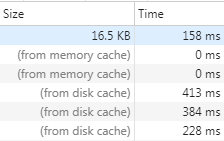
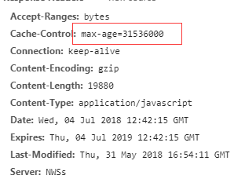
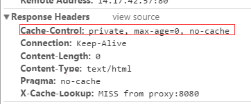
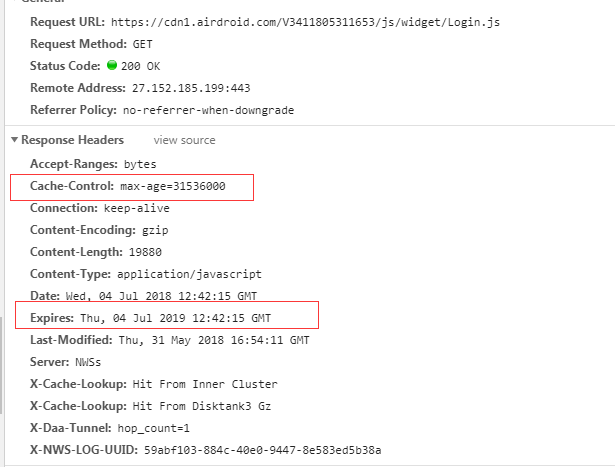
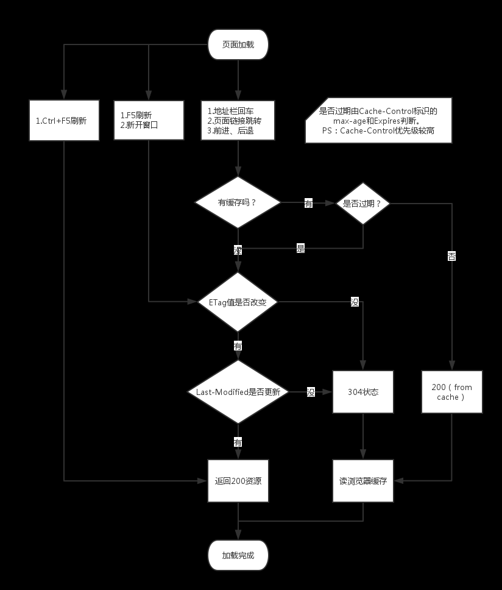

这次主要想讲一讲浏览器缓存的一些事，因为平时我在面试中也会问关于浏览器缓存的一些问题，所以我结合网上的一些资料再加上自己的见解，再老生常谈一下这个问题。
## 缓存对于前端的优化
在前端开发中，性能一直都是被大家所重视的一点，然而判断一个网站的性能最直观的就是看网页打开的速度。其中提高网页反应速度的一个方式就是使用缓存。一个优秀的缓存策略可以缩短网页请求资源的距离，减少延迟，并且由于缓存文件可以重复利用，还可以减少带宽，降低网络负荷。
缓存之于性能优化：
- 请求更快：通过将内容缓存在本地浏览器或距离最近的缓存服务器（如CDN），在不影响网站交互的前提下可以大大加快网站加载速度。
- 降低服务器压力：在大量用户并发请求的情况下，服务器的性能受到限制，此时将一些静态资源放置在网络的多个节点，可以起到均衡负载的作用，降低服务器的压力。
<!--more-->

## 缓存的类别
缓存有分为：
- 服务端缓存，比如 CDN
- 客户端缓存，也就是浏览器缓存

## 浏览器缓存的优点
浏览器缓存(Brower Caching)是浏览器在内存或者本地磁盘对用户最近请求过的文档进行存储，当访问者再次访问同一页面时，浏览器就可以直接从内存或者本地磁盘加载文档。
浏览器缓存的优点有：
- 减少了冗余的数据传输，节省了网费
- 减少了服务器的负担，大大提升了网站的性能
- 加快了客户端加载网页的速度

## webkit的资源分类
说到浏览器的缓存，这边要先了解一个概念： **什么是 webkit 的资源分类??**
webkit的资源分类主要分为两大类：**主资源和派生资源**。
- 主资源：比如HTML页面，或者下载项，对应代码中的类是MainResourceLoader。可以认为是地址栏url对应的那个资源。
- 派生资源：比如HTML页面中内嵌的图片或者脚本链接(js,css)，对应代码中的类是SubresourceLoader。即主资源页面加载的其他资源。

## 浏览器缓存的类别
浏览器的缓存，主要分为两种：
- 强缓存
- 协商缓存

两者的共同点是都从客户端读取资源，不同的是强缓存不会向服务器发送请求，协商缓存会发请求。
总共会有三种不同的状态码分类：
- 200 (from memory cache)
- 200 (from disk cache)
- 304 (Not Modified)

其中前面两种都是属于强缓存， 后面一种 304 是属于协商缓存。

## 强缓存
如果启用了强缓存，请求资源时不会向服务器发送请求，直接从缓存中读取资源，在chrome控制台的network中看到请求返回的200状态码，并在状态码的后面跟着from disk cache 或者from memory cache关键字。
两者的差别在于获取缓存的位置不一样。

### 200 (from memory cache)
不访问服务器，直接读缓存，从内存中读取缓存。此时的数据时缓存到内存中的，当kill进程后，也就是浏览器关闭以后，数据将不存在。
注意： 这种方式只适用于派生资源。 也就是主HTML页面中内嵌页的其他资源，比如css，js 等等。 不包括这个主页面。

虽然Webkit支持memoryCache，但是也只是针对派生资源，它对应的类为CachedResource，用于保存原始数据（比如CSS，JS等），以及解码过的图片数据。

### 200 (from disk cache)
不访问服务器，直接从磁盘中读取缓存，当kill进程时，数据还是存在。
注意：这种方式也只能缓存派生资源。

它的直接操作对象为CurlCacheManager。
它的存储形式为一个index.dat文件，记录存储数据的url，然后再分别存储该url的response信息和content内容。Response信息最大作用就是用于判断服务器上该url的content内容是否被修改。

举个例子就是：
访问-> 200 -> 退出浏览器
再进来-> 200(from disk cache) -> 刷新 -> 200(from memory cache)
### 强缓存原理：Cache-Control 和 Expires
浏览器请求某一资源时，会先获取该资源缓存的header信息，然后根据header中的Cache-Control和Expires来判断是否过期。若没过期则直接从缓存中获取资源信息，包括缓存的header的信息，所以此次请求不会与服务器进行通信。这个就是强缓存。
强缓存是利用http头中的Expires和Cache-Control两个字段来控制的，用来表示资源的缓存时间。强缓存中，普通刷新会忽略它，但不会清除它，需要强制刷新。浏览器强制刷新，请求会带上 Cache-Control:no-cache 和 Pragma:no-cache
#### Cache-Control
Cache-Control是 http1.1 时出现的header信息，主要是利用该字段的max-age值来进行判断，它是一个相对时间，例如Cache-Control:max-age=3600，代表着资源的有效期是3600秒。Cache-Control 有几个比较常用的设置值：
- **max-age（单位为s）指定设置缓存最大的有效时间，定义的是时间长短**
当浏览器向服务器发送请求后，在max-age这段时间里浏览器就不会再向服务器发送请求了。我们来找个资源看下。比如这个 css 资源，max-age=31536000，也就是说缓存有效期为31536000秒（也就是365天）。于是在365天内都会使用这个版本的资源，即使服务器上的资源发生了变化，浏览器也不会得到通知。max-age会覆盖掉Expires。

- **s-maxage（单位为s）同max-age，指定响应在公共缓存中的最大存活时间， 只用于共享缓存（比如CDN缓存）**
比如，当s-maxage=60时，在这60秒中，即使更新了CDN的内容，浏览器也不会进行请求。也就是说max-age用于普通缓存，而s-maxage用于代理缓存。如果存在s-maxage，则会覆盖掉max-age和Expires header。
- **public 指定响应会被缓存，并且在多用户间共享**
如果没有指定public还是private，则默认为public。
- **private 响应只作为私有的缓存，不能在用户间共享**
如果要求HTTP认证，响应会自动设置为private。
它指示响应信息的全部或部分用于单个用户，而不能用一个共享缓存来缓存。这可以让源服务器指示，响应的特定部分只用于一个用户，而对其他用户的请求则是一个不可靠的响应。一个 private（非共享）缓存可以缓存这样的响应。
注意：使用 private 仅仅控制可以缓存响应的哪里，不能保证信息内容的隐私。
- **no-cache 指定不缓存响应，表明资源不进行缓存**

但是设置了no-cache之后并不代表浏览器不缓存，而是在缓存前要向服务器确认资源是否被更改。如果浏览器返回304，那么就还是会取浏览器上的缓存。因此有的时候只设置no-cache防止缓存还是不够保险，还可以加上private指令，将过期时间设为过去的时间。
- **no-store 绝对禁止缓存**
一看就知道如果用了这个命令当然就是不会进行缓存啦～每次请求资源都要从服务器重新获取。
- **must-revalidate 指定如果页面是过期的，则去服务器进行获取**
一旦缓存过期，必须向源服务器进行校验，不得使用过期内容。如果无法连接必须返回504
- **min-fresh 客户端愿意接受一个新鲜度不小于当前age加上指定时间的响应**
简单说在指定的后续一段时间内不会过期的响应。
- **immutable**
表示响应正文不会随时间而改变。资源（如果未过期）在服务器上不发生改变，因此客户端不应发送重新验证请求头（例如If-None-Match或If-Modified-Since）来检查更新，即使用户显式地刷新页面。
即连304服务端都不用返回了，因为不会请求服务端。 这样可以节省流量还有减少请求时间。比如： 

Cache-Control: max-age=365000000, immutable

不过它有一定的浏览器兼容性问题。

#### Expires
Expires是http1.0的规范，它的值是一个绝对时间的GMT格式的时间字符串。比如 ：expires:Fri, 14 Apr 2017 10:47:02 GMT。这个时间代表这这个资源的失效时间，只要发送请求时间是在Expires之前，那么本地缓存始终有效，则在缓存中读取数据。所以这种方式有一个明显的缺点，由于失效的时间是一个绝对时间，而且它代表的是服务端的具体时间，也就是说，Expires=max-age + 请求时间， 所以当服务器与客户端时间偏差较大时，就会导致缓存混乱。如果同时出现Cache-Control:max-age和Expires，那么max-age优先级更高。response headers部分如下：

那么表示资源可以被缓存的最长时间为 31536000。
注意： Cache-Control与Expires可以在服务端配置同时启用，同时启用的时候Cache-Control优先级高。
## 协商缓存
协商缓存就是由服务器来确定缓存资源是否可用，所以客户端与服务器端要通过某种标识来进行通信，从而让服务器判断请求资源是否可以缓存访问，这主要涉及到下面两组header字段，这两组搭档都是成对出现的，即第一次请求的响应头带上某个字段（Last-Modified或者Etag），则后续请求则会带上对应的请求字段（If-Modified-Since或者If-None-Match），若响应头没有Last-Modified或者Etag字段，则请求头也不会有对应的字段。
通过这两组参数，如果符合，那么服务器就会返回304状态码并带上新的response header通知浏览器从缓存中读取资源。
普通刷新会启用协商缓存，忽略强缓存。只有在地址栏或收藏夹输入网址、通过链接引用资源等情况下，浏览器才会启用强缓存，这也是为什么有时候我们更新一张图片、一个js文件，页面内容依然是旧的，但是直接浏览器访问那个图片或文件，看到的内容却是新的， 因为直接访问是属于主资源的，这时候是不能用强缓存的，只能用协商缓存。
### Last-Modify/If-Modify-Since
浏览器第一次请求一个资源的时候，服务器返回的header中会加上Last-Modify，Last-modify是一个时间标识该资源的最后修改时间，例如Last-Modify: Thu,31 Dec 2037 23:59:59 GMT。
当浏览器再次请求该资源时，request的请求头中会包含If-Modify-Since，该值为缓存之前返回的Last-Modify。服务器收到If-Modify-Since后，根据资源的最后修改时间判断是否命中缓存。
如果命中缓存，则返回304，并且不会返回资源内容，并且不会返回Last-Modify。
### ETag/If-None-Match
与Last-Modify/If-Modify-Since不同的是，Etag/If-None-Match返回的是一个校验码（Apache中，ETag的值，默认是对文件的索引节（INode），大小（Size）和最后修改时间（MTime）进行Hash后得到的）。ETag可以保证每一个资源是唯一的，资源变化都会导致ETag变化。服务器根据浏览器上送的If-None-Match值来判断是否命中缓存。
与Last-Modified不一样的是，当服务器返回304 Not Modified的响应时，由于ETag重新生成过，response header中还会把这个ETag返回，即使这个ETag跟之前的没有变化。
### 为什么要有Etag？
你可能会觉得使用Last-Modified已经足以让浏览器知道本地的缓存副本是否足够新，为什么还需要Etag呢？HTTP1.1中Etag的出现主要是为了解决几个Last-Modified比较难解决的问题：
- 一些文件也许会周期性的更改，但是他的内容并不改变(仅仅改变的修改时间)，这个时候我们并不希望客户端认为这个文件被修改了，而重新GET；
- 某些文件修改非常频繁，比如在秒以下的时间内进行修改，(比方说1s内修改了N次)，If-Modified-Since能检查到的粒度是s级的，这种修改无法判断(或者说UNIX记录MTIME只能精确到秒)；
- 某些服务器不能精确的得到文件的最后修改时间。

注意： Last-Modified与ETag是可以一起使用的，服务器会优先验证ETag，一致的情况下，才会继续比对Last-Modified，最后才决定是否返回304。

## 用户行为影响
强缓存与协商缓存的区别可以用下表来表示：

| 缓存类型        | 获取资源形式  | 状态码     |    发送请求到服务器 |
| ------------- |:-------------:| -----:| ---:|
| 强缓存     | 从缓存取 | 200（from cache） | 否，直接从缓存取  |
| 协商缓存     | 从缓存取      |   304（Not Modified） |  是，通过服务器来告知缓存是否可用 |

用户行为对缓存的影响:

|用户操作	|强缓存|	协商缓存 |
| ------------- |:-------------:| -----:|
|地址栏回车	|有效	|有效|
|页面链接跳转	|有效	|有效|
|新开窗口	|有效	|有效|
|前进回退	|有效	|有效|
|F5刷新	|无效	|有效|
|Ctrl+F5强制刷新	|无效	|无效|

上述缓存控制机制优先级:
- Expires < Cache:max-age
- Last-Modified < ETag

引用一张网络图片：

## 练习题
**以下为 page.html 内容：**

<!DOCTYPE html><html xmlns="http://www.w3.org/1999/xhtml"><head>
  <meta http-equiv="Content-Type" content="text/html; charset=utf-8" />
  <title>page页</title></head><body>
  
  <a href="page.html">重新访问page页</a></body></html>

首次访问该页面，页面中 head.png 响应头信息如下：

HTTP/1.1 200 OK
Cache-Control: no-cache
Content-Type: image/png
Last-Modified: Tue, 08 Nov 2016 06:59:00 GMT
Accept-Ranges: bytes
Date: Thu, 10 Nov 2016 02:48:50 GMT
Content-Length: 3534

- 问题1：请问当点击“重新访问 page 页”链接重新加载该页面后， head.png 如何二次加载？
- 问题2：如果将上述信息中的 Cache-Control 设置为 private，那么结果又会如何呢？

### 解答
- **第一道题：**
分析上述 Http 响应头发现有以下两项与缓存相关：

Cache-Control: no-cache
Last-Modified: Tue, 08 Nov 2016 06:59:00 GMT

Cache-Control: no-cache 相当于 Cache-Control: max-age=0，将其分解：
Cache-Control: max-age=0，
接着 Cache-Control: max-age=0 又可分解成：

Cache-Control: public/private （不确定是二者中的哪一个）
Expires: 当前时间

所以最终结果是：浏览器会再次请求服务端，并携带上 Last-Modified 指定的时间去服务器对比：
    - a）对比失败：服务器返回200并重发数据，客户端接收到数据后展示，并刷新本地缓存。
    - b）对比成功：服务器返回304且不重发数据，客户端收到304状态码后从本地读取缓存数据。

- **第二道题：**
跟上题一样，找到缓存项

Cache-Control: private
Last-Modified: Tue, 08 Nov 2016 06:59:00 GMT

这时候你会发现根本找不到 相关缓存项， 这时候就要靠浏览器自己遵循的一个启发式的缓存过期策略，也就是所谓的新鲜度检测：
通过 fiddle 抓包可以看到，他是根据响应头中2个时间字段 Date 和 Last-Modified 之间的时间差值，取其值的10%作为缓存时间周期。
贴一下Caching面板里的描述：

HTTP/1.1 Cache-Control Header is present: private
HTTP Last-Modified Header is present: Tue, 08 Nov 2016 06:59:00 GMT
No explicit HTTP Cache Lifetime information was provided.
Heuristic expiration policies suggest defaulting to: 10% of the delta between Last-Modified and Date.
That's '05:15:02' so this response will heuristically expire 2016/11/1

关于这个浏览器默认的试探性过期算法，我这边摘录了 **<<HTTP权威指南>>** 这本书的相关资料：

如果响应中没有 Cache-Control：max-age 首部，也没有 Expires首部，缓存可以计算出一个试探性最大试用期。可以使用任意算法，但如果得到但最大使用期大于24小时，就可以向响应首部添加一个Heuristic Expiration Warning（试探性过期警告）首部。据我们所知，很少有浏览器会为用户提供这种警告信息。
LM-Factor 算法是一种很常见但试探性过期算法，如果文档中包含了最后修改日期，就可以使用这种算法。LM-Factor算法将最后修改日期作为依据，来估计文档有多么易变。算法的逻辑如下：
 - 如果已缓存文档最后一次修改发生在很久以前，它可能会是一份稳定的文档，不太会突然发生变化，因此将其继续保存在缓存中会比较安全。
 - 如果已缓存文档最近被修改过，就说明它很可能会频繁得发生变化，因此在于服务器进行再验证之前，只应该将其缓存很短一段时间


从书上来看的话，上面是将LM-Factor设置为差值的0.2的计算周期，跟本例抓包的差值的0.1的计算周期有点差别，不过后面的篇幅有详细说了浏览器这个新鲜度检测远远比这个复杂多了，要综合考虑很多因素，包括服务器的处理时间，响应的网络延迟，缓存的停留时间，所以并不是一成不变的。
所以结果就是： 浏览器会根据 Date 和 Last-Modified 之间的时间差值缓存一段时间，这段时间内会直接使用本地缓存数据而不会再去请求服务器（强制请求除外），缓存过期后，会再次请求服务端，并携带上 Last-Modified 指定的时间去服务器对比并根据服务端的响应状态决定是否要从本地加载缓存数据。
## 总结
强制缓存优先于协商缓存进行，若强制缓存(Expires和Cache-Control)生效则直接使用缓存，若不生效则进行协商缓存(Last-Modified / If-Modified-Since和Etag / If-None-Match)，协商缓存由服务器决定是否使用缓存，若协商缓存失效，那么代表该请求的缓存失效，重新获取请求结果，再存入浏览器缓存中；生效则返回304，继续使用缓存。

---

参考：
[浏览器缓存](https://segmentfault.com/a/1190000008377508)
[浏览器缓存，想说爱你不容易](https://segmentfault.com/a/1190000005704489)
[Web前端中的静态资源缓存笔记](https://segmentfault.com/a/1190000013464971)
[彻底弄懂 Http 缓存机制 - 基于缓存策略三要素分解法](https://mp.weixin.qq.com/s/qOMO0LIdA47j3RjhbCWUEQ)

