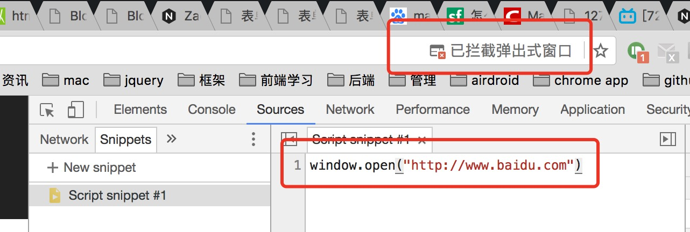
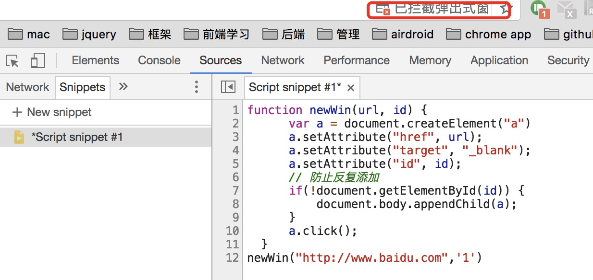

在之前做项目的时候，有遇到一种情况，有些浏览器的行为触发，只能借由当下用户的行为触发，否则直接由js的代码执行触发是不行的

##### 这些行为目前遇到过的有：

* 出现授权允许框（比如桌面通知授权框）
* 弹出框  window.open
* 全屏 fullScreen

这些事件只能在用户主动触发的事件中，比如click，调用才会被实现，而且只能同步调用。

举个例子，以window.open 方法为例，如果直接在浏览器的代码片段直接触发的话，默认会被浏览器所block掉

#### 对于window.open的行为
具体到项目就是我们的一个第三方登陆的项目，如果点击第三方的按钮，出现window弹出框，这个时候，因为是主动触发点击的（在click事件处理里面），因此该窗口不会被浏览器阻止。
而在分享的时候，弹出分享授权框是由js来触发的 （不在click的事件里面），因此很大可能性会被浏览器给阻止掉

之前有在网上看过可以用a便签代替，但是经过我测试，至少在Chrome上还是会被截住

function newWin(url, id) {  
      var a = document.createElement("a")  
      a.setAttribute("href", url);  
      a.setAttribute("target", "_blank");  
      a.setAttribute("id", id);  
      // 防止反复添加  
      if(!document.getElementById(id)) {                       
          document.body.appendChild(a);  
      }  
      a.click();  
  }  
newWin("http://www.baidu.com",'1')


#### 对于全屏操作
在点击图片的时候，实现全屏 (click事件里面)
而如果要在大图加载完之后，再触发全屏，就会实现不了
（因为这时候实现全屏的代码不在click事件里面，而在图片的onload里面，这个是一个异步）

---
### 总结
在click事件（用户主动行为）里面用异步(setTimeout ajax setInterval)是不行的，只能用同步操作

因此如果是在ajax的回调函数里面来弹出窗口的话，只能用这种方式：先弹出窗口，再重定向，具体代码如下：

xx.addEventListener(‘click‘, function () {  
        // 打开页面，此处最好使用提示页面  
        var newWin = window.open(‘loading page‘);  
        ajax().done(function() {  
        // 重定向到目标页面  
        newWin.location.href = ‘target url‘;  
    });  
});  


以上方法其实是打开了两个地址，所以建议大家打开第一个地址的时候给出一个类似‘当前页面正在加载中，请稍后。。’的简单提示页，这样可以避免打开两次真正的目标页面，让用户察觉到页面的重定向。

当然还有一种方式，就是打开这个窗口之后，由请求的后端去重定向到具体的url，这个其实更快。不过需要后端程序配合