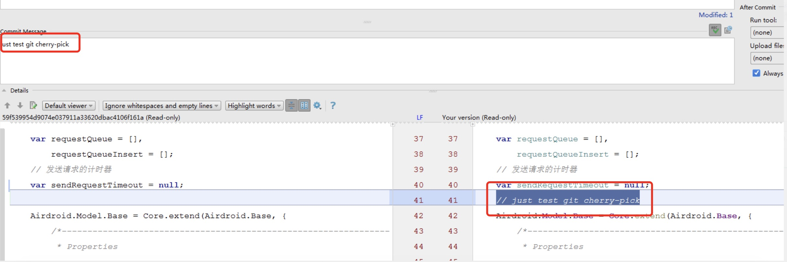
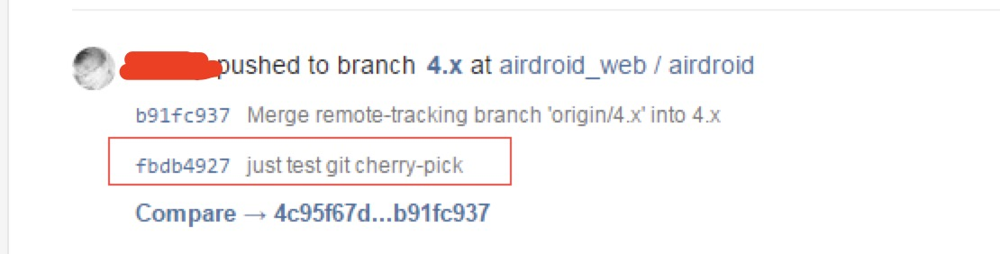
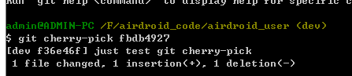
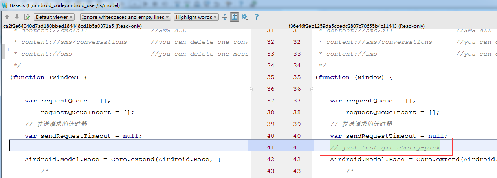
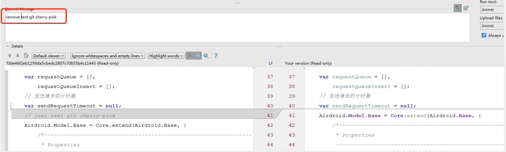
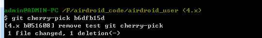
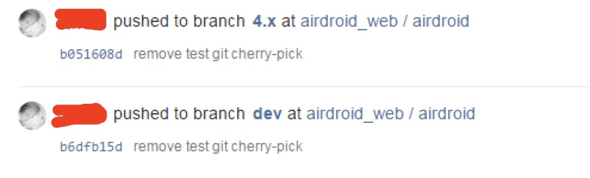

之前在做一个项目的4.0改版的时候，从项目中的dev分支拉了一个分支4.x作为新版4.x的分支，然后在这 4.x 分支做了很多修改，包括很多图片替换，修改了很多bug。其中发现有些bug的fix，其实也需要合并到dev去。这时候就麻烦了，因为不能直接把4.x的内容直接merge 到 dev 分支。因为会把之前4.x分支的很多修改都合并进去。这不是我们想要的，我们想要的只是要把当前4.x分支的这个bug fix 的commit 提交合并到 dev 分支，而其他的commit不用。这时候就要用 git 的 cherry-pick 来处理。 
举个例子： 比如我们在 4.x 的分支上，对Base.js 进行了修改。
<!--more-->

这时候提交上去。这时候查看gitlab 就可以看到这一条提交记录了

接下来切换到 dev 分支。这时候查看发现 Base.js 没有这个修改。然后接下来就是使用 cherry-pick 来合并这一条合并了。

发现合并成功了，接下来就push上去了。在push的时候，可以发现已经把那一条commit 的修改同步过去了。

查看gitlab 提交记录，就会发现，这个既不是merge，也不是 rebase，而是相当于又重新复制了一次提交记录。

接下来我们试试反向的，就是在 dev 分支中，把这个 git cherry-pick test的注释删掉，然后提交上去。

然后在 cherry-pick 到 4.x 分支。

成功，接下来push的时候，发现这个commit已经合并进去了。
查看提交记录

发现没错。

---

总结：Git cherry-pick可以选择某一个分支中的一个或几个commit(s)来进行操作。例如，假设我们有个稳定版本的分支，叫v2.0，另外还有个开发版本的分支v3.0，我们不能直接把两个分支合并，这样会导致稳定版本混乱，但是又想增加一个v3.0中的功能到v2.0中，这里就可以使用cherry-pick了。当执行完 cherry-pick 以后，将会 生成一个新的提交；这个新的提交的哈希值和原来的不同，但标识名 一样。
