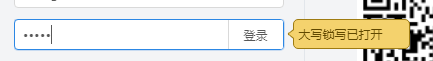

之前做一个项目的时候，有个需求是用户在密码框输入密码的时候，如果当前是开启大写的话，那么就要给个提示。像这样子：

具体代码如下：

/**
 * 检测有没有开启大写标记
 * @param e
 * @param showHandle
 * @param hideHandle
 */
detectCapsLock: function (e, showHandle, hideHandle) {
    e = e || window.event;
    // 获取按键的keyCode
    var keyCode = e.keyCode || e.which;
    var isShift = e.shiftKey || (keyCode === 16 ) || false;
    // 判断shift键是否按住
    if (((keyCode >= 65 && keyCode <= 90 ) && !isShift) || ((keyCode >= 97 && keyCode <= 122 ) && isShift)) {
        if (_.isFunction(showHandle)) {
            showHandle();
        }
    } else {
        if (_.isFunction(hideHandle)) {
            hideHandle();
        }
    }
}


ps: 后面我发现在我的mac book pro 中会失效，因为我的电脑的大写的方式是先按住shift键，然后再按下字母键。其实这个逻辑不在上面的判断中，所以会无效