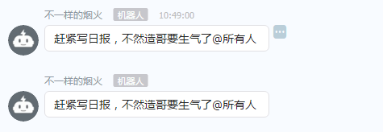

之前有个需求就是我每天早上都要到那个小伙伴群去通知他们要写日报。
这样真的很烦，后面我就写了一个机器人的webhook，周一到周五的10点的 0分，10分，各推送一次，通知他们要写日报
因为是常驻程序，所以就用nodejs写了一个发起webhook的post请求，然后用forever 启动就行了。
关于钉钉机器人的创建，文档直接看这边：[传送门](https://open-doc.dingtalk.com/docs/doc.htm?spm=a219a.7629140.0.0.karFPe&treeId=257&articleId=105735&docType=1)

nodejs的代码如下：(access token 怎么得到直接看上面的文档)：
<!--more-->

// 发送钉钉通知
var https = require('https');
var sendNotice = function(){
    var data = {
        "msgtype": "text",
        "text": {
            "content": "赶紧写日报，不然造哥要生气了"
        },
        "at": {
            "isAtAll": true
        }
    };
    data = JSON.stringify(data);
    console.log(data);
    var opt = {
        method: "POST",
        host: "oapi.dingtalk.com",
        path: "/robot/send?access_token=xxxx",
        headers: {
            "Content-Type": 'application/json'
        }
    };
    var req = https.request(opt, function (res) {
        var body = "";
        res.
        on('data', function (data) {
            body += data;
        })
        .on('end', function () {
            console.log(body);
        });
    });
    req.on('error', function(e) {
        console.log('problem with request: ' + e.message);
    });
    req.write(data + "\n");
    req.end();
};

var schedule = require("node-schedule");
var rule = new schedule.RecurrenceRule();
// 周一到周五的10点的 0分，10分，各弹一次
rule.dayOfWeek = [1, new schedule.Range(2, 5)];
rule.hour = 10;
rule.minute = [0,10];
var j = schedule.scheduleJob(rule, function(){
    // 发送通知
    console.log("发送通知");
    sendNotice()
});

console.log("=========start==========");


最后部署到服务器，forever 启动：

然后就可以看到推送了

