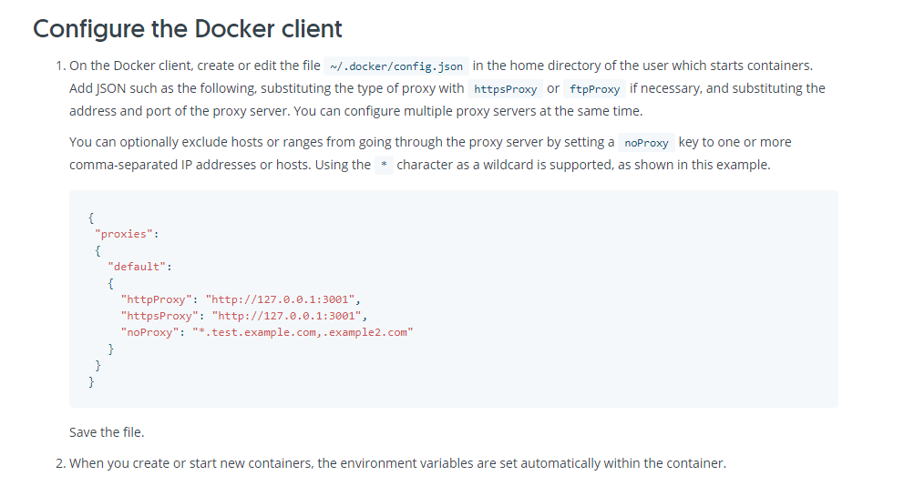

## 前言
之前在用docker安装golang 版本的时候，有出现过一种情况，就是宿主机有设置代理，但在docker的容器内(container)下载golang依赖资源的时候，却不能使用宿主机的代理设置，所以下载依赖就会失败。
举个例子，我run了一个 docker 的容器，基于 go10.1 这个go版本。
```html
[root@VM_156_200_centos docker-go1.10]# sudo docker run -it  --name golang-1.10-1  kbz/golang-1.10
```
然后我把宿主机的 go 程序的代码放到这个容器里面的 GOPATH 路径的 src 目录,最后跑起来，但是因为没有安装依赖，所以会报错:
```html
[root@VM_156_200_centos docker-go1.10]# docker cp /root/go/src/goworker golang-1.10-1:/go/src/
[root@VM_156_200_centos docker-go1.10]# docker exec -it golang-1.10-1  /bin/bash
root@4943d5f1558c:/app# cd /go/src
root@4943d5f1558c:/go/src# ls
go_learn_demo  goworker
root@4943d5f1558c:/go/src# cd goworker/
root@4943d5f1558c:/go/src/goworker# ls
hello_worker.go  worker  worker.go
root@4943d5f1558c:/go/src/goworker# go run *.go
hello_worker.go:5:2: cannot find package "github.com/benmanns/goworker" in any of:
    /usr/local/go/src/github.com/benmanns/goworker (from $GOROOT)
    /go/src/github.com/benmanns/goworker (from $GOPATH)
```
<!--more-->
这时候我返回到 src，然后安装依赖，发现要挂代理才能下载
```html
root@4943d5f1558c:/go/src/goworker# cd ../
root@4943d5f1558c:/go/src# go get github.com/benmanns/goworker
package golang.org/x/net/context: unrecognized import path "golang.org/x/net/context" (https fetch: Get https://golang.org/x/net/context?go-get=1: dial tcp 216.239.37.1:443: i/o timeout)
```
结果我检测了一下，发现在容器里面，竟然是没有代理的, 而退出到宿主机，确实有代理的， 宿主机代理设置具体看： 
```html
root@4943d5f1558c:/go/src# curl cip.cc
IP    : 119.xx.xx.28
地址    : 中国  广东  广州
运营商    : tencent.com

数据二    : 广东省广州市海珠区 | 深圳市腾讯计算机系统有限公司IDC机房(BGP)

数据三    : 中国广东省广州市 | 电信

URL    : http://www.cip.cc/119.xx.xx.28
root@4943d5f1558c:/go/src# exit
exit
[root@VM_156_200_centos docker-go1.10]# curl cip.cc
IP    : 119.xx.xx.79
地址    : 中国  香港  tencent.com

数据二    : 新加坡 | 腾讯云

数据三    : 中国香港香港 | 腾讯

URL    : http://www.cip.cc/119.xx.xx.79
```
## 尝试方案
查了一下网上的教程：[custom-docker-daemon-options](https://docs.docker.com/config/daemon/systemd/#custom-docker-daemon-options)
并且参照了一下网上的方案，也说可以这样设置？？ 然后我跟着试了一下：
```html
[root@VM_156_200_centos docker-go1.10]# sudo mkdir -p /etc/systemd/system/docker.service.d
[root@VM_156_200_centos docker-go1.10]# vim /etc/systemd/system/docker.service.d/http-proxy.conf
[root@VM_156_200_centos docker-go1.10]# vim /etc/systemd/system/docker.service.d/https-proxy.conf
[root@VM_156_200_centos docker-go1.10]# sudo systemctl daemon-reload
[root@VM_156_200_centos docker-go1.10]# systemctl restart docker
[root@VM_156_200_centos docker-go1.10]# systemctl show --property=Environment docker
Environment=GOTRACEBACK=crash DOCKER_HTTP_HOST_COMPAT=1 PATH=/usr/libexec/docker:/usr/bin:/usr/sbin HTTP_PROXY=http://127.0.0.1:8118/ HTTPS_PROXY=https://127.0.0.1:8118/
```
刚开始是 设置为 127.0.0.1
```html
[root@VM_156_200_centos docker-go1.10]# systemctl show docker |grep 127.0.0.1
Environment=GOTRACEBACK=crash DOCKER_HTTP_HOST_COMPAT=1 PATH=/usr/libexec/docker:/usr/bin:/usr/sbin HTTP_PROXY=http://127.0.0.1:8118/ HTTPS_PROXY=http://127.0.0.1:8118/
```

接下来进入到 docker 容器中：
```html
[root@VM_156_200_centos docker-go1.10]# docker start  -ai golang-1.10-1
root@f6f5b929b332:/app# curl cip.cc
IP    : 119.xx.xx.28
地址    : 中国  广东  广州
运营商    : tencent.com

数据二    : 广东省广州市海珠区 | 深圳市腾讯计算机系统有限公司IDC机房(BGP)

数据三    : 中国广东省广州市 | 电信

URL    : http://www.cip.cc/119.xx.xx.28
```
发现还是没有代理的情况？？？ 之后我改成用的是 docker 的虚拟网桥地址，主机上启动的Docker容器会连接到这个虚拟网桥上：
```html
[root@VM_156_200_centos ~]# ifconfig
。。。

docker0: flags=4163<UP,BROADCAST,RUNNING,MULTICAST>  mtu 1500
        inet 172.17.0.1  netmask 255.255.0.0  broadcast 0.0.0.0
        ether 02:42:17:40:c8:62  txqueuelen 0  (Ethernet)
        RX packets 28163  bytes 1512024 (1.4 MiB)
        RX errors 0  dropped 0  overruns 0  frame 0
        TX packets 37113  bytes 123305214 (117.5 MiB)
        TX errors 0  dropped 0 overruns 0  carrier 0  collisions 0

。。。
```
也就是 **172.17.0.1**, 改过来看看
```html
[root@VM_156_200_centos docker-go1.10]# systemctl show docker |grep 172.17.0.1
Environment=GOTRACEBACK=crash DOCKER_HTTP_HOST_COMPAT=1 PATH=/usr/libexec/docker:/usr/bin:/usr/sbin HTTP_PROXY=http://172.17.0.1:8118/ NO_PROXY=localhost,127.0.0.1,docker-registry.example.com,.corp HTTPS_PROXY=http://172.17.0.1:8118/
```
进入docker 容器里面:
```html
[root@VM_156_200_centos docker-go1.10]# docker start  -ai golang-1.10-1
root@f6f5b929b332:/app# curl cip.cc
IP    : 119.xx.xx.28
地址    : 中国  广东  广州
运营商    : tencent.com

数据二    : 广东省广州市海珠区 | 深圳市腾讯计算机系统有限公司IDC机房(BGP)

数据三    : 中国广东省广州市 | 电信

URL    : http://www.cip.cc/119.xx.xx.28
```

发现还是不行。
因为宿主机的 /etc/profile 有设置代理，所以容器里面，也设置一下，看看行不行， 反正试试看呗？？
```html
root@f6f5b929b332:/app# vim /etc/profile
bash: vim: command not found
```
发现容器内，都没有 vim 这个指令？？？
因为容器是一个简单的 ubuntu 系统，所以要安装一下：
```html
root@f6f5b929b332:/app# apt-get update
...                              
Reading package lists... Done

root@f6f5b929b332:/app# apt-get install vim
...
update-alternatives: using /usr/bin/vim.basic to provide /usr/bin/editor (editor) in auto mode


root@f6f5b929b332:/app# apt-get install apt-utils
...
Processing triggers for libc-bin (2.24-11+deb9u3) ...

```
这样子，就可以在容器里面进行 vim 指令了：
```html
root@f6f5b929b332:/app# vim /etc/profile
root@f6f5b929b332:/app# cat /etc/profile | grep proxy
# ss http proxy
export http_proxy=http://172.17.0.1:8118
export https_proxy=http://172.17.0.1:8118
export ftp_proxy=http://172.17.0.1:8118
root@f6f5b929b332:/app# source /etc/profile
```
这时候在容器里 curl 这个域名，发现端口都通不了，估计需要映射出来？？ 而且还是没有代理
```html
root@f6f5b929b332:/app# curl 172.17.0.1
curl: (7) Failed to connect to 172.17.0.1 port 8118: Connection refused
root@f6f5b929b332:/app# curl cip.cc
IP    : 119.xx.xx.28
地址    : 中国  广东  广州
运营商    : tencent.com

数据二    : 广东省广州市海珠区 | 深圳市腾讯计算机系统有限公司IDC机房(BGP)

数据三    : 中国广东省广州市 | 电信

URL    : http://www.cip.cc/119.xx.xx.28
```
## 解决方法
后面又在官网找到另一篇教程：[use-environment-variables](https://docs.docker.com/network/proxy/#use-environment-variables)
根据不同的docker版本，有两种方式：


If your container needs to use an HTTP, HTTPS, or FTP proxy server, you can configure it in different ways:

    - In Docker 17.07 and higher, you can configure the Docker client to pass proxy information to containers automatically.

    - In Docker 17.06 and lower, you must set appropriate environment variables within the container. You can do this when you build the image (which makes the image less portable) or when you create or run the container.


因为我的 docker 版本的客户端是 1.13.1， 所以只能用下面那种方式：
```html
[root@VM_156_200_centos docker-go1.10]# docker version
Client:
Version:         1.13.1
```

所以重新改一下 dockerfile 
```html
[root@VM_156_200_centos docker-go1.10]# cat dockerfile
FROM golang:1.10
ENV HTTP_PROXY "http://127.0.0.1:8118"
ENV HTTPS_PROXY "http://127.0.0.1:8118"
RUN mkdir /app
ADD . /app/
WORKDIR /app
```
重新 build 成 kbz/golang-1.10-2, 然后重新 run 一个容器出来：
```html
[root@VM_156_200_centos docker-go1.10]# sudo docker run -it  --name golang-1.10-3  kbz/golang-1.10-2
root@6b68c09cf1ff:/app# curl cip.cc
IP    : 119.xx.xx.28
地址    : 中国  广东  广州
运营商    : tencent.com

数据二    : 广东省广州市海珠区 | 深圳市腾讯计算机系统有限公司IDC机房(BGP)

数据三    : 中国广东省广州市 | 电信

URL    : http://www.cip.cc/119.xx.xx.28
```
试了一下，好像也不行？？？ 那只能是另一种方式，就是把 docker 升级到 17.07 及以上，通过： ，已经升级上来了,并且大于 17.07 了
```html
[root@VM_156_200_centos ~]# docker version
Client:
Version:           18.09.2
```

接下来就开始配置 json 文件了：
```html
[root@VM_156_200_centos ~]# mkdir .docker
[root@VM_156_200_centos ~]# vim  ~/.docker/config.json
cat: vim: No such file or directory
{
"proxies":
{
   "default":
   {
     "httpProxy": "http://127.0.0.1:8118",
     "httpsProxy": "http://127.0.0.1:8118",
     "noProxy": "localhost"
   }
}
}
```
然后重新 run 一个 容器看看， 镜像还是用之前的，
```html
[root@VM_156_200_centos ~]# docker run -it  --name golang-1.10-1  kbz/golang-1.10
root@bd9ec6bba9eb:/app# curl cip.cc
curl: (7) Failed to connect to 127.0.0.1 port 8118: Connection refused
```
发现 8118 端口还是被拒绝了， 有可能是 8118 端口没有映射出去，考虑到 docker 默认的是 bridge 的网络模式，端口是要做转发映射的。
所以为了直接用宿主机的 ip 和 端口，我们换成用 host 的网络模式，让它可以跟宿主机共用一个 Network Namespace。
```html
[root@VM_156_200_centos ~]# docker run -it --net host  --name golang-1.10-1  kbz/golang-1.10
root@VM_156_200_centos:/app# curl cip.cc
IP    : 119.xx.xx.79
地址    : 中国  香港  tencent.com

数据二    : 新加坡 | 腾讯云

数据三    : 中国香港香港 | 腾讯

URL    : http://www.cip.cc/119.xx.xx.79
```
这样子果然代理出去了。

那么如果把刚才那个代理的json配置文件去掉，是不是就会不能代理了？？？， 试试呗
```html
[root@VM_156_200_centos ~]# cd .docker/
[root@VM_156_200_centos .docker]# ll
total 4
-rw-r--r-- 1 root root 161 Feb 21 18:03 config.json
[root@VM_156_200_centos .docker]# mv config.json  config.json.bak
[root@VM_156_200_centos .docker]# ll
total 4
-rw-r--r-- 1 root root 161 Feb 21 18:03 config.json.bak
```
把名字改掉，然后run 一个新的，看看：
```html
[root@VM_156_200_centos .docker]# docker run -it --net host  --name golang-1.10-test  kbz/golang-1.10
root@VM_156_200_centos:/app# curl cip.cc
IP    : 119.xx.xx.28
地址    : 中国  广东  广州
运营商    : tencent.com

数据二    : 广东省广州市海珠区 | 深圳市腾讯计算机系统有限公司IDC机房(BGP)

数据三    : 中国广东省广州市 | 电信

URL    : http://www.cip.cc/119.xx.xx.28
```
果然不能翻墙了。然后再把 json 文件重新改回来，再试试
```html
[root@VM_156_200_centos .docker]# mv config.json.bak  config.json
[root@VM_156_200_centos .docker]# ls
config.json
[root@VM_156_200_centos .docker]# docker run -it --net host  --name golang-1.10-test2  kbz/golang-1.10
root@VM_156_200_centos:/app# curl cip.cc
IP    : 119.xx.xx.79
地址    : 中国  香港  tencent.com

数据二    : 新加坡 | 腾讯云

数据三    : 中国香港香港 | 腾讯

URL    : http://www.cip.cc/119.xx.xx.79
```
果然又可以代理了。

---

后面有出现了一个问题：我现在容器里面可以使用宿主机的代理了，但是我发现在宿主机使用 docker pull 下载镜像，会报错，但是进入容器，网络又正常？？ 而且宿主机的网络也正常
```html
[root@VM_156_200_centos .docker]# docker pull centos
Using default tag: latest
Error response from daemon: Get https://registry-1.docker.io/v2/: proxyconnect tcp: dial tcp 172.17.0.1:8118: connect: connection refused
```
后面查了一下，原来是之前我在进行尝试的时候，在docker的配置文件，增加了两个配置文件：
```html
[root@VM_156_200_centos .docker]# cd /etc/systemd/system/docker.service.d/
[root@VM_156_200_centos docker.service.d]# ll
total 8
-rw-r--r-- 1 root root 124 Feb 19 11:48 http-proxy.conf
-rw-r--r-- 1 root root 125 Feb 19 11:49 https-proxy.conf
```
但是因为之前尝试失败，就放在那边，而且重装的时候，也一直还在，导致还一直在生效，所以这个要删掉才行,并且重启docker
```html
[root@VM_156_200_centos docker.service.d]# cd ..
[root@VM_156_200_centos system]# rm -rf docker.service.d/
[root@VM_156_200_centos system]# systemctl daemon-reload
[root@VM_156_200_centos system]# systemctl restart docker
[root@VM_156_200_centos system]# systemctl show --property=Environment docker
Environment=
```
这样 docker pull 就正常了：
```html
[root@VM_156_200_centos system]# docker pull centos
Using default tag: latest
latest: Pulling from library/centos
a02a4930cb5d: Pull complete 
Digest: sha256:184e5f35598e333bfa7de10d8fb1cebb5ee4df5bc0f970bf2b1e7c7345136426
Status: Downloaded newer image for centos:latest
```
所以之后尝试失败的东西，一定要清干净！！！