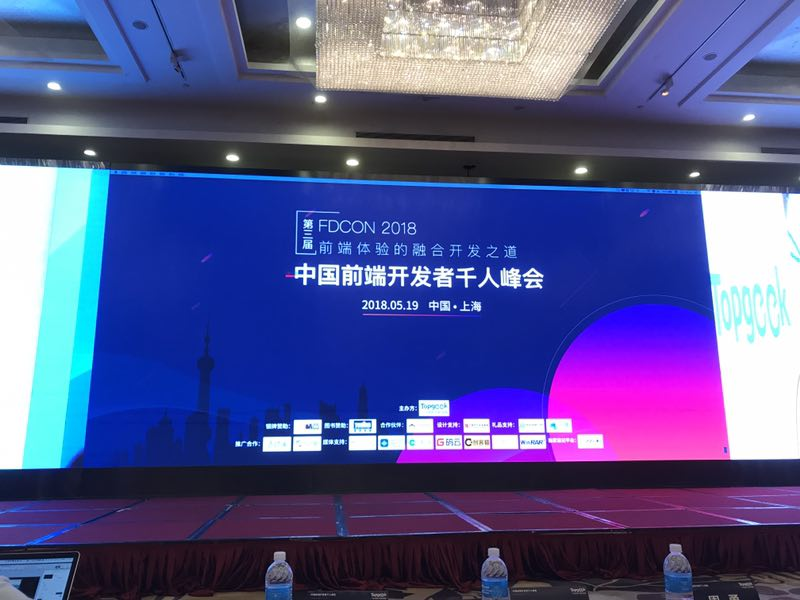
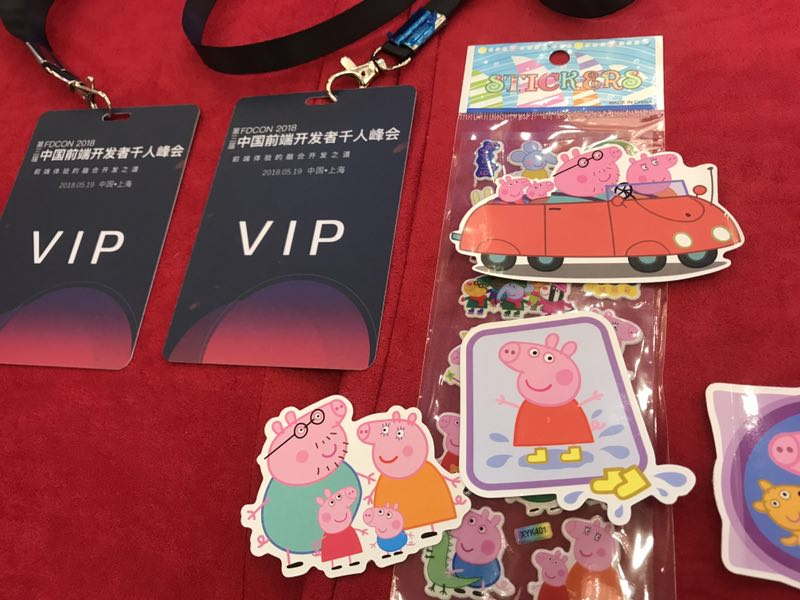

上周六去上海参加了第三届中国前端开发者大会，当然说到这一点，必须在这边再次感谢公司，能够让我有这次机会借着公费出差的方式去学习，而且一买就是vip的票，直接坐在嘉宾第二排，真的是壕无人性 ε٩(๑> ₃ <)۶з

当然有一点要吐槽的是，会场的贴纸竟然是小猪佩奇，我只能说太社会了 ╮(๑•́ ₃•̀๑)╭
当然在分享的过程中，技术干货其实也不少，总算也没有白去啊。
<!--more-->
当然最主要的收获有两点：
1. 当然是看到真人版的寸志老师啦， 哇， 超腼腆的
2. 还有就是张云龙大大讲的主题<一个程序员的成长史>解开了我一个今年开始就一直存在的疑惑
---
### 接下来让我们回到主题来，也就是 人到三十，怎能不惑???
这个主题分为两部分：
1. 人到了三十了，怎么可能不迷惑?
2. 人到了三十了，怎么才能不迷惑?

首先是第一点，也就是人到了三十了，怎么可能不迷惑，恰恰我今年三十岁了，在这个年纪，我已经成家了，也即将有了自己的孩子，可以说在家庭方面，我不迷惑，我知道我要做个好丈夫，也知道将来也要做个好爸爸，可以说家庭方面，我不迷惑，可以做到三十不惑。

然而工作呢？到今年我已经步入工作6年，从刚开始的纯前端，到近两年来的前后端都做，开始步入全栈领域，可以说我一直有意识的在扩大自己的技术圈，一直在避免技术太过单薄的情况。

而且从管理上，也有3-4年的技术管理经验，从开始的毛头小子到现在可以独立负责前后端小组的工作安排和人才培养。

表面上来看光鲜亮丽，团队核心。 但是其实我的内心一直充满迷茫。 我很想知道我的核心价值在哪里，是我技术很强？ 还是我管理很强？这个我根本没法自我肯定，也没法自我否定。因此从今年开始，我一直都在寻找一个答案，那就是我作为一个技术人员，或者说一个技术管理人员，我的核心竞争力是什么？？？

当然，我的同事经常笑我闲的蛋疼，还有时间想着这破事。 其实不然，我这个人危机意识很强，工作上我没有错， 错的是我作为一个技术人员，我的年纪太老了，我已经三十了，我不是刚毕业的小伙子了， 那么我跟刚毕业的人，或者刚工作的人，应该会有一个差别， 这个差别应该是他们必须花上三年，乃至5年的时间才能赶上我的， 这就是我要追求的答案， 我的核心竞争力？

当然不是说，老程序员不好啊，我绝对没有贬低的意思，其实不是，国外甚至国内，有非常多的老程序员都非常棒，非常 enjoy 他们的工作，并且在技术这条路上有非常好的贡献和产出，但是我觉得那不是我将来要走的路。

其实从今年开始，团队的前端和后端都需要招人， 因此我进行了大量的面试， 估摸着也有 50-100 个吧， 每次遇到超过4年的前端，我都会问他们， 你觉得你的核心竞争力是什么？ 但是其实结果都不是我要的，好一点的答案就是 有自己的技术专研和技术积累， 差一点的就是直接做库和框架的搬运工（就是说自己懂得多少多少库，会使用多少多少框架），后一种情况，当我再问，你觉得如果一个刚毕业的人，我给他一年的时间，他能够学会刚才你说的那些所有的库和框架吗？ 这时候他们就会哑口无言了。

我知道自己不是一个技术geek，很多时候促使我研究技术的，恰恰是因为我的危机感， 真是另类的自驱力啊， 今天晚上我还在跟我老婆调侃，她说她自己是积极废人（思想上很积极，但是行动上是废人），我说我跟她的区别在于 "你赚的钱，后面用来贴补家用，而我赚的钱，可是后面要能用来买房子的，如果我跟你都一样，那咱俩就都废了"

---

就这样，一直抱着这个迷惑， 直到我参加了这次大会，我才解开了，也就是第二个主题， 人到三十，怎么才能不迷惑？？
就是从张云龙大大讲的<一个程序员的成长史>中，我得到了解答， 我没有他那么牛逼的履历，从名牌大学，到大厂工作，有了业内名声，最后创业当CTO.
不过他讲的有一点跟我非常的有共鸣，就是一个程序员的中年危机到底是什么？（以下三点我直接抄他的ppt内容）：
1. 技术要深入到什么程度?
2. 做久了技术总要转型管理?
3. 我能做什么? 我想做什么?

然后他讲到了三点：
1. 一技之长
    1. 栈内技术
    2. 栈外技术
    3. 工程经验
    4. 带人做事
    5. 业界发声
2. 独立做事
    1. 独立 Coding
    2. 独立带新人
    3. 独立带团队
    4. 独立做业务
    5. 独立能生存
3. 拥有事业
    1. 企业使命
    2. 商业模型
    3. 凝聚人才
    4. 整合资源
    
总共就这三点，然后每个点都有不同的小点，当然第三点拥有事业，对我还说，还比较远，暂时我也没有想法。
主要是一技之长 和 独立做事，真正能让我解惑的，其实就是以下两点：
##### 1. 工程经验 
包括前端工程和后端工程，属于领域型的解决方案，包括技术选型，架构设计，性能优化等等，这些都是刚毕业或者刚工作的人，没法涉及到的，只能通过时间和经验来积累，走不了任何的捷径，只能真正实操过才能得到经验，只看文章根本不算
##### 2. 带人做事
注意这边是"带" 而不是 "管"， 如果是管的话，那么你可以不懂这个事情，只要你的下属给你回执就行了。 这样是远远不够的， 而带的意思就是，你要把原本你做的好好的事情，交给你要带的人，让他去做，并且在他做的一塌糊涂的时候，还的去一步一步的去引导他，让他走向正确的方向和养成良好的做事风格。 从而在接下来的工作中，渐渐独当一面。 这个才是带的最终结果， 这个也是需要在工作中不停的积累才行。
当然这里面还有一个进阶，如果是带多个人做事的话，那么就是带团队了

---
总结： 除了要在技术上的一技之长上要继续迭代，跟进潮流之外， 工程经验和带人做事， 也是需要不停的在工作中，总结和积累才行。 这样才能慢慢形成自己的做事风格。 从而具备自己的核心竞争力， 不会担心自己被这个时代所淘汰  (ง •̀_•́)ง (*•̀ㅂ•́)و

