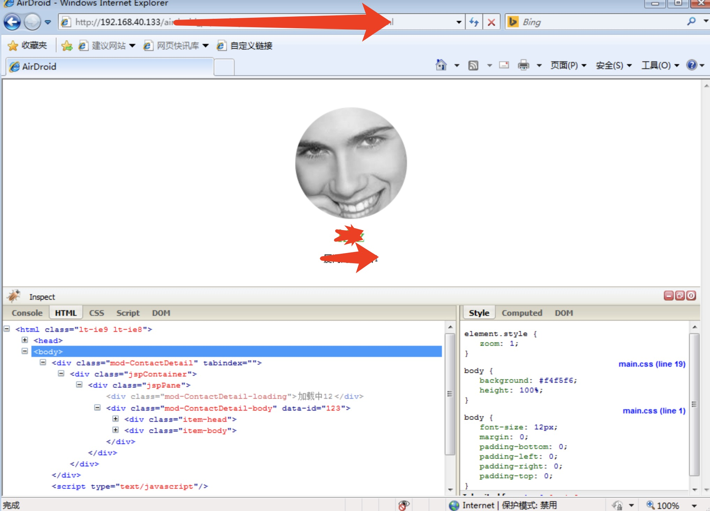
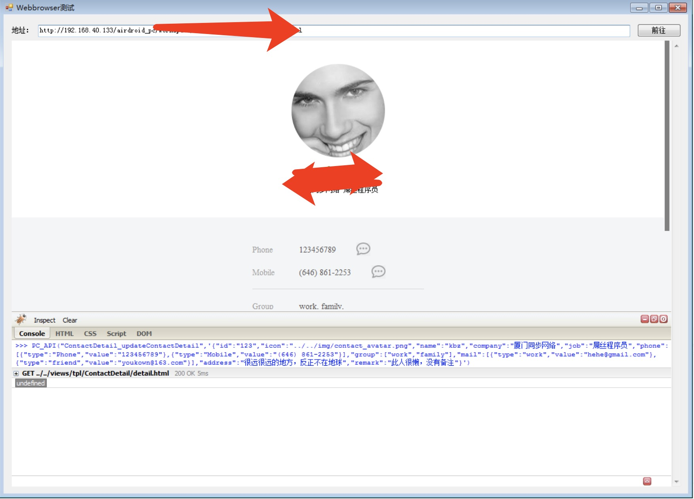

之前在做一个pc端内嵌页项目的时候，因为要兼容XP系统，而XP系统的webview内核是 ie6，所以在调试IE 6， IE 7 的时候，发现调试非常难调，尤其是webview调试，根本没有所谓的调试窗口，后面发现有一个神器，就是firebug lite版，可以让你轻松的调试ie。
其实就是在html标签后面嵌入一段js：



只要放在 html 闭合标签的后面，让其加载，然后就可以出现调试窗口框了
<!--more-->
在IE 7 下 表现为：

在webview 也很吊，甚至可以输入命令

以后调试ie6,ie7 就靠他了