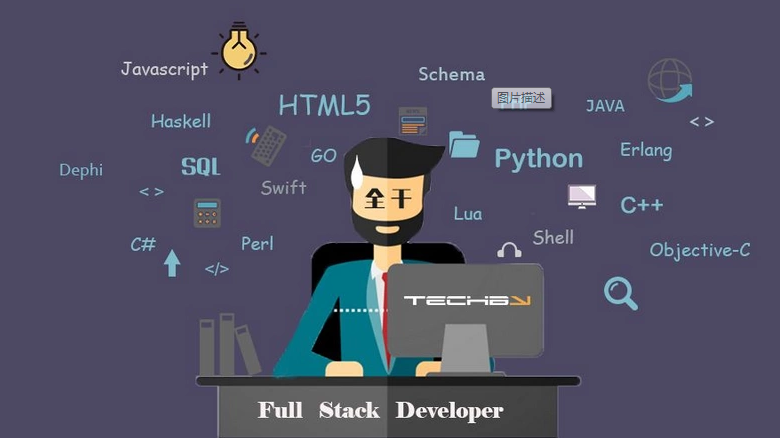

## 前言
这段时间要在公司内做一个分享，关于全栈的话题，所以我就参考了网上的一些文章，再结合自己这几年的工作，对何为全栈也提出了自己的看法。
## 全栈是什么
全栈工程师，英文 Full Stack developer，是指那些掌握多种技能，并能利用多种技能独立完成产品的人。当然，现在「全栈工程师」很吃香，非常吃香！这是因为在移动互联网时代，IT 系统变得愈加复杂，需要拥有全局思维的工程师来搞定各种「疑难杂症」。不仅要玩得转前端，还要搞得定后端，总之各种技术都懂，所以其重要性可见一斑。
<!--more-->
而对全栈的定义，据我所了解的，最早来源于Facebook的工程师Calos Bueno在2010年底时写的一篇文章：[The Full Stack](https://www.facebook.com/note.php?note_id=461505383919&sw_fnr_id=1327989795&fnr_t=0&sw_fnr_id=3070728406&fnr_t=0&sw_fnr_id=3070728407&fnr_t=0&sw_fnr_id=3070728408&fnr_t=0)。作者认为全栈是一个通才，能够自己创建不平凡的应用程序。他也指出，没人能够熟悉所有方方面面，但作为一个全栈，能够看清每个栈的上下之间是如何运作的。
而百度百科收录的定义则是：掌握多种技能，并能利用多种技能独立完成产品的人。收录的原文其实是这篇：[全栈工程师到底有什么用](https://www.williamlong.info/archives/3731.html)。本质上来说，和Calos Bueno的观点大同小异。

所以如果要独立完成产品，那么如果要求高的，可以认为：  
```html
全栈 = 需求分析 + 产品设计+ UI设计 + (移动)客户端开发 + 前端开发 + 后端开发 + 运维
```
但是这个太难了，基本上来说，除了个人开发者(包括中国早期的站长时代那一群人，当然要写代码的那种，那时候很多站长其实只是熟练利用建站工具而已)，其他人基本上很难达到这种能力，而个人开发者现在其实已经越来越少了，现在基本上优秀的产品都是团队开发的。而且隔行如隔山，单单把代码这个层面搞的很牛逼已经很难了，更不用说要懂得产品和UI了，那是另一个领域的东西了。

所以现在对全栈工程师的一种比较要求低的，并且比较受大家认可的，其实就是全端工程师，也就是既懂前端开发，也会后端开发。其实就是专注于代码层面上的东西，而且现在前端JS也可以做客户端了，比如PC端有 Electron， 移动端也有 Native。所以基本上来说，从代码层面上，可以 cover 住整个产品的开发需求，那么就可以称为全栈工程师了。
比如熟悉H5前端开发和Node.js后端开发，或者会 JS 和 PHP，这些从上面的要求来看，就可以称得上是全栈工程师了。

## 全栈工程师的价值
全栈的价值，最早来自于 Facebook 的「我们只招全栈工程师」，再加上上面那种秒天秒地秒空气的介绍和很多Flag公司都已经声称只招 Full Stack 的员工。当然会导致全栈很火啦，有点像普通工程师的 plus 加强版。
那么全栈工程师的价值在何处？ 难道是因为我懂前端和后端，所以前后端的代码全部我来写？ 其实很多时候往往不是， 全栈工程师的价值不是说你一个人可以干几个人的活，而是在这个项目中，所要扮演什么样的角色，就以我自己来举例吧，我勉勉强强敢说自己是一个全栈工程师，前面4-5年专攻前端，后面2年转为后端，但是前端领域的东西还是一样跟进和学习，目前管理团队中的前端组和服务端组两个小组。但是我的日常工作中，其实后面写的业务代码也会变得越来越少，而是我把我的工作精力更多的放在了整个团队的产品上，从全局性思维去考虑问题，并且可以使得项目中各个组的沟通成本降低。说白了，就是通过全局性思维去做技术架构和优化，再通过自己的眼界和见识去降低团队中的沟通成本。
### 全局性思维
现代项目的开发，很少说只用到一两种技术的，特别是移动互联网大潮下。随便一个互联网项目中用到的技术，就会需要用到后端开发、前端开发、界面设计、产品设计、数据库、各种移动客户端、三屏兼容、RESTful API设计和OAuth等等。Web前端也远远不是从前的切个图用个jQuery上个AJAX兼容各种浏览器那么简单了。现代的Web前端，你需要用到模块化开发、多屏兼容、MVC，MVVM，各种复杂的交互与优化，甚至你需要用到Node.js来协助前端的开发, 比如 SSR。所以说一个现代化的项目，是一个非常复杂的构成，我们需要一个人来掌控全局，他不需要是各种技术的资深专家，但他需要熟悉到各种技术。对于一个团队特别是互联网企业来说，有一个全局性思维的人非常非常重要。
全局思维能力是最难提高的，需要不断扩展自己的技能栈，要不断扩大自己的视野，要站在更高的视角看问题。像如果是我经手的项目，前端方面我肯定会注意到网页加载速度优化，会考虑打包问题，会考虑浏览器缓存和CDN，会考虑SEO问题和多语言页面静态化。后端方面，我会考虑设计API的合理性，数据库表结构设计的冗余，不同大区之间的负载均衡，对一些重要服务的集群部署，对微服务的注册和发现，对数据库的优化，比如 mysql ，redis 的主从，mongo的副本集架构。这时候我要考虑的已经不是程序他能不能工作（能不能工作会有组内的开发者去实现，我只要负责code review和指导就行了），而是能不能很好的工作， 或者是怎么样更好的，更快，更稳定的工作（设置更多的优化指标，做好各种预警，做好容灾处理）。 同时也会反过来基于在技术上的一些实现方案和演进，同时也会给产品经理、UI设计师提建议。
### 良好的沟通能力
项目越大，沟通成本越高，做过项目管理的人都知道，项目中的人力是1+1<2的，人越多效率越低。因为沟通是需要成本的，不同技术的人各说各话，前端和后端是一定会掐架的。每个人都会为自己的利益而战，毫不为已的人是不存在的。举个很现实的例子，大部分的初级服务端开发者写接口都不考虑前端的跨域问题，不考虑 options 请求的回执，然后前端在进行 ajax 请求的时候，就会出现跨域问题，这时候就会质问服务端的人说你的接口有问题，不行，要改。服务端的人也不服气，我的接口怎么不行啦，我在浏览器地址栏访问，在postman上访问，不都返回正常的json格式，为啥你就不行，这时候就会掐起来了。

而全栈工程师的沟通成本几乎为零，因为各种技术都懂，胸有成竹，一不小心自己就全做了。即使是在团队协作中，与不同技术人员的沟通也会容易得多，你让一个后端和一个前端去沟通，那完全是鸡同鸭讲，更不用说设计师与后端了。但如果有一个人懂产品懂设计懂前端懂后端，那沟通的结果显然不一样，因为他们讲的，彼此都能听得懂。
### 解决问题的能力和超强的学习能力
以上两种能力只是我认为全栈工程师要比普通工程师更突出，也更具有价值的能力。当然作为全栈工程师，熟练掌握工作领域中的各种技术栈了，比如前后端开发、数据库、运维等。这时候当然要有比之普通工程师更强的解决问题的能力和学习能力了。
比如 Google 的 Adwords 就是几个非相关工程师主动解决了小问题带来大收益的。再比如 Facebook 的人才培养一开始是不分工的，「新兵营」之后才分工，并且轮岗很多，这中间暗含了：学习能力要相当强，我想学什么，都能学什么，需要我做什么，都能胜任。
## 怎么样发展全栈
上面提到的全栈工程师的价值其实就是指的是全栈工程师的软能力。而全栈工程师的硬能力就是对工作领域中的各个技术栈的实实在在的掌握。

如果是前端的，那么就要学习基础的 HTML,JS,CSS 乃至比较进阶的 HTML5, ES6, VUE, React， React Native 再到更深层次的，比如 web安全攻击的防护(XSS,CSRF)，页面速度的优化(CDN, 浏览器缓存)，SEO 的优化等等。

如果是后端的，那么就要学习基础语言的语法的RESTful API 的设计(Go，PHP，Node), 再进阶就是做服务，比如队列服务，缓存服务，订阅服务，计划任务服务，再到更深层次的就是服务优化，比如负载均衡，预警和容灾处理，集群和微服务的注册和发现，配置中心的分发等等。其中后端会涉及到一些运维和数据库的东西，而运维又会涉及到一些第三方云服务的管理，比如 AWS 的 S3,cloudfront，router 53，SES, RDS，VPS 等等。越到后面越细。
### 一专多长
“先精后广 ，一专多长 ”是指 ，建议初学者学习全栈技能的时候 ，先在一个特定的方向上有比较深入的钻研 ，然后再将学习目标渐渐推广开来 。比如先从前端方向入手 ，掌握了基本的 HTML、CSS 、JavaScript之后 ，不要转头向服务器端语言或者 App 方向发展 ，而是深入到性能优化 、SEO 、多种框架 、响应式页面等前端细节中去 。经过一到两年的深入研究之后 ，再去学习其他方向 。

为什么要强调在开始的时候要专精方向的重要性呢？因为这样您才能在求职的时候有一个“亮点”。无论是毕业生还是社会招聘 ，仅仅满足招聘要求是不够的 。您需要在招聘要求的方向上以 200%的能力来得到这个职位 。一个求职者在整个流程中会受到多方考核 ： HR考核您的成本和价值 ，专业面试官 （不是全栈工程师 ）考核您的专业能力 ，经理考核您的沟通能力 。在所有这些考核中 ，其实每一环都是漏斗型筛选 ，会过滤掉一些人 。所以作为求职者 ，一定要在某个特定方向上有非常深入的理解 。仅仅会做还不够 ，还要理解背后的原因 ，还有背后的背后的原因 。

说白了，一定要做T字型人才，其中T的那一竖就是你的专长，也是你的大腿，只有你的大腿够粗，才能支撑你接下来要扩展的多个技能，这样大楼才不会塌。以我举例子来说，我在转做全栈之前，一直在做前端，做了4-5年，项目中的绝大部分的前端项目都是我架构和开发的，在这期间也一直在对前端进行研究，对我来说，前端就是我作为全栈基础上的那个专精的方向。也正是基于这样的前端基础，我后面学习服务端，学习运维之类的，也会有个基石，而且因为有基础了，在学习其他知识的时候，会有触类旁通的感觉，也会学习的很快。

而如果是毕业生或者初学者 ，我不建议在刚开始的一到两年接触太多技术 ，杂而不精 ，结果可能会对后面的职业道路产生副作用 。如果是接下来打算走全栈方向的话，建议在初始领域沉淀个3年以上，才开始慢慢接触其他领域。 不然就会变成，样样懂一点，样样都不精，结果最后的竞争力还不如那些一开始就沉浸在某一个领域的人。
### 围绕商业目标去学习
```html
“当您只有一把锤子，您看什么都像钉子”
```
老板雇用一个员工 ，不是因为他能写程序 ，而是因为他能帮助自己赚钱 。赚钱有两种方法 ：减少成本 ，或者增加收入 。程序员如果能加快内部系统的运行效率 ，让产品制作流程更加顺畅 ，就是减少成本 。如果能让用户更容易地购买产品 ，或者提高服务质量吸引更多用户 ，就能增加收入 。在老板看来 ，程序员只是一个昂贵的劳动力 ，他会不会写程序都没那么重要 ，重要的是能赚钱 。所以如果您想成为一个高级开发者 （或者高级设计师 ） ，就一定要学会这种思维方式 。

其实就是让产品来驱动技术的演进，什么技术对产品好，那么就学什么技术，等到自己成为全栈工程师 ，或者成为团队管理者 ，更加需要在多个目标任务之中做出选择 。全栈工程师需要做和能够做的事情是很多的 ，他会很多技能 ，也负责处理很多工作 ，所以他更需要能力从诸多事情中找到最有商业价值的一个 ：可能是制作一款工具提升团队效率 ，也可能是成本上的优化 。全栈工程师可以做得事情越多 ，就越需要具备判断做什么的能力 。如果增加一个用户需要的功能是加分项的话 ，拒绝一个用户不需要的需求更加值得推崇 。

总的来说，一切都是为了产品，不能一心只醉于一门单独的技术，要考虑你的技能能带来的收益。也就是所有的技术都是服务于项目和产品的。

还是以我的经历来举例，我虽然前面几年都在做前端，但是我从来没有把自己限制为自己是一个前端程序员，所以当团队中服务端的人员空缺的时候，当我的leader问我愿不愿意接下来去服务端坐坐，顺便接下来接管一下服务端的工作，那时候我很快就答应了，而且对我来说也是一个很不错的一个转向全栈的机会，事实上那时候我在前端的领域上，已经有点触及到天花板了，当然我说的那个天花板不是大前端领域的天花板，事实上前端领域涉及的东西非常多，我那时候掌握的不及十分之一，但是为啥我会有一种触及到天花板的感觉呢，因为那时候以我掌握的前端知识，在工作上已经非常足够，接下来能通过工作得到的进步已经很少了，当然我还可以通过不断的自学和尝试，但是事实上在这种环境下，能真正得到的锻炼已经越来越少了，除非到一个更大的环境。所以在基于这种环境下，我后面跑去服务端了，然后就是全栈之路了。

当然有人可能要反驳了，一门做到极致不就够了么？ 事实上，某种情况下，还真不够，我举了一个罗辑思维第330期《人生三级跳》的内容：

拿破仑有句名言：“不想当元帅的士兵，不是好兵。”但问题是，我们谁见过当元帅的士兵呢？
欧成效先生举了个例子，之前南京军区的专业科目表里有一科叫“蛙人科”，是专门训练“水下特种作战”的战士。这些战士要能在水底潜伏很长的时间、泅渡较长距离、执行复杂的作战任务。
假设，你是“蛙人科”里一个热心上进的青年，一心想出人头地。别人训练8小时，你训练10小时甚至更多。最终，你成为了整支队伍中最精锐、最出色的战士。
请问你的前途会怎样？
答案是，你会成为蛙人小队长、中队长、直到大队长，对应职位就是排长、连长、营长。
可是，做到蛙人大队长之后，你的职业生涯基本上也就到头了。因为南京军区以陆军为主，以炮兵和机械化步兵为主。所以一般晋升师长、军长，通常只会在这两个兵种中产生。蛙人大队长要想当上师长，那得有特殊的机缘了。
所以你看，最优秀的士兵，并不一定可以当元帅。

所以其实还是有天花板的，一旦触及到天花板，就得考虑转型。专注于移动端或前端开发的程序猿们，不就和“蛙人”们一样吗？如果一直只专注于移动端或前端开发，一直努力做到了技术专家级别之后，职业生涯也是基本到头了。因为系统的核心还是在后端，技术总监们也基本都是精通后端架构才晋级上去的。不过，你也不要和我抬杠说有移动端总监、前端总监之类的，那只有BAT类的大公司才有，很多中小企业可没有这类细分的总监职位。
所以何必吊死一棵树上，编程语言是工具，不能痴迷于一个工具死不放手，当别的工具能更好的实现你想要达成的目标的时候，就该给自己的工具箱里添加一个新工具了。
### 关注用户体验
```html
每一个糟糕的体验背后都蕴藏着商机
```
事实上很多时候，我们的很多服务优化都是来源于用户的反馈和体验。将技术落实到用户的体验中，这时候你才会发现原来你的代码还有那么多需要优化的地方。这时候就会促使你去解决各种问题，从而改善用户体验，同时提高自己的技术水平。

举个例子，之前在做官网优化的时候，因为我们的产品是全球性产品，所以基本上代码是部署在国外的服务器的，但是因为复杂的跳转规则的关系，导致没办法将全部的代码部署在CDN上。所以我们的测试就会反馈在国内访问官网会非常慢，所以我们后面就把官网的资源分为html页面和其他静态资源，然后将静态资源分别部署在AWS 和 腾讯云上，相当于国外走AWS的CDN, 国内走腾讯云的CDN。这样就可以解决这个问题，具体看这个：
我经常跟自己的组内成员说，我们的工种是程序员，但是我们的工作不是写代码的码农，而是开发产品的开发者。所以代码总归是要落地的，如果你的代码不建壮，那么一落地，可能就会摔的粉碎。
## 从硬能力上去发展全栈
刚才讲的发展全栈，其实都是更倾向于软能力，或者说是一个方向。但是有没有实锤呢，比如我现在就是一个前端，我打算在前端沉淀几年，就往全栈发展，那么有没有一个比较详细的攻略，比如我应该学习哪些知识？当然有的，如果没有，那这一篇不就变成鸡汤文了(๑•̀ㅂ•́)و✧。
当然是我个人的经验来的，我是从**前端 -> 后端 -> 全栈** 这一条路的。所以如果你跟我一样，刚开始是做前端的，那你的技术达到了以下水平的话，那么可以尝试往全栈发展：
1. 熟练使用 js ，html， css 能够做出一些简单的页面。
2. 熟练使用 ES6, HTML5, CSS3 能够做出一些比较复杂的页面，包含一些 SPA 页面。
3. 熟悉使用 vue.js, react.js 这两个框架，并且基于这两个框架的各自技术栈(vuex，redux等等)，结合 gulp 或者 webpack或者其他的构建工具 做了一些站点。
4. 使用 hybrid 或者 native 的方式开发移动端应用，并进行响应式适配。

上面就是前端领域里面，工作中经常用到的，也就是我们经常说的开发经验，通过大量的开发，掌握这些其实并不难。
接下来就是一些进阶知识：

1. 网络七层模型，tcp/ip 协议，三次握手，四次挥手， 
2. HTTP(S) 状态码，以及头部，以及这些状态码和头部的应用, TLS 加密原理
3. 缓存，浏览器缓存，服务器缓存，强缓存，协商缓存
4. 性能优化，加载速度优化，打包优化，
5. SEO 优化
6. web安全攻击和防护(XSS, CSRF)
7. 算法和设计模式
8. 同源策略以及跨域请求

这些知识，一般对一些比较大型的网站，有影响力的网站一般都会用到，当然还有更进阶的：

1. js 语言内部机制的了解，event loop，参数机制，原型链的原理， ES6 的原理
2. 浏览器内部机制的了解，输入一个网站到页面加载出来，中间都干了些啥
3. 市面上热门框架的源码的阅读。

当你的前端水平觉得达到了我上述说的那种水平，那么接下来是可以考虑全栈方向了。
当然对于绝大部分前端的人来说，切入后端的方向无非是 NodeJS，这个方向没错。不过 NodeJS 有很重的前端味，其实并不利于重新建立起对后端的认知。很多JSer在切入后端的时候，多是走 NodeJS，但是也恰恰如此，很多的思维也都限制住了。

我那时候去服务端的时候，其实就有 NodeJS 做项目的经验了，但是我们的产品核心的项目并不是用 NodeJS 写的，事实上很多成熟产品的后端往往都不是用 NodeJS 写的，因为负责后端开发的人，很少对前端有足够了解的。他们往往有自己原先的技术栈，比如 PHP ，GO ，JAVA 等，除非后面因为性能原因，才采用 NodeJS 改写的。
所以如果要涉及到后端的话，建议重新学一门纯后端的语言，比如 Python 或者 Go 都不错，当然 PHP 也可以，但是 PHP 我觉得还不太够，因为大部分使用 PHP 都是做API接口，比较少做服务。而服务恰恰是后端的精髓所在，而 PHP 虽然也可以开发服务，但是没有 Python 或者 Go 适合。
在学习后端的过程中，就会涉及到一些之前前端学不到的东西，比如：
1. 会有线程，协程的概念 (当然前端也有，比如 web worker 之类的，但是毕竟没有那么成熟，而且限制也多)
2. 算法和设计模式（当然前端也有，但是比重差很多，因为有并发存在，算法差一点，性能上就差很多）
3. 负载均衡和缓存机制
4. 安全方面的防护(SQL, DDOS)
5. 消息队列，计划任务
6. 分布式部署，集群，微服务注册和发现
7. 配置分发
8. 预警，容错处理，邮件提醒

然后在这个过程中，你会接触到另外两个领域，数据库和运维。 当然对于比较成熟的项目和公司来说，数据库一般有DBA在管理和优化，运维的事情也有专门负责运维的人员来处理。但是作为一个全栈，你还是的去了解才行，这时候就要虚心请教了。
当这些东西都掌握之后，你就是一个硬能力合格的全栈了，但是软能力的锻炼还不能落下，不然还不是合格的全栈。

## 总结和展望
其实要成为一个合格的全栈工程师，并不是一件简单的事情，单单硬能力的提升就需要一直不断的学习，更不用说软能力的提升了。
事实上很多的全栈其实都是被“逼”出来的，也就是工作经验堆出来的。没有适合的环境，靠完全自学的环境，根本供养不了全栈。全栈需要的土壤其实非常多和复杂。
一个很残酷的现实就是：成为全栈很多人需要花费大量的学习时间，到最后依然是无功而返。最后造成了一个现象是，你确实什么都会，问题是我要的是一个8k的切图，而不是一个3万什么都会一点的全栈。
一个很重要的原因就是你的工作环境不合适，所以我认为全栈完全是实战出来的，而且是项目驱动型的，你想完成什么样的目标，那么就去学习对应的技术。单单自学而没有实战经验只会变成四不像。

武侠里面有两个全栈工程师，一个是鸠摩智，号称会少林七十二绝技，结果呢，最后变成了“打残哥”，虚竹来了把他打残了，段誉来了把他打残了，最后乔峰来了又把他打残了，所以想通过学习变成全栈肯定会死的比鸠摩智还惨。那怎么办？武侠最强全栈是扫地僧，这家伙是bug级存在，但是大家发现人家是靠年头熬出来的。所以这个是正路，全栈是经验不是课本，是一种思维。

为什么说国外全栈很多呢。因为很多人都是10年以上工作经验，一开始是后台工作，工作了几年跳槽了换了一家工作发现需要数据交互又做数据交互了，这个时候也会简单的切图了，然后工作又变动发现切图和套js太麻烦了。用vue试试一不小心又会vue了，vue写多了，发现后端是不是也可以用js啊，有了node和koa，那数据库是不是可以呢，上MongoDB，最后发现这个语言不好用，我自己写个吧。所以很多全栈都是大胡子中年。
全栈应该是业务需求催出来的，而不是学出来的。其实全栈和技术大牛是殊途同归的，就像《人月神话》里面技术专家和手术刀其实最后都融合了。你学吃饭的过程想过是只学用筷子还是勺子吗？因为当专到一定程度的时候自然就融会贯通了，反过来当你博采众长的时候，自然就知道哪里自己薄弱需要加强了，全栈和专业并不冲突，他们的目的都是为了完成工作这件事。

**最后一句，技术是为解决问题服务的**。