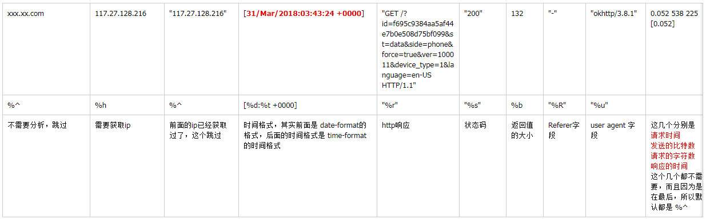
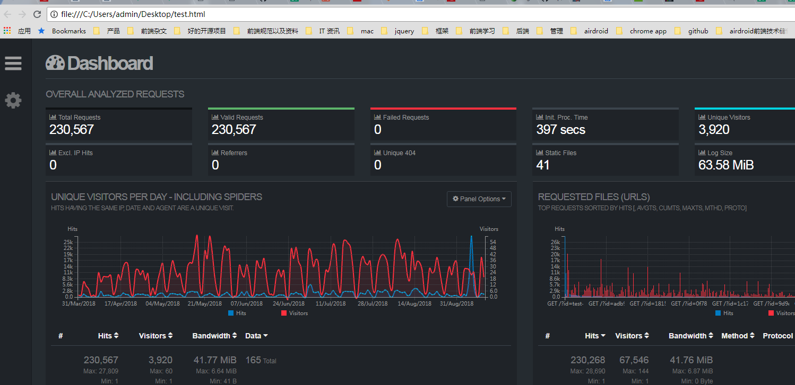
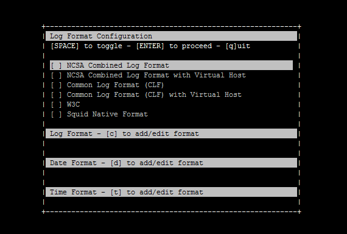
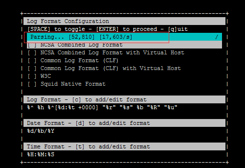
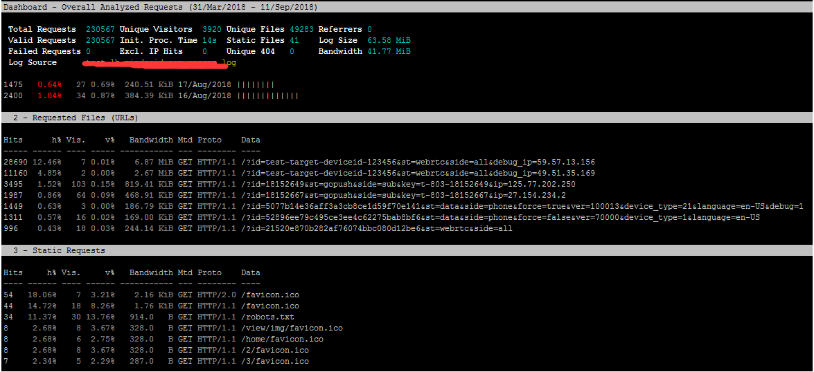

## GoAccess
简单来说呢 [GoAccess](https://goaccess.io/) 是一个专门用来分析日志的工具，既可以在终端中展示结果，也可以生成 HTML 报表在浏览器中查看。GoAccess 最吸引人的一点就是它生成的 HTML very 炫酷。
## 安装
我的服务器是 CentOS7, 可以直接用yum安装： **yum install goaccess**
<!--more-->
```
[root@VM_156_200_centos ~]# yum install goaccess
Loaded plugins: fastestmirror, langpacks
Repository epel is listed more than once in the configuration
。。。
Dependency Installed:
  tokyocabinet.x86_64 0:1.4.48-3.el7                                                                                                                                                                     

Complete!
```
这样就安装完了。(安装完之后，我没有进行任何的配置修改，没有改过 /etc/goaccess.conf 这个配置文件的东西)
## 生成HTML报表
后面把其他服务器的一个nginx access log上传到这台服务器，准备生成一个HTML文件分析一下：
指令： **goaccess -f xx.xxx.com.access.log -a > test.html**
```
[root@VM_156_200_centos nginxlog]# goaccess -f xx.xxx.com.access.log -a > test.html
Parsing... [0] [0/s]
GoAccess - version 1.2 - Jul 23 2017 03:05:48
Config file: /etc/goaccess.conf

Fatal error has occurred
Error occured at: src/parser.c - parse_log - 2705
No time format was found on your conf file.
```
果然报了一个时间格式错误，这时候我看一下，这个log的其中一条记录，其实都是有格式的：
```
xx.xxx.com 220.130.153.228 "220.130.153.228" - - [02/Apr/2018:01:50:12 +0000] "GET /?id=f695c9384aa5af44e7b0e508d75bf099&st=data&side=phone&force=true&ver=100011&device_type=1&language=en-US HTTP/1.1" "200" 132 "-" "okhttp/3.8.1" 0.052 538 225 [0.052]
```
也就是说，我们需要让 goaccess 知道我们的nginx log的format格式，他才能分析得出来。 主要要配置三种：
-- **time-format** 时间格式
-- **date-format** 日期格式
-- **log-format** log 格式

只有这三个配置完之后，goaccess 才能正常的解析并生成分析报告。 这三个可以在 **/etc/goaccess.conf** 配置文件中设置，也可以直接用指令来临时指定：
具体应该怎么设置，可以看官方的 [custom-log](https://goaccess.io/man#custom-log)文档, 上面写的挺清楚的。

%x A date and time field matching the time-format and date-format variables. This is used when a timestamp is given instead of the date and time being in two separate variables.
%t time field matching the time-format variable.
%d date field matching the date-format variable.
%v The server name according to the canonical name setting (Server Blocks or Virtual Host).
%e This is the userid of the person requesting the document as determined by HTTP authentication.
%h host (the client IP address, either IPv4 or IPv6)
%r The request line from the client. This requires specific delimiters around the request (single quotes, double quotes, etc) to be parsable. Otherwise, use a combination of special format specifiers such as %m, %U, %q and %H to parse individual fields.
       Note: Use either %r to get the full request OR %m, %U, %q and %H to form your request, do not use both.
%m The request method.
%U The URL path requested.
       Note: If the query string is in %U, there is no need to use %q. However, if the URL path, does not include any query string, you may use %q and the query string will be appended to the request.
%q The query string.
%H The request protocol.
%s The status code that the server sends back to the client.
%b The size of the object returned to the client.
%R The "Referer" HTTP request header.
%u The user-agent HTTP request header.
%D The time taken to serve the request, in microseconds.
%T The time taken to serve the request, in seconds with milliseconds resolution.
%L The time taken to serve the request, in milliseconds as a decimal number.
%^ Ignore this field.
%~ Move forward through the log string until a non-space (!isspace) char is found.
~h The host (the client IP address, either IPv4 or IPv6) in a X-Forwarded-For (XFF) field.

因为有些字段不需要分析，或者说是有重复的，比如上面例子的ip，其实就有重复，所以，就用 **%^** 表示忽略。
接下来具体实作一下，以上面那一条nginx log记录为例：
```
xx.xxx.com 220.130.153.228 "220.130.153.228" - - [02/Apr/2018:01:50:12 +0000] "GET /?id=f695c9384aa5af44e7b0e508d75bf099&st=data&side=phone&force=true&ver=100011&device_type=1&language=en-US HTTP/1.1" "200" 132 "-" "okhttp/3.8.1" 0.052 538 225 [0.052]
```
当然这时候，我们要先看一下，这个nginx的log format的格式，这样才便于分析：
```
log_format access '$host $remote_addr "$clientRealIp" - $remote_user [$time_local] "$request" '
              '"$status" $body_bytes_sent "$http_referer" "$http_user_agent" '
              '$request_time $bytes_sent $request_length [$upstream_response_time]';
```
所以对应的format，应该这样写：
时间格式和日期格式比较简单, 这两个一般都不会变：
-- time-format: %H:%M:%S
-- date-format: %d/%b/%Y

主要还是log-format这个要分析一下：


所以最后是:(我全部直接用options指令，没有在 goaccess.conf 中设置，这样看比较直观)
```
[root@VM_156_200_centos nginxlog]# goaccess -f xx.xxx.com.access.log --log-format='%^ %h %^[%d:%t +0000] "%r" "%s" %b "%R" "%u"' --date-format='%d/%b/%Y' --time-format='%H:%M:%S'  -d -a > test.html
```
然后就慢慢等他分析，并生成 html 报表， 最后查看：

这样分析就出来了。
## 服务器上直接分析
当然，还有一种是在 服务器直接分析的， 
```
goaccess -f xx.xxx.com.access.log -c -a
```
输入以上命令，就会弹出一下窗口，

这边自己输入 各种 format，都填完之后，直接按 enter ：这时候就会开始分析：

这个就是 分析报告， 当然还是没有 html 来的好看。

按两下q，就会退出。
## 实时分析功能
goaccess 还有实时分析的功能，用一下命令：
```
$ goaccess --config-file=.goaccessrc /var/log/nginx/access.log
```
一切正常的话 GoAccess 应该开始分析日志文件了，然后显示 "WebSocket server ready to accept new client connections"。
现在用浏览器打开 **http://your-domain/stat/** 应该就可以看见分析结果了，每秒钟刷新一次数据。
<font color=red>ps：这个功能我还没有用过，因为从业务来说，nginx log刷新得太快了，如果没有出问题的话(比如被人刷接口), 老实说实时分析的用处不大， 一般都是出问题之后，取出问题的那一段时间来分析。</font>


