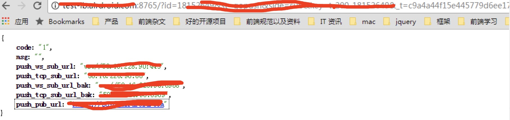

之前项目有发生过一种情况，就是我们的测试服在中国区，然后有一个load balance 的服务，在使用lb服务去请求线上美区的另一个服务的时候，因为墙的关系，导致请求失败，因此 pc端登录的时候，经常会失败。

我看了一下 lb 的log，全部是请求 海外这一台 服务器，然后超时

[Error] [/var/lib/jenkins/workspace/airdroid-dev-go-loadbalance/utils.go 245] [2017-08-10 15:21:16] [GetGoPushSubUrl getWebContent(https://xxx.xxx.com/server/get?k=t-200-18152649&p=3) error: Get https://xxx.xxx.com/server/get?k=xxx: net/http: request canceled while waiting for connection (Client.Timeout exceeded while awaiting headers)]

<!--more-->
然后想到之前测试服的 pay 项目也是因为很难连上 PayPal 和 google 服务器，有让运维的同学在测试服上 开了一个 1082 端口用来做代理。
因此lb也可以用这个端口做http 代理，这样就可以连上海外的服务器了，这个测下在测试服用curl 走这个代理端口能不能访问访问海外服务器的接口，而不会被墙掉：

因此 lb 的代码要改下， 改成在请求 海外服务器 地址的时候，要用http 代理，原代码：

import (
   "io/ioutil"
   "net/http"
   "time"
)

// get web page content
func getWebContent(urlStr string, disableKeepAlives bool) ([]byte, error) {
   timeout := time.Duration(5 * time.Second)
   client := &http.Client{
      Timeout: timeout,
   }
   resp, err := client.Get(urlStr)
   if err != nil {
      return nil, err
   }
   defer resp.Body.Close()

   // read body content
   body, err := ioutil.ReadAll(resp.Body)
   if err != nil {
      return nil, err
   }

   return body, nil
}

修改后的代码：

import (
   "io/ioutil"
   "net/http"
   "time"
   "iGong/util/log"
   "net/url"
)

// get web page content
func getWebContent(urlStr string, disableKeepAlives bool) ([]byte, error) {
   timeout := time.Duration(5 * time.Second)
   client := &http.Client{
      Timeout: timeout,
   }
   // 判断是否要进行http 代理请求
   if config.HttpProxy != "" {
      log.Infof("http proxy(%v): %v", config.HttpProxy, urlStr)
      proxyUrl, err := url.Parse(config.HttpProxy)
      if err != nil {
         log.Info("Bad proxy URL", err)
         return nil, err
      }
      client.Transport = &http.Transport{Proxy: http.ProxyURL(proxyUrl)}
   }
   resp, err := client.Get(urlStr)
   if err != nil {
      return nil, err
   }
   defer resp.Body.Close()

   // read body content
   body, err := ioutil.ReadAll(resp.Body)
   if err != nil {
      return nil, err
   }

   return body, nil
}

其实就是加了一个判断，判断是否有代理的配置，如果有的话，就启用代理

   // 判断是否要进行http 代理请求
   if config.HttpProxy != "" {
      log.Infof("http proxy(%v): %v", config.HttpProxy, urlStr)
      proxyUrl, err := url.Parse(config.HttpProxy)
      if err != nil {
         log.Info("Bad proxy URL", err)
         return nil, err
      }
      client.Transport = &http.Transport{Proxy: http.ProxyURL(proxyUrl)}
   }

然后在config.go 里面还要再加上这个设置

//设置是否需要进行http代理，一般就是测试环境需要，因为测试环境有时候会因为被墙的关系，导致连不上线上的海外服务器,本地调试和线上都不需要
HttpProxy     string `toml:"http_proxy"`

最后在 配置文件加上这个配置项 config.conf

http_proxy = "http://127.0.0.1:1082"

这样就可以了， 接下来测试一下

发现可以了，看了一下log：

[Info] [/var/lib/jenkins/workspace/airdroid-dev-go-loadbalance/utils.go 28] [2017-08-10 15:21:53] [http proxy(http://127.0.0.1:1082): https://xxx.xxx.com/server/get?k=xxx]
可以就实现了 http 的代理请求了

---

不过之前有遇到过一个问题，就是设置 http_proxy 的时候没有加上协议，那么就会报错：

http_proxy = "127.0.0.1:1082"


[Error] [/var/lib/jenkins/workspace/airdroid-dev-go-loadbalance/utils.go 241] [2017-08-10 15:10:55] [GetGoPushSubUrl getWebContent(https://xxx.xxx.com/server/get?k=xxx) error: Get https://xxx.xxx.com/server/get?k=xxx: http: error connecting to proxy 127.0.0.1:1082: dial tcp :0: getsockopt: connection refused]

后面查了一下[这篇问答](https://stackoverflow.com/questions/14669958/error-when-fetching-url-through-proxy-in-go)才发现是要加上http协议才行的

