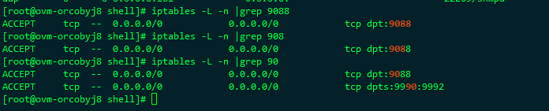
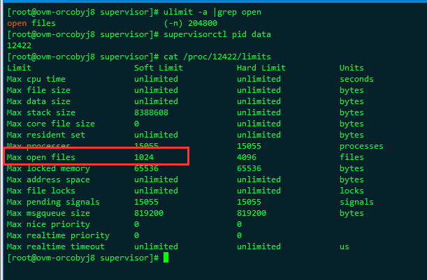

之前有发生一个情况。就是我们有两个go程序服务A和B，其中A服务会调用B服务的http接口，而B服务是一个对外的长链接服务。两个服务在同一台服务器，其中在A服务的log中，发现在调用B服务接口的时候，会报这个错误：

[Error] [/data/code/go/src/stream-forward/phone_conn_pool.go 80] [2018-06-24 21:38:29] 
[request phone(9a7b01445fd7ec85f122eadbdc07e084) create channel: Get https://xxx.airdroid.com:9088/create_channel?id=xxx&token=xxx&host=xx-bd.airdroid.com&port=9991: dial tcp xxx.xxx.xxx.xxx:9088: i/o timeout]

即请求B服务的接口出错了，而且这两个服务是在同一台服务器上的。后面直接在这一台机子上，试着curl 这个接口地址。发现也不行：

[kbz@ovm-orcobyj8 dataforwardsrv]$ curl 'https://xxx.airdroid.com:9088/create_channel?id=xxx&token=xxx&host=xxx-bd.airdroid.com&port=9991'
curl: (7) Failed connect to xxx.airdroid.com:9088; Connection timed out

<!--more-->
然后直接telnet 端口号也不行。刚开始以为是 9088 端口没有开。但是后面发现 其实是有开的

而且也可以看到连接上来的长连接也不少

[kbz@ovm-orcobyj8 ~]$ netstat -an | grep '9088'
tcp        0      0 xx.xx.xx.xx:9088      187.108.11.114:34356    SYN_RECV   
tcp6       0      0 :::9088                 :::*                    LISTEN     
tcp6       0      0 xx.xx.xx.xx:9088      181.91.xx.63:64941     ESTABLISHED
tcp6       0      0 xx.xx.xx.xx:9088      177.xx.70.174:38131     ESTABLISHED
tcp6       0      0 xx.xx.xx.xx:9088      177.98.190.xxx:40627    ESTABLISHED

说明不是端口问题，但是我用本机 telnet之后，一会儿可以连，一会儿不能连。 就算能连接也是超级慢。
后面查了一下B服务的supervisor err log，看是不是B服务的问题，后面发现了这个：

2018/06/24 21:56:43 http: Accept error: accept tcp [::]:9088: accept4: too many open files; retrying in 640ms
2018/06/24 21:56:44 http: Accept error: accept tcp [::]:8088: accept4: too many open files; retrying in 640ms
2018/06/24 21:56:44 http: Accept error: accept tcp [::]:9088: accept4: too many open files; retrying in 1s

too many open files(打开的文件过多)是Linux系统中常见的错误，从字面意思上看就是说程序打开的文件数过多，不过这里的files不单是文件的意思，也包括打开的通讯链接(比如socket)，正在监听的端口等等，所以有时候也可以叫做句柄(handle)，这个错误通常也可以叫做句柄数超出系统限制。 引起的原因就是进程在某个时刻打开了超过系统限制的文件数量以及通讯链接数。
也就是这时候B服务的文件句柄的打开数已经超出了系统的限制了，所以A服务请求B服务接口的时候，没办法再分配新的文件句柄了，所以就会导致这种情况，所表现出来的结果就是B服务没办法再受理新的请求了，除非原来已连接的请求被释放，然后句柄也跟着释放。
通过命令ulimit -a可以查看当前系统设置的最大句柄数是多少, 然后可以通过 /proc/$pid/limits 查看具体服务所能打开的最大文件句柄：

发现系统设置的最大打开文件数是有被改过来的。 但是实际进行的这个服务的文件句柄还没有生效，还是系统默认的1024。
这时候重启一下 supervisor， 并且重启B服务 看看。

[kbz@ovm-orcobyj8 camera]$ sudo supervisorctl pid data
14807
[kbz@ovm-orcobyj8 camera]$ cat /proc/14807/limits
Limit                     Soft Limit           Hard Limit           Units     
Max cpu time              unlimited            unlimited            seconds   
Max file size             unlimited            unlimited            bytes     
Max data size             unlimited            unlimited            bytes     
Max stack size            8388608              unlimited            bytes     
Max core file size        0                    unlimited            bytes     
Max resident set          unlimited            unlimited            bytes     
Max processes             100000               100000               processes
Max open files            100000               100000               files     
Max locked memory         65536                65536                bytes     
Max address space         unlimited            unlimited            bytes     
Max file locks            unlimited            unlimited            locks     
Max pending signals       15055                15055                signals   
Max msgqueue size         819200               819200               bytes     
Max nice priority         0                    0                   
Max realtime priority     0                    0                   
Max realtime timeout      unlimited            unlimited            us 

这时候就可以看到B服务的句柄数，已经变成100000了。 这样就不会再出现这个问题了。

---

参考资料：  [too many open files(打开的文件过多)解决方法](https://blog.csdn.net/roy_70/article/details/78423880)

