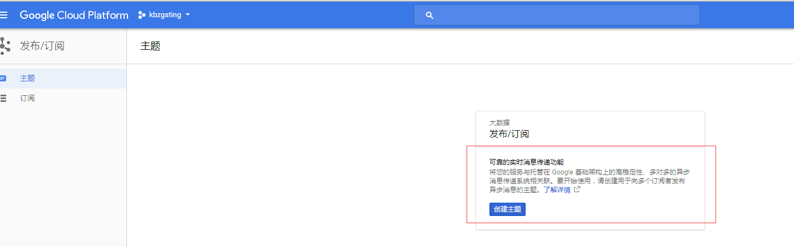

## 前言
之前我们的产品有接入google的内购支付，即 google iap，但是google iap不同于Paypal，Stripe 这种第三方支付，像Paypal， Stripe 这种第三方支付在支付成功之后，后面会发送webhook给服务端。然后服务端就可以根据webhook的信息来判断有没有支付成功，其他的事件比如订阅续费，取消循环，退款等等，也会通过webhook来通知服务端，服务端就可以根据相应的事件去处理。
但是google iap本身没有提供这种webhook，所以刚开始我们在接入的时候，除了在服务端做当下的支付校验之外，还需要有一个 Golang 服务去定时跑这些订阅，比如哪些订阅被取消，哪些订阅有续费，就是去轮训google的接口来得到信息，然后比对数据库的信息，来判断当前的订阅是否还有效，以及当前的订阅是否有续费。这样其实很麻烦。
后面看了一下iap的文档：[具体文档](https://developer.android.com/google/play/billing/billing_subscriptions#realtime-notifications)， 发现通过 Google Cloud Platform (GCP) 我们就可以做到类似于 webhook 接口效果。
<!--more-->
## 官方流程实践
所以这边就使用了一下 GCP 的 pub 和 sub 功能。如果 demo 没有问题的话，其实就可以接入到我们的产品。
具体的流程其实文档都写的比较清楚：[操作文档](https://cloud.google.com/pubsub/docs/quickstart-console)
刚好我的 google 账号的 GCP 之前有创建了几个测试项目(前几年为了翻墙搞了一堆)：

### 前置准备
前置准备可以按照官方文档来：

#### 设置项目： 即点击 SET UP A PROJECT:
选择项目以允许开启 pub/sub api：

#### 接下来是安装并且初始化 cloud sdk 
**(这一步我直接跳过，因为我觉得gcloud，还没有写代码用SDK方便)**
其实就是装一个 gcloud 组件，这个就是 GCP pub sub 的命令行工具

gcloud components update &&
gcloud components install beta

### 创建主题
接下来到 GCP 控制台的主题页面，点击创建主题：

点击创建，这时候就有一个主题了：

### 创建订阅
既然已经有一个主题了，那么接下来就创建一个订阅，点击新建订阅按钮

创建一个为 pay 的订阅，并且选择 推送到端点，选择 xxx.xxx.com

点击创建，一直报这个错误，说是参数错误

后面查了一下，原来这个端点一定是要你自己的，要经过google 的认证的，而且要https的，[官方文档说明](https://cloud.google.com/pubsub/docs/push), 这个后面会讲怎么改成端点推送的
我们先换成**拉取**， 就可以了

这时候就有一个订阅了

### 接下来就发布一个信息到主题
点击发布消息：

随便写一个消息：

点击发布，发布成功。
### 通过 gcloud 来拉取
发布消息成功了，接下来就是用 gcloud 从订阅中可以收到这一条消息
**（因为gcloud我没有装，所以我直接跳过）**

gcloud beta pubsub subscriptions pull MySub

其中 MySub 就是订阅的主题，对本例来说，就是 pay
### 删除主题

这样就删除了
创建和删除 主题，都可以用 api 来实现：[文档](https://cloud.google.com/pubsub/docs/admin)
## 用go语言写demo
### 创建 account key
首先要创建一个 google service account key， 入口： [文档入口](https://cloud.google.com/docs/authentication/production)

点击这个，会跳转到 GCP 后台，然后点击创建

这时候账号的.json 文件就创建成功了，下载下来:

### 还要为主题添加权限

这样就添加成功了。 这个邮件就是你账号的服务号，就在 json 文件的 client_email 字段。
当然为了省事，还可以填，**allUsers**， 意味着所有人都可以用，不过我不建议用，这个不安全。
### 创建一个新的订阅
点击创建订阅，就可以创建一个订阅

可以看到，我们这边建了一个订阅，就叫 **test1**
### 写 sub 代码， sub.go

package main
import (
   "cloud.google.com/go/pubsub"
   "golang.org/x/net/context"
   "iGong/util/log"
   "os"
)
const(
   GcpSecretUrl = "kbzgsting-a80262ae859b.json"
   GcpSubscription = "test1"
)
/**
订阅google服务器
*/
func SubPay() {
   log.Info("start subpay")
   os.Setenv("GOOGLE_APPLICATION_CREDENTIALS", GcpSecretUrl)
   ctx := context.Background()
   client, err := pubsub.NewClient(ctx, "kbzgsting")
   if err != nil {
      log.Error(err)
   }
   // Use a callback to receive messages via subscription1.
   sub := client.Subscription(GcpSubscription)
   err = sub.Receive(ctx, func(ctx context.Context, m *pubsub.Message) {
      log.Info("data:", string(m.Data))
      for k, v := range m.Attributes {
         log.Infof("%v:%v",k, v)
      }
      log.Infof("google payinfo (%s)", m.Data)
      m.Ack() // Acknowledge that we've consumed the message.
   })
   if err != nil {
      log.Error(err)
   }
}
func main() {
   SubPay()
}

这时候就要跑起来，注意，依赖的库有点多，要一一去装，不需要go版本太新，我 1.7.6 就可以跑了

F:\airdroid_code\go\src\gcp-demo>go run sub.go
[Info] [sub.go 24] [2018-07-24 17:50:18] [start subpay]
[Error] [sub.go 44] [2018-07-24 17:50:21] [rpc error: code = PermissionDenied desc = User not authorized to perform this action.]

但是报了一个权限的错误，可是我们不是才给 主题 有加权限了吗，后面查了一下，发现后面建的那个订阅，也要加权限的：

所以这边也要加的。然后再试一下：

F:\airdroid_code\go\src\gcp-demo>go run sub.go
[Info] [sub.go 24] [2018-07-24 17:55:49] [start subpay]

发现在监听了，这时候我们就直接在管理后台发布了一条消息：


F:\airdroid_code\go\src\gcp-demo>go run sub.go
[Info] [sub.go 20] [2018-07-24 20:02:47] [start subpay]
[Info] [sub.go 31] [2018-07-24 20:03:53] [data:hello world]
[Info] [sub.go 33] [2018-07-24 20:03:53] [age:99]
[Info] [sub.go 33] [2018-07-24 20:03:53] [name:zachke]
[Info] [sub.go 35] [2018-07-24 20:03:53] [google payinfo (hello world)]

可以看到，有收到了。
### 写pub脚本， pub.go
接下来我们做一下 pub 的脚本： pub.go:

package main

import (
   "cloud.google.com/go/pubsub"
   "golang.org/x/net/context"
   "iGong/util/log"
   "os"
)

const(
   GcpSecretUrl = "kbzgsting-a80262ae859b.json"
)

/**
GCP pub 消息
*/
func PubPay() {
   log.Info("start pubpay")
   os.Setenv("GOOGLE_APPLICATION_CREDENTIALS", GcpSecretUrl)
   ctx := context.Background()
   client, err := pubsub.NewClient(ctx, "kbzgsting")
   if err != nil {
      log.Error(err)
   }
   // Publish a text message on the created topic.
   if err := publish(client, "hello", "this message from golang script"); err != nil {
      log.Errorf("Failed to publish: %v", err)
   }
}
func publish(client *pubsub.Client, topic, msg string) error {
   ctx := context.Background()
   // [START pubsub_publish]
   // [START pubsub_quickstart_publisher]
   t := client.Topic(topic)
   result := t.Publish(ctx, &pubsub.Message{
      Data: []byte(msg),
   })
   // Block until the result is returned and a server-generated
   // ID is returned for the published message.
   id, err := result.Get(ctx)
   if err != nil {
      return err
   }
   log.Infof("Published a message; msg ID: %v\n", id)
   // [END pubsub_publish]
   // [END pubsub_quickstart_publisher]
   return nil
}
func main() {
   PubPay()
}

然后跑一下：

F:\airdroid_code\go\src\gcp-demo>go run pub.go
[Info] [pub.go 18] [2018-07-24 20:05:20] [start pubpay]
[Info] [pub.go 46] [2018-07-24 20:05:23] [Published a message; msg ID: 150751798925826
]

可以看到pub成功了，然后也可以看到刚才的sub的程序也收到了

F:\airdroid_code\go\src\gcp-demo>go run sub.go
[Info] [sub.go 20] [2018-07-24 20:02:47] [start subpay]
[Info] [sub.go 31] [2018-07-24 20:03:53] [data:hello world]
[Info] [sub.go 33] [2018-07-24 20:03:53] [age:99]
[Info] [sub.go 33] [2018-07-24 20:03:53] [name:zachke]
[Info] [sub.go 35] [2018-07-24 20:03:53] [google payinfo (hello world)]
[Info] [sub.go 31] [2018-07-24 20:05:24] [data:this message from golang script]
[Info] [sub.go 35] [2018-07-24 20:05:24] [google payinfo (this message from golang script)]

所以大概就是这样子，还是挺简单的。
而且我查了一下，官方的 example demo，还是很多功能的：
https://github.com/GoogleCloudPlatform/golang-samples/blob/master/pubsub/subscriptions/main.go
https://github.com/GoogleCloudPlatform/golang-samples/blob/master/pubsub/topics/main.go
包含的api功能有： 创建topic，创建订阅，显示所有的订阅，pub 消息， sub 消息， 删除订阅，删除 topic。
而且创建订阅有两种，一种就是 pull (就是没有webhook端点的)：

func create(client *pubsub.Client, name string, topic *pubsub.Topic) error {
    ctx := context.Background()
    // [START pubsub_create_pull_subscription]
    sub, err := client.CreateSubscription(ctx, name, pubsub.SubscriptionConfig{
        Topic:       topic,
        AckDeadline: 20 * time.Second,
    })
    if err != nil {
        return err
    }
    fmt.Printf("Created subscription: %v\n", sub)
    // [END pubsub_create_pull_subscription]
    return nil
}

另一种就是push，就是有webhook地址的

func createWithEndpoint(client *pubsub.Client, name string, topic *pubsub.Topic, endpoint string) error {
    ctx := context.Background()
    // [START pubsub_create_push_subscription]
    // For example, endpoint is "https://my-test-project.appspot.com/push".
    sub, err := client.CreateSubscription(ctx, name, pubsub.SubscriptionConfig{
        Topic:       topic,
        AckDeadline: 10 * time.Second,
        PushConfig:  pubsub.PushConfig{Endpoint: endpoint},
    })
    if err != nil {
        return err
    }
    fmt.Printf("Created subscription: %v\n", sub)
    // [END pubsub_create_push_subscription]
    return nil
}

但是端点是需要做注册和校验才能用的。我们这个demo也只是用pull 的方式来 sub。
## 使用端点推送
上面的demo其实就是拉取，因为要用端点推送，其实就是webhook的功能，那么GCP是要求这个站点一定要是我们所拥有的站点，也就是这个站点要经过google的认证，他才会允许我们用这种方式给我们的站点推送支付通知。
按照官方的文档来说，使用端点推送，有两步：[步骤](https://cloud.google.com/pubsub/docs/push)
- 站点要进行验证
这个其实是我用的方式：[连接传送门](https://support.google.com/webmasters/answer/35179?hl=en&topic=2370564&ctx=topic)
就是生成一个含有校验码的html文件，放到这个站点的根目录就行了

只要可以请求到，就说明有校验了。这样认证就成功了。

- 将这个域名添加到 GCP 的允许网域允许中

点击添加

添加成功

这样就可以了

- 最后试一下，创建 push 方式的订阅 能不能添加成功

这样就添加成功了，接下来如果有pub消息的话，就会推到这个站点的接口，接下来的 接入 google iap 就会讲到这个。