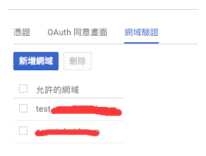

## 前言
通过  可以知道 GCP 怎么使用 pub 和 sub 的功能来进行推送和拉取。
本节主要是结合我们的支付项目，为 google iap 接入 webhook。
官网的文档写的还算比较清楚： [官方文档](https://developer.android.com/google/play/billing/realtime_developer_notifications)
<!--more-->
## 实践
接下来主要是讲具体操作：
跟上一节的demo有点不一样的是， 后面我们不用pull的方式，而是要用push的方式，因此我们要先进行站点的校验和注册才行。
如果站点校验成功了，那么就可以添加订阅了，这时候发布/订阅服务器将订阅的任何消息发送到配置的webhook地址。你的webhook应用程序需要处理传入的消息并返回一个HTTP状态代码以指示成功。任何以下HTTP状态代码都被Pub / Sub系统解释为成功：**200**,**201**,**202**,**204**或**102**。 如果您的服务返回任何其他代码，则Google Cloud Pub / Sub将重试传递消息为订阅设置的最长保留时间。
为了规范推送消息的传送速度，Google Cloud Pub / Sub使用慢启动算法。在启动速度较慢的情况下，Google Cloud Pub / Sub一次只能发送一条消息，而每次成功发送时则会增加一倍，直至达到并发消息的最大数量。任何时候交付失败，订阅允许的消息数量减半。
还有一点不一样的是，我们的demo过来的数据都是明文的，直接取就行了，而这个 IAP 过来的是有base64编码的。 我们还要对他进行解码才行。 **message.data** 字段是base64编码的。
### 创建主题
到 GCP 后台的 发布/订阅 栏目。 创建一个主题， 叫 pay-notification 
### 设置这个主题的权限
然后在设置这个主题的权限，将这个 ** google-play-developer-notifications@system.gserviceaccount.com ** 作为 Publisher role 添加进去
其实就是google的一个服务号。
### 添加站点认证
因为我们的支付项目，有生产环境和测试环境，而 google iap 其实上是没有沙盒环境的(它有测试账号，但是没有沙盒环境)， 因此生产环境和测试环境都是共用一个google 服务。也就是即使在测试环境中测试支付，如果这个账号不是google 支付配置的测试账号的话，也是会正式扣钱的。
因此测试环境和生产环境，两个站点都要进行 google 认知。 这边还是跟之前一样，都采用 html 文档校验，即要把一个html放到站点根目录

两个文档其实是同一个文件。
### 在GCP后台设置域名许可

### 新建一个订阅
然后回到GCP后台，在刚才创建的 pay-notification 主题，新建一个订阅， test-play-iap ，然后选择推送到端点地址 https://test-xx.xxx.com/webhook 。先用于测试的（等后面没问题，更新到线上，再添加一个有正式地址的主题）。

### google play后台添加主题通知
最后只要在Google play 后台的 开发工具-> 服务和API 这个页面的 实时开发者通知这边， 填入主题名称， 按照这个格式 projects/{project_id}/topics/{topic_name}

### 点击测试通知
然后点击下面的**测试通知**按钮，可以看到 test-xx.xxx.com 可以收到 这个请求了

test-xx.xxx.com 49.xx.xx.241 "66.102.6.117" - - [25/Jul/2018:11:39:39 +0000] "POST /webhook HTTP/1.0" "200" 21 "-" "APIs-Google; (+https://developers.google.com/webmasters/APIs-Google.html)" 0.293 418 1148 [0.103]

### 更新到线上去
接下来只要写代码就行了。 注意，如果是更新到线上去，那么就要在这个主题(pay-notification)下，再建一个 release 的订阅(release-pay-notification)，然后将端点设置为  xx.xxx.com。 这样子， google 就会两个一起都推送，然后让代码去根据token有没有存在去判断是线上的还是测试的。
但是刚开始测试的时候，可以先建 release 订阅，但是不要设置为推送，设置为提取，提取是需要对应的服务配合的，他不会主动推送。等后面线上服务上的时候，再设置为推送模式。

## webhook 数据格式
webhook 过来的数据格式是这样子(涉及到data base64 编码敏感数据，直接中间省略)：

{
    "message": {
        "data": "eyJ2ZXJzaW9ua ... 1fbW9udGhseSJ9fQ==",
        "messageId": "158186580440470",
        "message_id": "158186580440470",
        "publishTime": "2018-08-01T23:34:37.899Z",
        "publish_time": "2018-08-01T23:34:37.899Z"
    },
    "subscription": "projects/xxxx/subscriptions/test-play-iap"
}

然后将 data 进行 base64 解密之后：

{
    "version": "1.0",
    "packageName": "xxx",
    "eventTimeMillis": "1533166477772",
    "subscriptionNotification": {
        "version": "1.0",
        "notificationType": 2,
        "purchaseToken": "fhagihifggf ... 28jOt",
        "subscriptionId": "premium_monthly"
    }
}

就是这样, 其他都很好理解， 如果有 subscriptionNotification，那么就是正常的，如果是 testNotification 说明是后台发的测试通知。
主要是 notificationType 这个，有以下这个：

|type	|描述|	是否处理 |
| ------------- |:-------------:| -----:|
|1	|订阅从账户里面恢复	|暂时不需要处理|
|2	|订阅续费了	|要处理，升级|
|3	|订阅取消了（有分主动和被动，如果是主动的话，就是用户主动取消的，如果是被动的话，就是过了7天的宽限期之后还么有付款，这时候这个订阅就会被动取消了）	|要处理，取消订阅|
|4	|新的订阅购买	|要处理，但是要配合 iapVerify， 因为这两个都是首次购买，所以逻辑会重复|
|5	|订阅进入账号？？	|暂时不需要处理|
|6	|订阅进入宽限期，就是到了付款时间还没有付款，这时候就会进入7天的宽限期，这时候就会推这个通知	|暂时不需要处理|
|7	|重新激活订阅	|暂时不需要处理|

目前应该只需要处理 2，3，4 三种就行了。

