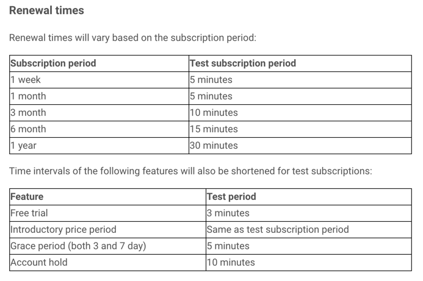

## 前言
之前项目有用到了一些第三方支付，包括 paypal，google iap， stripe， 还有国内的 alipay。其中每个支付类型都有一些坑，本章讲的是google 内购支付，即 google iap 的一些需要注意的点，或者是一些踩过的坑， 将会持续更新。
## 创建商品的最低价钱
之前有一个需求，就是服务端要调用google的 iap API 来动态创建商品项， [API传送门](https://developers.google.com/android-publisher/api-ref/inappproducts/insert), 打算建一个 $0.5 的订单， 后面发现竟然报错了：
<!--more-->
```
[2018-04-12 08:22:26] GoogleIap.INFO: start create google plan,0.5,0.1,1 [] []
[2018-04-12 08:22:28] GoogleIap.ERROR: insert google plan error:{  "error": {   "errors": [    {     "domain": "androidpublisher",     "reason": "inAppProductDefaultPriceTooLow",     
"message": "Default price is too low."    }   ],   "code": 403,   "message": "Default price is too low."  } }  [] []
```
价钱太低了。后面试了一下： 0.9 刚好可以建
```
[2018-04-12 08:38:18] GoogleIap.INFO: start create google plan,0.9,0.1,1 [] []
[2018-04-12 08:38:20] GoogleIap.DEBUG: create plan:{"defaultLanguage":"en-US","packageName":"...","purchaseType":"managedUser","sku":"....9","status":"active","subscriptionPeriod":null,"trialPeriod":null} [] []
[2018-04-12 08:38:21] GoogleIap.INFO: start insert google plan,0.9,....9 [] []
```
0.89 都不行：
```
[2018-04-12 08:41:01] GoogleIap.INFO: start create google plan,0.89,0.1,1 [] []
[2018-04-12 08:41:03] GoogleIap.ERROR: insert google plan error:{  "error": {   "errors": [    {     "domain": "androidpublisher",     
"reason": "inAppProductDefaultPriceTooLow",     "message": "Default price is too low."    }   ],   "code": 403,   "message": "Default price is too low."  } }  [] []
```
<font color=red><b>所以最低都要是 $0.9</b></font>
## 测试账号和正式账号的支付差距
我们知道google iap其实是没有沙盒环境的，但是它可以设置某一个账号为**测试账号**，用这个所谓的测试账号来支付，是不用真正花钱的。但是用测试账号来支付和用正常账号来支付的话，其实是有差距，如果是循环的话，假设是循环一个月，那么如果是测试账号的话，5分钟就过期了，就会再续了。具体如下：

所以最好告知你们的测试人员，不然他会很疑惑
## 使用GCP平台集成webhook
google iap 还有一个很不好的地方就是，就是没有 webhook 通知，但是我们可以通过他们的 GCP 平台来集成 webhook 功能，具体看：

## 取消订阅的神奇逻辑
google 内购 **取消订阅** 有一个很神奇的逻辑:
假设这个用户在4月1号订阅了一个产品，但是在 4月15号的时候，取消了订阅。但是这时候google是不受理的，他还是会等到这个循环周期结束的时候，也就是5月1号的时候，当再去扣钱的时候，这时候再去判断是否有取消订阅。如果有取消，那么就不扣钱，如果没有取消，那么就扣钱。
也就是说假设一个用户在4月15号，取消了订阅，但是在4月20号的时候，又购买了同一个plan，这时候google会认为这个用户还在循环周期内，所以根本不会扣款，还是的等到5月1号才扣款，**但是程序要特别注意，不能因为用户购买了循环，就给他升级，而是要判断他有没有之前就购买过，并且有在循环周期内，不然就会给他升两次了**
服务端判断的条件可以是这样子，比如判断服务端有没有存在相同过期时间的有效循环，如果有的话，一般都是再购买的，因为过期时间是精确到毫秒的，基本上不会有重复的两个不同的支付用户存在， 而这时候这个循环是不会扣钱的。
## [订阅超过一年之后，手续费降为15%](https://support.google.com/googleplay/android-developer/answer/112622?hl=zh-Hans)
我们知道google 内购的手续费贵的要死，他会收30%的平台费，也就是说，用户支付$10,事实上到达我们的账号只有 $7。
好消息就是如果对于循环支付订单，如果超过了12个支付月之后，那么过了12个月之后，用户再支付之后，只会收15%的平台费。 也就是假设用户买了一个年循环，价格 $10, 第一年事实上我们只收到$7, 那么第二年我们就可以收到$8.5。

对于通过 Google Play 提供的应用以及应用内商品，均须支付交易费用（相当于相应售价的 30%）。您会收到 70% 的付款，剩下的 30% 将用于投放合作伙伴分成和支付运营费用。
自 2018 年 1 月 1 日起，对于您在 12 个付费月后留住的任何订阅者，相应订阅商品的交易费用将降至 15%。如果订阅者自该日期起一直处于活跃状态，此时间将被计入统计信息。例如，如果订阅者处于活跃状态的时间达到 4 个月，则交易费用将在 8 个付费月后降至 15%。
以下信息将计入用户的 12 个付费月中：

	* 处于宽限期内的订阅者
	* 从帐号保留或宽限期状态恢复订阅的订阅者
	* 享受入门价格的订阅者
	* 升级或降级至其他方案的订阅者
	* 在取消订阅两个月内重新注册的订阅者

以下信息将不会计入用户的 12 个付费月中：

	* 免费试用
	* 已退款的购买交易
	* 帐号保留时间
	* 已推迟时间（通过 Google Play Developer API 使用延期结算功能）



## 订阅商品一旦激活就没法取消
我们知道有API可以创建商品订单，并且可以设置是单次购买还是循环订阅。但是这边要注意一点的是，一旦创建商品订单，并且激活之后，那么接下来就没法针对这个订阅的商品进行取消激活，也没法删除这个商品，更不能修改订单。
```
$postBody->setStatus(self::STATUS_ACTIVE);
```
他有一个update配置的接口：[接口文档](https://developers.google.com/android-publisher/api-ref/inappproducts/patch), 然后我之前写了一个指令，看能不能将已经激活订阅的商品，给他取消掉激活
```
    // todo 悲伤的是，这个根本实现不了，因为已经激活的订阅，根本没法取消激活，会报这个错误  Subscription cannot be deactivated.
    private function doHandle($sku)
    {
        // api: https://developers.google.com/android-publisher/api-ref/inappproducts/get
        try {
            $ap = Factory::newApClient();
            $packageName = config('google.package_name');
            $postBody = new \Google_Service_AndroidPublisher_InAppProduct();
            $postBody->setSku($sku);
            $postBody->setStatus("inactive");
            $postBody->setPackageName($packageName);
            $autoConvertMissingPrices = true;
            $data = $ap->inappproducts->patch($packageName, $sku, $postBody, [
                'autoConvertMissingPrices' => $autoConvertMissingPrices
            ]);
            $this->log->debug(json_encode($data));
        } catch (\Exception $ex) {
            $this->log->error("change google status error:" . $ex->getMessage());
        }
        return null;
    }
```
但是执行结果是这样子的： **Subscription cannot be deactivated.**
```
[2018-04-09 07:25:32] Pay.INFO: google iap change status to  inactive... [] []
[2018-04-09 07:25:34] Pay.ERROR: change google status error:{  "error": {   "errors": [    {     "domain": "androidpublisher",     "reason": "inAppProductDeactivateSubscription",     "message": "Subscription cannot be deactivated."    }   ],   "code": 403,   "message": "Subscription cannot be deactivated."  } }  [] []
```
所以如果要修改价格的话，只能重新创建一个新的订阅商品了。
## 单次购买的商品没法复用
我们知道 已经激活的订阅是不能再被取消激活和修改价钱的，也不能删除。但是 单次购买的商品是可以删除的。 可以在google play 后台删除。 但是删除之后，这个商品id就不能再复用了。
也就是说，假设之前有一个 id 是 month_1 的商品id， 那么后台删掉了。这时候你是不能再建一个同样名称的 month_1 的商品的，会报错。 也就是说，只要创建商品了，不管这个商品有没有被删掉，这个商品id都是唯一的。后来者都不能再复用
## 退款问题
google 内购是可以退款的，但是只能退循环订阅的那一种，普通支付不能退款，退款API: [API refund 文档](https://developers.google.com/android-publisher/api-ref/purchases/subscriptions/refund),而且很神奇的是，他只能退当期循环支付的钱，并不会把订阅取消掉。也就是说，如果没有把循环取消掉，那么当下一期的循环周期来临的时候，google还是会继续的扣钱的。
所以你如果要退款，并且要终止循环的话，就不能用这个api，而是要用这个api: [API revoke 文档](https://developers.google.com/android-publisher/api-ref/purchases/subscriptions/revoke), 这个就会把退款和终止循环 一起处理。


