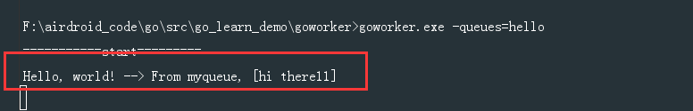
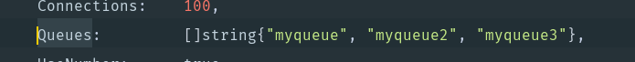

## 前言
**goworker**是一个基于Go后台队列任务执行框架， 运行速度比基于Ruby的快10到100,000倍。 **goworker** 兼容 Resque，所以你可以用 Rails/PHP 和Resque推送你的作业，然后利用Go在后台执行。
我们的很多项目都是用 goworker 来进行队列任务处理，即一些基于PHP的业务处理，然后将一些分支任务，比如 发送push，发送邮件， 通用统计 等等的任务，放到worker中去处理，这样子可以让多个业务项目的一些通用任务处理全部放在一块。
goworker是基于resque的用golang语言封装的库，Resque 是使用Redis创建后台任务，存储进队列，并随后执行。它是rails下最常用的后台任务管理工具之一。
官方文档：[传送门](https://github.com/benmanns/goworker)
<!--more-->
## 简单实测
按照官网的实例来看的话，就两个文件，一个是 **worker.go**(入口执行文件), 一个是 **hello_worker.go**,
**worker.go**:

package main
import (
       "fmt"
       "github.com/benmanns/goworker"
)
// run=====
// go build
// goworker.exe -queues=hello

func main() {
       fmt.Println("===========start=========")
       if err := goworker.Work(); err != nil {
              fmt.Println("Error:", err)
       }
}

**hello_worker.go**:

package main
import (
       "fmt"
       "github.com/benmanns/goworker"
)
func init() {
       settings := goworker.WorkerSettings{
              URI:            "redis://localhost:6379/",
              Connections:    100,
              Queues:         []string{"myqueue", "delimited", "queues"},
              UseNumber:      true,
              ExitOnComplete: false,
              Concurrency:    2,
              Namespace:      "resque:",
              Interval:       5.0,
       }
       goworker.SetSettings(settings)
       goworker.Register("Hello", helloWorker)
}

func helloWorker(queue string, args ...interface{}) error {
       fmt.Printf("Hello, world! --> From %s, %v\n", queue, args)
       return nil
}

这边要指定 redis 的url， 并指定queue。 接下来先跑起来， 指定要运行的任务是 hello。

go build
goworker.exe  （上面已经显示的指定要处理的queue了）


这时候redis还没有任务进来。所以这时候要往redis插入一条任务试试。 这时候指定queue是 myqueue， class 就是任务 hello， agrs 就是参数。

RPUSH resque:queue:myqueue '{"class":"Hello","args":["hi","there11"]}'


发现马上跑任务了

接下来我往redis的这个队列再插5条

5 RPUSH resque:queue:myqueue '{"class":"Hello","args":["hi","kbz"]}'


5条任务马上就执行了

原理就是这样，只要一往 redis 对应 queue 插入对应的class，那么就会触发。非常好用。假设这个服务没有开，往redis 队列发送任务

从redis的桌面管理工具，可以看到

堆积了5条。然后我们一启动这个worker服务，就会马上去redis里面取数据，并处理。

马上执行5条 。接下来 reload 一下 db0

发现 队列是没有了，还是有跑一个worker， 关闭这个队列服务，重新reload 一下。

发现 worker 也没有了。
## 进阶测试
从 redis 的命名空间可以看到：

这个空间的命名规则就是这种情况：

settings := goworker.WorkerSettings{
       URI:            "redis://localhost:6379/",
       Connections:    100,
       Queues:         []string{"myqueue", "delimited", "queues"},
       UseNumber:      true,
       ExitOnComplete: false,
       Concurrency:    2,
       Namespace:      "resque:",
       Interval:       5.0,
}

也就是说，只要命名空间确定之后，我要注册几个class都可以， 也就是说，我可以注册不同的class worker：

而且从 **Queues: []string{"myqueue", "delimited", "queues"}**, 可以看到我可以设置不同的queue，来入不一样的class work。
**hello_worker.go**:

package main
import (
       "fmt"
       "github.com/benmanns/goworker"
)
func init() {
       settings := goworker.WorkerSettings{
              URI:            "redis://localhost:6379/",
              Connections:    100,
              Queues:         []string{"myqueue", "myqueue2", "myqueue3"},
              UseNumber:      true,
              ExitOnComplete: false,
              Concurrency:    2,
              Namespace:      "resque:",
              Interval:       5.0,
       }
       goworker.SetSettings(settings)
       goworker.Register("worker_Hello", Worker_hello)
       goworker.Register("worker_World", Worker_world)
}
func Worker_hello(queue string, args ...interface{}) error {
       fmt.Printf("Hello,  --> From %s, %v\n", queue, args)
       return nil
}
func Worker_world(queue string, args ...interface{}) error {
       fmt.Printf("world,  --> From %s, %v\n", queue, args)
       return nil
}

从上面的代码来看：我们有三个不一样的队列，分别是 **myqueue**， **myqueue2**， **myqueue3**
并且注册了两个worker， 分别是 **worker_Hello** 和 **work_World**
接下来开始测试，假设我们服务先不开起来, 先往redis先插入任务。

2 RPUSH resque:queue:myqueue '{"class":"worker_Hello","args":["hi","hello"]}'
2 RPUSH resque:queue:myqueue2 '{"class":"worker_Hello","args":["hi","hello2"]}'
2 RPUSH resque:queue:myqueue3 '{"class":"worker_Hello","args":["hi","hello3"]}'
2 RPUSH resque:queue:myqueue '{"class":"worker_World","args":["hi","world"]}'
2 RPUSH resque:queue:myqueue2 '{"class":"worker_World","args":["hi","world2"]}'
2 RPUSH resque:queue:myqueue3 '{"class":"worker_World","args":["hi","world3"]}'


往每个queue里面，各插了两个worker的数据，一个是两条。


可以看到，每个queue里面都插了4条数据，这四条数据来自于两个worker，(**worker_Hello** 和 **worker_World**)
接下来开始跑这个队列任务，注意，因为已经在代码里面显示的写要处理的queues了，所以直接跑 **goworker.exe** 就行了


可以看到3个queue里面的条目都被取出来了。
刷新一下redis 的 db，会发现queue中，没有数据了

这时候手动往**myqueue3** 插入一条任务，这时候就会执行。


接下来测试一种情况，就是我跑队列的时候，只跑两个队列，比如只跑 **myqueue** 和 **myqueue2**，不跑**myqueue3**
首先把这个显示的指定queues的参数注释掉，用queues的指令参数来指定，然后重新跑一下go build


这时候，往**myqueue**插入一条hello的class数据。  

RPUSH resque:queue:myqueue '{"class":"worker_Hello","args":["hi","hello_xx"]}'


可以看到马上处理了

接下来往 **myqueue2** 插入一条 world的class数据。 

RPUSH resque:queue:myqueue2 '{"class":"worker_World","args":["hi","world2_zzz"]}'


可以看到也处理了。

接下来往**myqueue3** 插入一条hello的class数据。 

RPUSH resque:queue:myqueue3 '{"class":"worker_Hello","args":["hi","hello3_dddd"]}'

可以看到没有执行，而是堆积起来

说明**myqueue3**不在处理的queue数组里面。
## 默认的配置项

func init() {
       flag.StringVar(&workerSettings.QueuesString, "queues", "", "a comma-separated list of Resque queues")
       flag.Float64Var(&workerSettings.IntervalFloat, "interval", 5.0, "sleep interval when no jobs are found")
       flag.IntVar(&workerSettings.Concurrency, "concurrency", 25, "the maximum number of concurrently executing jobs")
       flag.IntVar(&workerSettings.Connections, "connections", 2, "the maximum number of connections to the Redis database")
       redisProvider := os.Getenv("REDIS_PROVIDER")
       var redisEnvURI string
       if redisProvider != "" {
              redisEnvURI = os.Getenv(redisProvider)
       } else {
              redisEnvURI = os.Getenv("REDIS_URL")
       }
       if redisEnvURI == "" {
              redisEnvURI = "redis://localhost:6379/"
       }
       flag.StringVar(&workerSettings.URI, "uri", redisEnvURI, "the URI of the Redis server")
       flag.StringVar(&workerSettings.Namespace, "namespace", "resque:", "the Redis namespace")
       flag.BoolVar(&workerSettings.ExitOnComplete, "exit-on-complete", false, "exit when the queue is empty")
       flag.BoolVar(&workerSettings.UseNumber, "use-number", false, "use json.Number instead of float64 when decoding numbers in JSON. will default to true soon")
}

因为是用flag包，因此可以在跑程序的时候，用命令行指定。
其中 redis url 如果没有指定，那么就是 redis://localhost:6379/
interval 轮询时间间隔默认5s
concurrency 并行数默认为 25
与redis的最大连接数 connections 默认为 2
默认的redis的命名空间为 **resque:**
## 关于并行数concurrency
从上面的配置项来看，默认的并行数是25。 因为之前我们项目有个比较奇葩的需求是，需要将获取job的并行数设置为1，就是要串行，也就是一次只能取一个job，当这个job运行完之后，才取下一个job，所以就想知道，这个的实现的逻辑，以下涉及到到大量的原生代码分析：
主要设置就是在 goworker.go 的 **Work** 方法，也就是入口方法来判断：

	for id := 0; id < workerSettings.Concurrency; id++ {
		worker, err := newWorker(strconv.Itoa(id), workerSettings.Queues)
		if err != nil {
			return err
		}
		worker.work(jobs, &monitor)
	}

也就是如果**Concurrency**设置为 1 的话，那么只会初始化一个 worker。 注意这边的 **jobs** 很重要，
这边的 **jobs** 是由上面的代码得到的：

jobs := poller.poll(time.Duration(workerSettings.Interval), quit)

其实它是一个只读的channel： **jobs := make(chan *Job)**， poll 方法会去定时去取job： **job, err := p.getJob(conn)**：

func (p *poller) getJob(conn *RedisConn) (*Job, error) {
	for _, queue := range p.queues(p.isStrict) {
		logger.Debugf("Checking %s", queue)
		reply, err := conn.Do("LPOP", fmt.Sprintf("%squeue:%s", workerSettings.Namespace, queue))
		if err != nil {
			return nil, err
		}
		if reply != nil {
			logger.Debugf("Found job on %s", queue)
			job := &Job{Queue: queue}
			decoder := json.NewDecoder(bytes.NewReader(reply.([]byte)))
			if workerSettings.UseNumber {
				decoder.UseNumber()
			}
			if err := decoder.Decode(&job.Payload); err != nil {
				return nil, err
			}
			return job, nil
		}
	}
	return nil, nil
}

每次从redis取出一条来，注意，这边一次只取一条，然后就把这一条给 channel jobs： **jobs <- job**，因为这个 **jobs** 的channel，是一个同步channel，是没有设置缓冲区的，也就是说，当我第一个没有取出来之前，第二个是塞不进去的，也就是 redis 就不会再去取了。
而这些 worker 就是专门用来取 **jobs** 里面的 job 的：
```
for job := range jobs {
    if workerFunc, ok := workers[job.Payload.Class]; ok {
        w.run(job, workerFunc)

        logger.Debugf("done: (Job{%s} | %s | %v)", job.Queue, job.Payload.Class, job.Payload.Args)
    } else {
        errorLog := fmt.Sprintf("No worker for %s in queue %s with args %v", job.Payload.Class, job.Queue, job.Payload.Args)
        logger.Critical(errorLog)

        conn, err := GetConn()
        if err != nil {
            logger.Criticalf("Error on getting connection in worker %v", w)
            return
        } else {
            w.finish(conn, job, errors.New(errorLog))
            PutConn(conn)
        }
    }
}
```
也就是当我设置并行数 **Concurrency** 为1的时候，也就是 **worker** 实例只有一个，也就是每次 jobs channel 有东西的时候，只能通过这个 worker 来取，然后等这个当下任务执行完之后， 这时候channel 就空了， 又可以再去redis读取下一个队列任务了。

		
		
		