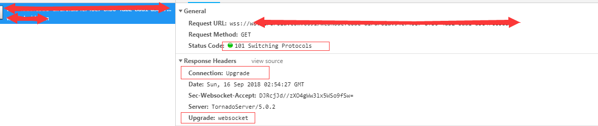

## 前言
http的状态码，其实只要是一个程序员都能脱口而出几个，但是如果想知道这些状态码，表示的是什么，使用场景在哪里？ 我觉得还是挺有意思的。所以专门花了一些时间，结合自己的知识面，专门整理了一下。
## 1xx 开头
**含义：服务器正在处理请求**
这一类型的状态码，代表请求已被接受，需要继续处理。这类响应是临时响应，只包含状态行和某些可选的响应头信息，并以空行结束。由于 HTTP/1.0 协议中没有定义任何 1xx 状态码，所以除非在某些试验条件下，服务器禁止向此类客户端发送 1xx 响应。
### 100 Continue
**含义：继续发送**
客户端应当继续发送请求。这个临时响应是用来通知客户端它的部分请求已经被服务器接收，且仍未被拒绝。客户端应当继续发送请求的剩余部分，或者如果请求已经完成，忽略这个响应。服务器必须在请求完成后向客户端发送一个最终响应。
**使用场景：**
1. http 100-continue用于客户端在发送POST数据给服务器前，征询服务器情况，看服务器是否处理POST的数据，如果不处理，客户端则不上传POST数据，如果处理，则POST上传数据。在现实应用中，通常在POST大数据时，才会使用100-continue协议。
2. 客户端策略
    1. 如果客户端有POST数据要上传，可以考虑使用100-continue协议。加入头{"Expect":"100-continue"}
    2. 如果没有POST数据，不能使用100-continue协议，因为这会让服务端造成误解。
    3. 并不是所有的Server都会正确实现100-continue协议，如果Client发送Expect:100-continue消息后，在timeout时间内无响应，Client需要立马上传POST数据。
    4. 有些Server会错误实现100-continue协议，在不需要此协议时返回100，此时客户端应该忽略。
3. 服务端策略
    1. 正确情况下，收到请求后，返回100或错误码。
    2. 如果在发送100-continue前收到了POST数据（客户端提前发送POST数据），则不发送100响应码(略去)。

### 101 Switching Protocols
**含义：协议升级**
服务器已经理解了客户端的请求，并将通过Upgrade 消息头通知客户端采用不同的协议来完成这个请求。在发送完这个响应最后的空行后，服务器将会切换到在Upgrade 消息头中定义的那些协议。 
**使用场景：**
只有在切换新的协议更有好处的时候才应该采取类似措施。例如，切换到新的HTTP 版本比旧版本更有优势，或者切换到一个实时且同步的协议以传送利用此类特性的资源。
其实在浏览器上最常见的使用场景，就是websocket在进行跟服务器握手的时候，这时候服务端就会返回201，从而进行协议升级，将协议从 http(s) 升级到 ws(s)

### 102 Processing
**含义：协议升级**
由WebDAV（RFC 2518）扩展的状态码，代表处理将被继续执行。
**使用场景：**
这个其实是临时响应，主要是用来通知客户端，我已经接受到你的请求了，正在处理，但是可能得要一段时间，比如得20s之类的，但是放心，等我处理完之后，我会再发一个回执通知你。
The server MUST send a final response after the request has been completed.
## 2xx
**含义：请求已正常处理完毕**
### 200 
**含义：协议升级**
由WebDAV（RFC 2518）扩展的状态码，代表处理将被继续执行。
**使用场景：**

---
参考：
[How to handle “100 continue” HTTP message?](https://zhuanlan.zhihu.com/p/30830041)
[102 PROCESSING](https://httpstatuses.com/102)

