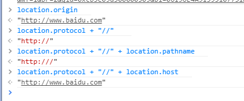
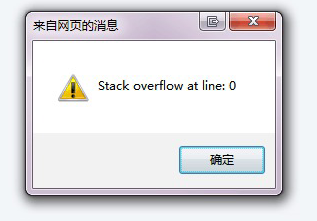
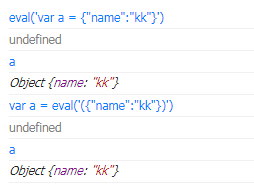

## 前言
虽然现在做的一些项目，越来越不需要兼容IE的问题，但是早期几年在做的时候，还是需要兼容一些IE的问题的，所以这边就把之前遇到的一些IE的兼容问题列一下，算加入到自己的问题手册中。
## IE8,IE9 使用 XDomainRequest 下不支持不同协议的post 跨域
这个可以看我的早期文章：
还是讲的比较详细的。
## IE8 下对象带关键字报错
之前做官网项目的时候，有报了一个错误, 就是 IE8 以下不能用 **self.server.payFromType.new** 这种写法，因为 new 是关键字，会导致代码报错。
要改成这种写法 **self.server.payFromType["new"]**
<!--more-->
## IE10 11 取消input框默认的叉叉和密码输入框的眼睛
IE10默认在input框中输入内容后会显示一个‘X’按钮，方便删除输入的所有内容。
在password输入框显示一个眼睛的按钮，去掉眼睛和叉叉的方法如下：
```javascript
::-ms-clear { display: none; }
::-ms-reveal { display: none; }
```
## IE6 支持png的透明度
这是IE6的老问题了，网上有很多相关的解决办法，归结起来有三种：
1.使用htc文件修复(自行查找相关文章) ；
2.js修复；
3.css hack。
这里主要说下css hack方法。通过filter我们可以间接让IE6支持png的alpha值(注：这种方法适合用png作为背景图的hack)，比如为某个元素设置了背景图:
```css
.class{background:url(images/bg.png)}
```
则相应的hack写法：
```css
.class{
    background:url(images/bg.png);
    /*IE6清除背景图*/
    _background:none;
    /*用filter载入的png图片就具有了alpha属性*/
    _filter:progid:DXImageTransform.Microsoft.AlphaImageLoader(enabled=true, sizingMethod=scale, src="misc/images/icon_circle.png")}
```
filter的相关属性和缺点(性能和不能平铺等)在此不赘述，需要注意的是对应的路径，虽然同样是写在css里，但filter的运行环境是相对于当前文档，而不是当前css，所以css中的url相对路径和filter中的路径很可能是不相同的，为了避免出错，你也可以使用完整路径，如：http://abc.com/misc/images/icon_circle.png ，如果你在使用filter时发现不起作用，很有可能是路径搞错了！
## 解决IE6 下png 透明背景图片 有锯齿的bug
在 IE6 下，不支持 透明背景的图片，一般的PNG透明都是 png 32，但是IE6 不支持 png32，只支持png 8。
看这个： 
## 关于滤镜AlphaImageLoader src属性的相对路径问题
今天偶然发现一个很让人无奈的问题,在我们的页面在样式文件里边设置了filter滤镜来过滤png图片(png图片在ie6中有灰色的背景，需要使用过滤器来过滤)，结果这些滤镜全都不能显示。后来查找问题，发现写在样式文件里边的filter的src是相对于当前浏览器的url路径，而不是相对于样式文件的路径(这与background-image的路径不同，background-image的路径是相对于样式文件的路径) 
例如：样式文件 
**http://a.b.c/a/b/c/d.css** 里边有如下样式定义： 
```css
.test{ 
    background-image:url(‘../../images/a.gif’); 
} 

.testFilter{ 
    filter: progid:DXImageTransform.Microsoft.AlphaImageLoader ( enabled=true , sizingMethod=scale, src=’../../images/b.png’ ) 
} 
```
在页面**http://b.c/a/b/c.html**里边引用该样式文件，那么： 
使用test样式时，它的背景图片取值路径为： **http://a.b.c/a/images/a.gif**, 
而使用testFilter时，引用的滤镜的图片地址为： **http://b.c/images/b.png**。 
## IE6 IE7 下 table 中 有长字符串导致table被扩大
在 ie6 ie7 下，如果在table 中 td 里面 div 中有长字符串的时候，会导致 整个table 被扩大,这时候，无论怎么定义 table td 和 div 的宽度，都没有效果, 只能使用 **work-break = break-all** 来切断字符
```javascript
// ie 浏览器下，检查长字符串，并做切断处理
// 只有 传输模块的文本，短信列表，新建短信 会用到，其他模块不适用
// todo ie 6 下很耗性能，后面不行的话，ie 6 直接砍掉
checkLongStrAndBreak:function(dom, targetDomSelector ,maxWidth){
    maxWidth = maxWidth || 315;
    targetDomSelector = targetDomSelector || ".item-content";
    var self = this;
    if(Airdroid.Util.browser.ie && dom.length > 0){
        setTimeout(function(){
            var isReinit = false;
            dom.each(function(){
                if($(this).find(targetDomSelector).outerWidth() > maxWidth){
                    $(this).find(targetDomSelector).css("word-break","break-all");
                    isReinit = true;
                }
            });
            if(isReinit){
                // 全部完了之后，再渲染一遍
                self.reinitScrollbar();
            }
        },20);
    }
},
```
## IE9以下没有 location.origin
ie 9 及以下，没有 location.origin 这个属性，只能 用 location.protocol + "//" + location.host 来代替

## IE6 - IE9 CSS禁止选择文本功能
有时候，我们为了用户体验，需要禁用选择文本功能。 这需要用到一个CSS属性：**user-select**。
一般浏览器我们都这样写：
```css
body{
    -moz-user-select: none; /*火狐*/
    -webkit-user-select: none; /*webkit浏览器*/
    -ms-user-select: none; /*IE10*/
    -khtml-user-select: none; /*早期浏览器*/
    user-select: none;
}
```
IE6-9还没发现相关的CSS属性，只能通过JS来实现:
```javascript
//IE6-9
document.body.onselectstart = document.body.ondrag = function(){
    return false;
}
```
## IE6，IE7不支持tr的border样式
IE6，IE7不支持tr的border样式。
Firefox和IE8及以上支持tr的border样式。
在IE6,IE7只好用td来控制border了。
## IE6 使用 inline-block
IE6 默认 inline 的元素才可设为 inline-block， 所以要用 inline 元素 **span**。
如果是其他非默认inline布局的元素，如果设置为 inline-block，那么是不起效果的。
## IE7 下设置绝对定位的时候，有时候显示不出来
IE7 下有时候，会有这个问题，就是某个元素设置绝对定位，并设置成 **display : block**， (用 js 或者添加css类来设置),但是在界面上却没有显示出来。
解决方法， 添加 **zoom: 1** 来触发  IE 的hasLayout属性， 同时 **z-index** 也要设大
## 关于Zoom属性(清除margin重叠)
Zoom属性是IE浏览器的专有属性，Firefox等浏览器不支持。它可以设置或检索对象的缩放比例。除此之外，它还有其他一些小作用，比如触发ie的hasLayout属性，清除浮动、清除margin的重叠等。
Zoom的使用方法：
```css
zoom : normal | number
```
```css
normal :　 默认值。使用对象的实际尺寸
number :　 百分数 | 无符号浮点实数。浮点实数值为1.0或百分数为100%时相当于此属性的 normal 值 用白话讲解就是zoom:后面的数字即放大的倍数，可以是数值，也可以是百分比。如：zoom:1，zoom:120%。 而这个属性只要在IE中才起作用，所以很少用到它的实际用途，而最经常用到作用是清除浮动等。
```
清除浮动，清除margin重叠：
```css
.border{
    border:1px solid #CCC;
    padding:2px;
    overflow:hidden;
    _zoom:1;
}
```
_zoom是CSS hack中专对IE6起作用的部分。IE6浏览器会执行zoom:1表示对象的缩放比例，但这里 overflow:hidden;和_zoom:1;是连起来用的，作用是清除border内部浮动。
同理，还可以使用同样方法清除margin属性在IE浏览器中的重叠问题。
## IE6 不支持 css 属性选择器
只有在规定了 !DOCTYPE 时，IE7 和 IE8 才支持属性选择器。在 IE6 及更低的版本中，不支持属性选择。
比如这样写在 IE6 下是不起作用的
```css
[title] {
    color:red;
}
```
## IE6不支持两个连续并列class类名
简单的来说，就是
```css
.item-state-3.item-to-3  {
     display:block
}
```
到 IE6 就变成
```css
.item-to-3  {
     display:block
}
```
前面的选择丢了，只取后面那一个
## IE7处理colspan的列有问题
IE7处理colspan的列有问题。当colspan的单元格内容宽度大于同列非colspan列的宽度时，非colspan的单元格会被撑大。
## IE6 IE7 下 padding 算在 width 里面
这个就是 IE 怪异盒子模型。 这边不细讲，网上到处都是
## IE6 IE7 下 兼容 max-width 和  max-height
我们知道 IE6 IE7 下是没有这两个属性的，可以用以下方式兼容：
```css
// =lt-ie8

// =lt-ie7
// max-width and max-height
// not support .max-width(10%)
.max-width (@width) {
  max-width: unit(@width, px);
  @w : unit(@width);
  .lt-ie7 & {
    width: e('expression(this.scrollWidth>@{w}?"@{w}px":"auto")');
    overflow: hidden;
  }
}

.max-height (@height) {
  max-height: unit(@height, px);
  @h : unit(@height);
  .lt-ie7 & {
    height: ~'expression(this.scrollHeight>@{h}?"@{h}px":"auto")';
    overflow: hidden;
  }
}
```
该 less 属性 兼容 IE6 IE7 的 max-width 属性, 使用方式如下:
**.item-content {.max-width(340px)}**                            
但是有一种情况下，会出错，就是  item-content 这个类，不能放在table上 ，不然ie6 下会出问题。遇到这种情况的话，只能在 item-content 再套一层的 div，然后设置固定宽度。

## IE6 下双倍margin的问题
解决方法，在class上设置  display: inline;
## IE6 下用table会有间隙
用**cellspacing="0"**来消除 间隙
```html
<table cellspacing="0">xxx</table>
```
## IE 6,7,8 下加载script脚本，并执行成功和失败事件
请看这个： 
## IE6,7,8 兼容 oninput 方法
当对输入框框(input)的输入做监听时，会用到诸如：onchange, oninput, onpropertychange，来看看他们的区别和联系吧。
onchange：
- 事件触发条件：输入框(input)的值改变，且失去焦点(onblur)后才触发(这一点就很不好)。
- 兼容性：各浏览器都支持。

oninput & onpropertychange：
- 事件触发条件：输入时，实时触发，而不是失去焦点才触发。
- 兼容性：
**oninput**: 在用户输入、退格、删除、剪切、粘贴及鼠标剪切与粘贴时触发(在 IE9&IE9+ 中可能略有区别)。 Chrome/IE9/Firefox/Safari/Opera 支持
**onpropertychange**: 在用户输入、退格、删除、剪切、粘贴及鼠标剪切与粘贴时触发。 IE6/IE7/IE8/IE9 支持

所以如果要实现输入时，实时触发事件，结合使用oninput + onpropertychange就可以了，即 
```javascript
(if IE) onpropertychange + else oninput
```
注意：IE9下： 剪切(cut)，删除(delete)不会触发事件。
oninput 事件要 ie9 及以上才支持。

同时顺便讲下 onkeyup 和 oninput 事件的差别，input 事件 会比 keyup 更容易监听内容变化事件，因为keyup不能监听粘贴等操作。

## 如何写针对IE9 的 css
```css
background-color:blue\9\0; 仅IE9支持；
```
## IE 下图片加载失败的无限错误
之前在做项目的时候，又遇到过这个问题，代码如下：
```html
<!DOCTYPE html PUBLIC "-//W3C//DTD XHTML 1.0 Transitional//EN" "http://www.w3.org/TR/xhtml1/DTD/xhtml1-transitional.dtd"><!-- saved from url=(0022)http://www.airdroid.com --><!--[if lt IE 7]>
<html class="lt-ie9 lt-ie8 lt-ie7 ie-6"> <![endif]--><!--[if IE 7]>
<html class="lt-ie9 lt-ie8 ie-7"> <![endif]--><!--[if IE 8]>
<html class="lt-ie9 ie-8"> <![endif]--><!--[if gt IE 8]><!-->
<html class="no-ie"> <!--<![endif]-->
<head>
    <meta http-equiv="Content-Type" content="text/html; charset=utf-8">
    <title>AirDroid</title>
</head>
<body>

<script type="text/javascript">
    document.getElementById('test').onerror = function(){
          this.src = '2.jpg';
     }
</script>
</body>
</html>
```
在ie下，以上代码会出现 堆栈溢出的错误。

原因就是 1.jpg 和 2.jpg 都不存在，导致 onerror 的无限循环。因此改成 
```javascript
    document.getElementById('test').onerror = function(){
         this.onerror = null;
          this.src = '2.jpg';
     }
```
就解决了。
## IE6 使用eval来代替json格式转换
在IE6 下，不支持 JSON 原生函数，所以要用eval来代替 json格式转换。
比如这样子：
```javascript
eval('var a={"name":"kk"}')
```
但是这样会产生一种情况，就是 a 变成全局变量了，因此可以采用另一种方法，用括号包起来
```javascript
var a = eval('({"name":"kk"})')
```
这种会更好，就不会变成全局变量了。

## IE7及以下使用activexobject进行同域异步请求
具体看这个：
简单的来说，就是 IE8 和 IE9 如果要进行请求跨域的时候，那么就要用 XDomainRequest 对象，IE10 及以上和其他的浏览器 都用 xhr 对象来进行跨域请求。
也就是 IE7 及以下是不能进行异步跨域请求的，只能用异步同域请求。那么是用什么对象来进行异步同域请求的呢？？？
ActiveXObject 这个对象是 ie5 才加进去的。
也就是如果要在 ie5 及以上（ie5， ie6， ie7， ie8， ie9）要执行同域下的异步请求的话， 那么就用这个。
```javascript
if(window.ActiveXObject)//IE
{
    try {
        //IE6以及以后版本中可以使用
        xmlHttp = new ActiveXObject("Msxml2.XMLHTTP");
    }
    catch (e) {
        //IE5.5以及以后版本可以使用
        xmlHttp = new ActiveXObject("Microsoft.XMLHTTP");
    }
}
```
        


