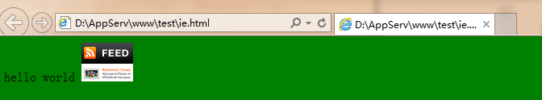

之前有个项目是给pc端的桌面应用做内嵌页，也就是说这个项目的页面不是线上的页面，而是打包在pc端的安装包里面，而且pc端还没有开webserver来显示页面，而是直接用文档模式来打开html页面，后面有发生一种情况就是如果直接用文档模式打开html页面，并且有引入js脚本的话，会出现这种提示：

<!--more-->
举个很简单的例子，就是有一个页面，里面有一个js文件，然后用本地文档模式来打开，就会出现这种情况

ie.html：

<html>
    <head>
        
    </head>
    <body>
        hello world
    </body>
</html>

ie.js：

alert("33");

然后用文档模式打开，就会出现这种情况：

发现没有执行 alert 函数，也就是没有加入外部脚本。

后面查了一下，发现是因为ie的一个安全机制，即 MOTW。
MOTW 是 The Mark of the Web 的英文简称。MOTW 是 Windows Internet Explorer通过强制使IE浏览器浏览存储下来的网页在安全的位置的一种机制，目的是增强安全性。MOTW 是一个注释作为标签添加到HTML网页中的，当用户打开存储在本地的HTML文档时，IE浏览器通过读这个注释判断是否在安全区域。下面是一个有效地MOTW示例：<!-- saved from url=(0023)http://www·sagerking·com/ -->其中，（0025）值是他后面的字符串长度，sagerking是Internet Web站点的名称，当浏览器打开此保存的html时，IE将查找“Save from URL”注释，并使用适合该URL的区域来确定对Web页应该应用哪种安全策略。
官方是这样解释的：

The Mark of the Web (MOTW) is a feature of Windows Internet Explorer that enhances security. MOTW enables Internet Explorer to force webpages to run in the security zone of the location the page was saved from—as long as that security zone is more restrictive than the Local Machine zone—instead of the Local Machine zone. When you are developing webpages, the MOTW enables you to test your HTML documents in the security zone where you intend the pages to run. Adding the MOTW to your webpages also enables you to fully test their compatibility with users' security settings.

也就是我们只要加上 save from url 就可以了：

<!DOCTYPE html PUBLIC "-//W3C//DTD XHTML 1.0 Transitional//EN" "http://www.w3.org/TR/xhtml1/DTD/xhtml1-transitional.dtd">
<!-- saved from url=(0022)http://www.airdroid.com/ -->
<html xmlns="http://www.w3.org/1999/xhtml">
    <head>
        
    </head>
    <body>
        hello world
    </body>
</html>


这样就可以执行了。而且后面引入css和图片也都没问题

ps：我发现url 后面的域名好像只要有就行了，不一定是要你的产品的域名。