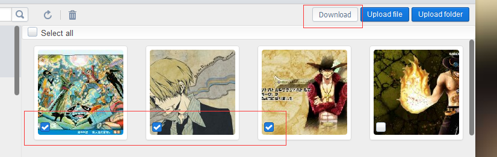
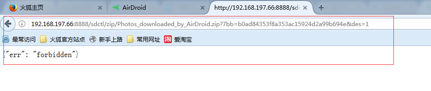

之前在做 web.airdroid.com (这个项目允许在web上操作手机的东西，尤其是在同一个局域网下)项目的时候，有发生过一个bug， 就是Firefox 在 web.airdroid.com 进行 zip 包下载，会报一个 forbidden 的错误，这个错误是手机端返回的。

这时候点击下载，这个页面就会跳转到

为啥会这样呢，不仅整个 web.airdroid.com 的页面都重定向了，而且下载还失败了？？？
<!--more-->
后面查了一下，发现在进行 post 下载的时候，在Firefox下会进行重定向，然后因为这个重定向的原因，导致 之前 web.airdroid.com 的 websocket 断开，错误码是 1001，而 1001表示端点“离开”（going away），例如服务器关闭或浏览器导航到其他页面。
所以整个过程就是这个下载zip包导致页面重定向，导致 websocket 断开，导致手机端那边认为连接断开了，所以后面重定向之后，就会返回 forbidden， 也就是不让下载了，因为手机端断开之后的所有请求都是非法的。否则正常流程下，应该是web端抛送一个请求过去，手机端就会将所选的资源打包成二进制流，然后直接抛送到浏览器端，让浏览器端去下载。
而在 chrome 下是不会的，是正常的，只有Firefox 才会。
具体代码逻辑是：

var filePath = this.getStreamAssets("/sdctl/zip/" + zipname + ".zip", {});
$("<form method='post'></form>")
    .attr("action", filePath)
    .append($("<input type='hidden' name='data' />").attr('value', "type=" + type + "&systemType=" + osType[Airdroid.Util.OS.getOSName()] + "&params=" + encodeURIComponent(JSON.stringify(params))))
    .appendTo('body')
    .submit()
    .remove();

可以看到，这边是直接生成一个form，然后在当前页面重定向，才会导致这种情况发生。所以解决方法也很简单，就是在这个form进行重定向的时候，target 设置 为 _blank, 这样子就会重新开这个tab，而不会在当前tab进行重定向。

$("<form method='post'></form>")
    .attr("action", filePath)
    .attr("target", "_blank")
    .append($("<input type='hidden' name='data' />").attr('value', "type=" + type + "&systemType=" + osType[Airdroid.Util.OS.getOSName()] + "&params=" + encodeURIComponent(JSON.stringify(params))))
    .appendTo('body')
    .submit()
    .remove();

这样就可以解决这个问题了。 但是这样会有一个不好的地方，就是会有一个很明显的打开一个空tab，然后再重新关闭的现象，其实还是比较讨厌的，如果能像之前chrome那样，直接在本页面之内进行下载最好了。后面看了一个文章[iframe跨域POST提交](https://www.cnblogs.com/webbest/p/7161174.html), 发现其实可以通过将target 指向一个 iframe 的名字，这样就可以通过 iframe 进行post提交，并且可以跨域。
后面代码改为：

<iframe id="downloadFrame" name="downloadFrame" style="display:none" width="0" height="0" />

var filePath = this.getStreamAssets("/sdctl/zip/" + zipname + ".zip", {});
$("<form method='post'></form>")
    .attr("action", filePath)
        // 这边通过指向一个iframe进行下载，可以避免在Firefox打开一个新tab的情况
    .attr("target", "downloadFrame")
    .append($("<input type='hidden' name='data' />").attr('value', "type=" + type + "&systemType=" + osType[Airdroid.Util.OS.getOSName()] + "&params=" + encodeURIComponent(JSON.stringify(params))))
    .appendTo('body')
    .submit()
    .remove();

这样就可以在本页面直接下载zip包了，而且是post，无论是chrome还是Firefox 都没有问题。
不过这样会有一个问题，就是如果当前连接断开了，那么就会下载失败，而且因为是在iframe下载的，所以会没有任何界面反馈，如果是上面那种_blank 的形式，至少还会弹出一个错误的新页面来提示用户下载失败。

