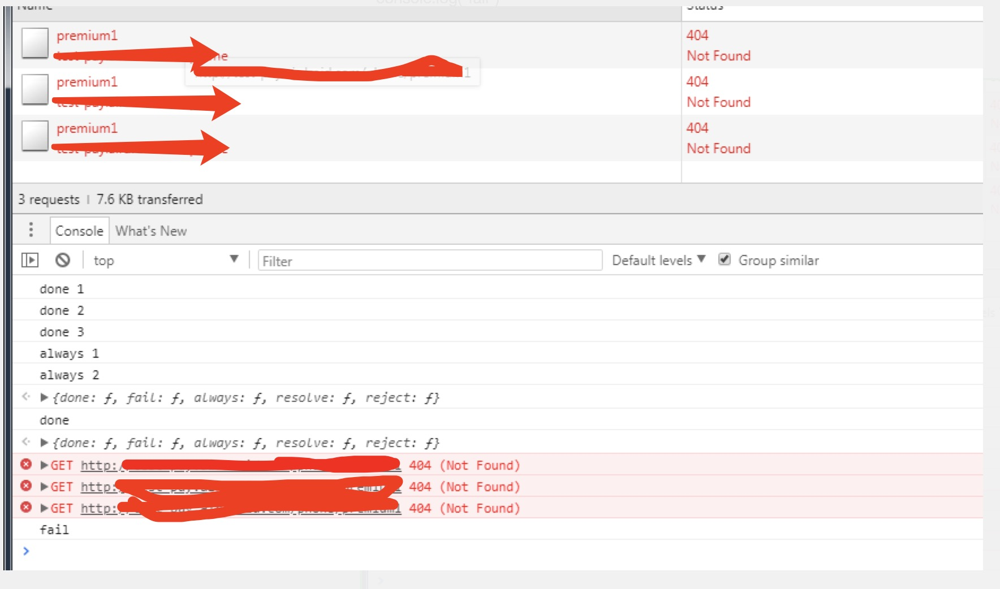

之前在做手机端页面的时候，为了减少体积，舍弃了jquery和zepto, 自己用原生写了一个ajax库，不仅可以实现jquery库的ajax功能，而且还进行了扩展，主要有以下功能：
1. 支持ajax跨域请求
2. 支持jsonp跨域请求
3. 支持异步加载js文件
4. 支持deferred用法或者直接传入回调参数的用法
5. 支持同步调用
6. 支持ajax请求失败的加载重试次数设置
7. 兼容ie6，ie7

具体代码如下：
<!--more-->

/**
 * Ajax 请求库
 */
(function (_window) {
    _window.globalEval = _window.globalEval || eval;

    var Deferred = function () {
        var self, successCbs, failCbs, alwaysCbs, status,
            result, createDeferredFn, createInvokeFn;

        self = this;
        successCbs = [];
        failCbs = [];
        alwaysCbs = [];
        status = 'waiting';
        result = [];

        createDeferredFn = function (invokeStatus, cbs) {
            return function (fn) {
                if (invokeStatus.indexOf(status) > -1) {
                    fn.apply(self, result);
                } else {
                    cbs.push(fn);
                }
                return this;
            };
        };

        createInvokeFn = function (newStatus, cbs) {
            return function () {
                var args = arguments;
                status = newStatus;
                cbs.concat(alwaysCbs).forEach(function(cb){
                    cb.apply(self, args);
                    result = args;
                });
            };
        };

        return {
            done: createDeferredFn(['resolved'], successCbs),
            fail: createDeferredFn(['rejected'], failCbs),
            always: createDeferredFn(['resolved', 'rejected'], alwaysCbs),
            resolve: createInvokeFn('resolved', successCbs),
            reject: createInvokeFn('rejected', failCbs)
        };
    };

    _window.ajax = {
        /**
         * 发送 jsonp 请求
         * @param url
         * @param {Object|Function} [data]
         * @param {Function} [successCb]
         * @param {Function} [failCb]
         * @param {Function} [alwaysCb]
         */
        jsonp: function (url, data, successCb, failCb, alwaysCb) {
            var callbackName, script, defer;

            defer = Deferred();

            if (typeof url === 'object') {
                var tmp = url;
                url = tmp.url;
                data = tmp.data;
                successCb = tmp.success;
                failCb = tmp.fail;
                alwaysCb = tmp.always;

            } else if (typeof data === 'function') {
                successCb = data;
                data = {};
            }

            data.callback = 'jsonp' + new Date().getTime();
            callbackName = data.callback;

            if (data) {
                url = url + '?' + toUrlParam(data);
            }
            script = document.createElement("script");
            script.id = callbackName;

            function clean() {
                alwaysCb && alwaysCb();
                window[callbackName] = null;
                script.parentNode.removeChild(script);
            }

            window[callbackName] = function (resp) {
                // TODO 实现 jsonp 的 responseText
                // defer.responseText =
                successCb && successCb(resp);
                defer.resolve(resp);
                clean();
                console.debug('jsonp end:', resp);
            };

            script.onerror = function (e) {
                failCb && failCb(e);
                defer.reject(e);
                clean();
                console.debug('jsonp error:', e);
            };

            console.debug('jsonp start:', url);
            script.src = url;
            document.body.appendChild(script);
            return defer;
        },

        /**
         * 发送 ajax 请求，用法与 jqeruy 类似
         * @param opts
         */
        ajax: function (opts) {
            var dataType, async, fakeXhr, type;

            opts = opts || {};
            opts.dataType = opts.dataType ? opts.dataType.toLowerCase() : '';
            opts.async = typeof opts.async === 'undefined' ? true : opts.async;
            opts.type = opts.type ? opts.type.toLowerCase() : 'get';

            dataType = opts.dataType;
            async = opts.async;
            type = opts.type;

            if (async && type === 'get' && dataType === 'jsonp') {
                fakeXhr = ajax.jsonp.call(ajax, opts);
            } else {
                fakeXhr = ajax.xhrRequest.call(ajax, opts);
            }
            return fakeXhr;
        },

        requestRepeat: function (opts) {
            opts.defer = Deferred();
            opts.countTime = 0;
            opts.maxTime = opts.maxTime || 3;
            opts.request = ajax.ajax;
            return function () {
                return ajax.ajax(opts);
            }
        },

        xhrRequest: function (opts) {
            var self, url, data, type, dataType, async, resp, defer, xhr, maxTime, withCredentials;

            defer = opts.defer || Deferred();
            maxTime = opts.maxTime || 3;
            opts.countTime = typeof opts.countTime === 'undefined' ? maxTime : ++opts.countTime;

            self = this;
            opts = opts || {};
            url = opts.url;
            data = opts.data;
            async = opts.async;
            dataType = opts.dataType;
            type = opts.type;
            // 是否允许跨域的时候，带上cookie
            // 如果是同步请求的话，必须要为false，不然会报错
            withCredentials = async ? !!opts.withCredentials : false;

            if ('data' in opts && typeof data !== 'string') {
                data = toUrlParam(data);
                if (type === 'get') url += '?' + data;
            }
            xhr = window.ActiveXObject ? createActiveXHR() : createStandardXHR(withCredentials);
            xhr.open(type, url, async);
            xhr.onreadystatechange = function () {
                if (xhr.readyState == 4) {
                    defer.responseText = xhr.responseText;
                    switch (xhr.status) {
                        case 200:
                            resp = self.decodeResponse(xhr.responseText, dataType);
                            opts.success && opts.success(resp);
                            defer.resolve(resp);
                            break;
                        default :
                            if (opts.countTime < maxTime) {
                                opts.request(opts);
                            } else {
                                opts.fail && opts.fail();
                                defer.reject();
                            }
                            break;
                    }
                }
            };
            if (data) {
                if (type === 'post') {
                    xhr.setRequestHeader("Content-type", "application/x-www-form-urlencoded");
                }
                xhr.send(data);
                console.debug('ajax start:', url, data);
            } else {
                xhr.send();
                console.debug('ajax start:', url);
            }

            if (!async) {
                defer.responseText = xhr.responseText;
            }

            return defer;
        },

        decodeResponse: function (responseText, dataType) {
            switch (dataType) {
                default :
                case 'html':
                    return responseText;
                case 'json':
                    return JSON.parse(responseText);
                case 'script':
                    globalEval(responseText);
                    return '';
            }
        },

        "getJSON": function (url, data, successCb, failCb, alwaysCb) {
            if (typeof url === 'object') {
                var tmp = url;
                url = tmp.url;
                data = tmp.data;
                successCb = tmp.success;
                failCb = tmp.fail;
                alwaysCb = tmp.always;

            } else if (typeof data === 'function') {
                successCb = data;
                data = {};
            }

            this.ajax({
                url: url,
                data: data,
                success: successCb,
                fail: failCb,
                always: alwaysCb
            });
        }
    };

    function createStandardXHR(withCredentials) {
        try {
            var xhrTmp = new window.XMLHttpRequest();
            xhrTmp.withCredentials = withCredentials;
            return xhrTmp;
        } catch (e) {
        }
    }

    function createActiveXHR() {
        try {
            return new window.ActiveXObject("Microsoft.XMLHTTP");
        } catch (e) {
        }
    }

    function toUrlParam(obj) {
        var arr = [];
        for (var key in obj) {
            arr.push(key + '=' + encodeURIComponent(obj[key]));
        }
        return arr.join('&');
    }
})(window);


用法的话：

1. jsonp 用法：

window.ajax.jsonp(
            'http://xxx.com/phone/premium',
            {q: "111"}
        ).done(function (resp) {
                console.log("done 1");
        }).done(function (resp) {
                console.log("done 2");
        }).done(function (resp) {
                console.log("done 3");
        }).fail(function () {
                console.log("fail 1");
        }).fail(function () {
                console.log("fail 2");
        }).fail(function () {
                console.log("fail 3");
        }).always(function () {
                console.log("always 1");
        }).always(function () {
                console.log("always 2");
        });


2. 多次数的 ajax 请求, 如果失败的话，会重复请求三次

   var request = ajax.requestRepeat({
     url: "http://xxx.com/phone/premium1",
     dataType: 'json',
     type: 'get',
     maxTime: 3
   })();
   request.done(function (res) {
      console.log("done")
   }).fail(function () {
       console.log("fail")
   })


3. 普通的 ajax 请求：

var request = ajax.ajax({
  url: "http://xxx.com/phone/premium",
}).done(function (res) {
   console.log("done")
}).fail(function () {
    console.log("fail")
})


---

ps: 如果真的要在ie6，ie7 下使用的话，那么有一个函数会报错，就是 Array.prototype.forEach，所以这边要加上这个polyfill方法： [文档](https://developer.mozilla.org/zh-CN/docs/Web/JavaScript/Reference/Global_Objects/Array/forEach)

// Production steps of ECMA-262, Edition 5, 15.4.4.18
// Reference: http://es5.github.io/#x15.4.4.18
if (!Array.prototype.forEach) {

  Array.prototype.forEach = function(callback, thisArg) {

    var T, k;

    if (this == null) {
      throw new TypeError(' this is null or not defined');
    }

    // 1. Let O be the result of calling toObject() passing the
    // |this| value as the argument.
    var O = Object(this);

    // 2. Let lenValue be the result of calling the Get() internal
    // method of O with the argument "length".
    // 3. Let len be toUint32(lenValue).
    var len = O.length >>> 0;

    // 4. If isCallable(callback) is false, throw a TypeError exception. 
    // See: http://es5.github.com/#x9.11
    if (typeof callback !== "function") {
      throw new TypeError(callback + ' is not a function');
    }

    // 5. If thisArg was supplied, let T be thisArg; else let
    // T be undefined.
    if (arguments.length > 1) {
      T = thisArg;
    }

    // 6. Let k be 0
    k = 0;

    // 7. Repeat, while k < len
    while (k < len) {

      var kValue;

      // a. Let Pk be ToString(k).
      //    This is implicit for LHS operands of the in operator
      // b. Let kPresent be the result of calling the HasProperty
      //    internal method of O with argument Pk.
      //    This step can be combined with c
      // c. If kPresent is true, then
      if (k in O) {

        // i. Let kValue be the result of calling the Get internal
        // method of O with argument Pk.
        kValue = O[k];

        // ii. Call the Call internal method of callback with T as
        // the this value and argument list containing kValue, k, and O.
        callback.call(T, kValue, k, O);
      }
      // d. Increase k by 1.
      k++;
    }
    // 8. return undefined
  };
}

这样就没问题了。 基本上这个库可以满足正常的接口请求的方法。