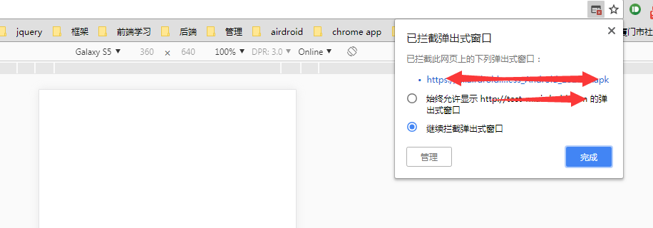

## 前言
之前有做一个功能，就是如果有一个h5的下载页面， 如果是在android 打开的话，自动下载对应的apk 文件。
这种情况下，不能直接粗暴的将这个下载链接， 直接用 window.open 来打开。不然这种未经用户行为的open页面时间会被浏览器給挡掉的：

<!--more-->
## 解决
所以应该改成用 iframe 来下载：
```javascript
function DownloadFile (url) {
    var $downloadFrame = $('#downloadFrame');
    if ($downloadFrame.length <= 0) {
        // 创建 iframe 来进行下载
        $downloadFrame = $('<iframe id="downloadFrame" width="0" height="0" style="display: none;"></iframe>');
        $downloadFrame.appendTo($('body'));
    }
    $downloadFrame.attr('src', url);
}
```
然后如果这个下载页面本来就是一个空白页的话，那么就顺便把这个页面给关掉， 或者回到默认页:
```javascript
var userAgent = navigator.userAgent;
if (userAgent.indexOf("Firefox") != -1 || userAgent.indexOf("Chrome") !=-1) {
  window.location.href="about:blank";
}else if(userAgent.indexOf('Android') > -1 || userAgent.indexOf('Linux') > -1){
  window.opener=null;window.open('about:blank','_self','').close();
}else {
  window.opener = null;
  window.open("about:blank", "_self");
  window.close();
}
```


