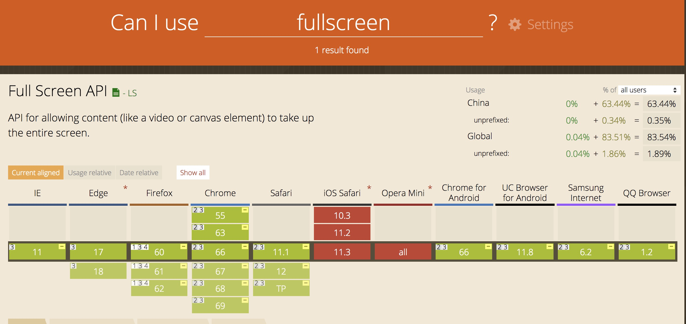
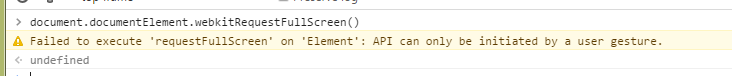
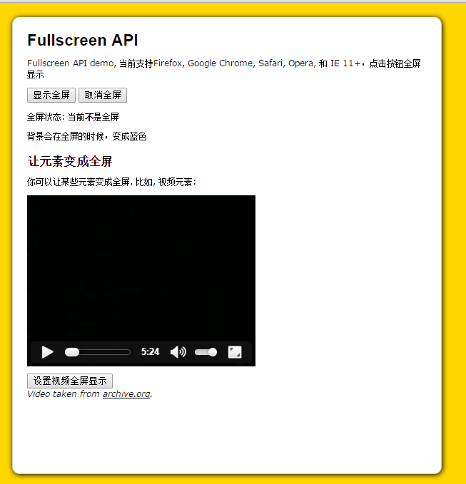
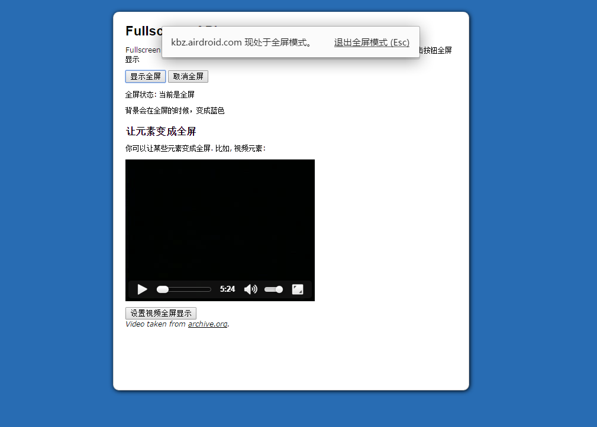

因为前段有做了一个功能是关于全屏显示图片和视频，因此这边稍微整理了一些关于在浏览器显示全屏的一些API。
HTML 5中的full screen 就是用来做全屏API的。不过还是会有一些浏览器兼容性问题。

可以看到IE下只有IE11才支持。而且其他支持的主流浏览器，也大部分都要使用前缀才行。主要有以下几个API：
<!--more-->
### element.requestFullScreen()
作用：请求某个元素element全屏

Document.getElementById(“myCanvas”).requestFullScreen()

这里是将其中的元素ID去请求fullscreen全屏。
假设有个按钮是"显示全屏"，点击就是将整个页面变成全屏的话，相当于按了F11的话，那么代码就是：

var viewFullScreen = document.getElementById("view-fullscreen");
if (viewFullScreen) {
    viewFullScreen.addEventListener("click", function (e) {
        // 主要，这边要全屏的对象是这个body，如果只是选择点击的对象，比如 e.currentTarget，那么就会变成只有这个按钮全屏
        var docElm = document.documentElement;
        // 浏览器兼容
        if (docElm.requestFullscreen) {
            docElm.requestFullscreen();
        } else if (docElm.msRequestFullscreen) {
            docElm.msRequestFullscreen();
        } else if (docElm.mozRequestFullScreen) {
            docElm.mozRequestFullScreen();
        } else if (docElm.webkitRequestFullScreen) {
            docElm.webkitRequestFullScreen();
        }
    }, false);
}

这时候整个屏幕就会变成全屏了。
如果是想单独对某个元素进行全屏话的话，比如对视频进行全屏的话，那么就是点击按钮对video元素进行全屏：

// video 元素全屏
var marioVideo = document.getElementById("mario-video"),  // 视频元素
    videoFullscreen = document.getElementById("video-fullscreen");  // "视频全屏" 按钮
// 这边只让视频全屏
if (marioVideo && videoFullscreen) {
    videoFullscreen.addEventListener("click", function (evt) {
        if (marioVideo.requestFullscreen) {
            marioVideo.requestFullscreen();
        } else if (marioVideo.msRequestFullscreen) {
            marioVideo.msRequestFullscreen();
        } else if (marioVideo.mozRequestFullScreen) {
            marioVideo.mozRequestFullScreen();
        } else if (marioVideo.webkitRequestFullScreen) {
            marioVideo.webkitRequestFullScreen();
        }
    }, false);
}

对你想要全屏显示的页面元素调用全屏方法，浏览器窗口就会变成全屏，但会先请求用户允许全屏模式。要注意，用户很有可能会拒绝全屏模式。如果用户运行全屏模式，则浏览器的工具条等按钮菜单都会隐藏，你的页面会覆盖整个屏幕。
注意：这个动作只能用户行为触发点击，比如要绑定在某个按钮的click事件，才会触发。如果只是单纯的在控制台执行是没有效果的，原因参照：

在chrome 下，如果这样执行，那么就会有提示

### 退出全屏 document.cancelFullScreen()
比如这边有个退出全屏的按钮，点击之后就会退出全屏，那么事件绑定如下：

var cancelFullScreen = document.getElementById("cancel-fullscreen");
if (cancelFullScreen) {
    // 浏览器兼容性
    cancelFullScreen.addEventListener("click", function () {
        if (document.exitFullscreen) {
            document.exitFullscreen();
        } else if (document.msExitFullscreen) {
            document.msExitFullscreen();
        } else if (document.mozCancelFullScreen) {
            document.mozCancelFullScreen();
        } else if (document.webkitCancelFullScreen) {
            document.webkitCancelFullScreen();
        }
    }, false);
}

需要注意的是，exitFullscreen只能由document对象调用，而不是启动全屏时传入的对象。

### 全屏属性和事件
判断当前是否是全屏状态 document.fullScreenElement，如果用户在全屏模式下，则返回true
fullscreenchange事件会在启动全屏或退出全屏时触发，当然因为浏览器兼容性原因，得写好几个：
比如有一个显示当前是否全屏的span标签，如果当前是全屏的话，那么就是显示 "全屏"， 如果非全屏，那么就是显示 "不全屏":

// 判断全屏状态
var fullscreenState = document.getElementById("fullscreen-state");
if (fullscreenState) {
    document.addEventListener("fullscreenchange", function () {
        fullscreenState.innerHTML = (document.fullscreenElement)? "全屏" : "不全屏";
    }, false);
    document.addEventListener("msfullscreenchange", function () {
        fullscreenState.innerHTML = (document.msFullscreenElement)? "全屏" : "不全屏";
    }, false);
    document.addEventListener("mozfullscreenchange", function () {
        fullscreenState.innerHTML = (document.mozFullScreen)? "全屏" : "不全屏";
    }, false);
    document.addEventListener("webkitfullscreenchange", function () {
        fullscreenState.innerHTML = (document.webkitIsFullScreen)? "全屏" : "不全屏";
    }, false);
}


### 全屏样式CSS
各种浏览器都提供了一个非常有用的全屏模式时的css样式规则：

/* Fullscreen */
html:-moz-full-screen {
    background: #286CB3;;
}
html:-webkit-full-screen {
    background: #286CB3;;
}
html:-ms-fullscreen {
    background: #286CB3;;
    width: 100%; /* needed to center contents in IE */
}
html:fullscreen {
    background: #286CB3;;
}


### 具体例子
我的github有写了一个简单的例子：[传送门](https://github.com/kebingzao/js-fullscreen/)
截图如下：
全屏之前：

全屏之后：

