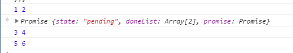
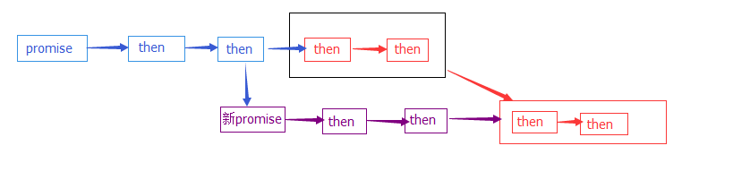

## 前言
Promise 是 ES6 的语法，但是会有浏览器兼容性，所以如果只是简单使用的话，那么可以用原生的js来实现，但是这个实现是非常简单的，如果只是基础的使用是没有问题的。
<!--more-->
## 代码
代码如下：
```javascript
function Promise(func){
    this.state = 'pending';
    this.doneList = [];
    func(this.resolve.bind(this));
    this.promise = this;
}

Promise.prototype = {
    resolve: function(){
        // arguments[0]是resolve的第一个参数
        var arg = arguments[0];
        while(true){
            if( this.doneList.length === 0 ){
                this.state = 'done';
                break;
            }
            if( arg instanceof Promise ){
                this.promise = arg;
                arg.doneList = arg.doneList.concat(this.doneList);
                this.doneList.length = 0;
                this.state = 'done';
                break;
            }
            // 这里是运行then里面回调函数的地方
            // 以数组形式传给下一个函数,然后保存新的值
            // 判断传递的参数是否为undefined,是的话，就不用传了
            if( typeof arg === 'undefined' ){
                arg = this.doneList.shift().apply(this);
            }else{
                arg = this.doneList.shift().apply(this, [arg]);
            }  
        }
        // 保存最后的arg，保证后续的回调能继续得到参数
        this.arg = arg;
    },
    then: function(callback){
        this.doneList.push(callback);
        if( this.state === 'done'){
            this.state = 'pending';
            this.resolve(this.arg); // 注意这里也要传递参数
        }
        return this.promise;
    }
}
```
## 实例
接下来测试一下：
```javascript
new Promise(function(resolve){
    resolve(1)
}).then(function(data){
    console.log(data, 2); // 1,2
    return new Promise(function(resolve){
        window.setTimeout(function(){
            resolve(3);
        }, 1000);
    }).then(function(data){
        console.log(data, 4); // 3,4
        return 5;
    });
}).then(function(data){
    console.log(data, 6); // 5, 6
});
```
结果是正确的：

稍微讲一下流程：
1. 初始化执行 reslove(1), 但是 因为 doneList.length 为0，所以将状态改为done后就退出了， 保存参数，所以这时候的 this.arg 的值为1
2. 接下来执行到第一个then，将 callback push进去，因为这时候状态已经为done了，所以执行resolve方法，并传入this.arg的值为1.
3. 在resolve方法中，因为doneList.length == 1了，并且arg参数为 1，所以执行第一个then的callback方法，打出log 1,2. 并返回一个promise 对象，
    注意，这时候的this.arg 的值就是这个promise方法执行的结果，其实就是一个promise对象，所以这时候就会进入到这个promise的执行过程中，这时候就会执行到这个timeout，等待resolve方法，所以接下来就会执行这个promise的then函数，因为这个promise的状态还是pending，所以then 的callback不执行，只是把callback放入这个promise的doneList中。
4. 接下来继续执行第一个promise的第二个then方法。 因为第一个promise的状态是done，所以执行第then函数体里面的 resolve方法，注意这里的this.arg就是第一个promise的第一个then的返回值，也就是第二个promise对象。所以在 reslove函数体里面， arg instanceof Promise 这个判断为真。接下来将arg参数，也就是第二个promise对象赋给第一个promise的 promise属性，并且把第一个promise的第二个then的callback放到第二个promise的donelist执行列表后面（这个就是精髓），然后把第一个promise的doneList执行列表清空（因为它已经跑到第二个promise的doneList列表去了），并且把状态改为done，等待第一个promise的下一个then方法。注意，接下来的this.arg还是第二个promise对象，并且doneList已经有两个callback了。
5. 因为第一个promise的then执行完了，并且第一个promise的doneList已经为空了，接下来就等第二个promise的timeout等待的reslove执行。当执行的时候，这时候又到了reslove 方法体里面。这时候的执行对象就是第二个promise对象，所以这时候的arg为3，并且 doneList.length ==2, 所以直接执行第二个promise的第一个then方法，这时候打印，3,4，执行完之后，因为doneList还有一个（就是原先第一个promise的第二个then），继续执行，打印5,6. 最后退出循环，把这个callback的返回值赋给 this.arg

总的流程可以用这张图表示：

如果没有回调返回一个promise，程序会一直按照第一行走下去，就算回调中有其他promise(只要不return)，也是两条并行的线。一旦返回promise，新的promise会在这个点插入，并且原来还没有执行的回调，也会排到新的回调列表后面了。

---
## 参考资料
[实现简易 ES6 Promise 功能 （一）](https://segmentfault.com/a/1190000004344928)
[实现简易 ES6 Promise 功能 （二）](https://segmentfault.com/a/1190000004358563)