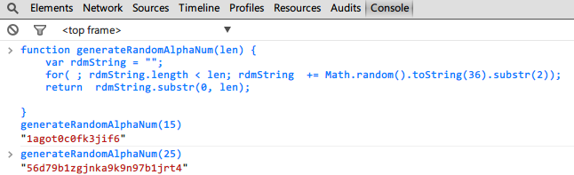

## 原理
利用**Math.random**和**toString**生成随机字符串。这里的技巧是利用了toString方法可以接收一个基数作为参数的原理，这个基数从2到36封顶。如果不指定，默认基数是10进制。
```javascript
function generateRandomAlphaNum(len) {
    var rdmString = "";
    for (; rdmString.length < len; rdmString += Math.random().toString(36).substr(2));
    return rdmString.substr(0, len);
}
```   



