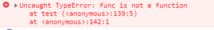

## 前言 
最近有在面试前端的人，刚好经常有问了一下关于js的作用域和变量提升，结合网上的一些资料，我这边按照自己的理解总结了一下。
## JS 的变量作用域
引用术语，就是：

作用域（Scope）即代码执行过程中的变量、函数或者对象的可访问区域，作用域决定了变量或者其他资源的可见性；计算机安全中一条基本原则即是用户只应该访问他们需要的资源，而作用域就是在编程中遵循该原则来保证代码的安全性。除此之外，作用域还能够帮助我们提升代码性能、追踪错误并且修复它们。

JavaScript 中的作用域主要分为**全局作用域（Global Scope）** 与 **局部作用域（Local Scope）** 两大类
<!--more-->
### ES5 的函数作用域
在ES5中， 局部作用域只有函数作用域， 直到 ES6 中，才增加了另一个局部作用域，也就是块级作用域。
全局作用域其实是全局对象的作用域，任意地方都可以访问到（如果没有被函数作用域覆盖）。
函数对象作用域跟 **c** 的局部变量作用域是不同的，它的作用域是整个函数范围，不论他是在函数的任意位置申明的！这就是所谓的 **hoisting**，也就是变量提升的概念。
函数作用域的一个例子：

var name = "Global";
function showName () {
  var name = "Local";    // local variable; only accessible in this showName function
  console.log (name);    // output Local
}
console.log (name); // the global variable, output Global

用 **var** 证明没有块级作用域的一个例子：

(function (){
     var name = "Global";  
     if(name){
         var name = "Local";
         console.log(name);
     } 
     console.log(name)
})();

最后两个都输出 **Local**。 说明 if 大括号里面的作用域还是外层的那个函数作用域。
还有一个例子就是：

for (var i = 0; i < 10; i++) {
  // some code
}
return i;

这时候就会输出 **10**

### 全局变量
所有在函数外面声明的变量都处于全局作用域中。在浏览器环境中，这个全局作用域就是我们的**Window**对象（或者整个HTML文档）。
每一个在函数外部声明或者定义的变量都是一个全局对象，所以这个变量可以在任何地方被使用，例如：

var myName = "ke";
var sex = "male";

//他们都处在window对象中
console.log(window.myName); // ke
console.log('sex' in window); //true

还有一种就是： 如果一个变量第一次初始化/声明的时候没有使用var关键字，那么他自动加入到全局作用域中。

function showAge(){
  //age初始化时没有使用var关键字，所以它是一个全局变量
  age = 20;
  console.log(age);
}

showAge();        //20
console.log(age); //因为age是全局变量，所以这里输出的也是20

**setTimeout/setInterval** 中的函数是在全局作用域中执行的。
**setTimeout/setInterval** 中的函数所处在于全局作用域中，所以函数中使用this关键字时，这个this关键字指向的是全局对象（Window）:

var Value1 = 200;
var Value2 = 20;
var myObj = {
  Value1 : 10,
  Value2 : 1,
  caleculatedIt: function(){
    setTimeout(function(){
      console.log(this.Value1 * this.Value2);
    }, 1000);
  }
}

myObj.caleculatedIt(); //4000

## 作用域链
- 每一个函数都有一个与之相关的作用域链，当js在查找变量X时，它会从链的第一个对象开始查找，如果这个对象有一个名为X的属性值，则会直接使用这个 属性值，如果没有就继续下一个对象寻找...一直找到最后都没有的话则会输出ReferenceError引用错误！
- 作用域链查找的顺序是：当前函数对象-->上一层函数对象...-->window全局对象！

举个例子：

var name = '1';
function fun1 (){
    var name = '2';
    function fun2(){
        var name = '3';
        console.log(name);
    }
    function fun3(){
        console.log(name);
    }
    fun2()
    fun3()
}
fun1();

最后会输出 **3**，**2**.
刚开始输出 **3** 很好理解，就是 fun2的函数作用域下的name是 **3**，他会覆盖所有上层作用域下的同名变量，所以输出**3**。而后面输出**2**是因为func3 找不到 name 变量，就到上一层函数作用域 fun1，这时候找到了，所以就为**2**， 当然如果这时候还找不到的话，那么就得到window 全局对象去找。

还有一个例子就是：

<html>
 <head>
 
 </head>
 <body>
    <button id="button1">Button1</button>
    <button id="button2">Button2</button>
    <button id="button3">Button3</button>
 </body> 
</html>

当文档加载完毕，给几个按钮注册点击事件，当我们点击按钮时，会弹出什么提示框呢？？
是的，三个按钮都是弹出：Button4。当注册事件结束后，i的值为4，当点击按钮时，事件函数即“function(){ alert("Button"+i);}”这个匿名函数中没有i,根据作用域链，所以到buttonInit函数中找，此时i的值为4，所以弹出”button4“。

## 变量提升（hoisting）
MDN中对变量hoisting的解释是这样的：

var hoisting
Because variable declarations (and declarations in general) are processed before any code is executed, declaring a variable anywhere in the code is equivalent to declaring it at the top. This also means that a variable can appear to be used before it's declared. This behavior is called "hoisting", as it appears that the variable declaration is moved to the top of the function or global code.

这段话翻译下来就是：
因为变量声明是在任意代码执行前处理的，在代码区中任意地方声明 变量和在最开始（最上面）的地方声明 是一样的。也就是说，看起来一个变量可以在声明 之前被使用！这种行为就是所谓的“hoisting”，也就是变量提升，看起来就像变量的声明 被自动移动到了函数或全局代码的最顶上。
**注意：仅仅是声明提升了，定义并不会被提升。**
其实这里的 “**变量提升**” 名词是随大流叫法，“变量提升” 改为 “标识符提升” 更准确。因为变量一般指使用 var 声明的标识符，JS 里使用 function 声明的标识符也存在提升（Hoisting）。
JS 存在变量提升，这个的设计其实是低劣的，或者是语言实现时的一个副作用。它允许变量不声明就可以访问，或声明在后使用在前。新手对于此则很迷惑，甚至许多使用JS多年老手也比较迷惑。但在 ES6 加入 let/const 后，变量Hoisting 就不存在了， 虽然 let/const 的声明也会被提升，但是不允许在实际声明前使用。
为了更好的理解变量提升，先看几个例子：
**1.  变量未声明，直接使用**

function test() {
    console.log(notDefined);
}
test();

直接报错，很正常。

**2. 变量声明在末尾**

function test() {
    console.log(declaredButNotAssigned); // undefined
    var declaredButNotAssigned;
}
test();

这时候会输出 **undefined**
**3. 变量声明在末尾，同时给变量赋值**

function test() {
    console.log(declaredAndAssigned); // undefined
    var declaredAndAssigned = 1;
}
test();

这时候也输出 **undefined**

2,3 都发生了变量提升（Hoisting）。这时候将 3 的声明和赋值拆开，也就是真正js执行的顺序是这样子的：

function test() {
  var declaredAndAssigned;
  console.log(declaredAndAssigned); // undefined
  declaredAndAssigned = 1;
}

这里强调 “代码顺序” 和 “运行顺序”，是因为多数时候我们写的代码都是顺序执行的，即 “代码顺序” 和 “运行顺序” 是一致的。这也符合人的大脑的思维过程。比如有过 C语言 经验的程序员：

#include <stdio.h>
int main() {
  int x = 1;
  printf("%d, ", x); // 1
}

两句代码，先声明整数型 x， 再输出。代码顺序和运行顺序是一致的，即正常运行。
如果顺序反过来：

#include <stdio.h>
int main() {
  printf("%d, ", x); // error
  int x = 1;
}

此时，编译都不能通过了。但JS里可以反过来写，见**2**、**3**。
因此，有类C语言经验的程序员，都很清楚变量需要先声明后使用，不然会报错。而到了JS里，有变量提升现象，可以先使用后声明，C 的经验用到JS里迷惑便出现了。
**4. 函数表达式也存在变量提升**

function test() {
  alert(func); // undefined
  var func = function() {};
}
test();

这时候会输出 **undefined**
如果想使用这个函数，那么就会直接报错：

function test() {
  alert(func); // undefined
  func(); // 报异常
  var func = function() {};
}
test();


结果func 是 undefined，调用 func 则会报异常。 在上面的定义中提到了 可访问性 和 可用性 对应如下语句。
- 可访问性：alert(func)，输出 undefined，可以运行，可以访问 func。
- 可用性： func()， 报异常，不能正常调用 func，表示无可用性。

在js真正的执行的顺序如下：

function test() {
  var func;
  alert(func); // undefined
  func(); // 报异常
  func = function() {};
}
test();

**2**、**3**、**4** 都是使用 var 声明的变量，JS 里函数声明也会存在提升，只是这个 “变量” 比较特殊，它是一个 function 类型（可以作为函数、方法或构造器）。它的名字（标识符）也会提升到当前作用域的顶部。
**5. 函数声明的名也会提升到当前作用域顶部**

function test() {
  alert(f1); // function
  f1(); // "called"
  function f1() {
    alert('called');
  }
}
test();

整个函数声明提升上来了，其实在js的执行顺序就变成：

function test() {
  function f1() {
    alert('called');
  }
  alert(f1); 
  f1(); 
}
test();

我们看到，声明 f1 在代码最末，f1 使用在前，alert(f1) 和 f1() 都正常执行，表示 可访问性 和 可用性 都有了。
在作用域中，不管变量和函数写在什么位置，所有变量会被整体提升到作用域顶部，所有函数也会被整体提升到作用域顶部.
javascript中一个名字(name)以四种方式进入作用域(scope)，其优先级顺序如下：
- 语言内置：所有的作用域中都有 this 和 arguments 关键字;
- 形式参数：函数的参数在函数作用域中都是有效的;
- 函数声明：形如function foo() {};
- 变量声明：形如var bar;

名字声明的优先级如上所示。也就是说如果一个变量的名字与函数的名字相同，那么函数的名字会覆盖变量的名字，无论其在代码中的顺序如何。

(function(){
    console.log(typeof foo); //function
    function foo(){}
    var foo = "foo";
    console.log(typeof foo); //string
})();

虽然 var foo 是在 foo的函数声明之后， 但是优先级还是函数声明高，所以在第一个console的时候， foo 其实就是 foo 函数。其实执行顺序是这样的：

(function(){ 
    var foo;
    function foo(){}
    console.log(typeof foo); //function
    foo = "foo";
    console.log(typeof foo); //string
})();

或者是：

(function(){ 
    function foo(){}
    var foo;
    console.log(typeof foo); //function
    foo = "foo";
    console.log(typeof foo); //string
})();

无论 foo 变量声明在 foo 函数声明的前面或者后面。最后都是 函数声明覆盖变量声明。 当然后面的重新赋值，那是另外的操作了。

**命名函数表达式**：
可以像函数声明一样为函数表达式指定一个名字，但这并不会使函数表达式成为函数声明。命名函数表达式的名字不会进入名字空间，也不会被提升。

f();//TypeError: f is not a function
foo();//ReferenceError: foo is not defined
var f = function foo(){console.log(typeof foo);};
f();//function
foo();//ReferenceError: foo is not defined

命名函数表达式的名字只在该函数的作用域内部有效。
## ES 6 的 let/const 和块级作用域
类似于 if、switch 条件选择或者 for、while 这样的循环体即是所谓的块级作用域；在 ES5 中，要实现块级作用域，即需要在原来的函数作用域上包裹一层，即在需要限制变量提升的地方手动设置一个变量来替代原来的全局变量，譬如：

var callbacks = [];
for (var i = 0; i <= 2; i++) {
  (function (i) {
    // 这里的 i 仅归属于该函数作用域
    callbacks[i] = function () {
        return i * 2;
    };
  })(i);
}
callbacks[0]() === 0;
callbacks[1]() === 2;
callbacks[2]() === 4;

而在 ES6 中，可以直接利用 let 关键字达成这一点：

let callbacks = []
for (let i = 0; i <= 2; i++) {
  // 这里的 i 属于当前块作用域
  callbacks[i] = function () {
    return i * 2
  }
}
callbacks[0]() === 0
callbacks[1]() === 2
callbacks[2]() === 4

const定义的变量不可修改，const一般在require一个模块的时候用或者定义一些全局常量。
这边主要说说 let 和 var 的差别：
- 声明后未赋值，表现相同

(function() {
  var varTest;
  let letTest;
  console.log(varTest); //输出undefined
  console.log(letTest); //输出undefined
  }());

- 使用未声明的变量，表现不同:

(function() {
  console.log(varTest); //输出undefined(注意要注释掉下面一行才能运行)
  console.log(letTest); //直接报错：ReferenceError: letTest is not defined
  var varTest = 'test var OK.';
  let letTest = 'test let OK.';
}());

- 重复声明同一个变量时，表现不同：

(function() {
      var varTest = 'test var OK.';
      let letTest = 'test let OK.';

      var varTest = 'varTest changed.';
      let letTest = 'letTest changed.'; //直接报错：SyntaxError: Identifier 'letTest' has already been declared

      console.log(varTest); //输出varTest changed.(注意要注释掉上面letTest变量的重复声明才能运行)
      console.log(letTest);  // 同一个作用域下，let 不允许重复声明
    }());

- 变量作用范围，表现不同：

(function() {
  var varTest = 'test var OK.';
  let letTest = 'test let OK.';

  {
    var varTest = 'varTest changed.';
    let letTest = 'letTest changed.';
  }

  console.log(varTest); //输出"varTest changed."，内部"{}"中声明的varTest变量覆盖外部的letTest声明
  console.log(letTest); //输出"test let OK."，内部"{}"中声明的letTest和外部的letTest不是同一个变量 , 因为已经在两个不同的作用域下，所以也不会有重复声明的问题
}());


总结就是：
- let 有块级作用域，只在let声明的代码块内有效，如果在代码块外调用会报错，这个就可以防止内层变量会覆盖外层变量。 var 没有
- var 有变量提升， let 没有
- 同一个作用域中， var 可以重复声明，let 不行

let 和 const 的差别：
**const声明一个只读的常量，常量值一旦声明，就不允许改变。一旦声明就必须初始化。不能留在以后再初始化，否则会报错。**

## 总结
变量的生命周期包含了声明（Declaration phase）、初始化（Initialization phase）与赋值（Assignment phase）过程这三个过程。
传统的 var 关键字声明的变量允许在声明之前使用，此时该变量被赋值为 undefined；而函数作用域中声明的函数同样可以在声明前使用，其函数体也被提升到了头部。这种特性表现也就是所谓的提升（Hoisting）；虽然在 ES6 中以 let 与 const 关键字声明的变量同样会在作用域头部被初始化，不过这些变量仅允许在实际声明之后使用。在作用域头部与变量实际声明处之间的区域就称为所谓的暂时死域（Temporal Dead Zone），TDZ 能够避免传统的提升引发的潜在问题。另一方面，由于 ES6 引入了块级作用域，在块级作用域中声明的函数会被提升到该作用域头部，即允许在实际声明前使用；而在部分实现中该函数同时被提升到了所处函数作用域的头部，不过此时被赋值为 undefined。
举个例子：

function foo (){
    var a = 1;
    console.log(a);
    if(true){
        console.log(a);
        a();
        function a(){console.log(3)}
    }
}
foo()

在浏览器中执行，因为是 ES6， 所以 a 的函数声明其实是提到if的块作用域的头部，而不会到 foo 函数的头部。所以执行是这样子：

function foo (){
    var a = 1;
    console.log(a);
    if(true){
        function a(){console.log(3)}
        console.log(a);
        a();
    }
}
foo()

所以是先输出 1， 再输出 ƒ a(){console.log(3)}， 最后输出 3.

## 练习题
### 练习题1

// 写出以下代码的运行结果
var a = 1;
function fn() {
  if (!a) {
    var a = 2;
  }
  alert(a); // ?
}
fn();

转换为js执行的顺序

var a = 1;
function fn() {
  var a;
  if (!a) {
     a = 2;
  }
  alert(a); // ?
}
fn();

所以应该是 if 里面的 a 是 undefined， 所以进入if，然后因为没有块级作用域，所以赋值后的a，其实就是这个函数作用域的a，所以 alert 的那个 a 就是 2

### 练习题2

// 写出以下代码的运行结果
var a = 1;
function fn() {
  a = 2;
  return;
  function a() {}
}
fn();
alert(a); // ?

转换为 js 执行的顺序：

var a = 1;
function fn() {
  function a() {}
  a = 2;
  return;
}
fn();
alert(a);

可以看到在fn函数里面，本来a是函数声明，并且是函数作用域，然后后面赋值为2，也是属于函数作用域。  一直都没有改动到全局作用域的a变量，所以 alert 的那个a 还是为 1
### 练习题3

var tmp = new Date()
function f(){
    console.log(tmp);
    if(!tmp){
        var tmp = 'hello';
    }
}
f();

这道题，转换为 js 执行顺序就是：

var tmp = new Date()
function f(){
    var tmp;
    console.log(tmp);
    if(!tmp){
        tmp = 'hello';
    }
}
f();

所以很简单，就是输出 undefined
### 练习题4

var foo = {n:1};
(function (foo) {
    console.log(foo.n);
    foo.n=3;
    var foo = {n:2};
    console.log(foo.n);
})(foo);
console.log(foo.n);

可以写成：

 var foo = {n:1};
 (function (foo) {
    var foo;
    console.log(foo.n);
    foo.n=3;
    var foo = {n:2};
    console.log(foo.n);
 })(foo);
 console.log(foo.n);

1、声明一个变量，为引用类型，然后接下来声明一个匿名函数，并立即执行，传递的参数是第1行中的foo。将一个对象类型赋值给一个新的变量，由于对象是引用类型，实质上是指将对象的地址赋值给该变量（也就是说这两个变量指向同一个地址空间），因此改变新的变量中的属性值或方法，对应的原来对象的值也会改变。
2、原题中的第5行，由于存在变量提升，因此会在函数开始就声明，此时为undefined；然而由于一个变量的声明优先级低于形参，所以这行没有任何效果，还是输出形参的 **1**
3、改变第1行变量foo的属性n的值为3；
4、重新声明并定义了一个变量，开辟了新的内存空间，n为2
5、由于js中的代码是自上而下执行，所以此时输出 2
6、上面的函数调用结束后，局部变量被销毁，而之前的内存空间值已经变为3，所以输出3
所以最终的结果为：**1 2 3**

可以理解为这个匿名函数里面是有两个 foo， 一个是函数作用域， 一个是 外面传进来的形参，但是由于是对象的地址引用，所以其实就是外面的那个全局变量 foo。从作用域链来看就是   函数的 foo -> 全局 foo  ， 函数的 foo 并不会覆盖 全局的 foo。 但是本例中 全局foo因为是对象，其实就是函数的形参，他会比只有声明没有定义的局部变量foo优先级高，所以先输出1，但是又比已经定义过的局域变量优先级低，所以输出的是 局部变量foo 的 2.
 

