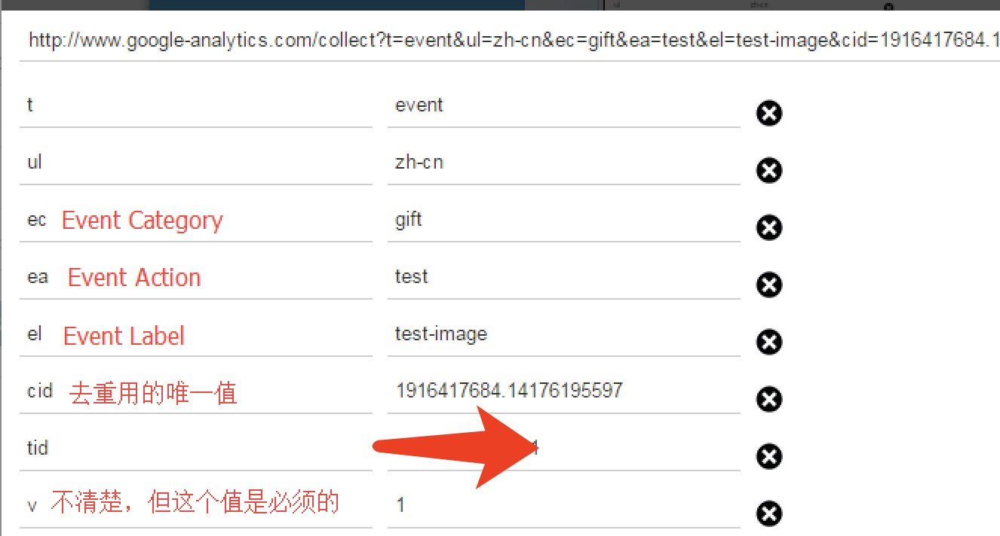
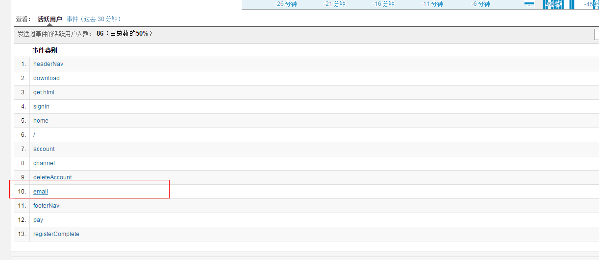
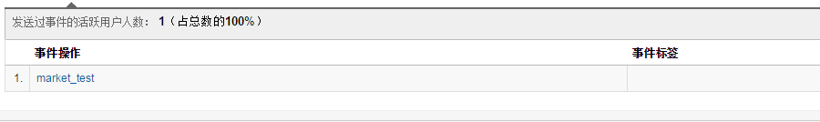
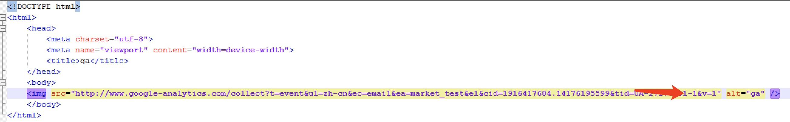
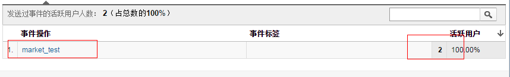

之前项目在做发送邮件模版的时候，有一个需求是要统计这封邮件有多少次被打开过。
而我们项目用的统计站点是google 统计， 即GA， 而且GA本身就有实时统计的功能。 
那么接下来的问题就是怎么把GA统计放到邮件里面，要知道邮件里面可是不能执行js代码的。

后面参照了这位大佬的文章终于找到了解决方案： [传送门](http://www.lunametrics.com/blog/2013/06/17/email-tracking-google-analytics/)
这篇文章讲的还是很详细的，其方法就是用 image src 请求，抛送 ga 请求 
<!--more-->
当然ga请求的参数有很多，我这边大概列了，本次需要的字段的说明，其中 tid 就是GA统计的哪个id值

接下来我们使用post man试下抛送
使用 postman 直接发送

http://www.google-analytics.com/collect?t=event&ul=zh-cn&ec=email&ea=market_test&el&cid=1916417684.14176195597&tid=UA-xxxxx-1&v=1

然后去GA后台实时统计那边查看一下,可以看到已经有数据了





然后接下来试一下，如果是直接用img标签来请求的话




发现也成功抛上去来

----

因此这种方式是可行的，所以最后邮件模版这样写就可以了，其中cid作为 uniqueId, 可以传当前邮件发送的时间戳，反正只要不重复就行了

在邮件模板的写法是:
```

```
