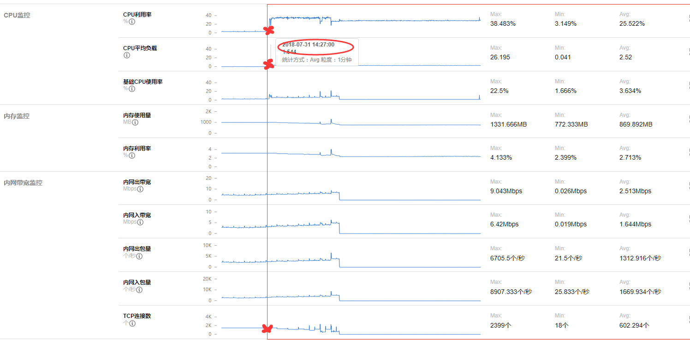
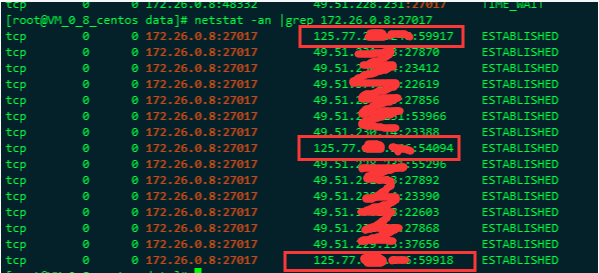
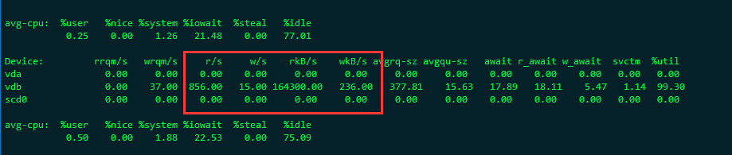
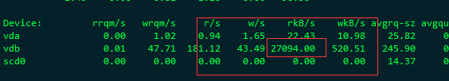

## 故障发生和修复
前段时间有一个服务报警了，后面查了一下，发现是服务连接不上 mongo 导致的， error.log 如下

SaveChannel error(read tcp 172.26.16.28:21544->172.26.0.8:27017: i/o timeout)
SaveChannel error(read tcp 172.26.16.28:22848->172.26.0.8:27017: i/o timeout)

这个服务中我们mongo配置的是副本集设置，也就是说，如果主副本集挂掉的话，会自动选举次副本集。刚开始以为是这台primary mongo挂掉了，但是看了一下，好像服务是正常的，而且 telnet 是可以通的。
<!--more-->
因为时间问题，所以当下因为 主副本 有问题，所以就先手动切换mongo角色，将原来的次副本的那一台mongo，切换成主副本。将原来的主副本换成次副本。这样子果然这一台mongo就正常了，服务也就正常了。
## 找原因
先让线上服务正常，然后就是找原因了。 接下来就要看下 原primary 这一台为啥会出问题？？？
先从监控看下有没有异常的图：

可以看到在 14 点的时候， cpu 飚上去了。 但是我们的事故发生在 20 点，两者是不是有关联呢？？？
而且到现在 cpu 都没有降下来。
而另一台(原来的次，现在的主)的监控图是正常的：

而且之前有问题的那一台 mongo 的日志，其实还是有一些写入的成功的，只不过相对正常情况下慢了很多：

正常最高才 100多ms，现在要将近 2000ms，慢了将近 20 倍？？？
所以这边的推测就是，因为CPU突然增高（原因不详） mongo处理速度必然下降。到了高峰期 就出问题了。 刚好20点就是我们产品的使用高峰期，所以就出问题了。
到了20点，已经变得非常慢了

这一条insert 花了 300s。那之后的连接肯定是全部慢死了，甚至堵塞了，最后直接超时了。
所以从现象来看的话， cpu 的飚高，会对mongo会有些影响，因为内存读写需要频繁的换进换出。但是为啥cpu 才 30-40 就扛不住了，这个可远远达不到我们的cpu预警值呢，虽然平时cpu使用率是 3-5 ，但是这个负载应该还达不到我们机器的极限负载啊，为啥mongo就扛不住了呢？？？
而且跟连接数其实没有关系：

连接数都比较正常。后面查了一下，会不会是一些慢查询导致的：发现对比前一天的同一个时间段，慢查询多了非常多
之前出事故那一天的：

前一天的：

而且我查了一下线上这个服务的接口请求数，相对于前一天，也没有比较大的浮动。
既然不是服务的问题，服务里面没有什么sql的慢查询，否则之前早就有问题，而且也不是连接数暴涨的问题。而且服务也没有连接不上。那么是什么原因呢？？？
接下来就开始排除这台有问题的mongo的现有连接数，会不会出现在当前的几个连接有异常呢，毕竟 cpu 可还一直没有降下去呢？？

发现画红框的这三个ip不是我们服务的ip，而是公司的出口IP, 说明有公司服务端的同事通过mongo客户端连上这一台来。
很有可能就是这三个连接有问题？？
后面查了这三个连接的连接时长，分别是： 85359s 85449s 85335s，刚好快 1天了， 而且这三个连接的查询语句都是一模一样的：

"query" : {
    "$orderby" : {
    },
    "key" : /p-101-/
    }

发现这个语句是有问题，里面有一个模糊查询，而我们的这个mongo的库是很大的，基本上模糊查询的话，会查到挂掉的。后面问了一下这个同事，他说确实是他查的，只不过刚开始的时候，因为查的太慢了，所以就断开了，然后重试了两次，结果有三次，而且由于三次都很慢，所以后面还没有给出结果，就客户端就断开了。
但是问题就出现在这里，因为数据库已经收到指令在query了，这时候客户端断开连接也没有用了，只是会关闭对话框，只能手动再给一个 kill 命令，才能把这个query 禁止掉。所以后面就直接手动将这三个连接给 kill 掉。这时候果然就可以明显看到cpu下降了，而且回到正常的水准了。

但是问题来了，为什么这种超级慢查询，查了一天还没有查到，直接把cpu的负载飚上去了，但是有没有飙到顶，而是直到 40 就不能用了。
后面看了一下，那时候的 磁盘IO ，达到了 **164 M/S**。

基本上就达到了这台机器的磁盘IO的峰值了。 导致后面的mongo 操作全部没法进行磁盘IO读写。 这也是为啥cpu飙到一半就上不去了，因为磁盘IO先到达极限了。
因为这三个慢查询的结果集太大了，而且持续时间太长了， 直接把磁盘性能耗光。 其他的操作就没办法进行了。把这三个慢查询kill掉之后，才恢复了正常。

所以原因就是这个： 几个模糊查询消耗掉了磁盘性能，磁盘IO,会一定程度影响cpu, 但是我们有8核的CPU，所以看到cpu 的负载并不高。
所以后面的优化准备：

- 监控磁盘IO, 做预警
- 写脚本，监控query查询时间，超过30分钟，就预警
- 升级mongo，现在的mongo版本太低了，要升到最新版，性能会比较好
- 开发人员最好在次副本进行查询操作，不要主副本进行查询

