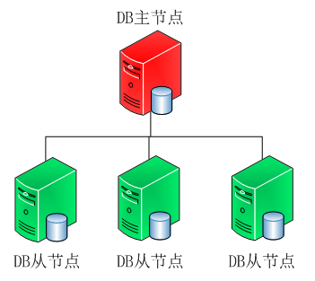

## 前言
之前有一个项目， mongo 存放的库非常大， 单单一个collection 就有 80G， 有几千万条数据。所以后面打算对 mongo 做优化。 刚开始是打算增加主从架构。

<!--more-->
## 实践
所以刚开始是增加了从库的配置：

MongoDbSlaveHost        string        `goconf:"mongodb_slave:host"`
MongoDbSlaveUser        string        `goconf:"mongodb_slave:user"`
MongoDbSlavePass        string        `goconf:"mongodb_slave:pass"`

然后在初始化的时候，把从库也初始化

mongoDb = NewMongoDB(Conf.MongoDbHost, Conf.MongoDbUser, Conf.MongoDbPass)
mongoDbSlave = NewMongoDB(Conf.MongoDbSlaveHost, Conf.MongoDbSlaveUser, Conf.MongoDbSlavePass)

接下来就是把一些查询操作，都改成用从库来操作， channel.go:

func GetChannelByKey(key string) (Channel, error) {
   var ch Channel
   err := mongoDbSlave.M("test", "channel", func(c *mgo.Collection) error {
      return c.Find(bson.M{"key": key}).One(&ch)
   })
   return ch, err
}

但是放到线上去，发现从库一直连不上，一直报这个错误：

no reachable servers

但是主库是可以连上的，就是从库不行， 而且直接在那一台服务器上直接用 mongo shell 连接是可以的，说明连接上肯定是没问题的？？？
后面查了一下，发现 golang 的这个mongo 的库 **gopkg.in/mgo.v2**，本身是支持集群的, 但是如果是这样写的话，就会出现从库连不上的问题

如果换成端口不一样的话，还是会出现第一个可以连接，但是第二个还是 no reachable：

var ch interface{}
host := "59.57.13.xxx"
url := fmt.Sprintf("mongodb://%s:27017,%s:27018", host, host)
fmt.Println("url=>", url)
session, err := mgo.Dial(url)
if err != nil {
   fmt.Printf("can not connect to server %v\n", err)
   panic(err)
}
defer session.Close()

collection := session.DB("gopush").C("channel")
err = collection.Find(nil).One(&ch)
fmt.Println(ch)

后面发现了少了一个连接的参数，也就是 options 参数 
**mongodb://59.57.13.xxx:27017,59.57.13.xxx:27018**<b>?connect=direct</b>
这个好像是可以连接上的，但是我发现连接的时候，还是用的是主库的地址，就是不会连到从库。
而如果我主动切换模式的话，确实可以切换为 从库模式， 测试模式如下：

func main() {
   var ch interface{}
   host := "59.57.13.xxx"
   url := fmt.Sprintf("mongodb://%s:27017,%s:27018?connect=direct", host, host)
   fmt.Println("url=>", url)
   session, err := mgo.Dial(url)
   if err != nil {
      fmt.Printf("can not connect to server %v\n", err)
      panic(err)
   }
   defer session.Close()
   collection := session.DB("gopush").C("channel")
   err = collection.Find(nil).One(&ch)
   fmt.Println(ch)
   // 切换为从库
   session.SetMode(mgo.Secondary, false)
   collection2 := session.DB("gopush").C("channel")
   err = collection2.Find(nil).One(&ch)
   fmt.Println(ch)
}

可以看到如果我切换为**mgo.Secondary**， 那么接下来的session就是从库的连接

session.SetMode(mgo.Secondary, false)

默认是 mode 是 strong， 也就是强制主库

func DialWithInfo(info *DialInfo) (*Session, error) {
   addrs := make([]string, len(info.Addrs))
   for i, addr := range info.Addrs {
      p := strings.LastIndexAny(addr, "]:")
      if p == -1 || addr[p] != ':' {
         // XXX This is untested. The test suite doesn't use the standard port.
         addr += ":27017"
      }
      fmt.Println("addr:", addr)
      addrs[i] = addr
   }
   cluster := newCluster(addrs, info.Direct, info.FailFast, dialer{info.Dial, info.DialServer}, info.ReplicaSetName)
   session := newSession(Eventual, cluster, info.Timeout)
   session.defaultdb = info.Database
   if session.defaultdb == "" {
      session.defaultdb = "test"
   }
   session.sourcedb = info.Source
   if session.sourcedb == "" {
      session.sourcedb = info.Database
      if session.sourcedb == "" {
         session.sourcedb = "admin"
      }
   }
   if info.Username != "" {
      source := session.sourcedb
      if info.Source == "" &&
         (info.Mechanism == "GSSAPI" || info.Mechanism == "PLAIN" || info.Mechanism == "MONGODB-X509") {
         source = "$external"
      }
      session.dialCred = &Credential{
         Username:    info.Username,
         Password:    info.Password,
         Mechanism:   info.Mechanism,
         Service:     info.Service,
         ServiceHost: info.ServiceHost,
         Source:      source,
      }
      session.creds = []Credential{*session.dialCred}
   }
   if info.PoolLimit > 0 {
      session.poolLimit = info.PoolLimit
   }
   cluster.Release()

   // People get confused when we return a session that is not actually
   // established to any servers yet (e.g. what if url was wrong). So,
   // ping the server to ensure there's someone there, and abort if it
   // fails.
   if err := session.Ping(); err != nil {
      session.Close()
      return nil, err
   }
   session.SetMode(Strong, true)
   return session, nil
}

倒数第三行的 **session.SetMode(Strong, true)** 就是默认连接的是主库
这边有好几个mode：

Primary            Mode = 2 // Default mode. All operations read from the current replica set primary.
PrimaryPreferred   Mode = 3 // Read from the primary if available. Read from the secondary otherwise.
Secondary          Mode = 4 // Read from one of the nearest secondary members of the replica set.
SecondaryPreferred Mode = 5 // Read from one of the nearest secondaries if available. Read from primary otherwise.
Nearest            Mode = 6 // Read from one of the nearest members, irrespective of it being primary or secondary.

// Read preference modes are specific to mgo:
Eventual  Mode = 0 // Same as Nearest, but may change servers between reads.
Monotonic Mode = 1 // Same as SecondaryPreferred before first write. Same as Primary after first write.
Strong    Mode = 2 // Same as Primary.

如果是**secondary**那么就是强制使用从库，如果是**SecondaryPreferred**那么就是优先使用从库，没有的话，就用主库。
本来是使用**SecondaryPreferred**这个模式的，因为这个模式，要求配置文件不需要强制设置从库，可以只设置一个主库。但是后面发现如果是这个模式的话，很多是明明可以用从库查询的，结果又跑到主库去，不知道是bug，还是哪里有问题？？？
所以后面就选择**secondary**这个模式，但是这个模式，要求一定要设置从库，**如果只有主库的话，那么会报错**，所以要特别注意一点。
并且**如果主库和从库一样的话，也是不行的，也会报错的**。所以后面我们的程序有对这一点进行兼容，如果没有设置从库，或者从库和主库一样的话，那么就不做从库的读取。
所以在初始化的时候，要判断有没有设置从库配置，并且这个配置有没有问题：
配置文件：

[mongodb]
host 59.57.13.xxx:27017
slave_host 59.57.13.xxx:27018

修改的代码如下：

// init mongodb
// 设置从库
if Conf.MongoDbSlaveHost == "" || Conf.MongoDbSlaveHost == Conf.MongoDbHost{
   // 如果没有设置从库，或者从库和主库一样，那么就不设置从库了
   hasSlaveMongoDb = false
   mongoDb = NewMongoDB(Conf.MongoDbHost, Conf.MongoDbUser, Conf.MongoDbPass)
}else{
   // 有从库，就设置从库
   hasSlaveMongoDb = true
   host := fmt.Sprintf("%s,%s/?connect=direct", Conf.MongoDbHost, Conf.MongoDbSlaveHost)
   mongoDb = NewMongoDB(host, Conf.MongoDbUser, Conf.MongoDbPass)
}

如果从库设置有问题的话，那么 **hasSlaveMongoDb** 这个参数要设置为 false， mongodb.go :

var (
   mongoDb         *MongoDB
   hasSlaveMongoDb bool
)

接下来就是mongo在使用的时候，通过传入一个参数，来制定要不要用从库来查询：

func (db *MongoDB) M(mode_type int, database, collection string, f func(*mgo.Collection) error) error {
   session, err := db.Session()
   if err != nil {
      return err
   }
   defer session.Close()
   if hasSlaveMongoDb && mode_type == MONGO_USE_SLAVE {
      // 设置为使用从库
      session.SetMode(mgo.Secondary, false)
   }
   mdb, err := db.DB(session, database)
   if err != nil {
      return err
   }

   c := mdb.C(collection)
   return f(c)
}

新增一个参数 mode_type 来表示要不要用从库查询
如果 有设置从库，并且 mode_type 为 **MONGO_USE_SLAVE**， 那么就把session 设置为从库模式

const (
    MONGO_USE_SLAVE = 1
    MONGO_USE_PRIMARY = 0
)

接下来就是修改之前的mongo操作，并将要不要使用从库的参数填进去,如果是需要用主库的，比如 insert，或者 update 操作，那么就这样写：

func SaveChannel(key, deviceType, appType string, tags []string, extraParams map[string]interface{}) error {
   unix := time.Now().Unix()
   channel := &Channel{key, deviceType, appType, tags, extraParams, unix}
   return mongoDb.M(MONGO_USE_PRIMARY,"test", "channel", func(c *mgo.Collection) error {
      err := c.Insert(channel)
      if err != nil {
         if strings.Contains(err.Error(), "duplicate") {
            return AddTagsAndUpdateExtraParamsByKey(key, tags, extraParams)
         }
         return err
      }
      return nil
   })
}

如果是需要 select 查询的，那么就用从库：

func GetChannelByKey(key string) (Channel, error) {
   var ch Channel
   err := mongoDb.M(MONGO_USE_SLAVE,"gopush", "channel", func(c *mgo.Collection) error {
      return c.Find(bson.M{"key": key}).One(&ch)
   })
   return ch, err
}


这样就可以实现mongo的主从了， 后面果然整个 mongo的压力减少了很多。

---
后面发现mongoDB官方已经不建议使用主从模式了，替代方案是采用副本集的模式，而且从 mongo4.0 开始，就移除主从的支持了： [传送门](https://docs.mongodb.com/master/core/master-slave/)
所以我们后面又换成副本集的方式。

