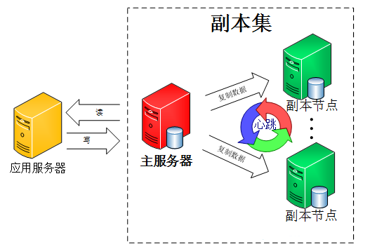
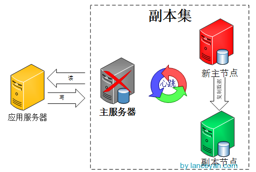

## 前言
通过 我们知道，mongoDB官方已经不建议使用主从模式了，替代方案是采用副本集的模式。
而且主从架构还有几个问题确实不好解决，比如 主节点挂了能否自动切换连接？目前需要手工切换。
<!--more-->
## 什么是副本集
那什么是副本集呢？打魔兽世界总说打副本，其实这两个概念差不多一个意思。游戏里的副本是指玩家集中在高峰时间去一个场景打怪，会出现玩家暴多怪物少的情况，游戏开发商为了保证玩家的体验度，就为每一批玩家单独开放一个同样的空间同样的数量的怪物，这一个复制的场景就是一个副本，不管有多少个玩家各自在各自的副本里玩不会互相影响。 mongoDB的副本也是这个，主从模式其实就是一个单副本的应用，没有很好的扩展性和容错性。而副本集具有多个副本保证了容错性，就算一个副本挂掉了还有很多副本存在，并且解决了上面的问题“主节点挂掉了，整个集群内会自动切换”。难怪mongoDB官方推荐使用这种模式。
我们来看看mongoDB副本集的架构图(网上的图片)：

由图可以看到客户端连接到整个副本集，不关心具体哪一台机器是否挂掉。主服务器负责整个副本集的读写，副本集定期同步数据备份，一但主节点挂掉，副本节点就会选举一个新的主服务器，这一切对于应用服务器不需要关心。
我们看一下主服务器挂掉后的架构(网上的图片)：

副本集中的副本节点在主节点挂掉后通过心跳机制检测到后，就会在集群内发起主节点的选举机制，自动选举一位新的主服务器。
## 测试副本集表现
也就是说，我如果有设置三个副本集，然后突然那个primary的副本挂了之后，这时候其他存活的两个副本就会选举出一个副本当做新的primary来进行读写，这时候程序是平滑切换的，用户是感觉不到的。
测试代码如下：

package main
import (
   "gopkg.in/mgo.v2"
   "time"
   "gopkg.in/mgo.v2/bson"
   "fmt"
)
func main() {
   var ch interface{}
   mongoDb = NewMongoDBT("", "user123", "pass456")
   err := mongoDb.M("test", "channel", func(c *mgo.Collection) error {
      return c.Find(bson.M{"key": "t-100-123"}).One(&ch)
   })
   fmt.Println(err)
   fmt.Println(ch)
   err = mongoDb.M("test", "channel", func(c *mgo.Collection) error {
      return c.Find(bson.M{"key": "t-100-456"}).One(&ch)
   })
   fmt.Println(err)
   fmt.Println(ch)
}

var (
   mongoDb      *MongoDB
)

type MongoDB struct {
   Host, User, Pass string
   session          *mgo.Session
}

func NewMongoDBT(host, user, pass string) *MongoDB {
   return &MongoDB{host, user, pass, nil}
}

func (db *MongoDB) M(database, collection string, f func(*mgo.Collection) error) error {
   session, err := db.Session()
   if err != nil {
      return err
   }
   defer session.Close()
   mdb, err := db.DB(session, database)
   if err != nil {
      return err
   }
   c := mdb.C(collection)
   return f(c)
}

func (db *MongoDB) Session() (*mgo.Session, error) {
   if db.session == nil {
      session, err := mgo.DialWithTimeout("xx.xxx.34.147:27017,xx.xxx.35.120:27017?connect=replicaSet", 30*time.Second)
      if err != nil {
         return nil, err
      }
      db.session = session
   }
   return db.session.Copy(), nil
}

func (db *MongoDB) DB(session *mgo.Session, name string) (*mgo.Database, error) {
   mdb := session.DB(name)
   if db.User != "" && db.Pass != "" {
      if err := mdb.Login(db.User, db.Pass); err != nil {
         return nil, err
      }
   }
   return mdb, nil
}

上面代码设置了两个副本集，分别是 xx.xxx.34.147 和 xx.xxx.35.120， 并且连接方式是副本集的方式，即 **connect=replicaSet**
这时候开始测试：
### 当两个副本集都开着的时候

F:\airdroid_code\go\src\gopush-air\client>replicaset
addr: xx.xxx.34.147:27017
addr: xx.xxx.35.120:27017
==============addr: xx.xxx.34.147:27017
<nil>
map[some mongo data， not important]
==============addr: xx.xxx.34.147:27017
<nil>
map[some mongo data， not important]

这时候会发现两次查询都是用 147的副本来查的，因为这时候的primary服务器就是 147 这一台， 120这一台在primary服务器存活的情况下，只做数据同步
### 当147挂掉，120开着的时候

F:\airdroid_code\go\src\gopush-air\client>replicaset
addr: xx.xxx.34.147:27017
addr: xx.xxx.35.120:27017
==============addr: xx.xxx.35.120:27017
<nil>
map[some mongo data， not important]
==============addr: xx.xxx.35.120:27017
<nil>
map[some mongo data， not important]

可以看到程序还是可以跑的，只不过换成查询的是120了，这个是因为147这一台primary挂了之后，120这一台就自动提升为primary服务器了，所以就继续读写了，对用户来说是没有感觉的。
### 当两个都挂掉的时候

F:\airdroid_code\go\src\gopush-air\client>replicaset
addr: xx.xxx.34.147:27017
addr: xx.xxx.35.120:27017
no reachable servers
<nil>
addr: xx.xxx.34.147:27017
addr: xx.xxx.35.120:27017
no reachable servers
<nil>

两个都挂掉，肯定是两个请求都超时了
### 当147开着，但是120挂掉的时候

F:\airdroid_code\go\src\gopush-air\client>replicaset
addr: xx.xxx.34.147:27017
addr: xx.xxx.35.120:27017
==============addr: xx.xxx.34.147:27017
<nil>
map[some mongo data， not important]
==============addr: xx.xxx.34.147:27017
<nil>
map[some mongo data， not important]

这时候就可以看到查询就变成 147 了。因为147是primary服务器，120 这一台副本集挂了，其实没影响的
## 项目修改
既然测试没问题了，接下来就是要把之前的主从构架变成副本集构架了
修改很简单，之前的那些 slave对象啊，判断是否要切换模式啊，全部都去掉，直接在连接的时候，将这些副本集地址放上去就行了。
本来是这样的：

// 设置从库
if Conf.MongoDbSlaveHost == "" || Conf.MongoDbSlaveHost == Conf.MongoDbHost{
   // 如果没有设置从库，或者从库和主库一样，那么就不设置从库了
   hasSlaveMongoDb = false
   mongoDb = NewMongoDB(Conf.MongoDbHost, Conf.MongoDbUser, Conf.MongoDbPass)
}else{
   // 有从库，就设置从库
   hasSlaveMongoDb = true
   host := fmt.Sprintf("%s,%s/?connect=direct", Conf.MongoDbHost, Conf.MongoDbSlaveHost)
   mongoDb = NewMongoDB(host, Conf.MongoDbUser, Conf.MongoDbPass)
}

现在只需要这样设置：

// init mongodb 设置成副本集的方式，这边的host 配置可以多个地址来配置
host := fmt.Sprintf("%s/?connect=replicaSet", Conf.MongoDbHost)
mongoDb = NewMongoDB(host, Conf.MongoDbUser, Conf.MongoDbPass)

这样就行了，接下来就是在配置文件的host字段上，加上这些副本集的ip和port，这样子就可以了，配置文件改成这样：

host x.xx.xxx.58:27017,x.xx.xxx.182:27017,x.xx.xxx.231:27017
user xxx
pass xxxxxx

线上就设置了3个副本集，其中 x.xx.xxx.58 这一台主要是负责读写的，也就是标记为primary（这一台放aws）， 另外两台用来进行数据的实时同步（这两台在腾讯云上）
但是当aws这一台出问题挂掉之后，另外两台就会选举出一台作为新的primary，然后继续读写，这个过程是mongo的程序自己完成的，我们程序都都不用管。
而如果是之前主从架构的时候，如果主库或者从库挂掉之后，相当于程序就挂了，这时候只能恢复挂掉的服务器，这样子程序才能继续跑，很显然，这样子健壮性就加了很多。
## 后续待优化
虽然已经切换成副本集架构了，这样子除非所有的mongo服务器都挂掉了，不然程序是不会挂的。
不过有一点比较不好的是，虽然有好几个副本集，但是平时只有一台标记为primary的机器在进行读写，这样子无疑对服务器的负载会比较高。
之前主从架构的时候，因为读写分离，所以负载反而比较小，所以可能要考虑一下副本集模式下的读写分离，这个应该是可以做到的？？ 后面还得实践一下

---

参考：
[搭建高可用mongodb集群（一）——配置mongodb](http://www.lanceyan.com/tech/mongodb/mongodb_cluster_1.html)
[搭建高可用mongodb集群（二）—— 副本集](http://www.lanceyan.com/tech/mongodb/mongodb_repset1.html)

