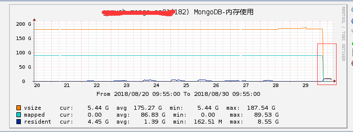
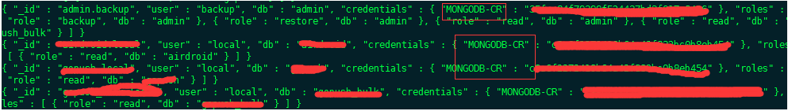
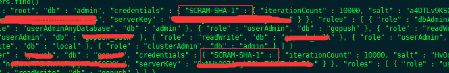

## 前言
项目中有个mongo要删一些过期数据，但是因为数据太多了，而且考虑到现在的mongo版本是2.6，版本太低了，删除的效率比较低，所以打算换成 mongo 3.4 版本。
刚开始升上去之后，情况挺好的，业务上也没有出现问题。 但是马上接下来的几天都会有出现如果是用户高峰期的情况，都会出现内存消耗非常大的情况，而且还会卡顿。
<!--more-->
## 引擎没有换成 wiredtiger
后面查了一下，发现原来升级到了 3.4版本，引擎没有换成 3.4 自带的 **wiredtiger** 引擎，还是之前版本的 **MMAPv1** 引擎。 而wiredtiger 这个引擎会比原来的  MMAPv1 优秀很多。 
主要体现在：
-- 通过 WiredTiger，MongoDB 3.0 实现了文档级别的并发控制(Concurrency Control)，因此大幅提升了大并发下的写负载。
-- 用户可以自己选择储存数据的压缩比例，MongoDB 3.0提供最高达80%的压缩率，不过压缩率越高数据处理的时间成本也越多，用户可以自行权衡应用。

因此这时候只能手动重导数据，更换引擎。 果然换上去之后，内存一下子就下来了。

从cacti 图上来看的话，一下子出现了断崖式下跌了。
## 换新的auth认证方式
版本升上来之后，在后台的高峰期阶段，出现了大量的auth 认证 sql，而且往往很耗时？？

因为升级了版本之后 认证机制用的就是新的这个 **SCRAM-SHA-1**， 旧的 **MONGODB-CR** 已经废弃掉了。 换言之，现在数据库配置是 **SCRAM-SHA-1**， 但我们程序里的设置却还是旧的 **MONGODB-CR**， 所以我想 应该是这里发生冲突了。
所以认证这一块，就会换成 **SCRAM-SHA-1** 方式，同时在程序里面，就要加上用户名和密码。 然后就可以了，之后就不会再出现那么多的auth sql了。

