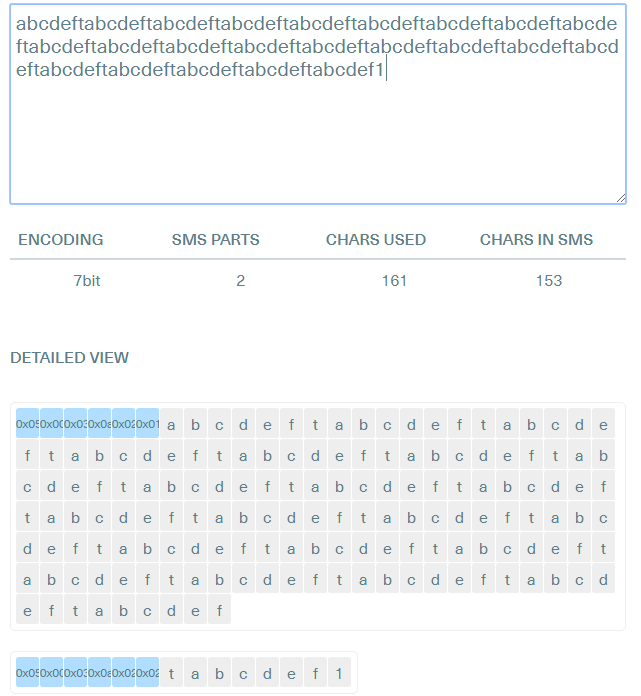

之前做过一个项目([web.airdroid.com](http://web.airdroid.com)的短信模块)是可以在web端的输入框输入短信内容，然后调用手机端的API来发送短信。这时候就需要做到跟手机端的短信app的一样的提示效果，即用户在输入的时候，要提示当前是否会拆分多条短信，还有就是当前这条短信的剩余输入字数。最后上线的部分效果图如下：

在实现之前，这边先科普以下，一条短信会有几个字符可以输入，还有就是什么情况下会需要拆分多条短信？？
上世纪80年代无线传输的带宽不高，这就要求手机短信要言简意赅。短信发明人Hillebrand为遵从这一要求，经过试验后将160个字符作为短信长度上限，英文字母可发160个([参考文献](http://latimesblogs.latimes.com/technology/2009/05/invented-text-messaging.html))。
因为英文字母采用7位ASCII编码，而汉字则采用8位UCS-2编码并占2个字节，所以160个字符按照7位ASCII编码来换算，即160X7=1120位；而汉字是按照8位的UCS-2编码，即8位一个字符，一个汉字占2个字符，这样1120位换算成汉字数就是1120/8/2=70。如果换算成字节(byte)的话，那么一条短信就是 1120/8 = 140 个字节(一个字节8位(bit))
也就是说，如果是单条短信的话，如果只输入英文字母的话，那么可以输入160个字符，如果输入汉字的话，可以输入70个字符，如果是中英混输的话，就按照汉字来算(只要内容里面有一个汉字，那么整个内容的编码就全部按照汉字的编码来算)。
也就是说，当英文字母超过160个字符之后，这时候短信就会拆分成两条。 如果是汉字超过70个字符之后，也会拆成两条。
<!--more-->
这边找到一个站点可以来实践这个东西：[传送门](https://messente.com/documentation/tools/sms-length-calculator)
这边具体举几个例子：
1. 如果单纯是英文

可以看到160个，刚好是一条。只要是多出一个字符的话，那么就是分为两条，而且第一条是 153个字符，至于为什么是153个，而不是154个，这个因为如果是多条短信的话，那么前面的6个字节，要用来做头部标识符，因此就只剩下134个字节了，用ASCII编码换算成英文字符的话，就是 (1120 - 6*8) / 7 = 153.14 ,  所以就是 153个英文字符了

可以看到，当我英文字符为161的时候，就会分为两条，然后第一条只有153个字符，每一条的前6个字节主要用来做标识符：

6位协议头格式：05 00 03 XX MM NN
byte 1 : 05, 表示剩余协议头的长度
byte 2 : 00, 这个值在GSM 03.40规范9.2.3.24.1中规定，表示随后的这批超长短信的标识位长度为1（格式中的XX值）。
byte 3 : 03, 这个值表示剩下短信标识的长度
byte 4 : XX，这批短信的唯一标志（0-255）
byte 5 : MM, 这批短信的数量。如果一个超长短信总共5条，这里的值就是5。
byte 6 : NN, 这批短信的数量。如果当前短信是这批短信中的第一条的值是1，第二条的值是2。


2. 如果是中文的话

中文如果刚好是 70 个字的话，那么就刚好一条,如果在多加一个字符的话，就会变成两条了，而且第一条就会变成67个字符了，这个算法跟上面的差不多，(1120 - 6*8) / 8 / 2 = 67 ,  所以就是 67 个汉字字符了

3. 混合的话，就跟中文一样的处理方式
记住一个原则，如果不是全部都是7bit的ASCII编码，那么就全部按照Unicode (UCS-2) 的编码方式就可以了

---

原理搞懂了，接下来就是代码了：

// 改变短信条数和剩余个数， 涉及到 7bit 和 unicode 两种
function ChangeSMSLength (dom, content) {
    if (content) {
        var charset7bit = ['@', '£', '$', '¥', 'è', 'é', 'ù', 'ì', 'ò', 'Ç', "\n", 'Ø', 'ø', "\r", 'Å', 'å', 'Δ', '_', 'Φ', 'Γ', 'Λ', 'Ω', 'Π', 'Ψ', 'Σ', 'Θ', 'Ξ', 'Æ', 'æ', 'ß', 'É', ' ', '!', '"', '#', '¤', '%', '&', "'", '(', ')', '*', '+', ',', '-', '.', '/', '0', '1', '2', '3', '4', '5', '6', '7', '8', '9', ':', ';', '<', '=', '>', '?', '¡', 'A', 'B', 'C', 'D', 'E', 'F', 'G', 'H', 'I', 'J', 'K', 'L', 'M', 'N', 'O', 'P', 'Q', 'R', 'S', 'T', 'U', 'V', 'W', 'X', 'Y', 'Z', 'Ä', 'Ö', 'Ñ', 'Ü', '§', '¿', 'a', 'b', 'c', 'd', 'e', 'f', 'g', 'h', 'i', 'j', 'k', 'l', 'm', 'n', 'o', 'p', 'q', 'r', 's', 't', 'u', 'v', 'w', 'x', 'y', 'z', 'ä', 'ö', 'ñ', 'ü', 'à'];
        var charset7bitext = ["\f", '^', '{', '}', '\\', '[', '~', ']', '|', '€'];
        var chars_arr = content.split("");
        var coding = '7bit';
        // 当前所需要拆分的短信条数
        var part = 1;
        // 已经使用的总的字符数
        var chars_used = 0;
        // 一条短信所使用的字符数
        var chars_sms = 160;
        for (var i = 0; i < chars_arr.length; i++) {
            if (charset7bit.indexOf(chars_arr[i]) >= 0) {
                chars_used = chars_used + 1;
            } else if (charset7bitext.indexOf(chars_arr[i]) >= 0) {
                chars_used = chars_used + 2;
            } else {
                coding = '16bit';
                chars_used = chars_arr.length;
                break;
            }
        }
        if (coding == '7bit') {
            if (chars_used > 160) {
                var part_chars_used = 7;
                chars_sms = 153;
                for (i = 0; i < chars_arr.length; i++) {
                    if (part_chars_used + 1 > 160) {
                        part = part + 1;
                        part_chars_used = 7;
                    }
                    if (charset7bitext.indexOf(chars_arr[i]) >= 0 && part_chars_used + 2 > 160) {
                        part = part + 1;
                        part_chars_used = 7;
                    }
                    if (charset7bitext.indexOf(chars_arr[i]) == -1) {
                        part_chars_used = part_chars_used + 1;
                    } else {
                        part_chars_used = part_chars_used + 2;
                    }
                }
            } else {
                chars_sms = 160;
            }
        } else {
            if (chars_used > 70) {
                var part_chars_used = 3;
                chars_sms = 67;
                for (i = 0; i < chars_arr.length; i++) {
                    if (part_chars_used + 1 > 70) {
                        part = part + 1;
                        part_chars_used = 3;
                    }
                    part_chars_used = part_chars_used + 1;
                }
            } else {
                chars_sms = 70;
            }
        }
        // 当前这一条已经使用的字符数
        var chars_single_used = chars_used % chars_sms == 0 ? chars_sms : (chars_used % chars_sms);
        dom.html(chars_single_used + "/" + chars_sms + "(" + part + ")");
    } else {
        dom.html(0);
    }
}


调用实例(这边直接拿项目的代码)：

var el = chatDom.find(".mod-chat-sendContent[load='1']"), 
    content = self._editor.getContentValue(el, true);  // 输入的内容

ChangeSMSLength(chatDom.find('.mod-chat-chatCount'), content);
