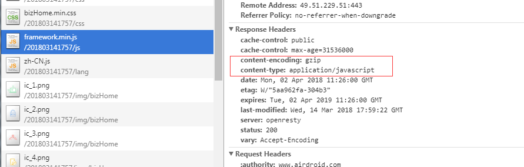

将官网的一些静态资源，比如 js ，css， 图片 设置成 gzip 压缩的方式, 可以提高静态资源的加载速度
因为我们用的是nginx，所以可以通过nginx来配置，直接在nginx.conf添加一下代码：

    # Gzip Settings
    gzip on;
    gzip_disable "msie6";
    gzip_vary on;
    gzip_proxied any;
    gzip_min_length 1000;
    gzip_comp_level 4;
    gzip_buffers 16 8k;
    gzip_http_version 1.1;
    gzip_types text/plain text/css application/json application/javascript application/x-javascript text/xml application/xml application/xml+rss text/javascript image/svg+xml;

实现效果的截图如下：
<!--more-->

这样就进行gzip压缩了
原来 193 k 现在只需要 67 k

