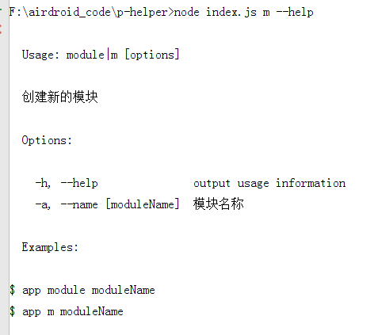
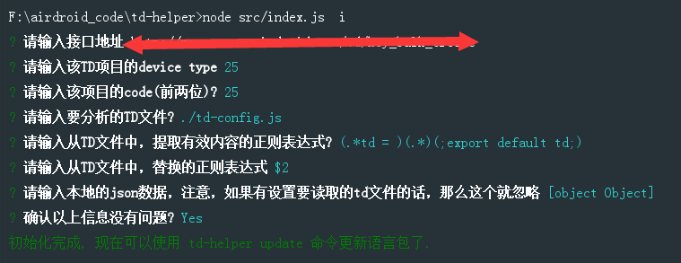

## 前言
在使用NodeJs过程中，有很多包都支持全局安装，然后提供一个命令，然后在命令行我们就可以完成一些任务，像 express, grunt, bower, yeoman, reap, karma, requirejs 等。有时候，我们也需要自己开发这样的命令行工具。
使用自定义的Node命令行，在我们的很多项目里面都有使用过，而且真的很好用，尤其是我们内部还有一些项目是辅助项目，比如多语言翻译平台，这些项目都是内部项目，但是线上的项目有涉及一些资源和文件，都跟这些内部项目息息相关。这时候我们就会开发一些Node命令行提供给开发人员，用于开发人员的更便捷操作。接下来的几篇都会讲到使用自定义的Node命令行在开发的过程中，所能提供的便捷有多好用。本篇主要是讲一下在开发Node命令行的时候，经常使用的几个npm 库。
<!--more-->
包括但是并不仅限于：
- [commander](https://www.npmjs.com/package/commander)
- [inquirer](https://www.npmjs.com/package/inquirer)
- [chalk](https://www.npmjs.com/package/chalk)

## commander - 用户命令行输入和参数解析
commander灵感来自 Ruby，它提供了用户命令行输入和参数解析的强大功能，可以帮助我们简化命令行开发。
根据其官方的描述，具有以下特性:
- 参数解析
- 强制多态
- 可变参数
- Git 风格的子命令
- 自动化帮助信息
- 自定义帮助等

简单的来说，就是用来做命令行的输入和所输入参数的解析， API 如下：
- command – 定义命令行指令，后面可跟上一个name，用空格隔开，如 .command( ‘app [name] ‘)
- alias – 定义一个更短的命令行指令 ，如执行命令$ app m 与之是等价的
- description – 描述，它会在help里面展示
- option – 定义参数。它接受四个参数，在第一个参数中，它可输入短名字 -a和长名字–app ,使用 | 或者,分隔，在命令行里使用时，这两个是等价的，区别是后者可以在程序里通过回调获取到；第二个为描述, 会在 help 信息里展示出来；第三个参数为回调函数，他接收的参数为一个string，有时候我们需要一个命令行创建多个模块，就需要一个回调来处理；第四个参数为默认值
- action – 注册一个callback函数,这里需注意目前回调不支持let声明变量
- parse – 解析命令行

举个例子：
```javascript
#! /usr/bin/env node

const program = require('commander')
program
    .command('module')
    .alias('m')
    .description('创建新的模块')
    .option('-a, --name [moduleName]', '模块名称')
    .action(config => {
        console.log("模块名字", config.name);
        console.log('Hello World')
    })
    //自定义帮助信息
    .on('--help', function() {
        console.log('  Examples:')
        console.log('')
        console.log('$ app module moduleName')
        console.log('$ app m moduleName')
    })

program.parse(process.argv)
```
**使用简写命令执行：**

**加上参数a：**

**当然还有命令的自定义帮助信息：**


## inquirer - 命令行交互
这个组件可以让我们跟命令行进行交互，它提供了用户界面和查询会话流程。
主要有一下功能：
- input–输入
- validate–验证
- list–列表选项
- confirm–提示
- checkbox–复选框等等

**还是一样举个例子，语法很简单，以下只是部分代码:**
```javascript
const inquirer = require('inquirer');
inquirer.prompt([{
        name: 'uri',
        message: '请输入接口地址',
        default: options.uri,
        type: 'input'
    }, {
        name: 'deviceType',
        message: '请输入该TD项目的device type',
        default: options.deviceType,
        type: 'input'
    }, {
        name: 'code',
        message: '请输入该项目的code(前两位)?',
        default: options.code,
        type: 'input'
    }, {
        name: 'targetFile',
        message: '请输入要分析的TD文件?',
        default: options.targetFile,
        type: 'input'
    }, {
        name: 'findReg',
        message: '请输入从TD文件中，提取有效内容的正则表达式?',
        default: options.findReg,
        type: 'input'
    }, {
        name: 'replaceReg',
        message: '请输入从TD文件中，替换的正则表达式',
        default: options.replaceReg,
        type: 'input'
    }, {
        name: 'jsonData',
        message: '请输入本地的json数据，注意，如果有设置要读取的td文件的话，那么这个就忽略',
        default: options.jsonData,
        type: 'input'
    }, {
        name: 'is_ok',
        type: 'confirm',
        message: '确认以上信息没有问题?',
        default: true
    }]).then(function (result) {
        if (result.is_ok) {
            options.uri = result.uri;
            options.deviceType = result.deviceType;
            options.code = result.code;
            options.targetFile = result.targetFile;
            options.findReg = result.findReg;
            options.replaceReg = result.replaceReg;
            options.jsonData = result.jsonData;
            fs.writeFileSync(TD_OPTIONS_FILE, JSON.stringify(options, null, 2));
            process.stdout.write('初始化完成, 现在可以使用 td-helper update 命令更新语言包了.\n');
        } else {
            process.stdout.write('已取消\n');
        }
    }).catch(function (e) {
        return console.log(e);
    });
```
运行截图如下：


## chalk - 美化命令行的输出
它具有轻量级、高性能、学习成本低等特点。
还是一样举个例子：
```javascript
    inquirer.prompt(promps).then(function (answers) {
        config = _.assign(config, answers);
        // 接下来拷贝目录
        fs.copySync(__dirname + '/structrue', config.name);
        console.log(chalk.green(`项目创建成功`));
        console.log(chalk.green(`项目名：${config.name}`));
    })
```
这时候最后输出的命令就是：


## 结语
接下来会通过几个例子来创建几个Node的命令行。

---
参考资料：
[Commander写自己的Nodejs命令](http://blog.fens.me/series-nodejs/)
[跟着老司机玩转Node命令行](https://aotu.io/notes/2016/08/09/command-line-development/)