## 前言
通过了学习了 。开始试着尝试自己做一个命令行工具，就是项目初始化的脚手架  **p-helper**
原理很简单，执行 **p-helper i --name myProject** 命令，就会在当前目录中，建立一个 myProject 的项目目录。里面就是一些常用的一些目录结构：
<!--more-->
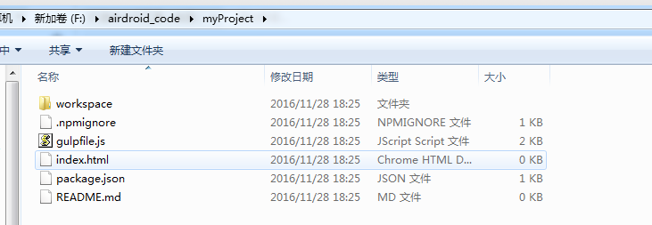
点击 **workspace**目录就是：
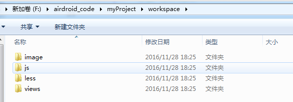
## 开发
项目代码目录如下：
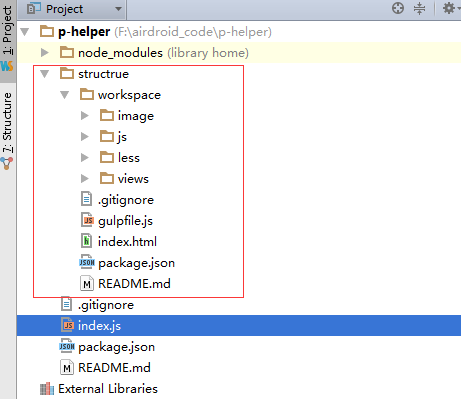
其中 structure 就是要复制过去的目录结构,我们预先创建好，先存起来，后面直接拷贝过去就行了。
代码其实非常简单，其实就一个**index.js**:
```javascript
#! /usr/bin/env node
const program = require('commander');
const inquirer = require('inquirer');
const _ = require('lodash');
const chalk = require('chalk');
const fs = require("fs-extra");


const pkg = require('./package.json');
program.version(pkg.version);

program
    .command('init')
    .alias('i')
    .description('创建一个项目')
    .option('--name [moduleName]')
    .action(option => {
        var config = _.assign({
            name: null,
            description: ''
        }, option);
        var promps = [];
        if(!config.name) {
            promps.push({
                type: 'input',
                name: 'name',
                message: '请输入模块名称',
                validate: function (input){
                    if(!input) {
                        return '不能为空'
                    }
                    return true
                }
            })
        }
        if(!config.description) {
            promps.push({
                type: 'input',
                name: 'description',
                message: '请输入模块描述'
            })
        }
        inquirer.prompt(promps).then(function (answers) {
            config = _.assign(config, answers);
            // 接下来拷贝目录
            fs.copySync(__dirname + '/structrue', config.name);
            console.log(chalk.green(`项目创建成功`));
            console.log(chalk.green(`项目名：${config.name}`));
        })
    })
    .on('--help', function() {
        console.log('  Examples:');
        console.log('');
        console.log('$ p-helper i');
        console.log('$ p-helper i --name kbzProject');
    });
program.parse(process.argv);

if (!program.args.length) program.help();
```
使用其实很简单，就一个命令 **init**：
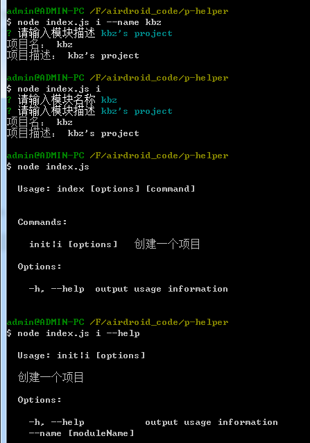
可以选择是否加上 --name， 这个是要新建的项目的名字，如果不加的话，那么就会在接下来的交互中，也要设置。
接下来就传到github项目。 然后全局安装。
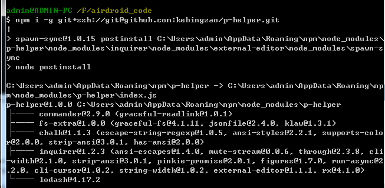
但是这边有出了一个问题。全局安装成功了，但是执行 **p-helper** 命令的时候，出现这个问题。
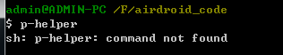
发现没有这个命令， 原来是 package.json 没有指定 bin 参数， 因此要指定一下：
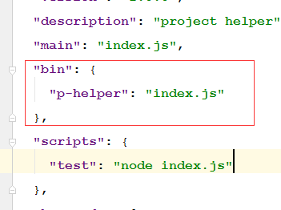
```javascript
"bin": {  
    "p-helper": "index.js"
},
```
要全局安装的话，这个配置是一定要的。这样全局执行 **p-helper** 的时候，才会有指定。 修改完之后，重新推送，再执行一下：
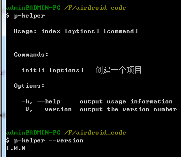
发现已经可以了，新建一个项目试试。 **p-helper i**：
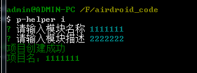
项目创建成功，去看看。
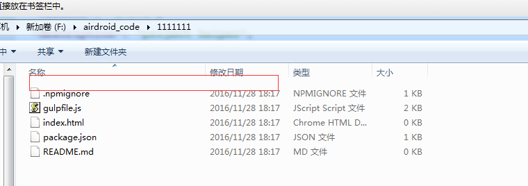
发现了一个问题，没有 workspace 目录，奇怪了， 我在 **p-helper** 项目目录下，执行 **node index.js i** 创建的话，其实是有的，
为什么在全局命令下，就没有了呢？<font color=red>后面找到了原因，因为 workspace 这个目录下面没有实质文件，全部是空目录。因此要在所有的空目录下加上一个占位的空文件，这样就不会有问题了。</font>
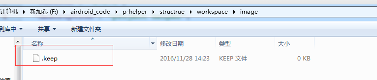
重新推送，再全局安装一下：
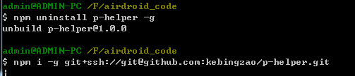
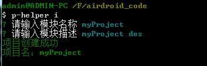
最后发现正常了
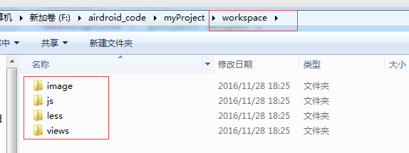
最后是p-helper 的package.json 文件：
```
{  
    "name": "p-helper",  
   "version": "1.0.0", 
   "description": "project helper",  
   "main": "index.js",  
   "bin": {    
        "p-helper": "index.js"  
    },  
    "scripts": {    
        "test": "node index.js"  
    },  
    "keywords": [    
        "helper"  
    ],  
    "author": "kebingzao",  
    "license": "ISC",  
    "dependencies": {    
        "chalk": "^1.1.3",    
        "commander": "^2.9.0",    
        "fs-extra": "^1.0.0",    
        "inquirer": "^1.2.3",    
        "lodash": "^4.17.2"  
    }
}
```

这样子，一个简单的项目脚手架命令行就完成。 当然这个只是练手用的，事实上真正用于项目中的有用的Node命令行会比这个复杂很多。


