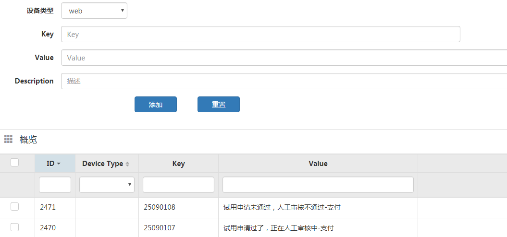
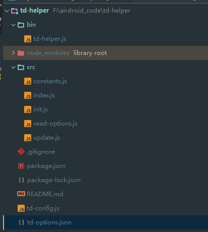
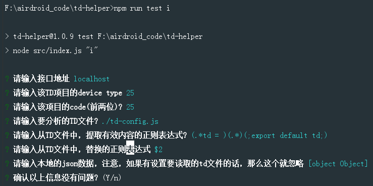
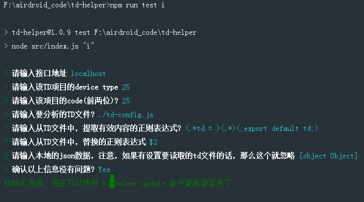
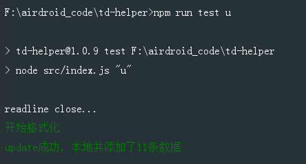
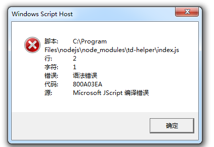

## 前言
之前做了一个练习之作 ，实用价值不高，这次要做的命令行就是用在项目中的。
## 需求和方案
为了收集用户在web上的点击行为，我们有自己的talking data 系统，并提供给web端，让web端的程序抛送。 但是为了便于存储，所以基本上存在数据库里面就是以 **01020304** 这种方式存放的。
其中前面两位就是项目的代号，每一个项目都有一个唯一的代号，后面的6位，两位为一个单位，所以会有树级的结构，所以会有三层来描述一个具体的用户行为，举个例子， 比如 **01020101** 可能就是表示 官网(01)下的个人中心(02)的购买模块(01)，然后用户点击购买按钮行为(01)。
<!--more-->
但是只有code存在数据库中，如果产品要看数据的话，他怎么把这个code和对应的意思结合起来。 这个就涉及到一个 map 对应，当然我们有自己的后台，可以让开发人员去添加：

但是这个后台只适合用来添加一些零散的，或者用来做修改。如果一个新的项目，他的td key可能就有一两百个了，一个一个添加就直接疯掉了。
所以刚开始服务端就做了一个批量添加 key 的接口：
```javascript
module.exports = function *(req, res, next) {
    var params = req.body["list"];
    params = JSON.parse(params);
    // 这边设置 如果 key 重复的话，就变成更新
    res.body.data = yield models.td_model_list.bulkCreate(params,{
        validate: false,
        ignoreDuplicates: true,
        updateOnDuplicate: true
    });
    next();
};
```
接口很简单，就是将前端传过来的list数组，直接批量入库就行了，如果唯一key已经存在，那么就变成修改，相当于就是 upsert 操作。
但是这样只是说明接口有着落了，但是拼成list数组的那个最繁琐的步骤其实还在。 而且web站点也有自己的一份 **td key - value** 的映射map。
这边截取一部分（实际上这个map非常大）：
```
/**
 *  value 的值非必填
 *  category model action 3层模式  category model 2层模式
 **/

const td = {
  "device": {
    "uid": "01",
    "value": "设备页面",
    "des": "device des",
    "model": {
      "list": {
        "uid": "01",
        "value": "设备列表模块",
        "des": "list des",
        "action": {
          "add": {
            "uid": "01",
            "des": "01 des",
            "value": "添加设备"
          },
          "openPermission": {
            "uid": "02",
            "value": "开启分组权限管理"
          }
        }
      },
      "wall": {
        "uid": "02",
        "value": "设备墙展示",
        "action": {
          "switchDeviceStatusShow2": {
            "value": "顶部选择展示总设备",
            "uid": "01"
          },
          "switchDeviceStatusShow1": {
            "value": "顶部选择展示总设备-在线",
            "uid": "02"
          }
        }
      }
    }
  },
  "member": {
    "uid": "02",
    "value": "成员页面",
    "model": {
      "list": {
        "uid": "01",
        "value": "成员列表模块",
        "action": {
          "invite": {
            "uid": "01",
            "value": "邀请成员"
          },
          "move": {
            "uid": "02",
            "value": "成员移动分组"
          }
        }
      }
    }
  }
};

export default td;
```
那是不是我可以写一个命令行工具，然后当在这个项目的根目录调用的时候，就去找这个map文件，通过正则表达式取出这一串有用的 json 串，然后解析生成类似这种map：
```
[ { device_type: '25',
    key: '25010000',
    value: '设备页面',
    description: 'device des' },
  { device_type: '25',
    key: '25010100',
    value: '设备列表模块',
    description: 'list des' },
  { device_type: '25',
    key: '25010101',
    value: '添加设备',
    description: '01 des' },
  { device_type: '25',
    key: '25010102',
    value: '开启分组权限管理',
    description: '' },
  { device_type: '25',
    key: '25010200',
    value: '设备墙展示',
    description: '' },
  { device_type: '25',
    key: '25010201',
    value: '顶部选择展示总设备',
    description: '' },
  { device_type: '25',
    key: '25010202',
    value: '顶部选择展示总设备-在线',
    description: '' },
  { device_type: '25',
    key: '25020000',
    value: '成员页面',
    description: '' },
  { device_type: '25',
    key: '25020100',
    value: '成员列表模块',
    description: '' },
  { device_type: '25',
    key: '25020101',
    value: '邀请成员',
    description: '' },
  { device_type: '25',
    key: '25020102',
    value: '成员移动分组',
    description: '' } ]
```
最后将这个数组直接post到那个批量添加的接口，不就可以了。
而且为了让这个命令行具有普遍性，不仅仅这个项目会用，其他项目也会用到，所以这边的想法就是将这个命令行的操作分为两步。
### 第一步初始化配置文件，指令是 **td-helper i**
这时候就会生成这个项目特有的配置文件，比如项目代号是多少，tdMap源文件放在哪里，提取的正则是多少，调用的接口是多少（有测试环境和生产环境），甚至可以自定义json串(可能有些项目不一定有tdMap文件，但是他又想批量添加，这时候直接将实现弄好的json串拷贝过去就行了)
配置文件**td-options.json**类似如下：
```
{
  "uri": "http://xxx.com/td/key_bulk_create",
  "deviceType": "25",
  "code": "25",
  "targetFile": "./td-config.js",
  "findReg": "(.*td = )(.*)(;export default td;)",
  "replaceReg": "$2",
  "jsonData": {}
}
```
### 第二步就是执行上面的逻辑，指令就是 **td-helper u**
其实就是找到tdMap文件，然后通过正则表达式将json串提取出来，然后遍历形成记录record 条目，最后调用批量添加的接口。这样就行了。

## 实际开发
文件目录如下：

- **td-config.js** 就是用来做开发的tdMap，具体项目会有具体的名称和位置，这个只是用来作为开发和调试用。 
- **td-options.json** 这个是init之后生成的配置文件，具体项目在用的时候，也会具体生成新的配置，这边也只是用于开发和调试会用到。
- **bin/td-helper.js** 这个是入口文件
- **src/** 这个文件夹是具体的业务代码，后面会讲到
- **package.json** 项目的配置文件

目录结构非常清晰，接下来具体分析一下：
### 总入口文件 bin/td-helper.js
**td-helper.js**:
```javascript
#!/usr/bin/env node
require('../src');
```
内容非常简单，直接指向 **src** 目录的 **index.js** 文件
### 业务的入口文件 index.js
**src/index.js**:
```javascript
'use strict';
const program = require('commander');
const init = require('./init');
const update = require('./update');
const pkg = require('../package.json');

program.version(pkg.version);
program.command('init').alias('i').description('初始化td批量添加key配置').action(init);
program.command('update').alias('u').description('批量添加或修改').action(update);

program.parse(process.argv);
if (!program.args.length) program.help();
```
可以看到逻辑也非常简单，就两个指令，一个初始化 **init(i)**, 一个用于批量添加 **update(u)**, 接下来先分析初始化的指令 **init.js**
### 初始化指令 init.js
**src/init.js**:
```javascript
'use strict';

const fs = require('fs');
const inquirer = require('inquirer');
const readOptions = require('./read-options');
const chalk = require('chalk');
const constants = require('./constants');
const TD_OPTIONS_FILE = constants.OPTIONS_FILE;
const API_URI = constants.URI;

function init() {
    let options = readOptions();
    if (!options) {
        // 设置默认值
        options = {
            uri: API_URI,
            deviceType: 4,
            code: "07",
            targetFile: '',
            findReg: '',
            replaceReg: '',
            jsonData: {}
        };
    }

    inquirer.prompt([{
        name: 'uri',
        message: '请输入接口地址',
        default: options.uri,
        type: 'input'
    }, {
        name: 'deviceType',
        message: '请输入该TD项目的device type',
        default: options.deviceType,
        type: 'input'
    }, {
        name: 'code',
        message: '请输入该项目的code(前两位)?',
        default: options.code,
        type: 'input'
    }, {
        name: 'targetFile',
        message: '请输入要分析的TD文件?',
        default: options.targetFile,
        type: 'input'
    }, {
        name: 'findReg',
        message: '请输入从TD文件中，提取有效内容的正则表达式?',
        default: options.findReg,
        type: 'input'
    }, {
        name: 'replaceReg',
        message: '请输入从TD文件中，替换的正则表达式',
        default: options.replaceReg,
        type: 'input'
    }, {
        name: 'jsonData',
        message: '请输入本地的json数据，注意，如果有设置要读取的td文件的话，那么这个就忽略',
        default: options.jsonData,
        type: 'input'
    }, {
        name: 'is_ok',
        type: 'confirm',
        message: '确认以上信息没有问题?',
        default: true
    }]).then(function (result) {
        if (result.is_ok) {
            options.uri = result.uri;
            options.deviceType = result.deviceType;
            options.code = result.code;
            options.targetFile = result.targetFile;
            options.findReg = result.findReg;
            options.replaceReg = result.replaceReg;
            options.jsonData = result.jsonData;
            fs.writeFileSync(TD_OPTIONS_FILE, JSON.stringify(options, null, 2));
            console.log(chalk.green('初始化完成, 现在可以使用 td-helper update 批量更新td key.'));
        } else {
            console.log(chalk.red('已取消'));
        }
    }).catch(function (e) {
        return console.log(e);
    });
}

module.exports = init;
```
逻辑其实也非常简单，就是在执行 init 的时候，出现一些交互页面，用户可以自己一步一步设置，如果本地已经存在 td-options.json文件，就会去读取这个文件，并当做默认值，如果不存在，在设置完之后，就会生成这个文件了
这边有涉及到这个 **read-options.js** 这个文件，其实逻辑很简单，就是去读取 **td-options.json** 文件的内容，并返回：
**read-options.js**：
```javascript
'use strict';

const fs = require('fs');
const constants = require('./constants');
const TD_OPTIONS_FILE = constants.OPTIONS_FILE;

function readOptions() {
    if (fs.existsSync(TD_OPTIONS_FILE)) {
        return JSON.parse(fs.readFileSync(TD_OPTIONS_FILE).toString());
    } else {
        console.log('找不到TD配置, 请先使用 td-helper init 命令生成当前项目的TD配置文件.');
    }
}

module.exports = readOptions;
```
而另一个 **constants.js** 就是存放一些变量，比如这个文件的名字，或者是默认的批量添加的接口：
**constants.js**：
```javascript
'use strict';

module.exports.URI = 'http://xxx.xxx.com/td/key_bulk_create';
module.exports.OPTIONS_FILE = './td-options.json';
```
执行 init 的效果就是：


这样子我们需要的配置文件 **td-options.json** 就生成了 (或者重新设置了)， 当然如果本地项目已经有这个文件了，也可以直接到这个文件直接修改也可以，不需要再执行 init 命令，因为本质上执行 init 命令就是为了生成并设置这个json文件。
### 更新指令 update.js
初始化设置之后，接下来肯定就是 批量更新了：
**src/update.js**:
```javascript
'use strict';

/**
 * 批量更新 td key
 */
const request = require('request');
const fs = require('fs');
const _ = require('lodash');
const chalk = require('chalk');
const readOptions = require('./read-options');
const readline = require('readline');
const constants = require('./constants');
const API_URI = constants.URI;

function updateLang() {
    let options = readOptions();
    if (!options) {
        console.log(chalk.red('找不到本地配置文件，请执行 td-helper i 指令进行配置文件的创建'));
        return;
    }
    // 获取本地的TD config 文件
    if (fs.existsSync(options.targetFile)) {
        const r1 = readline.createInterface({
            input: fs.createReadStream(options.targetFile)
        });

        let i = 1; //txt中的行数
        let str = '';
        let strObj = {};
        r1.on('line', function (line) { //事件监听
            // console.log('Line from file:' + i + ":" + line);
            str += line.trim();
            i += 1;
        });
        r1.on('close', () => {
            // console.log(str);
            console.log('readline close...');
            // 接下来用正则表达式，将json串提取出来
            str = str.replace(new RegExp(options.findReg), options.replaceReg);
            // console.log(str);

            // 接下来就格式化，判断是不是一个json串
            try {
                console.log(chalk.green('开始格式化'));
                strObj = JSON.parse(str);
            } catch (e) {
                console.log(chalk.red('json 格式化失败：请将 这个配置文件的json串拿去 https://www.bejson.com/ 进行校验，只有校验成功，才是合格的json串'));
                return e;
            }
            bulkUpdate(strObj, options);
        });
    }else{
        console.log(chalk.red('找不到本地td配置文件，获取jsonData参数'));
        if(_.isEmpty(options.jsonData)){
            console.log(chalk.red('jsonData 也为空, 请重新配置'));
        }else{
            try{
                JSON.parse(JSON.stringify(options.jsonData));
            }catch (e){
                console.log(chalk.red('jsonData 格式有误, 请重新配置'));
                return e;
            }
            bulkUpdate(options.jsonData, options);
        }
    }
}

function createTdMap(strObj, options) {
    let obj = {},
            modelKey = '',
            actionKey = '',
            model = '',
            action = '',
            key = '',
            modelValue = '',
            actionValue = '',
            modelDes = '',
            actionDes = '',
            td = strObj,
            originCode = options.code;
    const DEFAULT_UID = '00';
    for (let t in td) {
        model = td[t].model;
        modelValue = td[t].value || '';
        modelKey = td[t].uid;
        modelDes = td[t].des || '';

        for (let m in model) {
            action = model[m].action;
            actionKey = modelKey + model[m].uid;
            actionValue = model[m].value || '';
            actionDes = model[m].des || '';
            if (action) {
                for (let a in action) {
                    key = originCode + actionKey + action[a].uid;
                    obj[key] = {"value": action[a].value || '', "des": action[a].des || ''};
                }
                key = originCode + actionKey + DEFAULT_UID;
                obj[key] = {"value": actionValue, "des": actionDes};
            } else {
                key = originCode + actionKey + DEFAULT_UID;
                obj[key] = {"value": actionValue, "des": actionDes};
            }
        }
        key = originCode + modelKey + DEFAULT_UID + DEFAULT_UID;
        obj[key] = {"value": modelValue, "des": modelDes};
    }
    return obj;
}

function post(data, uri) {
    return new Promise(function (resolve, reject) {
        request({
                    url: uri || API_URI,
                    method: 'POST',
                    form: data
                },
                function (error, response, body) {
                    if (!error && response.statusCode === 200) {
                        //输出返回的内容
                        // console.log(body);
                        resolve(body);
                    } else {
                        // console.log(error);
                        reject(error)
                    }
                })
    });
}


function bulkUpdate(strObj, options) {
    let map = createTdMap(strObj, options);
    // console.log(map);
    let data = [];
    _.each(map, function (item, key) {
        data.push({
            "device_type": options.deviceType,
            "key": key,
            "value": item.value,
            "description": item.des
        })
    });
    // console.log(data);
    post({"list": JSON.stringify(data)}, options.uri).then(function (resp) {
        console.log(chalk.green("update成功，本地共添加了" + JSON.parse(resp).data.length + "条数据"));
    }, function (err) {
        console.log(chalk.red("update失败：" + err));
    });
}


module.exports = updateLang;
```
逻辑其实也很简单，主要是分为以下几个小步骤：
- 获取td-options.json中设置的tdMap文件，如果存在，那么就一行一行读取出来，将内容合并成一行，再用之前设置的正则表达式去获取这个json串，当获取到这个json串之后，还要去判断这个json串是否合法，能否正常执行**JSON.parse**, 如果找不到tdMap，那么就去判断是否有设置 jsonData这个配置，如果有的话，那么就把jsonData当做json串传到下一步处理。
- 将这个json串进行解析和重整，形成可以直接post到批量添加接口的 record 记录
- 最后再通过批量添加接口，将数据抛送过去，得到返回值

执行的一个结果如下：

这样子 这个命令行就做好了。
## 全局安装
接下来就是全局安装了，因为是内部的gitlab私有库的项目，因此直接用这种方式全局安装
```
F:\airdroid_code\td-helper>npm i -g git+ssh://git@xxx.xxx.com:airdroid_web/td-helper.git
C:\Program Files\nodejs\td-helper -> C:\Program Files\nodejs\node_modules\td-helper\bin\td-helper.js
+ td-helper@1.0.9
updated 1 package in 27.615s
```
这样就安装完了， 接下来就可以使用了，找到一个项目，然后在当前项目的目录下，执行 **td-helper i**:
```javascript
F:\airdroid_code\airdroid_business_admin>td-helper i
找不到TD配置, 请先使用 td-helper init 命令生成当前项目的TD配置文件.
? 请输入接口地址 http://xxx.xxx.com/td/key_bulk_create
? 请输入该TD项目的device type 25
? 请输入该项目的code(前两位)? 25
? 请输入要分析的TD文件? ./src/analysis/td.config.js
? 请输入从TD文件中，提取有效内容的正则表达式? (.*td = )(.*)(;export default td;)
? 请输入从TD文件中，替换的正则表达式 $2
? 请输入本地的json数据，注意，如果有设置要读取的td文件的话，那么这个就忽略 [object Object]
? 确认以上信息没有问题? Yes
初始化完成, 现在可以使用 td-helper update 批量更新td key.
```
这时候就在这个项目的根目录就生成了 **td-options.json** 文件了，接下来就执行 **td-helper u** 来批量更新 key了
```javascript
F:\airdroid_code\airdroid_business_admin>td-helper u
readline close...
开始格式化
update成功，本地共添加了142条数据
```
这样就更新成功了。

注意，如果是没有执行 init，而是直接执行 update，那么就会提示先执行 init：
```javascript
F:\airdroid_code\github\blog_hexo>td-helper u
找不到本地配置文件，请执行 td-helper i 指令进行配置文件的创建
```
最后配上**package.json**：
```
{
  "name": "td-helper",
  "version": "1.0.9",
  "description": "td bulk insert or update key",
  "main": "src/index.js",
  "bin": {
    "td-helper": "bin/td-helper.js"
  },
  "scripts": {
    "test": "node src/index.js"
  },
  "keywords": [
    "td bulk update key helper"
  ],
  "author": "kebingzao",
  "license": "ISC",
  "dependencies": {
    "chalk": "^2.4.1",
    "commander": "^2.18.0",
    "inquirer": "^6.2.0",
    "lodash": "^4.17.11",
    "request": "^2.88.0"
  }
}
```
## 遇到的问题
### 忘记启动脚本定义
之前有出现一个问题，就是我全局安装好了，但是在windows下执行，出现这个问题

后面查了一下，原来是我在 **bin/td-helper.js** 开头那边漏了这个定义为启动脚本：
```
#!/usr/bin/env node
```
文件开头加上这一行就正常了。
### npm安装报错 rollbackFailedOptional verb npm-session
我的其他同事在安装的时候，一直报这个错误，后面看了一下，好像是代理有问题。
所以后面转为用**cnpm**安装，好像就正常了。
## 总结
有了这个命令行之后，对于前端的程序员会方便很多，每次在tdMap文件添加完新的key之后，随手调用 **td-helper u**直接搞定。


