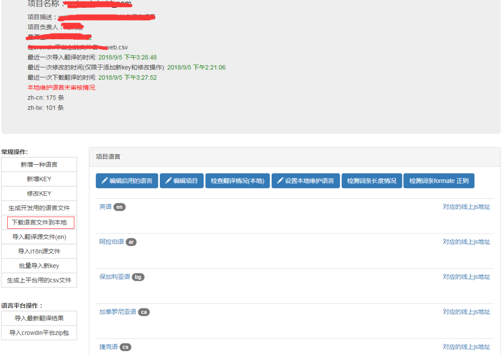
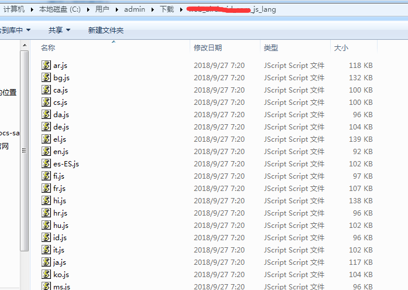

## 前言
之前做的  其实就在项目中就很有用了。这次做的另一个命令行工具，叫做语言助手下载替换工具 **lang-helper**， 这个也非常有用。
## 需求和方案
我们的团队做的项目是基于全球范围用户的，因此我们的所有产品其实都是有多语言的，有些项目少一点的也有七八种语种，多一点可能达到二三十种。而且我们的很多语种都会送到线上的翻译平台上去翻译。当然还有一些语种是我们自己内部运营自己维护的。
为了便于管理，我就开发了一个内部的语言助手平台，用来对各个项目的多语言进行翻译和校验，拉取和下载功能，甚至是跟翻译平台的同步和拉取功能。
<!--more-->


之前开发人员要更新项目的语言包的时候，就会点击左边的**下载语言文件到本地**功能，然后要选择要导出的格式：

比如我这边是web项目，所以我选择导出的格式为 **js**，然后点击导出按钮，这时候就会导出一个 **{projectName}_js_lang.zip**的zip，解压里面就是各个语种的语言包了：

然后开发人员再把这些新的语言文件，覆盖到对应项目中的存放语言文件夹的目录中。这样就更新了语言包了。
但是这样就麻烦在，如果我语言包更新的比较频率，比如运营或者产品，有几个词条一直在改，每次都要打包，每次打包之前都要更新语言包，然后在手动去平台上去下载zip包，然后解压，然后覆盖。有时候真的很麻烦，而且这种类似的web项目非常多，起码有将近10个左右，所以就在想弄个可以批量更新语言包的命令行工具。
思路跟前一篇的批量添加key的逻辑差不多：
- 使用init根据不用项目生成不同的json配置文件
- 调用语言助手提供的下载接口，得到zip下载包(对应的项目名已经在配置文件设置了)
- 解压下载包，然后将这些语言文件覆盖到该项目对应的语言目录(这个也是在配置文件里面设置了)

总的来说，就是差不多的逻辑。
## 实际开发
文件目录如下：

- **lang-options.json** 这个是init之后生成的配置文件，具体项目在用的时候，也会具体生成新的配置，这边也只是用于开发和调试会用到。
- **bin/lang-helper.js** 这个是入口文件
- **lib/** 这个文件夹是具体的业务代码，后面会讲到
- **.babelrc/** 配置babel的
- **package.json** 项目的配置文件

目录结构非常清晰，跟前一篇的几乎一致，接下来具体分析一下：
### 总入口文件 bin/lang-helper.js
**lang-helper.js**:
```javascript
#!/usr/bin/env node
require('../lib');
```
内容非常简单，直接指向 **lib** 目录的 **index.js** 文件
### 业务的入口文件 index.js
**lib/index.js**:
```javascript
'use strict';

require('babel-polyfill');
var program = require('commander');
var init = require('./init');
var update = require('./update');
var pkg = require('../package.json');
program.version(pkg.version);
program.command('init').alias('i').description('初始化当前项目语言包配置').action(init);
program.command('update').alias('u').description('更新语言包').action(update);
program.parse(process.argv);
if (!program.args.length) program.help();
//# sourceMappingURL=index.js.map
```
可以看到逻辑也非常简单，就两个指令，一个初始化 **init(i)**, 一个用于批量添加 **update(u)**, 接下来先分析初始化的指令 **init.js**
### 初始化指令 init.js
**lib/init.js**:
```javascript
'use strict';

var fs = require('fs');
var inquirer = require('inquirer');
var constants = require('./constants');
var readLangOptions = require('./read-options');
var LANG_OPTIONS_FILE = constants.LANG_OPTIONS_FILE;

function init() {
  var langProjectName = void 0;
  var options = readLangOptions();

  if (!options) {
    if (fs.existsSync('./package.json')) {
      langProjectName = JSON.parse(fs.readFileSync('./package.json').toString()).name;
    } else {
      langProjectName = 'myProject';
    }
    options = {
      langProjectName: langProjectName,
      langDir: './workspace/lang',
      downloadOptions: {
        ext: 'js',
        txt_quote: 0,
        txt_bom: 0,
        txt_ext: 'txt'
      }
    };
  }

  inquirer.prompt([{
    name: 'langProjectName',
    message: '请输入该项目在语言助手上的项目名?',
    default: options.langProjectName,
    type: 'input'
  }, {
    name: 'langDir',
    message: '请输入当前项目的语言文件路径?',
    default: options.langDir,
    type: 'input'
  }, {
    name: 'ext',
    message: '导出文件的数据格式?',
    default: ['js', 'json', 'xml', 'txt', 'csv'].indexOf(options.downloadOptions.ext),
    choices: ['js', 'json', 'xml', 'txt', 'csv'],
    type: 'list'
  }, {
    name: 'txt_quote',
    type: 'confirm',
    message: '是否带引号?',
    default: !!options.downloadOptions.txt_quote,
    when: function when(result) {
      return result.ext === 'txt';
    }
  }, {
    name: 'txt_bom',
    type: 'confirm',
    message: '是否头部带bom?',
    default: !!options.downloadOptions.txt_bom,
    when: function when(result) {
      return result.ext === 'txt';
    }
  }, {
    name: 'txt_ext',
    type: 'input',
    message: '要导出的后缀名?',
    default: options.downloadOptions.txt_ext,
    when: function when(result) {
      return result.ext === 'txt';
    }
  }, {
    name: 'is_ok',
    type: 'confirm',
    message: '确认以上信息没有问题?',
    default: true
  }]).then(function (result) {
    if (result.is_ok) {
      options.langProjectName = result.langProjectName;
      options.langDir = result.langDir;
      options.downloadOptions.ext = result.ext;
      options.downloadOptions.txt_quote = Number(!!result.txt_quote);
      options.downloadOptions.txt_bom = Number(!!result.txt_bom);
      options.downloadOptions.txt_ext = result.txt_ext || 'txt';
      fs.writeFileSync(LANG_OPTIONS_FILE, JSON.stringify(options, null, 2));
      console.log('初始化完成, 现在可以使用 lang-helper update 命令更新语言包了.');
    } else {
      console.log('已取消');
    }
  }).catch(function (e) {
    return console.log(e);
  });
}

module.exports = init;
```
其实就是设置一些配置项，用给下载zip的时候的一些参数配置项，这边不多说。主要还是生成**lang-options.json**,格式大概如下：
**lang-options.json**：
```
{
  "langProjectName": "web_project",
  "langDir": "./assets/lng/intl",
  "downloadOptions": {
    "ext": "js",
    "txt_quote": 0,
    "txt_bom": 0,
    "txt_ext": "txt"
  }
}
```
然后通过 **read-options.js** 这个方法去读取 **lang-options.json** 文件的内容，并返回：
**read-options.js**：
```javascript
'use strict';

var fs = require('fs');
var constants = require('./constants');
var LANG_OPTIONS_FILE = constants.LANG_OPTIONS_FILE;

function readLangOptions() {
  if (fs.existsSync(LANG_OPTIONS_FILE)) {
    return JSON.parse(fs.readFileSync(LANG_OPTIONS_FILE).toString());
  } else {
    console.log('找不到语言包配置, 请先使用 lang-helper init 命令生成当前项目的语言包配置文件.');
  }
}

module.exports = readLangOptions;
```
而另一个 **constants.js** 就是存放一些变量，比如这个文件的名字，或者是下载的临时zip包的名字：
**constants.js**：
```javascript
'use strict';

var os = require('os');
module.exports.LANG_TMP_FILENAME = os.tmpdir() + '/lang_tmp.zip';
module.exports.LANG_OPTIONS_FILE = './lang-options.json';
```
执行 init 的效果就是：

这样子我们需要的配置文件 **lang-options.json** 就生成了 (或者重新设置了)， 当然如果本地项目已经有这个文件了，也可以直接到这个文件直接修改也可以，不需要再执行 init 命令，因为本质上执行 init 命令就是为了生成并设置这个json文件。
### 更新指令 update.js
初始化设置之后，接下来肯定就是 批量更新了：
**lib/update.js**:
```javascript
'use strict';

/**
 * 更新语言包脚本方法
 */
var fs = require('fs');
var path = require('path');
var glob = require('glob-promise');
var unzip = require('extract-zip');
var downloadLang = require('./download');
var readLangOptions = require('./read-options');

function updateLang() {
  var options = readLangOptions();
  if (!options) return;

  console.time('耗时');
  return downloadLang(options.langProjectName, options.downloadOptions).then(function (filename) {
    return unzipFile(filename, { dir: options.langDir });
  }).then(function () {
    return console.log('更新成功');
  }).catch(function (err) {
    return console.error(`更新失败\n`, err.stack);
  }).then(function () {
    return glob(path.resolve(options.langDir) + '/**/*', { nodir: true }).then(function (files) {
      files.forEach(function (file) {
        var str = fs.readFileSync(file).toString();
        str = str.replace(//g, '');
        fs.writeFileSync(file, str);
      });
      console.log(`清理特殊字符完成(${files.length})`);
    });
  }).then(function () {
    return console.timeEnd('耗时');
  });
}

function unzipFile(file, options) {
  return new Promise(function (resolve, reject) {
    unzip(file, options, function (err) {
      !err ? resolve() : reject(new Error(`解压失败, ${err.message}`));
    });
  });
}

module.exports = updateLang;
```
其实逻辑非常简单，跟之前是思路一样:
- 先通过**downloadLang** 这个方法去语言助手提供的下载接口去下载zip包
- 然后再通过**unzipFile** 去解压zip包
- 最后清理掉一些特殊字符，然后将文件覆盖到项目中对应的语言目录

下载的代码就是 **lib/download.js**:
```javascript
'use strict'

var downloadLang = function () {
  var _ref = _asyncToGenerator(/*#__PURE__*/
    regeneratorRuntime.mark(function _callee (projectName, data) {
      var postOptions
      return regeneratorRuntime.wrap(function _callee$ (_context) {
        while (1) {
          switch (_context.prev = _context.next) {
            case 0:
              postOptions = {
                hostname: 'xxx.xxx.com',
                path: `/web/project/${projectName}/downloadFile`,
              }

              process.stdout.write(`开始下载\r`)
              return _context.abrupt('return',
                post(postOptions, data).then(function (response) {
                  return showProgress(response)
                }).then(function (response) {
                  return saveResponseToFile(LANG_FILENAME, response)
                }))

            case 3:
            case 'end':
              return _context.stop()
          }
        }
      }, _callee, this)
    }))

  return function downloadLang (_x, _x2) {
    return _ref.apply(this, arguments)
  }
}()

function _asyncToGenerator (fn) {
  return function () {
    var gen = fn.apply(this, arguments)
    return new Promise(function (resolve, reject) {
      function step (key, arg) {
        try {
          var info = gen[key](arg)
          var value = info.value
        } catch (error) {
          reject(error)
          return
        }
        if (info.done) { resolve(value) } else {
          return Promise.resolve(value).
                         then(function (value) {
                           step('next', value)
                         }, function (err) {
                           step('throw', err)
                         })
        }
      }

      return step('next')
    })
  }
}

var http = require('http')
var fs = require('fs')
var querystring = require('querystring')
var constants = require('./constants')
var LANG_FILENAME = constants.LANG_TMP_FILENAME

function showProgress (response) {
  var totalSize = parseInt(response.headers['content-length'], 10)
  var finishedSize = 0
  response.on('data', function (chunk) {
    finishedSize += chunk.length
    var progress = (100.0 * finishedSize / totalSize).toFixed(2)
    process.stdout.write(`正在下载: ${progress}%\r`)
    if (progress === '100.00') console.log('下载完成')
  })
  return response
}

function saveResponseToFile (filename, res) {
  return new Promise(function (resolve) {
    var file = fs.createWriteStream(filename)
    res.pipe(file)
    file.on('finish', function () {
      return file.close(function () {
        return resolve(filename)
      })
    })
  })
}

function post (options, data) {
  return new Promise(function (resolve, reject) {
    var postData = querystring.stringify(data)

    options.headers = options.headers || {}
    options.method = 'POST'
    options.headers['Content-Type'] = 'application/x-www-form-urlencoded'
    options.headers['Content-Length'] = Buffer.byteLength(postData)

    var req = http.request(options, function (res) {
      // console.log(`STATUS: ${res.statusCode}`);
      // console.log(`HEADERS: ${JSON.stringify(res.headers)}`);
      resolve(res)
    })

    req.on('error', function (err) {
      return reject(new Error(`下载失败, ${err.message}`))
    })

    // write data to request body
    req.write(postData)
    req.end()
  })
}

module.exports = downloadLang
```
全局安装就跟之前一样了，这边就不再说了，
执行一下就是：


这样就成功下载并替换了。
## 遇到的问题
在windows 下有时候对一些目录会没有写入权限，比如在 C:\Windows\System32 这个目录下，lang-options.json 就不能写入

## 总结
其实这个和之前的  这一篇思路非常像，像这种Node命令行工具，其实没必要做的太复杂。他要解决的就是一些重复性的劳动力。别小看这种重复劳动力的节省，随着项目的增多，能帮助我们节省的时间其实非常多。
