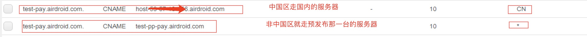

通过  为了解决测试环境下收不到paypal webhook的情况，我们将pay项目的测试环境放到国外的服务器，但是这个又引发了新的问题，就是接口请求速度太慢了。相当于跨区请求，而且测试库又在国内， 所以就导致， 请求从国内到国外，然后国外从国内连接数据库， 随后response从国外传回国内。 来来回回至少两趟， 因此接口会经常超时。导致测试很不方便。
所以为了线路问题和测试的便利性，还得把pay项目的测试环境放到国内来，这么一来我们就得解决paypal webhook收不到的问题。
后面我们想出来的解决方案就是，将pay项目的测试域名分区，就是中国区还是走测试服那一台，而国外的请求就走预发布环境那一台的，然后再将这个请求转发到国内的测试服上来，这样子paypal的webhook就可以先到达预发布那一台，然后在经由预发布那一台将请求转发到国内的测试服上来，从而可以解决webhook的问题。
<!--more-->
要进行域名分区的话，那么就要在aws的router53服务针对pay的测试域名进行分区配置：

那么这样子我们是不是就要维护两份代码？
其实不用，因为预发布那一台所有的请求都会被转发到中国区那一台服务器，因此预发布那一台只需要配置nginx转发就行了，根本就不需要有代码。
预发布服务器具体的nginx的配置如下：

[xxx@VM_16_13_centos sites-available]$ cat test-pay.airdroid.com.conf
upstream test-pay_server {
        # 中国区那一台的服务器
        server xx.xx.xx.xx:80 fail_timeout=0;
}

server {
        server_name  test-pay.airdroid.com;
        listen       80;
        listen       443 ssl http2;
        include      ssl/ssl_airdroid.com.conf;

        include      conf.d/limitip.conf;

        access_log  /var/log/nginx/test-pay.airdroid.com.access.log main;
        access_log  /var/log/nginx/test-pay.airdroid.com.4xx5xx.log combined if=$loggable;
        error_log   /var/log/nginx/test-pay.airdroid.com.error.log warn;

        # default 60s
        proxy_connect_timeout 60s;
        proxy_read_timeout    60s;
        proxy_send_timeout    90s;
        # 这边直接转发所有的请求到中国区的那一台服务器
        location / {
                proxy_pass http://test-pay_server/;
                proxy_set_header  Host             $host;
                proxy_set_header  X-Real-IP        $remote_addr;
                proxy_set_header  X-Forwarded-For  $proxy_add_x_forwarded_for;
        }
}


注意，他这个没有执行root的文件，只是一个反向代理，将请求代理到中国区的服务器，然后接下来就测试支付一下， 然后看 paypal的 webhook 能不能过来。
事实证明，是可以支付成功的。 而且paypal的webhook 也有过来了。
首先是到预发布环境的那一台中，预发布的log如下：
test-pay.airdroid.com 173.0.82.126 "173.0.82.126" - - [25/Apr/2018:03:40:24 +0000] "POST /pay/webhook HTTP/1.1" "200" 32 "-" "PayPal/AUHD-214.0-45842681" 9.116 509 2907 [9.116]
然后直接将请求反向到中国区的服务器中： 这时候来源的241就是预发布那一台的ip，中国区的log如下：
test-pay.airdroid.com 49.51.38.241 "173.0.82.126" - - [25/Apr/2018:03:40:24 +0000] "POST /pay/webhook HTTP/1.0" "200" 21 "-" "PayPal/AUHD-214.0-45842681" 8.948 418 2843 [8.780]
这样子就成功处理了, 成功实现了测试服务在国内，又可以收到国外第三方支付的webhook通知了。