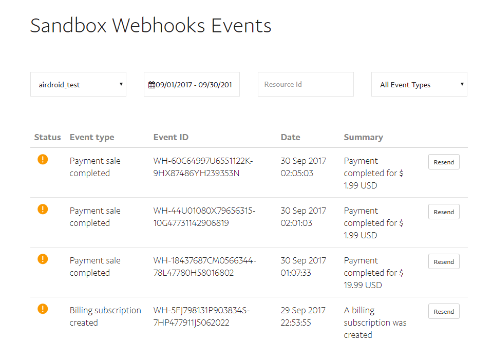

之前做的一个支付项目，里面有用到了paypal支付，线上支付和webhook回调都正常，但是问题就出在测试环境上，当时修改代码之后，部署到测试服，自己在沙盒测试的时候，发现支付成功之后，根本就没有webhook过来。而且查看了一下测试服对应的PayPal账号的 Sandbox Webhooks Events，发现竟然全部都发送失败了。

这下就蛋疼了，如果测试服的 webhook 没有过来，那怎么测试啊， 总不可能，没有测试就放到线上啊。后面想到，可能有一种情况会导致PayPal的webhook过不了，就是pay的测试服环境是国内的服务器。有可能PayPal的webhook 通知请求被长城防火墙给拦了，导致没法到达我们的服务器。而我们的线上服务器是在国外的，因此没问题。
<!--more-->
为了验证这个猜想，所以就打算换一个pay的测试服环境，把他换到国外去，也就是美西的预发布环境那一台，所以要请运维将测试服上面的pay项目搬到国外的那一台预发布服务器上，并修改aws的router53的域名指向。
接下来就开始测试了，试着用测试官网支付了一下，然后看了看log有没有webhook过来。

[2017-09-30 09:10:45] Paypal.DEBUG: received a new webhook 1506762645 [] []
[2017-09-30 09:10:45] Paypal.DEBUG: paypal webhook headers debug: {"content-type":["application\/json"],"content-length":["1276"],"accept":["*\/*"],"paypal-transmission-id":["36ef79d0-a5bf-11e7-86d9-77339302725b"],"paypal-transmission-time":["2017-09-30T09:10:33Z"],"paypal-transmission-sig":


这样就没问题了，通过将测试环境也部署到国外的服务器，就可以在沙盒模式下也可以收到webhook了