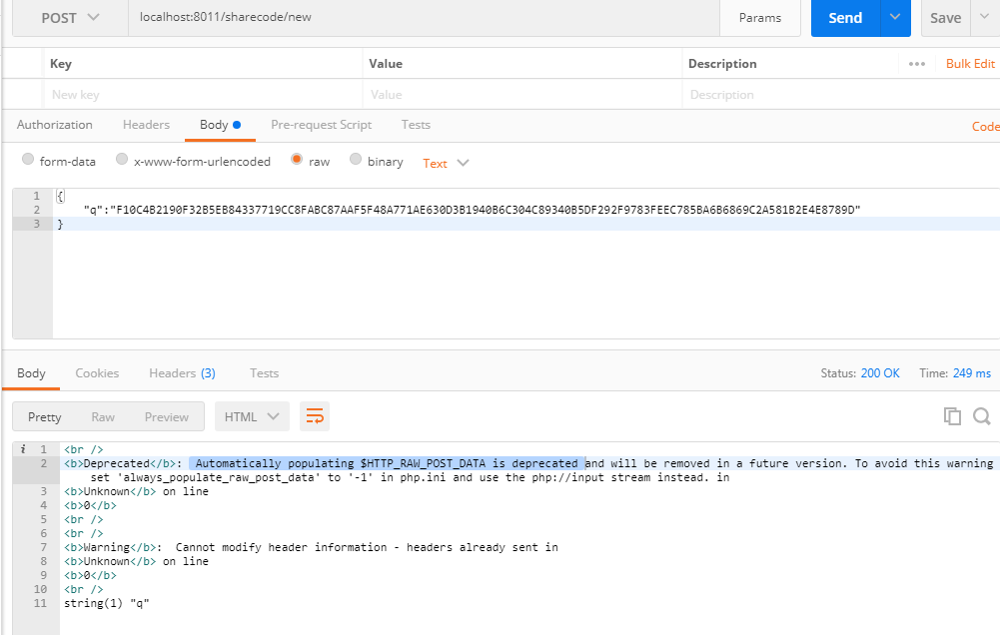
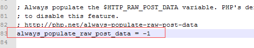
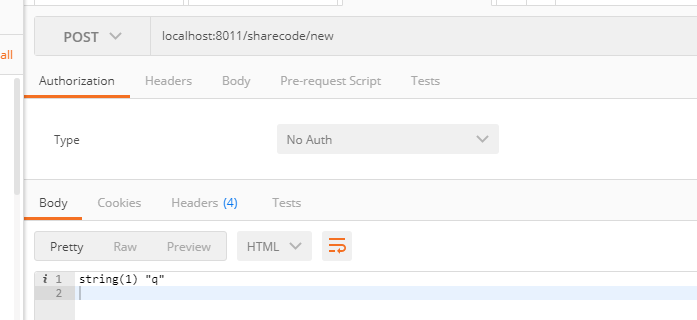

之前在用一个php项目在做本地调试的时候，用postman 来进行 post 请求，有报了一个这个错误：

后面查了一下资料，原来是有一个配置要设置
https://stackoverflow.com/questions/26261001/warning-about-http-raw-post-data-being-deprecated
要在php.ini 将 always_populate_raw_post_data 这个配置设置为 -1,
<!--more-->
因为这个项目不是靠Apache启动，而是 php 程序起的，所以看一下，现在的php程序是哪一个(我的本地有多个php版本)：

F:\airdroid_code\id-airdroid-com>php -v
Failed loading D:/wamp/bin/php/php5.4.3/zend_ext/php_xdebug-2.2.0-5.4-vc9.dll
PHP 5.6.29 (cli) (built: Dec  8 2016 12:21:16)
Copyright (c) 1997-2016 The PHP Group
Zend Engine v2.6.0, Copyright (c) 1998-2016 Zend Technologies

发现是 5.6.29， 那么就到 D:\wamp\bin\php\php5.6.29 这个目录的 php.ini 修改这个配置，改成：

改完php.ini ，要重新启动 id 项目，配置才会生效

这样没问题了