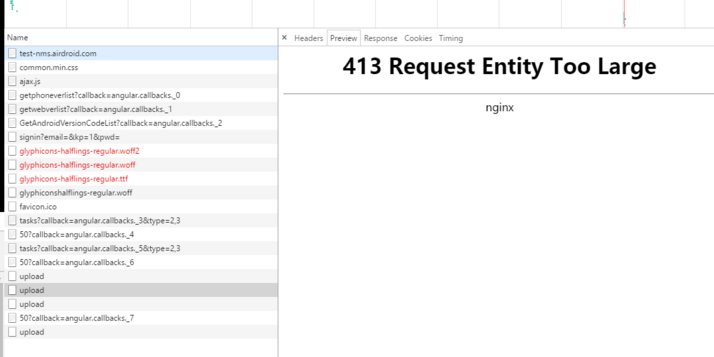
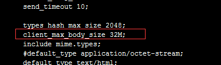
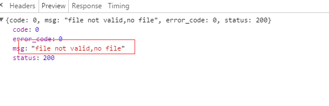
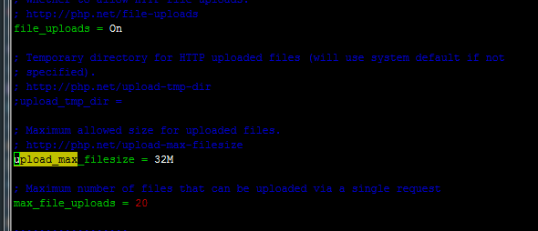

## 前因
之前在我们后台做发版操作的时候，要传升级包。这时候一个包大概要 20M，刚开始如果是传2M以下的，是没有问题，但是一旦超过了 2M，就会报这个错误：
<!--more-->

## 解决
从这个错误的log来看的话： <font color=red><b>413 Request Entity Too Large</b></font>， 应该就是 **nginx** 的设置问题。
后面我把 **nginx.conf** 的这个配置文件的这个值 **client_max_body_size** 设置为 <font color=red>32M</font>

然后重启下 nginx   
```
nginx -s reload
```
接下来重新再上传，发现20M的可以正常上传了，但是这时候又有问题了，传是传上去了，但是接口报错了:

接口显示读不到文件，但是 **2M** 以下还是没有问题。 后面发现虽然**nginx**这边的上传限制解除了，但是**php**还是有上传限制的， 还需要在 **php.ini** 修改一下这个值:
**upload_max_filesize** 设置为 **32M**:

这样子，果然后面就可以上传了。
## 其他情况
过了一段时间之后，后面传包又出现了问题了，就是win版在换包的时候，如果上传超过 60M, 那么进度会停在80%，然后直接挂掉。但是如果没有超过 60M，比如 55M，那么就可以成功。
但是看了一下线上的 nginx 和 php 配置，发现都有允许 60M 以上的文件上传。而且之前都可以传成功，超过60M的时候，就今天超过60M就一直上传失败。
看了一下 nginx 的 error log， 发现了一条：
```
2017/10/24 01:57:45 [warn] 32046#0: *122546077 a client request body is buffered to a temporary file /var/lib/nginx/tmp/client_body/0000003285, client: 47.xx.xx.73, server: xx.xxx.com, request: "POST /v2/xxx/uploadFileToServer HTTP/1.0", host: "xx.xxx.com", referrer: "http://nms.xxx.com/index.html?d=1508809258742"
```
上面说是缓存大小配置的问题,后面配置了nginx 的 **client_body_buffer_size 1024k;** 这个参数。重新试了一下，发现还是不行。期间还怀疑过会不会是因为上传过久，然后 nginx 那边因为超时机制就断开连接了。
因为查了一下，nginx 那边配置的连接超时时间是 5分钟，但是即使后面改为 10分钟，发现还是一样传不上去？？？
接下来认真想了一下，因为之前一直是可以的，而且测试环境一样的配置，就可以传。 而且考虑到现在国内正在举行19大，所以会不会是线路的问题。要知道之前为了提高xx.xxx.com 接口的访问速度，有对 xx.xxx.com 的请求进行了线路优化。就是在对xx.xxx.com 的请求进行了中转站的反向代理。也就是在香港那边有一台反向代理服务器作为中转服务器，用来转发xx.xxx.com的接口请求，这样会比直接在国内访问日本的服务器来得快（线上的xx.xxx.com服务器在日本）。而且上面的log里面的client的ip(47.xx.xx.73)就是香港那一台, 所以怀疑会不会在19大期间，香港那台反向代理服务器被限了？？？ 所以后面我把香港的这个反向代理取消，直接将请求指向线上日本区的那一台试试， 结果发现这样真的可以上传成功了。
所以后面的决定就是先把香港的反向代理中转取消掉。


