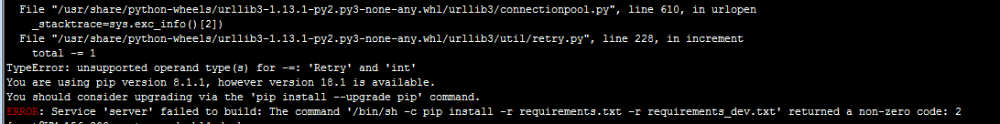

## 前言
当业务成长到一定规模之后，会有许多想看各种不同类型报表的需求，如果单独做在后台，那么无疑会浪费前端和后端开发的时间。所以一直都有在寻找一款好用的BI工具。
后面查了一下，市面上好用的一些非商业的BI工具，主要的是 **Superset**，**Redash**， **Metabase** 这三种。
评测请看：
[数据可视化的开源方案: Superset vs Redash vs Metabase (一)](https://tech.glowing.com/cn/superset-redash-metabase-1/)
[数据可视化的开源方案: Superset vs Redash vs Metabase (二)](https://tech.glowing.com/cn/superset-redash-metabase-2/)

<!--more-->
刚开始采用的是 Superset 这个工具，后面发现从使用体验上来看的话，感觉不好用。 而且文档比较混乱， 最重要的是不支持 mongo。
后面考虑到自己项目的使用情况， 再加上大部分的编写人员都是技术人员，所以后面就选了 Redash 打算先试用一下。
## 安装
参照官方文档采用docker安装： [官方docker安装文档](https://redash.io/help/open-source/dev-guide/docker)
### 前置环境
docker， docker compose， nodejs 都要安装，这边就不细讲了。
### git clone 库
```html
git clone https://github.com/getredash/redash.git
cd redash/
```
### 启动docker 服务(走不通)
```html
docker-compose up
```
但是发现一直报这个错误：

好像是 pip 的版本太低了，要升级到 18.1 版本。但是我后面升上去之后呢：
```html
[root@VM_156_200_centos redash]# pip -V
pip 18.1 from /usr/lib/python2.7/site-packages/pip (python 2.7)
```
他还是继续给我报这个bug？？？
### docker-compose.production.yml文件
后面就重新参照了这个教程： [redash安装及使用](https://blog.csdn.net/diantun00/article/details/80968604)
编辑**docker-compose.production.yml**文件，将数据目录映射出来以及更改密码。就改两个地方： 
- 这个映射的注释取消掉：

- 修改这个字段，其实就是密码：
```html
REDASH_COOKIE_SECRET: youPassword
```

### 运行命令完成数据库初始化操作
```html
docker-compose -f docker-compose.production.yml run --rm server create_db
```
```html
[root@VM_156_200_centos redash]# docker-compose -f docker-compose.production.yml run --rm server create_db
Pulling redis (redis:3.0-alpine)...
Trying to pull repository docker.io/library/redis ...
3.0-alpine: Pulling from docker.io/library/redis
88286f41530e: Pull complete
......
[2018-11-23 08:18:56,499][PID:1][INFO][alembic.runtime.migration] Running stamp_revision  -> 71477dadd6ef
```
### 利用docker-compose启动docker运行起来
```html
docker-compose -f docker-compose.production.yml up
```
```html
[root@VM_156_200_centos redash]# docker-compose -f docker-compose.production.yml up
Pulling nginx (redash/nginx:latest)...
Trying to pull repository docker.io/redash/nginx ...
latest: Pulling from docker.io/redash/nginx
03e1855d4f31: Pull complete
a3ed95caeb02: Pull complete
ccca24cf536d: Pull complete
6114b204585d: Pull complete
46062b965522: Pull complete
Digest: sha256:b10bc96086fa30b8fd8a8d1c47ce6fdb5f531c91cbfa5820595a687b33082be3
Status: Downloaded newer image for docker.io/redash/nginx:latest
redash_postgres_1 is up-to-date
Creating redash_worker_1 ...
Creating redash_worker_1 ... done
Creating redash_server_1 ... done
Creating redash_nginx_1  ... error

ERROR: for redash_nginx_1  Cannot start service nginx: driver failed programming external connectivity on endpoint redash_nginx_1 (21aba0dfa8812cb0de0f52563d7f347281cf353890d11577a1a20fba142190f6): Bind for 0.0.0.0:80 failed: port is already allocated

ERROR: for nginx  Cannot start service nginx: driver failed programming external connectivity on endpoint redash_nginx_1 (21aba0dfa8812cb0de0f52563d7f347281cf353890d11577a1a20fba142190f6): Bind for 0.0.0.0:80 failed: port is already allocated
ERROR: Encountered errors while bringing up the project.
```
发现报错了，原来是 nginx的镜像启动失败，80 端口被占用了， 查了一下 docker 容器，发现确实有两个之前就运行的nginx容器还在跑，那就把这个两个容器删掉：
```html
[root@VM_156_200_centos redash]# docker ps
CONTAINER ID        IMAGE                   COMMAND                  CREATED              STATUS              PORTS                                                                            NAMES
......
a9ee06d55082        nginx:v3                "nginx -g 'daemon ..."   7 months ago         Up 7 months         0.0.0.0:80->80/tcp                                                               webserver3
89e76cdbfe98        nginx                   "nginx -g 'daemon ..."   7 months ago         Up 7 months         0.0.0.0:8080->80/tcp                                                             webserver


[root@VM_156_200_centos redash]# docker rm  -f a9ee06d55082
a9ee06d55082
[root@VM_156_200_centos redash]# docker rm  -f 89e76cdbfe98
89e76cdbfe98
```
这样就删掉了, 重试一下：
```html
[root@VM_156_200_centos redash]# docker-compose -f docker-compose.production.yml up
redash_redis_1 is up-to-date
redash_postgres_1 is up-to-date
redash_worker_1 is up-to-date
redash_server_1 is up-to-date
Starting redash_nginx_1 ... done
Attaching to redash_redis_1, redash_postgres_1, redash_worker_1, redash_server_1, redash_nginx_1
......
worker_1    | [2018-11-23 08:20:43,810][PID:1][INFO][MainProcess] Received task: redash.tasks.refresh_queries[00156e42-0213-40b3-a9a2-8ff475584bfb]
```
这样就跑起来了。 接下来就访问  http://119.xx.xx.28/setup 可以看到已经有站点了, 这个就是设置页面:

这时候看了一下 docker 的容器，就会发现 redash 有5个相关的容器：
```html
[root@VM_156_200_centos redash]# docker ps
CONTAINER ID        IMAGE                   COMMAND                  CREATED             STATUS              PORTS                                                                            NAMES
751e870e42c7        redash/nginx:latest     "nginx -g 'daemon ..."   5 minutes ago       Up 2 minutes        0.0.0.0:80->80/tcp, 443/tcp                                                      redash_nginx_1
e48dd3875394        redash/redash:latest    "/app/bin/docker-e..."   5 minutes ago       Up 5 minutes        0.0.0.0:5000->5000/tcp                                                           redash_server_1
5de34df455e8        redash/redash:latest    "/app/bin/docker-e..."   5 minutes ago       Up 5 minutes        5000/tcp                                                                         redash_worker_1
c4ef5ca8af6f        redis:3.0-alpine        "docker-entrypoint..."   7 minutes ago       Up 7 minutes        6379/tcp                                                                         redash_redis_1
515d93e8f4bc        postgres:9.5.6-alpine   "docker-entrypoint..."   7 minutes ago       Up 7 minutes        5432/tcp                                                                         redash_postgres_1
......
```
### 设置管理员的用户名和密码

这样就进去了

## 使用
### web 页面添加数据源
在这边可以添加数据源：


添加一个新的， 然后选择  mysql：

然后就输入连接配置，这样就连接上了。

我这边配了两个mysql
### 创建一条query
点击新建query，然后写入sql，生成数据：

可以看到，有数据出来了。 接下来选择 New Visualization 来创建图表

命名完之后， 点击 save ，然后点击右上角的 publish，就可以发布出去了， 就可以在queries列表看到了

### 创建dashboard
点击创建一个新的dashboard：

点击 Edit，然后点击下面的 Add Widget， 添加query， 将刚才创建的query以图表的方式加进去

最后publish，就可以看到了：

## 总结
基本上基础的安装和使用就这样子了，至于后面更细的，得看redash对业务的使用情况。


