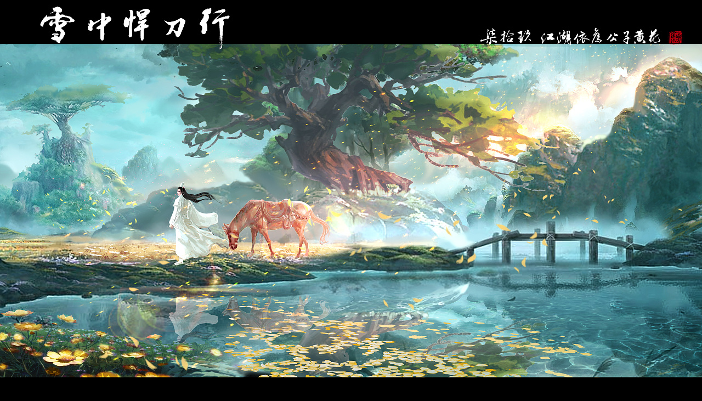

最近在抖音上看到了一句话很有感触： <b>随心所欲而不逾矩</b>
最高的高人就是 <b>我既能随心所欲还能不破坏规矩</b>, 这句话简直说到了我的心坎里。
后面我查了一下这句话是孔子说的：

随心所欲不逾矩出自《论语·第二章·为政篇》子曰：“吾十有五而志于学，三十而立，四十而不惑，五十而知天命，六十而耳顺，七十而从心所欲不逾矩。”


孔子他老人家认为至少要达到七十才能达到这种境界，毫无疑问，要达到这种境界需要丰厚的生活阅历和强大的心理素养。

随着社会阅历的增加，你会被这个社会慢慢的同化，你身上的童真和率真会变得越来越少，世故会在你的身上越来越多。 当然这不一定是坏事，毕竟人是需要慢慢成长从而变得成熟的，因此我更倾向于成长的代价。
<!--more-->
当然如果是拒绝成长的话，越到后面就会出现一种情况，那就是连生存都很难生存了，最后可能就是直接被这个社会所淘汰

以前年轻时候很喜欢看龙傲天的小白小说，主角不开心了，就掀桌子，我不玩了，你们也别想玩。 
但是长大后才发现，别说成为别人的棋子了，有时候你连进场的资格都没有。所以其实你会发现，所谓的不想长大，永远只会出现在歌词里面，正因为无法拥有，才会显得可贵，而现实中的不想长大，绝对不是一件好事（智障？ 精神病？）

这个社会上充满了大大小小的规矩，公司有公司的规矩，学校有学校的规矩，甚至从社会层面上来说，道德是一种规矩，法律也是一种规矩，甚至人情世故也是一种规矩。所以为了适应这个社会，尤其是这个笑贫不笑娼的操蛋社会，我们不可避免的会变得世故，甚至会变成以前我们讨厌的那种人。

当然我们得回到正题来，上面的内容有点偏灰暗了，负能量有点多，一不小心又愤青了一把。 本质上这个社会还是丰富多彩的，我们应该对生活报以信心才对，这个嘛，物质不够的话，精神来凑。

是个人都想随心所欲吧，当然这边要跟另外一个为所欲为区分开来，我所认为的随心所欲就是遵从内心的想法，在不伤害他人的情况下，做自己喜欢的，想做的事情。 
这个社会最大的底线就是以不伤害他人为底线，只要是不伤害到他人，又是自己喜欢的事情，那么我认为就是随心所欲，就是我想要的自由。我认为人生没有绝对的自由，自由都是相对于规矩的，所以如果要做到随心所欲而不逾矩的话，那么其实就是一个度的问题，而人生中最大的艺术恰恰就是度的掌握。没有丰富的人生阅历和思考，就很难去把控这个度。而这恰恰就是人生的闪光点。

我认为人的一生不能以结果论来总结，毕竟死后都是黄土一杯，徒有虚名罢了。 过程才是重要的，思想的成长和阅历的成长其实就是对度的不断迭代和改进。

哈哈，最后总结一下， 随心所欲而不逾矩 我所认为的具体表现就是 <b>我应在江湖悠悠，饮一壶浊酒，醉里看百花深处愁</b>。

最后再配上我很喜欢的一张 雪中的插图(如果侵权，请联系我删除)

