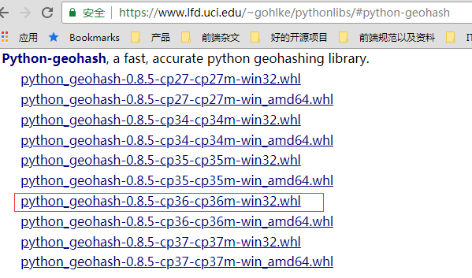
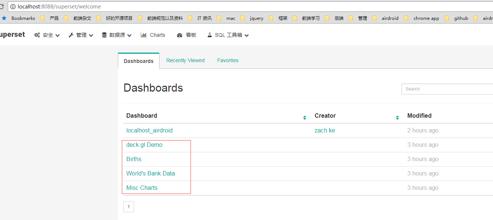
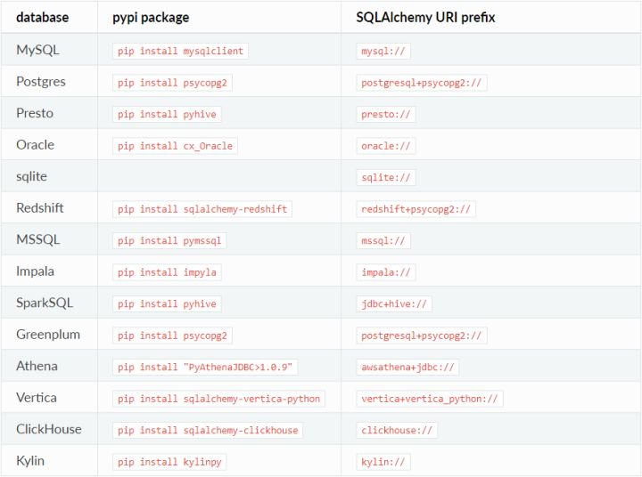
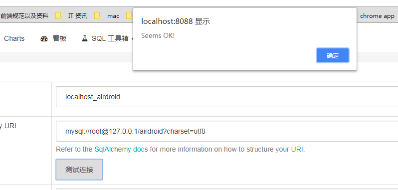
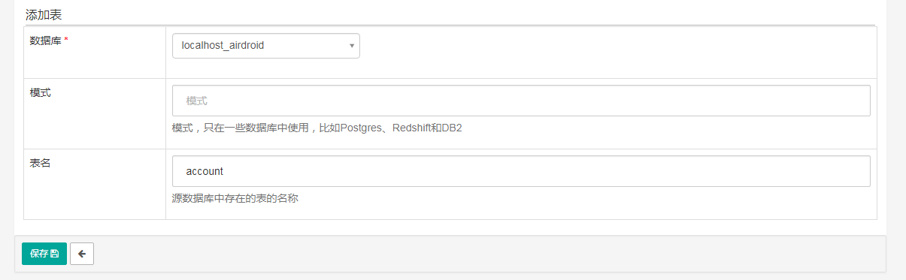
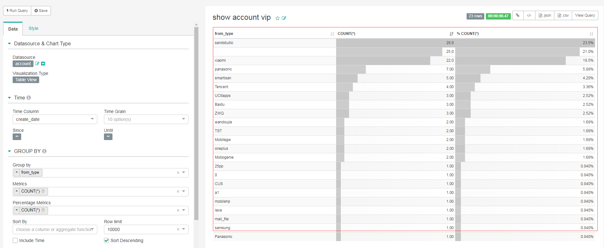
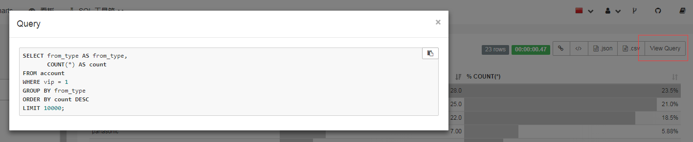
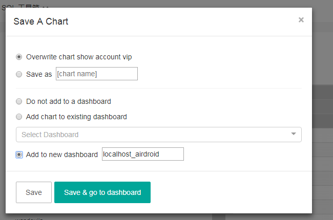
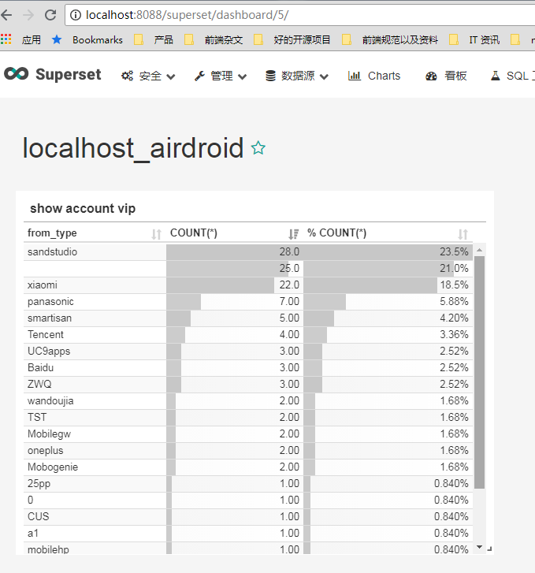
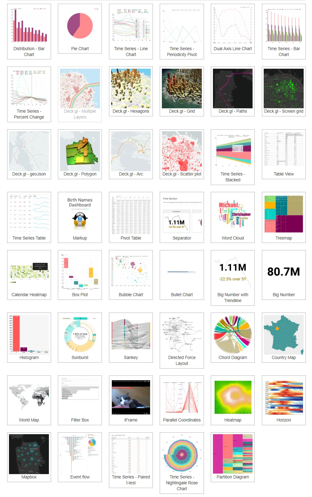

## 前言
最近想用一下Superset，这个是一个开源项目，可以直接通过写sql来生成图表，有时候对一些图表需求比较多的时候，可以用的上。


Superset是由Airbnb（知名在线房屋短租公司）开源BI数据分析与可视化平台（曾用名Caravel、Panoramix），该工具主要特点是可自助分析、自定义仪表盘、分析结果可视化（导出）、用户/角色权限控制，还集成了一个SQL编辑器，可以进行SQL编辑查询等，原来是用于支持Druid的可视化分析，后面发展为支持很多种关系数据库及大数据计算框架，如：mysql, oracle, Postgres, Presto, sqlite, Redshift, Impala, SparkSQL, Greenplum, MSSQL.

<!--more-->
## windows下的安装和配置
superset官网就有安装教程：[传送门](http://superset.apache.org/installation.html)
官网说明对Windows系统当前没有官方支持，不过实际上是可以安装成功的， 如果是windows下的安装的话，要用 Python 安装。
我的环境是： **windows 7 64 位**
以下是一些前置准备：
### 安装 Python
我安装的是 Python 3.6 版本。建议版本高一点，Python 2.7 版本在windows 上存在各种编码问题。

F:\>python --version
Python 3.6.1

### 安装 virtualenv
**virtualenv** 就是用来为一个应用创建一套“隔离”的Python运行环境

F:\>pip install virtualenv
Collecting virtualenv
  Downloading https://files.pythonhosted.org/packages/b6/30/96a02b2287098b23b875bc8c2f58071c35d2efe84f747b64d523721dc2b5/virtualenv-16.0.0-py2.py3-none-any.whl (1.9MB)
    100% |████████████████████████████████| 1.9MB 265kB/s
Installing collected packages: virtualenv
Successfully installed virtualenv-16.0.0

使用virtualenv。先在D盘建立d:\pycharm\superset目录。
创建虚拟环境： **virtualenv env**
激活，启用虚拟环境（必须要用反斜杆）：**env\Scripts\activate**

D:\>md pycharm
D:\>cd pycharm
D:\pycharm>md superset
D:\pycharm>cd superset
D:\pycharm\superset>virtualenv env
Using base prefix 'c:\\program files (x86)\\python36-32'
New python executable in D:\pycharm\superset\env\Scripts\python.exe
Installing setuptools, pip, wheel...done.

D:\pycharm\superset>env\Scripts\activate

当然，如果后面想退出虚拟环境就是这个：
**(env) D:\pycharm\superset>env\Scripts\deactivate**
### 安装 superset

(env) D:\pycharm\superset>pip install superset
Collecting superset
  Downloading https://files.pythonhosted.org/packages/64/7e/186af3b4501c82794a9332530e8b310073779f555a3f20ee481a27b3bfaf/superset-0.26.3.tar.gz (50.6MB)
    100% |████████████████████████████████| 50.6MB 45kB/s
Collecting bleach (from superset)
。。。
。。。
    error: Microsoft Visual C++ 14.0 is required. Get it with "Microsoft Visual C++ Build Tools": http://landinghub.visualstudio.com/visual-cpp-build-tools

    ----------------------------------------
Command "d:\pycharm\superset\env\scripts\python.exe -u -c "import setuptools, tokenize;__file__='C:\\Users\\admin\\AppData\\Local\\Temp\\pip-install-_zyiqvlv\\python-geohash\\setup.py';f=getattr(tokenize, 'open', open)(__file__);
code=f.read().replace('\r\n', '\n');f.close();exec(compile(code, __file__, 'exec'))" install --record C:\Users\admin\AppData\Local\Temp\pip-record-q7ds71hu\install-record.txt --single-version-externally-managed --compile --instal
l-headers d:\pycharm\superset\env\include\site\python3.6\python-geohash" failed with error code 1 in C:\Users\admin\AppData\Local\Temp\pip-install-_zyiqvlv\python-geohash\

看了一下，是少了 visualstudio 的组件，所以我又重新安装了一下 visualstudio 2015 的版本。
当将 vs2015 装上去之后，又重新试了一下。 发现还是报错，这次的错是这个：

error: [WinError 3] 系统找不到指定的路径。: 'C:\\Program Files (x86)\\Microsoft SDKs\\Windows\\v8.1\\lib'
Failed building wheel for python-geohash

看样子好像是少了一条 **Python-geohash** 库。 那我直接去这个地方装： https://www.lfd.uci.edu/~gohlke/pythonlibs/#python-geohash
这边还有一个细节，就是要安装对应版本Python的包，比如我的是 3.6的，那么就要对应下载这个：**python_geohash-0.8.5-cp36-cp36m-win32.whl**

如果下载的版本不匹配的话，就会报这个错误：xxxx is not a supported wheel on this platform.

(env) D:\pycharm\superset>pip install C:\Users\admin\Downloads\python_geohash-0.8.5-cp36-cp36m-win32.whl
Processing c:\users\admin\downloads\python_geohash-0.8.5-cp36-cp36m-win32.whl
Installing collected packages: python-geohash
Successfully installed python-geohash-0.8.5

这样就安装好了，接下来再重新安装一下：

(env) D:\pycharm\superset>pip install superset
Collecting superset
。。。
Installing collected packages: pyyaml, superset
Successfully installed pyyaml-3.13 superset-0.26.3

这时候就安装成功了。
### 配置
接下来就配置了

# 创建管理员帐号
fabmanager create-admin --app superset

# 初始化数据库 (windows下，先进入到 Python安装目录（或者virtualEnv的虚拟目录）下，lib\site-packages\superset\bin下)
Python superset db upgrade

# 加载例子(后续操作都需要在lib\site-packages\superset\bin下)
Python superset load_examples

# 初始化角色和权限
Python superset init

# 启动服务，端口 8088, 使用 -p 更改端口号。
Python superset runserver -d

这时候就配置完了，接下来就打开浏览器查看登录页面了： http://localhost:8088

(env) D:\pycharm\superset\env\Lib\site-packages\superset\bin>Python superset runserver -d
?[34m-=-=-=-=-=-=-=-=-=-=-=-=-=-=-=-=-=-=-=-=
?[33mStarting Superset server in ?[31mDEBUG?[33m mode
?[34m-=-=-=-=-=-=-=-=-=-=-=-=-=-=-=-=-=-=-=-=
?[0m
2018-08-14 11:21:26,805:INFO:werkzeug: * Restarting with stat
?[34m-=-=-=-=-=-=-=-=-=-=-=-=-=-=-=-=-=-=-=-=
?[33mStarting Superset server in ?[31mDEBUG?[33m mode
?[34m-=-=-=-=-=-=-=-=-=-=-=-=-=-=-=-=-=-=-=-=
?[0m
2018-08-14 11:21:30,112:WARNING:werkzeug: * Debugger is active!
2018-08-14 11:21:30,116:INFO:werkzeug: * Debugger PIN: 243-075-165
2018-08-14 11:21:30,126:INFO:werkzeug: * Running on http://0.0.0.0:8088/ (Press CTRL+C to quit)
2018-08-14 11:21:30,958:INFO:werkzeug:127.0.0.1 - - [14/Aug/2018 11:21:30] "GET /superset/welcome HTTP/1.1" 200 -
2018-08-14 11:21:31,191:INFO:werkzeug:127.0.0.1 - - [14/Aug/2018 11:21:31] "GET /static/assets/images/favicon.png HTTP/1.1" 200 -
2018-08-14 11:21:31,241:INFO:werkzeug:127.0.0.1 - - [14/Aug/2018 11:21:31] "GET /superset/fave_dashboards/1/ HTTP/1.1" 200 -
2018-08-14 11:21:31,266:INFO:werkzeug:127.0.0.1 - - [14/Aug/2018 11:21:31] "GET /dashboardmodelviewasync/api/read?_oc_DashboardModelViewAsync=changed_on&_od_DashboardModelViewAsync=desc HTTP/1.1" 200 -
2018-08-14 11:21:31,296:INFO:werkzeug:127.0.0.1 - - [14/Aug/2018 11:21:31] "GET /superset/fave_slices/1/ HTTP/1.1" 200 -
2018-08-14 11:21:31,318:INFO:werkzeug:127.0.0.1 - - [14/Aug/2018 11:21:31] "GET /superset/recent_activity/1/?limit=50 HTTP/1.1" 200 -
2018-08-14 11:21:45,502:INFO:werkzeug:127.0.0.1 - - [14/Aug/2018 11:21:45] "GET /lang/zh HTTP/1.1" 302 -
2018-08-14 11:21:45,757:INFO:werkzeug:127.0.0.1 - - [14/Aug/2018 11:21:45] "GET /lang/zh HTTP/1.1" 302 -
2018-08-14 11:21:45,811:INFO:werkzeug:127.0.0.1 - - [14/Aug/2018 11:21:45] "GET / HTTP/1.1" 302 -
2018-08-14 11:21:45,818:INFO:werkzeug:127.0.0.1 - - [14/Aug/2018 11:21:45] "GET / HTTP/1.1" 302 -
2018-08-14 11:21:46,237:INFO:werkzeug:127.0.0.1 - - [14/Aug/2018 11:21:46] "GET /superset/welcome HTTP/1.1" 200 -
2018-08-14 11:21:46,600:INFO:werkzeug:127.0.0.1 - - [14/Aug/2018 11:21:46] "GET /superset/welcome HTTP/1.1" 200 -
2018-08-14 11:21:46,877:INFO:werkzeug:127.0.0.1 - - [14/Aug/2018 11:21:46] "GET /superset/welcome HTTP/1.1" 200 -

登录就要输入刚才设置的用户名和密码。

可以看到有四个是刚才加载的 example demo
### 创建一个sql并生成图表
我们连得上mysql，所以之前先安装mysqlclient： **pip install mysqlclient**
Superset支持的数据库：

#### 连接到一个新的数据库
- 点击：数据源-数据库（Sources-Databases）
- 只需填写两项：数据库（名称）、SQLAlchemy URI（如果是mysql，中文一定要设置charset=utf8，不然会乱码）
- 保存（Save）

测试连接，表示是可以连的
#### 增加一个新表
- 点击：数据源-数据表（Sources-Tables）
- 选择数据库-填写此数据库存在的表名
- 保存（Save）

#### 写sql
新建表的时候，点击保存的时候，就可以直接到这个页面写sql了

可以直接查看 sql

最后保存到 dashboard，如果不存在就建一个

最后到dashboard 就可以查看了

在 charts 可以看到自己创建的图表

如果要新建一个新的图表的话，直接点击右上角的添加即可。
Superset 提供了很多的图表类型：

## 总结
windows下的环境是搭起来了，也试着用了一下，发现还是挺不错的，后面要看下这个东西怎么用的更好。

---
参考资料：
[Superset在windows下的安装配置及基础教程](https://zhuanlan.zhihu.com/p/36223295)
[Superset在windows下的安装配置](https://www.cnblogs.com/calmzeal/archive/2017/08/14/7359144.html)