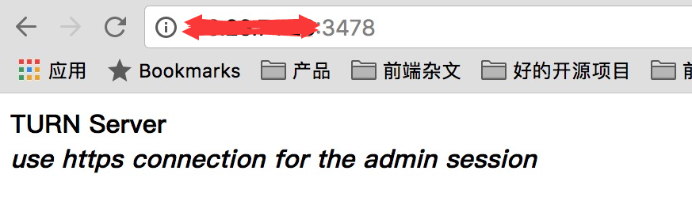

## 前言
最近在做一个基于webrtc的项目，所以肯定需要turn和stun转发服务器，我用的是 [coturn](https://github.com/coturn/coturn) 这个服务来做。
## 安装
### 首先下载 centos7 对应的 tar 包，然后解压
地址：[传送门](http://turnserver.open-sys.org/downloads/v4.5.0.7/)
<!--more-->
```html
[root@VM_156_200_centos ~]# wget http://turnserver.open-sys.org/downloads/v4.5.0.7/turnserver-4.5.0.7-CentOS7.4-x86_64.tar.gz
--2018-04-19 23:53:42--  http://turnserver.open-sys.org/downloads/v4.5.0.7/turnserver-4.5.0.7-CentOS7.4-x86_64.tar.gz
正在解析主机 turnserver.open-sys.org (turnserver.open-sys.org)... 78.47.74.102
正在连接 turnserver.open-sys.org (turnserver.open-sys.org)|78.47.74.102|:80... 已连接。
已发出 HTTP 请求，正在等待回应... 200 OK
长度：370013 (361K) [application/x-gzip]
正在保存至: “turnserver-4.5.0.7-CentOS7.4-x86_64.tar.gz”

100%[====================================================================================>] 370,013     17.3KB/s 用时 18s    

2018-04-19 23:54:02 (20.2 KB/s) - 已保存 “turnserver-4.5.0.7-CentOS7.4-x86_64.tar.gz” [370013/370013])

[root@VM_156_200_centos ~]# ls
anaconda-ks.cfg  docker-compose-file  docker-node-hello  go  mynginx  turnserver-4.5.0.7-CentOS7.4-x86_64.tar.gz
```
### 解压tar 包
```html
[root@VM_156_200_centos ~]# tar xvfz turnserver-4.5.0.7-CentOS7.4-x86_64.tar.gz
turnserver-4.5.0.7/
turnserver-4.5.0.7/turnserver-4.5.0.7-0.el7.centos.x86_64.rpm
turnserver-4.5.0.7/turnserver-client-libs-4.5.0.7-0.el7.centos.x86_64.rpm
turnserver-4.5.0.7/turnserver-utils-4.5.0.7-0.el7.centos.x86_64.rpm
turnserver-4.5.0.7/install.sh
turnserver-4.5.0.7/uninstall.turnserver.sh
[root@VM_156_200_centos ~]# ls
anaconda-ks.cfg  docker-compose-file  go       turnserver-4.5.0.7
coturn           docker-node-hello    mynginx  turnserver-4.5.0.7-CentOS7.4-x86_64.tar.gz
```
### 进入到 turnserver-4.5.0.7 这个目录， 执行 install.sh, 直接进行安装
```html
[root@VM_156_200_centos ~]# cd turnserver-4.5.0.7/
[root@VM_156_200_centos turnserver-4.5.0.7]# ls
install.sh                                  turnserver-client-libs-4.5.0.7-0.el7.centos.x86_64.rpm  uninstall.turnserver.sh
turnserver-4.5.0.7-0.el7.centos.x86_64.rpm  turnserver-utils-4.5.0.7-0.el7.centos.x86_64.rpm
[root@VM_156_200_centos turnserver-4.5.0.7]# ./install.sh 
已加载插件：fastestmirror, langpacks
Repodata is over 2 weeks old. Install yum-cron? Or run: yum makecache fast
epel                                                                                                   | 4.7 kB  00:00:00     
extras                                                                                                 | 3.4 kB  00:00:00     
os                                                                                                     | 3.6 kB  00:00:00     
updates                                                                                                | 3.4 kB  00:00:00     
(1/4): epel/7/x86_64/updateinfo                                                                        | 916 kB  00:00:00     
(2/4): extras/7/x86_64/primary_db                                                                      | 185 kB  00:00:00     
(3/4): epel/7/x86_64/primary_db                                                                        | 6.3 MB  00:00:00     
(4/4): updates/7/x86_64/primary_db                                                                     | 6.9 MB  00:00:00     
Determining fastest mirrors
正在解决依赖关系
--> 正在检查事务
---> 软件包 epel-release.noarch.0.7-11 将被 安装
--> 解决依赖关系完成

依赖关系解决
。
。
。
总计：529 k
安装大小：529 k
Downloading packages:
Running transaction check
Running transaction test
Transaction test succeeded
Running transaction
  正在安装    : turnserver-utils-4.5.0.7-0.el7.centos.x86_64                                                              1/1 
  验证中      : turnserver-utils-4.5.0.7-0.el7.centos.x86_64                                                              1/1 

已安装:
  turnserver-utils.x86_64 0:4.5.0.7-0.el7.centos                                                                              

完毕！
SUCCESS !
```
这样就成功了
## 修改配置文件
这样子turnserver 就安装成功了，接下来就是修改配置文件 **/etc/turnserver/turnserver.conf**
不过修改之前，要先用openssl生成证书
```html
openssl req -x509 -newkey rsa:2048 -keyout /etc/turn_server_pkey.pem -out /etc/turn_server_cert.pem -days 99999 -nodes
```
以下是修改的内容：
```html
# 要监听的设备，不推荐，默认注释
#listening-device=eth0

# turn 的 udp 和 tcp 的监听端口号,注释掉的话，就会取默认值 3478
#listening-port=3478

# 设置延迟转发的设备，不推荐设置
#relay-device=eth0

# 设置转发的ip（局域网ip），如果不设置，他会自己选择默认的
relay-ip=172.16.184.108

# 转发的外网ip(本机外网ip)，用于NAT 地址映射
external-ip=47.96.xx.xx

# 转发的线程数，其实默认不设置最好
relay-threads=5

# 主要是要输出日志的，其实不推荐，因为会输出大量烦人的log
#Verbose

# WebRTC 的消息里会用到
fingerprint

# WebRTC 认证需要
lt-cred-mech

# REST API 认证需要
use-auth-secret

# REST API 加密所需的 KEY
# 这里我们使用“静态”的 KEY，Google 自己也用的这个
static-auth-secret=1234567890

# 用户登录域
realm=pano

# 校验的时间生命周期，默认600s，超过就会得到438错误，然后客户端只能重新校验
#stale-nonce=600

# 证书
cert=/etc/turn_server_cert.pem

# 证书key
pkey=/etc/turn_server_pkey.pem

# 输出的log
log-file=/var/log/turn/turn.log

# 用于禁止回传地址
#no-loopback-peers

# 用于禁止广播
#no-multicast-peers

# 存放进程的地方
pidfile="/var/run/turnserver.pid"

# 开启移动ICE的支持
#mobility

# 禁用本地 telnet cli 管理接口
#no-cli
```
## 启动service
```html
[root@VM_156_200_centos turnserver]# service turnserver  start
Redirecting to /bin/systemctl start  turnserver.service
```
这样就启动起来了。
可以直接访问 3478 端口:



