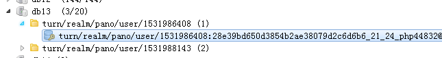
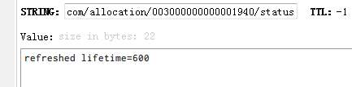
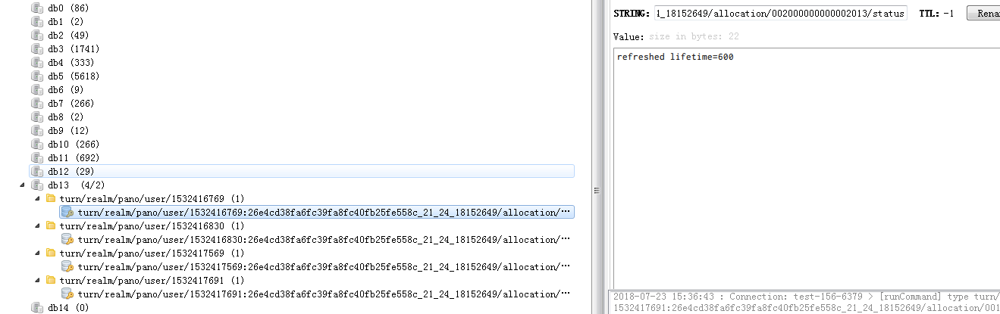
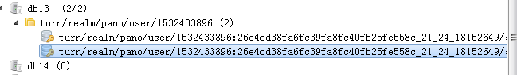
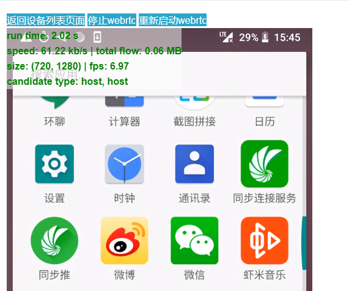
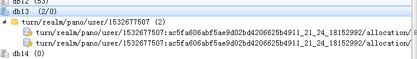
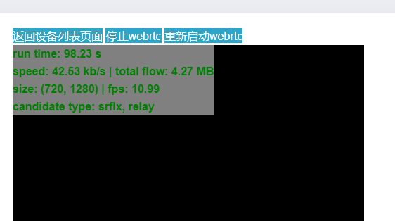
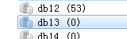
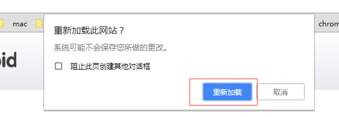

## 前言
虽然已经用 coturn 来作为 webrtc 的转发服。 但是我们只做了一个最基本的静态key的加密校验而已。但是对于转发的流量和转发的时长，却没法统计。
但是事实上，对于转发的流量和时长对于我们的业务来说是非常必要的。
刚好 coturn 有提供了一个统计的redis配置，**redis-statsdb**，这个是就是 turnserver 会将一些统计的数据存到 redis 中。 然后我们去取就行了。
所以要在配置文件里面加上这一个配置:
````html
redis-statsdb="ip=59.57.xx.xx dbname=13 port=6379 connect_timeout=30"
````
<!--more-->
具体文档：

-O, --redis-statsdb	<connection-string>	Redis status and statistics database connection string, if used (default - empty, no Redis stats DB used). This database keeps allocations status information, and it can be also used for publishing and delivering traffic and allocation event notifications. The connection string has the same parameters as redis-userdb connection string.

也就是这个参数是用来做状态统计的。 可以用来发布和传递流量， 还有断开和连接的webhook通知。通过这个统计的redis db，我们可以得到这一次转发的开始时间，结束时间，以及转发的流量。
大概的一个截图就是：

这边还有更详细的说明： [schema.stats.redis](https://github.com/coturn/coturn/blob/master/turndb/schema.stats.redis)
状态的key就是： 
```html
turn/user/<username>/allocation/<id>/status
```
举例：
```html
 turn/realm/pano/user/1531994598:fe909a0a4cde20be0a7bb9fbfdc8d6dc_21_24_18154723/allocation/003000000000002028/status
```
他的值有可能是 **new lifetime=...** 或者是 **refreshed lifetime=...**

一个用户名下可能有多个状态。
然后是订阅： 
- 通过订阅： **turn/realm/\*/user/\*/allocation/\*/status**  这个主题，可以得到一些事件，比如 deleted 事件
- 通过订阅: **turn/realm/\*/user/\*/allocation/\*/traffic**  这个主题，可以得到一些信息，比如流量， 当这个配置被删除的时候， 也可以得到通知。

如果是订阅所有的配置，那么就是 **turn/realm/\*/user/\*/allocation/\*/total_traffic**
因为不能过期，所以redis 的配置文件，要配置这两个：
```html
timeout 0
tcp-keepalive 60
```
## 分析
假设我们已经在使用webrtc的应用上连接上turn server了，并且已经在转发了。那我们就可以看下这个redis跑的统计数据都是什么样的？
接下来先在redis 先sub一下：
```html
127.0.0.1:6379[13]> psubscribe turn/realm/*
Reading messages... (press Ctrl-C to quit)
1) "pmessage"
2) "turn/realm/*"
3) "turn/realm/pano/user/1532417691:26e4cd38fa6fc39fa8fc40fb25fe558c_21_24_18152649/allocation/001000000000003326/status"
4) "new lifetime=600"
1) "pmessage"
2) "turn/realm/*"
3) "turn/realm/pano/user/1532417569:26e4cd38fa6fc39fa8fc40fb25fe558c_21_24_18152649/allocation/001000000000003324/status"
4) "new lifetime=600"
1) "pmessage"
2) "turn/realm/*"
3) "turn/realm/pano/user/1532417569:26e4cd38fa6fc39fa8fc40fb25fe558c_21_24_18152649/allocation/003000000000003700/status"
4) "refreshed lifetime=0"
1) "pmessage"
2) "turn/realm/*"
3) "turn/realm/pano/user/1532417569:26e4cd38fa6fc39fa8fc40fb25fe558c_21_24_18152649/allocation/003000000000003700/status"
4) "deleted"
1) "pmessage"
2) "turn/realm/*"
3) "turn/realm/pano/user/1532417569:26e4cd38fa6fc39fa8fc40fb25fe558c_21_24_18152649/allocation/003000000000003700/total_traffic"
4) "rcvp=0, rcvb=0, sentp=0, sentb=0"
1) "pmessage"
2) "turn/realm/*"
3) "turn/realm/pano/user/1532417569:26e4cd38fa6fc39fa8fc40fb25fe558c_21_24_18152649/allocation/001000000000003324/traffic"
4) "rcvp=1610, rcvb=1607159, sentp=438, sentb=22052"
1) "pmessage"
2) "turn/realm/*"
3) "turn/realm/pano/user/1532417569:26e4cd38fa6fc39fa8fc40fb25fe558c_21_24_18152649/allocation/001000000000003324/traffic"
4) "rcvp=1385, rcvb=1404252, sentp=663, sentb=31187"
1) "pmessage"
2) "turn/realm/*"
3) "turn/realm/pano/user/1532417569:26e4cd38fa6fc39fa8fc40fb25fe558c_21_24_18152649/allocation/001000000000003324/traffic"
4) "rcvp=1407, rcvb=1442093, sentp=641, sentb=30066"
1) "pmessage"
2) "turn/realm/*"
3) "turn/realm/pano/user/1532417569:26e4cd38fa6fc39fa8fc40fb25fe558c_21_24_18152649/allocation/001000000000003324/traffic"
4) "rcvp=1383, rcvb=1408780, sentp=665, sentb=31146"
1) "pmessage"
2) "turn/realm/*"
3) "turn/realm/pano/user/1532417691:26e4cd38fa6fc39fa8fc40fb25fe558c_21_24_18152649/allocation/001000000000003326/status"
4) "refreshed lifetime=0"
1) "pmessage"
2) "turn/realm/*"
3) "turn/realm/pano/user/1532417691:26e4cd38fa6fc39fa8fc40fb25fe558c_21_24_18152649/allocation/001000000000003326/status"
4) "deleted"
1) "pmessage"
2) "turn/realm/*"
3) "turn/realm/pano/user/1532417691:26e4cd38fa6fc39fa8fc40fb25fe558c_21_24_18152649/allocation/001000000000003326/total_traffic"
4) "rcvp=0, rcvb=0, sentp=0, sentb=0"
1) "pmessage"
2) "turn/realm/*"
3) "turn/realm/pano/user/1532417569:26e4cd38fa6fc39fa8fc40fb25fe558c_21_24_18152649/allocation/001000000000003324/status"
4) "refreshed lifetime=0"
1) "pmessage"
2) "turn/realm/*"
3) "turn/realm/pano/user/1532417691:26e4cd38fa6fc39fa8fc40fb25fe558c_21_24_18152649/allocation/001000000000003327/status"
4) "new lifetime=600"
1) "pmessage"
2) "turn/realm/*"
3) "turn/realm/pano/user/1532417691:26e4cd38fa6fc39fa8fc40fb25fe558c_21_24_18152649/allocation/003000000000003705/status"
4) "new lifetime=600"
1) "pmessage"
2) "turn/realm/*"
3) "turn/realm/pano/user/1532417569:26e4cd38fa6fc39fa8fc40fb25fe558c_21_24_18152649/allocation/001000000000003324/status"
4) "deleted"
1) "pmessage"
2) "turn/realm/*"
3) "turn/realm/pano/user/1532417569:26e4cd38fa6fc39fa8fc40fb25fe558c_21_24_18152649/allocation/001000000000003324/total_traffic"
4) "rcvp=5785, rcvb=5862284, sentp=2407, sentb=114451"
```
可以看到进行一次连接的话，会分配好几条临时会话。 从下图来看的话，可以看到有 4 条，其实这四条都属于同一个连接。

接下来我们一条一条来分析：
- 刚开始建立了一条 3326 的临时channel ， 生命周期是 600s，也就是 10分钟
- 然后又建立了一条 3324 的临时channel
- 接下来的三条分别是，刷新一条 3700 的临时channel ，lifetime 为0，说明是要删除，所以接下来就收到一条 delete 的状态，说明这个临时topic要删除，然后当删除的时候，就会将这一段时间的流量(total_traffic )也传上来。
- 接下来的4条，全部都是 3324 这一个topic的流量信息。包括收到的字节和发送的字节
- 接下来的三条是3326，分别是将lifetime 为0，然后delete，最后关于这条临时channel 的流量过来。
- 接下来的一条是 3324 这一条的lifetime 为 0， 然后是两条新的临时channel 的建立， 然后就是 3324 收到 delete 的状态，和总流量的通知。

总结一下：
### 1. 一次的webrtc 的turnserver 转发，其实会分配了好几个临时的 channel。
### 2. 每个 channel 的生命周期和对应的状态

每个 channel 刚开始创建的时候，生命周期只有 600s， 这个可以在 配置文件设置：
```html
# Uncomment to set the lifetime for the channel.
# Default value is 600 secs (10 minutes).
# This value MUST not be changed for production purposes.
#
#channel-lifetime=600
```
而且刚开始创建就会有状态通知，内容就是 **new lifetime=600**。
虽然每个channel的生命周期都是 600s， 但是并不意味着，600s 之后，这个channel就会被删除，其实不是的，这个是可以被续的，也就是如果这个 channel 被续了，那么就会有这个状态通知：
```html
1) "pmessage"
2) "turn/realm/*"
3) "turn/realm/pano/user/1532403222:26e4cd38fa6fc39fa8fc40fb25fe558c_21_24_18152649/allocation/004000000000003897/status"
4) "refreshed lifetime=600"
```
这个说明被续了一个周期了。当然也有不续的，这时候也会有这个状态，不过这时候 lifetime 是 0:
```html
1) "pmessage"
2) "turn/realm/*"
3) "turn/realm/pano/user/1532415366:07a9939e437c9bca97f67b4b74de6a2f_21_24_22819787/allocation/004000000000003905/status"
4) "refreshed lifetime=0"
```
一旦 lifetime 为0， 就说明这个channel要被删除了。 这时候就会收到 delete 状态:
```html
1) "pmessage"
2) "turn/realm/*"
3) "turn/realm/pano/user/1532415366:07a9939e437c9bca97f67b4b74de6a2f_21_24_22819787/allocation/000000000000001816/status"
4) "deleted"
```
这时候就说明这条channel已经被删除了。
而且每一个channel 的最长生命周期是可以配置的，默认是 3600s:
```html
# Uncomment if you want to set the maximum allocation
# time before it has to be refreshed.
# Default is 3600s.
#
#max-allocate-lifetime=3600
```
所以一个完整的 channel 周期就是  **创建-> 续周期(一次以上) -> 删除 (如果续的是 0)**
针对这个，我后面试了一下， 在一次长达 一个多小时的webrtc连接， 那个转发流量的channel， 续周期续了7次， 一次 600s， 总的是 7 * 600 = 4200， 比3600 还大了，但是也还没有断开,所以这个也有点奇怪？？？
### 3. 流量信息
每一条channel 在生命周期之内，如果有进行流量转发的话，那么就会每隔一段时间就会有 traffic 这个状态过来，注意，如果是 stun 或者 local 这种不走转发的，那么是没有这个事件的：
```html
1) "pmessage"
2) "turn/realm/*"
3) "turn/realm/pano/user/1532417569:26e4cd38fa6fc39fa8fc40fb25fe558c_21_24_18152649/allocation/001000000000003324/traffic"
4) "rcvp=1383, rcvb=1408780, sentp=665, sentb=31146"
```
而且每次的channel 的生命周期结束之后，也就是 delete 状态，也会收到这一条生命周期的所有的转发流量数据。 
```html
1) "pmessage"
2) "turn/realm/*"
3) "turn/realm/pano/user/1532417569:26e4cd38fa6fc39fa8fc40fb25fe558c_21_24_18152649/allocation/001000000000003324/total_traffic"
4) "rcvp=5785, rcvb=5862284, sentp=2407, sentb=114451"
```
跟 traffic 不一样， traffic 是真的是转发有流量，才会每隔一段时间抛一次，而 total_traffic 是必会有的，不管是穿透还是转发， 只不过如果是穿透的话，那就是都是 0，比如:
```html
1) "pmessage"
2) "turn/realm/*"
3) "turn/realm/pano/user/1532415366:07a9939e437c9bca97f67b4b74de6a2f_21_24_22819787/allocation/004000000000003905/total_traffic"
4) "rcvp=0, rcvb=0, sentp=0, sentb=0"
```
每一个 delete 状态，都会跟着一个 total_traffic 事件。 而里面的 这些参数，其实都是 traffic 的所有对应参数的总和。
这四个参数分别是：
```html
rcvp： 收到的数据包
rcvb:   收到的字节（byte）
sentp： 发送的数据包
sentb： 发送的字节（byte）
```
所以我们如果要统计这一次转发的时长的话，那么就要记录这次连接的所有的channel。也就是如果这一次的转发，有5个channel，那么就第一个channel创建的时候，就是开始时间， 当所有的channel 都断开的时候，那么就是结束时间。 一定要所有的channel 都断开，才算转发结束，
而且中间还会有不断的新的channel被创建，这些新的channel也要加入到map里面去。然后每一个channel断开，就从map里面去掉， 一直到最后map为空的话，才算转发结束。算转发的总流量也是一样，每一个channel都会有一段流量。 当所有的channel都断开的时候，加起来就是总的转发流量。
## 代码实现
刚开始是这样子写的：
```javascript
package main

import (
   "errors"
   "fmt"
   "github.com/garyburd/redigo/redis"
   "iGong/util/log"
   "strconv"
   "strings"
   "sync"
   "time"
)

type OnlineTimeBucket struct {
   Data   map[string]*OnlineTimeBucketSub
   Locker *sync.Mutex
}

func NewOnlineTimeBucket() *OnlineTimeBucket {
   return &OnlineTimeBucket{
      Data:   make(map[string]*OnlineTimeBucketSub),
      Locker: &sync.Mutex{},
   }
}

type OnlineTimeBucketSub struct {
   Timer map[string]*OnlineTime
}

type OnlineTime struct {
   Start        int64
   End          int64
   Delete       bool
   TotalTraffIc bool
   Rcvp         int
   Rcvb         int
   Sentp        int
   Sentb        int
}

var onlineTimeBucket *OnlineTimeBucket
var serverTime = time.Now().Unix()

/*
turn/realm/pano/user/1531882310:7ed1019263ce5e09f3d40a1ca15ae992_21_24_18152992/allocation/000000000000000495/status new lifetime=600
turn/realm/pano/user/1531881513:7ed1019263ce5e09f3d40a1ca15ae992_21_24_18152992/allocation/001000000000000462/status refreshed lifetime=0
turn/realm/pano/user/1531882310:7ed1019263ce5e09f3d40a1ca15ae992_21_24_18152992/allocation/004000000000000899/status deleted
turn/realm/pano/user/1531881513:7ed1019263ce5e09f3d40a1ca15ae992_21_24_18152992/allocation/001000000000000462/total_traffic rcvp=18612, rcvb=894124, sentp=104268, sentb=114206669
turn/realm/pano/user/1531881926:26e4cd38fa6fc39fa8fc40fb25fe558c_21_24_18152649/allocation/004000000000000896/traffic rcvp=1847, rcvb=2052114, sentp=201, sentb=10652
*/

func TurnServerStats() {
   conn, err := RedisTurn.GetConn()
   sub := redis.PubSubConn{Conn: conn}
   if err != nil {
      log.Error(err)
   }
   defer conn.Close()
   onlineTimeBucket = NewOnlineTimeBucket()
   sub.PSubscribe("turn/realm/*")

   for {
      switch n := sub.Receive().(type) {
      //case redis.Message:
      // fmt.Printf("Message: %s %s\n", n.Channel, n.Data)
      case redis.PMessage:
         err = forwardStats(n)
         if err != nil {
            continue
         }
         
      case error:
         fmt.Printf("error: %v\n", n)
         return
      }
   }

}

func forwardStats(data redis.PMessage) (err error) {
   fmt.Printf("PMessage: %s %s %s\n", data.Pattern, data.Channel, data.Data)
   event, deviceId, channel, err := decodeChannel(data.Channel)
   if err != nil {
      log.Error(err)
      return err
   }
   log.Info(event, deviceId)
   switch event {
   case "status":
      //统计时长 和在线状态
      onlineStatus := decodeDataWithStatus(data.Data)
      log.Info(onlineStatus)
      addOnlineTime(deviceId, channel, onlineStatus)
   case "total_traffic":
      //统计流量 这个事件过来说明转发已经结束 并且只有一个会话是有值的
      trafficMap, err := decodeDataWithTraffic(data.Data)
      if err != nil {
         return err
      }
      //rcvp 接收到的包数量  rcvb 接收到的流量 sentp 发送的包数量 sentb 发送的包流量
      log.Info(trafficMap)
      addFlow(deviceId, channel, trafficMap)

   }
   return

}

func decodeChannel(channel string) (event string, deviceId, channelId string, err error) {
   args := strings.Split(channel, "/")
   if len(args) != 8 {
      err = errors.New("channel fail .")
      return
   }
   event = args[7]
   deviceId = strings.Split(args[4], ":")[1]
   channelId = args[6]
   return

}

func decodeDataWithStatus(data []byte) (onlineStatus int) {
   args := strings.Split(string(data), "=")
   switch args[0] {
   //新建
   case "new lifetime":
      onlineStatus = 0
      //刷新
   case "refreshed lifetime":
      onlineStatus = 1
      //移除
   case "deleted":
      onlineStatus = 2
   default:
      onlineStatus = 1
   }
   return
}
func decodeDataWithTraffic(data []byte) (stats map[string]int, err error) {
   args := strings.Split(string(data), ",")
   if len(args) != 4 {
      err = errors.New("traffic data fail")
      return
   }
   stats = make(map[string]int)
   for _, v := range args {
      statsInfo := strings.Split(v, "=")
      s, _ := strconv.Atoi(statsInfo[1])
      stats[strings.TrimLeft(statsInfo[0], " ")] = s
   }
   return
}

//记录转发时长
func addOnlineTime(deviceId, channelId string, onlineStatus int) {
   if onlineStatus == 1 {
      return
   }
   onlineTimeBucket.Locker.Lock()
   timer := time.Now().Unix()
   if _, ok := onlineTimeBucket.Data[deviceId]; !ok {
      j := new(OnlineTimeBucketSub)
      j.Timer = make(map[string]*OnlineTime)
      onlineTimeBucket.Data[deviceId] = j
   }
   switch onlineStatus {
   case 0:
      log.Info("new life_time")
      var onlineModel = new(OnlineTime)
      onlineModel.Start = timer
      onlineTimeBucket.Data[deviceId].Timer[channelId] = onlineModel
   case 2:
      log.Info("delete life_time")
      if _, ok := onlineTimeBucket.Data[deviceId].Timer[channelId]; !ok {
         var onlineModel = new(OnlineTime)
         onlineModel.Start = serverTime
         onlineTimeBucket.Data[deviceId].Timer[channelId] = onlineModel
      }
      onlineTimeBucket.Data[deviceId].Timer[channelId].End = timer
      onlineTimeBucket.Data[deviceId].Timer[channelId].Delete = true
   }
   onlineTimeBucket.Locker.Unlock()

}

//记录转发流量并入库
func addFlow(deviceId, channelId string, trafficMap map[string]int) {
   onlineTimeBucket.Locker.Lock()
   if _, ok := onlineTimeBucket.Data[deviceId]; !ok {
      j := new(OnlineTimeBucketSub)
      j.Timer = make(map[string]*OnlineTime)
      onlineTimeBucket.Data[deviceId] = j
   }

   onlineTimeBucket.Data[deviceId].Timer[channelId].Rcvb = trafficMap["rcvb"]
   onlineTimeBucket.Data[deviceId].Timer[channelId].Rcvp = trafficMap["rcvp"]
   onlineTimeBucket.Data[deviceId].Timer[channelId].Sentb = trafficMap["sentb"]
   onlineTimeBucket.Data[deviceId].Timer[channelId].Sentp = trafficMap["sentp"]
   onlineTimeBucket.Data[deviceId].Timer[channelId].TotalTraffIc = true
   var isDelete = true
   for _, v := range onlineTimeBucket.Data[deviceId].Timer {
      if v.Delete == false || v.TotalTraffIc == false {
         isDelete = false
      }
   }

   if isDelete {
      //计算时间,,流量
      var rcvb, rcvp, sentb, sentp int
      var end int64
      start := time.Now().Unix()
      for _, v := range onlineTimeBucket.Data[deviceId].Timer {
         rcvb += v.Rcvb
         rcvp += v.Rcvp
         sentp += v.Sentp
         sentb += v.Sentb
         if start > v.Start {
            start = v.Start
         }
         if end < v.End {
            end = v.End
         }
      }
      accountInfo := strings.Split(deviceId, "_")
      if len(accountInfo) < 4 {
         log.Info("deviceId len fail ", deviceId)
      }
      total_time := onlineTimeBucket.Data[deviceId].Timer[channelId].End - onlineTimeBucket.Data[deviceId].Timer[channelId].Start
      err := InsertTurnServerLogs(accountInfo[3], accountInfo[0], accountInfo[1], accountInfo[2], start, end, total_time, rcvp, rcvb, sentp, sentb)
      if err != nil {
         log.Error(err)
      }
      onlineTimeBucket.Data[deviceId].Timer = nil
      delete(onlineTimeBucket.Data, deviceId)
   }

   onlineTimeBucket.Locker.Unlock()
}
```
按照上面的算法来做的话，当我在用web测试的时候，会出现一个情况：
<font color=red>就是如果 coturn 的连接断开了。但是对于这个username， 他还是会保持一两条临时 channel</font>
```html
1) "pmessage"
2) "turn/realm/*"
3) "turn/realm/pano/user/1532433896:26e4cd38fa6fc39fa8fc40fb25fe558c_21_24_18152649/allocation/000000000000001857/traffic"
4) "rcvp=1466, rcvb=1325047, sentp=582, sentb=29696"
1) "pmessage"
2) "turn/realm/*"
3) "turn/realm/pano/user/1532433896:26e4cd38fa6fc39fa8fc40fb25fe558c_21_24_18152649/allocation/001000000000003357/status"
4) "refreshed lifetime=0"
1) "pmessage"
2) "turn/realm/*"
3) "turn/realm/pano/user/1532433896:26e4cd38fa6fc39fa8fc40fb25fe558c_21_24_18152649/allocation/001000000000003357/status"
4) "deleted"
1) "pmessage"
2) "turn/realm/*"
3) "turn/realm/pano/user/1532433896:26e4cd38fa6fc39fa8fc40fb25fe558c_21_24_18152649/allocation/001000000000003357/total_traffic"
4) "rcvp=0, rcvb=0, sentp=0, sentb=0"
1) "pmessage"
2) "turn/realm/*"
3) "turn/realm/pano/user/1532433896:26e4cd38fa6fc39fa8fc40fb25fe558c_21_24_18152649/allocation/000000000000001857/status"
4) "refreshed lifetime=0"
1) "pmessage"
2) "turn/realm/*"
3) "turn/realm/pano/user/1532433896:26e4cd38fa6fc39fa8fc40fb25fe558c_21_24_18152649/allocation/003000000000003734/status"
4) "new lifetime=600"
1) "pmessage"
2) "turn/realm/*"
3) "turn/realm/pano/user/1532433896:26e4cd38fa6fc39fa8fc40fb25fe558c_21_24_18152649/allocation/001000000000003358/status"
4) "new lifetime=600"
1) "pmessage"
2) "turn/realm/*"
3) "turn/realm/pano/user/1532433896:26e4cd38fa6fc39fa8fc40fb25fe558c_21_24_18152649/allocation/000000000000001857/status"
4) "deleted"
1) "pmessage"
2) "turn/realm/*"
3) "turn/realm/pano/user/1532433896:26e4cd38fa6fc39fa8fc40fb25fe558c_21_24_18152649/allocation/000000000000001857/total_traffic"
4) "rcvp=1466, rcvb=1325047, sentp=582, sentb=29696"
```
明明我连接断开了，但是又重新连接了两条。而且这两条根本不会释放

这个就会导致 isDelete 的条件没法成立，因为总有新的链接没有释放。
而且后面还发现，一次转发，虽然有好几条channel存在，但是真正转发流量的channel只有一条，而且过了一个多小时，还是没有断。所以原则上我们只要去判断这一条channel，就可以知道本次转发的时长和流量了。 其他的channel都不要管。但是如果是stun这种穿透的，因为没有转发流量，所以根本不知道那一条的channel，才是起作用的那一条？？？？ 

后面发现这种情况其实是一个bug， 之所以浏览器刷新还保持两条turn channel 是因为浏览器在刷新的时候，其实没有明确的给手机端发送断开webrtc的信号。导致手机端其实还不知道webrtc断开了。所以手机端其实是对turnserver连接进行重连了， 这也是为啥会有新的两条channel 的问题。
我试了其他端，比如 ios 端，如果是断开的话，是不会有遗留turnserver 的channel 的，最后全部都会被清掉。因此对于web端，在刷新浏览器，或者是退出页面的时候，都要给手机的发送断开webrtc的信号，并且断开本地的webrtc连接。
所以web端的代码得改下：
```javascript
// 关掉 webrtc
stopWebRtcServer: function () {
    var self = this;
    // 给手机端发送一个webrtc 关闭的指令
    self.mqttSocket.pub(
            self.subCommonStr + 'toTarget',
            {
                "method": "webrtc.stop",
            },
            {
                useAes: true,
            }
    ).done(function (data) {
        console.log("%c accept stop:" + JSON.stringify(data), "color:red");
    });
    // 清空状态统计的定时
    clearTimeout(self.rtcStateMap.timeId);
    // 关闭signal长连接
    self.mqttSocket.close();
    // 关闭webrtc 连接
    self.rtcSocket.close();
},
```
其中 rtcSocket 的 close 事件为：
```javascript
close: function(){
    // 停止 video 传输
    var video = this._pc.getRemoteStreams()[0].getVideoTracks()[0];
    video.stop();
    // 关掉 pc 对象
    this._pc.close();
}
```
先停止video传输，再释放掉 pc 对象。这时候本来 webrtc work 的时候，是这样的：

看到的消息就是：
```html
1) "pmessage"
2) "turn/realm/*"
3) "turn/realm/pano/user/1532677507:ac5fa606abf5ae9d02bd4206625b4911_21_24_18152992/allocation/001000000000004071/status"
4) "new lifetime=600"
1) "pmessage"
2) "turn/realm/*"
3) "turn/realm/pano/user/1532677507:ac5fa606abf5ae9d02bd4206625b4911_21_24_18152992/allocation/004000000000004390/status"
4) "new lifetime=600"
1) "pmessage"
2) "turn/realm/*"
3) "turn/realm/pano/user/1532677507:ac5fa606abf5ae9d02bd4206625b4911_21_24_18152992/allocation/000000000000002210/status"
4) "new lifetime=600"
1) "pmessage"
2) "turn/realm/*"
3) "turn/realm/pano/user/1532677507:ac5fa606abf5ae9d02bd4206625b4911_21_24_18152992/allocation/004000000000004390/status"
4) "refreshed lifetime=0"
1) "pmessage"
2) "turn/realm/*"
3) "turn/realm/pano/user/1532677507:ac5fa606abf5ae9d02bd4206625b4911_21_24_18152992/allocation/004000000000004390/status"
4) "deleted"
1) "pmessage"
2) "turn/realm/*"
3) "turn/realm/pano/user/1532677507:ac5fa606abf5ae9d02bd4206625b4911_21_24_18152992/allocation/004000000000004390/total_traffic"
4) "rcvp=0, rcvb=0, sentp=0, sentb=0"
1) "pmessage"
2) "turn/realm/*"
3) "turn/realm/pano/user/1532677507:ac5fa606abf5ae9d02bd4206625b4911_21_24_18152992/allocation/001000000000004071/traffic"
4) "rcvp=1546, rcvb=1442311, sentp=502, sentb=24802"
```
就是建了3条 channel ，然后删掉一条 390 ，保留两条， 后面分别是 210 和 071

这时候我点击 停止webrtc 按钮，图片传输就会停止了。这时候webrtc 就断开了。

这时候就收到了断开的消息了， 210 和 071 都断开了:
```html
1) "pmessage"
2) "turn/realm/*"
3) "turn/realm/pano/user/1532677507:ac5fa606abf5ae9d02bd4206625b4911_21_24_18152992/allocation/000000000000002210/status"
4) "refreshed lifetime=0"
1) "pmessage"
2) "turn/realm/*"
3) "turn/realm/pano/user/1532677507:ac5fa606abf5ae9d02bd4206625b4911_21_24_18152992/allocation/001000000000004071/status"
4) "refreshed lifetime=0"
1) "pmessage"
2) "turn/realm/*"
3) "turn/realm/pano/user/1532677507:ac5fa606abf5ae9d02bd4206625b4911_21_24_18152992/allocation/000000000000002210/status"
4) "deleted"
1) "pmessage"
2) "turn/realm/*"
3) "turn/realm/pano/user/1532677507:ac5fa606abf5ae9d02bd4206625b4911_21_24_18152992/allocation/000000000000002210/total_traffic"
4) "rcvp=0, rcvb=0, sentp=0, sentb=0"
1) "pmessage"
2) "turn/realm/*"
3) "turn/realm/pano/user/1532677507:ac5fa606abf5ae9d02bd4206625b4911_21_24_18152992/allocation/001000000000004071/status"
4) "deleted"
1) "pmessage"
2) "turn/realm/*"
3) "turn/realm/pano/user/1532677507:ac5fa606abf5ae9d02bd4206625b4911_21_24_18152992/allocation/001000000000004071/total_traffic"
4) "rcvp=4595, rcvb=4367095, sentp=1549, sentb=74756"
```
这时候channel 就全部为空了。

所以要这样才可以。 但是问题来了，刚才是我们手动点击 停止 webrtc 按钮的，当然流程是对的。
但是如果是直接刷新浏览器呢，那可是来不及处理的？？？？
事实上也是有这个问题，如果直接刷新浏览器，并且不作处理的时候，就会出现最早之前的那种情况，就是手机端认为还连着，所以 turnserver 又建了两条新的 channel 。
所以我后面加了这个事件 **onbeforeunload**：
```javascript
// 这时候要设置一个unload事件，不然如果直接浏览器刷新的话，手机端是不知道webrtc不用了，他还会连接 turnserver， 导致turnserver 的session 一直在，后面没法算时间
// 设置unonload, 防止直接刷新浏览器的时候，没有传 webrtc.stop 指令
window.onbeforeunload = function(){
    self.stopWebRtcServer();
    return true;
};
```
每次用户刷新的时候，这时候就会弹出这个窗口，当用户点击 重新加载的时候， 这时候 stop 操作就已经处理完了。

因此就成功关闭了，缺点就是用户每次刷新都会弹窗，并且要点击重新加载。

所以服务端来说的话，整个连接过程中创建的channel 都要做判断，只有当channel 全部断掉的时候， 才判断这个连接结束，这时候才要算时间。虽然每一次连接都有一条channel 在发送流量。所以如果 traffic 有值的话，那么就是这一条有流量统计。所以如果有收到有流量的 total_traffic 的事件 ，那么应该就是 relay 的连接断开了。这时候就可以计算时长并入库了。
所以修改后的代码如下：
```javascript
package main

import (
   "errors"
   "fmt"
   "github.com/garyburd/redigo/redis"
   "iGong/util/log"
   "strconv"
   "strings"
   "sync"
   "time"
)

type OnlineTimeBucket struct {
   Data   map[string]*OnlineTimeBucketSub
   Locker *sync.RWMutex
}

func NewOnlineTimeBucket() *OnlineTimeBucket {
   return &OnlineTimeBucket{
      Data:   make(map[string]*OnlineTimeBucketSub),
      Locker: &sync.RWMutex{},
   }
}

type OnlineTimeBucketSub struct {
   Timer map[string]*OnlineTime
}

//map 存在线时间,结束时间-开始时间,,结束之后再存入表

type OnlineTime struct {
   Start         int64
   RefreshedFlow int64
   End           int64
   Delete        bool
   TotalTraffIc  bool
   Rcvp          int
   Rcvb          int
   Sentp         int
   Sentb         int
}

var onlineTimeBucket *OnlineTimeBucket
var serverTime = time.Now().Unix()

/*
turn/realm/pano/user/1531882310:7ed1019263ce5e09f3d40a1ca15ae992_21_24_18152992/allocation/000000000000000495/status new lifetime=600
turn/realm/pano/user/1531881513:7ed1019263ce5e09f3d40a1ca15ae992_21_24_18152992/allocation/001000000000000462/status refreshed lifetime=0
turn/realm/pano/user/1531882310:7ed1019263ce5e09f3d40a1ca15ae992_21_24_18152992/allocation/004000000000000899/status deleted
turn/realm/pano/user/1531881513:7ed1019263ce5e09f3d40a1ca15ae992_21_24_18152992/allocation/001000000000000462/total_traffic rcvp=18612, rcvb=894124, sentp=104268, sentb=114206669
turn/realm/pano/user/1531881926:26e4cd38fa6fc39fa8fc40fb25fe558c_21_24_18152649/allocation/004000000000000896/traffic rcvp=1847, rcvb=2052114, sentp=201, sentb=10652
*/

func TurnServerStats() {
   conn, err := RedisTurn.GetConn()
   sub := redis.PubSubConn{Conn: conn}
   if err != nil {
      log.Error(err)
   }
   defer conn.Close()
   onlineTimeBucket = NewOnlineTimeBucket()
   sub.PSubscribe("turn/realm/*")

   for {
      switch n := sub.Receive().(type) {
      //case redis.Message:
      // fmt.Printf("Message: %s %s\n", n.Channel, n.Data)
      case redis.PMessage:
         err = forwardStats(n)
         if err != nil {
            continue
         }
      case error:
         fmt.Printf("error: %v\n", n)
         return
      }
   }
}

func forwardStats(data redis.PMessage) (err error) {
   fmt.Printf("PMessage: %s %s %s\n", data.Pattern, data.Channel, data.Data)
   event, deviceId, channel, err := decodeChannel(data.Channel)
   if err != nil {
      log.Error(err)
      return err
   }
   log.Info(event, deviceId)
   switch event {
   case "status":
      //统计时长 和在线状态
      onlineStatus := decodeDataWithStatus(data.Data)
      log.Info(onlineStatus)
      addOnlineTime(deviceId, channel, onlineStatus)
   case "traffic", "total_traffic":
      //统计流量 这个事件过来说明转发已经结束 并且只有一个会话是有值的
      trafficMap, err := decodeDataWithTraffic(data.Data)
      if err != nil {
         return err
      }
      //rcvp 接收到的包数量  rcvb 接收到的流量 sentp 发送的包数量 sentb 发送的包流量
      log.Info(trafficMap)
      addFlow(deviceId, channel, trafficMap, event)

   }
   return
}

func decodeChannel(channel string) (event string, deviceId, channelId string, err error) {
   args := strings.Split(channel, "/")
   if len(args) != 8 {
      err = errors.New("channel fail .")
      return
   }
   event = args[7]
   deviceId = strings.Split(args[4], ":")[1]
   channelId = args[6]
   return
}

func decodeDataWithStatus(data []byte) (onlineStatus int) {
   args := strings.Split(string(data), "=")
   switch args[0] {
   //新建
   case "new lifetime":
      onlineStatus = 0
      //刷新
   case "refreshed lifetime":
      onlineStatus = 1
      //移除
   case "deleted":
      onlineStatus = 2
   default:
      onlineStatus = 1
   }
   return
}
func decodeDataWithTraffic(data []byte) (stats map[string]int, err error) {
   args := strings.Split(string(data), ",")
   if len(args) != 4 {
      err = errors.New("traffic data fail")
      return
   }
   stats = make(map[string]int)
   for _, v := range args {
      statsInfo := strings.Split(v, "=")
      s, _ := strconv.Atoi(statsInfo[1])
      stats[strings.TrimLeft(statsInfo[0], " ")] = s
   }
   return
}

//记录转发时长
func addOnlineTime(deviceId, channelId string, onlineStatus int) {
   if onlineStatus == 1 {
      return
   }
   timer := time.Now().Unix()
   if _, ok := onlineTimeBucket.Data[deviceId]; !ok {
      j := new(OnlineTimeBucketSub)
      j.Timer = make(map[string]*OnlineTime)
      onlineTimeBucket.Locker.Lock()
      onlineTimeBucket.Data[deviceId] = j
      onlineTimeBucket.Locker.Unlock()
   }
   onlineTimeBucket.Locker.RLock()
   switch onlineStatus {
   case 0:
      log.Info("new life_time")
      var onlineModel = new(OnlineTime)
      onlineModel.Start = timer
      onlineTimeBucket.Data[deviceId].Timer[channelId] = onlineModel
   case 2:
      log.Info("delete life_time")
      if _, ok := onlineTimeBucket.Data[deviceId].Timer[channelId]; !ok {
         var onlineModel = new(OnlineTime)
         onlineModel.Start = serverTime
         onlineTimeBucket.Data[deviceId].Timer[channelId] = onlineModel
      }
      onlineTimeBucket.Data[deviceId].Timer[channelId].End = timer
      onlineTimeBucket.Data[deviceId].Timer[channelId].Delete = true
   }
   onlineTimeBucket.Locker.RUnlock()

}

//记录转发流量并入库
func addFlow(deviceId, channelId string, trafficMap map[string]int, event string) {
   if _, ok := onlineTimeBucket.Data[deviceId]; !ok {
      j := new(OnlineTimeBucketSub)
      j.Timer = make(map[string]*OnlineTime)
      j.Timer[channelId].Start = time.Now().Unix()
      onlineTimeBucket.Locker.Lock()
      onlineTimeBucket.Data[deviceId] = j
      onlineTimeBucket.Locker.Unlock()

   } else {

   }
   onlineTimeBucket.Locker.RLock()
   if event == "total_traffic" {
      onlineTimeBucket.Data[deviceId].Timer[channelId].Rcvb = trafficMap["rcvb"]
      onlineTimeBucket.Data[deviceId].Timer[channelId].Rcvp = trafficMap["rcvp"]
      onlineTimeBucket.Data[deviceId].Timer[channelId].Sentb = trafficMap["sentb"]
      onlineTimeBucket.Data[deviceId].Timer[channelId].Sentp = trafficMap["sentp"]
      onlineTimeBucket.Data[deviceId].Timer[channelId].TotalTraffIc = true
      var isDelete = true
      if trafficMap["rcvb"] == 0 {
          //当穿透的时候流量为0,并且不会保存回话,所以需要判断所有会话是否关闭  当转发的时候,流量会大于0 ,但是可能会保留回话,所以转发的时候只需要判断流量过来就可以结束
          for _, v := range onlineTimeBucket.Data[deviceId].Timer {
             if v.Delete == false || v.TotalTraffIc == false {
                 isDelete = false
             }
          }
      }
      if isDelete {
         onlineTimeBucket.Locker.RUnlock()
         insertFlowLogs(deviceId)
         return
      }
   } else {
      onlineTimeBucket.Data[deviceId].Timer[channelId].RefreshedFlow = time.Now().Unix()
   }

   onlineTimeBucket.Locker.RUnlock()
}

func insertFlowLogs(deviceId string) {
    log.Info("start insertFlowLogs=>",deviceId)
   var rcvb, rcvp, sentb, sentp int
   var end int64
   start := time.Now().Unix()
   for _, v := range onlineTimeBucket.Data[deviceId].Timer {
      rcvb += v.Rcvb
      rcvp += v.Rcvp
      sentp += v.Sentp
      sentb += v.Sentb
      if start > v.Start {
         start = v.Start
      }
      if end < v.End {
         end = v.End
      }
   }
   accountInfo := strings.Split(deviceId, "_")
   if len(accountInfo) < 4 {
      log.Info("deviceId len fail ", deviceId)
   }

   err := InsertTurnServerLogs(accountInfo[3], accountInfo[0], accountInfo[1], accountInfo[2], start, end, end-start, rcvp, rcvb, sentp, sentb)
   if err != nil {
      log.Error(err)
   }
   onlineTimeBucket.Locker.Lock()
   onlineTimeBucket.Data[deviceId].Timer = nil
   delete(onlineTimeBucket.Data, deviceId)
   onlineTimeBucket.Locker.Unlock()
}

//程序关闭时调用,,记录 使用时长
func forceInsertTurnServerUseLogs() {
   onlineTimeBucket.Locker.Lock()
   log.Info("start forceInsertTurnServerUseLogs")
   for k, v := range onlineTimeBucket.Data {
      //取其中一个的开始时间就可以
      var start = time.Now().Unix()
      var end = time.Now().Unix()
      var rcvb, rcvp, sentb, sentp int
      for _, v := range v.Timer {
         rcvb += v.Rcvb
         rcvp += v.Rcvp
         sentp += v.Sentp
         sentb += v.Sentb
         if start > v.Start {
            start = v.Start
         }
      }
      useTime := end - start
      accountInfo := strings.Split(k, "_")
      if len(accountInfo) < 4 {
         log.Info("deviceId len fail ", k)
      }
      err := InsertTurnServerLogs(accountInfo[3], accountInfo[0], accountInfo[1], accountInfo[2], start, end, useTime, rcvp, rcvb, sentp, sentb)
      if err != nil {
         log.Error(err)
      }
   }
   onlineTimeBucket.Locker.Unlock()
}
```
如果是穿透的话，因为没有流量，所以每次收到 total_traffic的时候，都要判断是不是所有的channel 都断开了。如果是的话，那么就是连接断开了。这时候就统计时长并且入统计。


