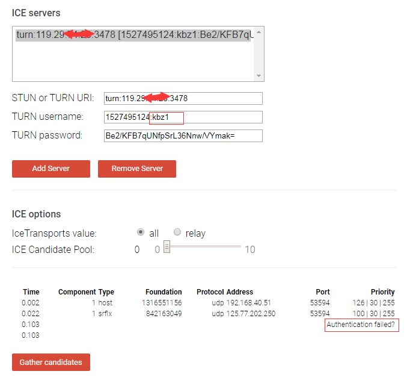

## 前言
通过  我们知道自己搭的turn server 可以用于 webrtc 的 turn server转发了，所以接下来就要开始弄 coturn 的校验机制了。
具体的配置项：[传送门](https://github.com/coturn/coturn/wiki/turnserver)
校验方式主要是有两种：
- 配置固定的用户名和密码
- 静态key校验

我们采用的是通过开启静态key的方式，和配合 ttl 有效期的方式来做连接校验。
<!--more-->
## 实现 rest api 校验接口
turn server 是没有实现 rest api 接口的，所以需要服务提供方自行实现及部署。
格式是类似于这样子：
```javascript
TURN 服务器自身没有必要实现该接口，所以需要服务提供方自行实现及部署。
* 此 TURN REST API 有标准的参考文档，包括了请求参数以及返回内容，都有明确规定。码农们需要按照该文档内描述的内容来实现该接口。
* 文档里提到的内容有：
* ① 请求信息，方式 GET：
* 需要包含：service(“turn”)、username、key
* 例如：/turn?username=392938130&key=4080218913
* ② 响应信息，内容格式 JSON Dictionary：
* 需要包涵：username、password、ttl(可选, 单位秒. 推荐86400)、uris(数组)
* 例如：

{
    "username": "1433065916:392938130", 
    "password": "***base64 encoded string***", 
    "ttl":86400, 
    "uris": [
            "turn:104.155.31.xxx:3478?transport=udp", 
            "turn:104.155.31.xxx:3478?transport=tcp", 
            "turn:104.155.31.xxx:3479?transport=udp", 
            "turn:104.155.31.xxx:3479?transport=tcp"
    ]
}
```
基本形式就是这样。需要提及的有：
1、响应的 username 字段，需要以【timestamp + ":" + username】的形式输出。注意：这里 timestamp 为密码失效的 UNIX 时间戳，即【当前 timestamp + ttl 时长】；而 username 则是请求时提交的 username，原封不动；中间使用半角冒号做字符串连接（默认设置下是这样，你也可以自己改，不过多蛋疼……）。
2、响应的 password 字段，需要以 HMAC-SHA1 算法计算得出，公式为：【base64_encode( hmac( key, turn-username ) )】。此处的 key，为 coTurn 服务器配置中的 “static-auth-secret”值。以 key 作为 hmac 算法的密钥，turn-username 为被计算的内容，得出的 hmac 摘要后，经 base64 编码得到最终密码。

我用 golang 写的代码就是：
```javascript
func (c *Turn) Test() revel.Result {
   res := Res{}
   username := "kbz"
   expired := time.Now().Unix() + DefaultTTL
   username = strconv.Itoa(int(expired)) + ":" + username
   // turnserver 这个值 static-auth-secret=1234567890
   key := "1234567890"
   password := crypto.Base64EncodeToStr(crypto.HmacSha1(key, username))

   var turnData TurnServer
   // 以下硬编码
   turnData.Username = username
   turnData.Password = password
   turnData.Ttl = DefaultTTL
   turnData.Uris = append(turnData.Uris, "turn:119.29.xx.xx:3478")

   res.Code = 1
   res.Msg = "ok"
   res.Data = turnData
   return utils.EchoResult(c.Controller, res)
}
```
当然username 我是直接硬编码的， 后面可能是通过获取 请求中的某些参数 用来做 username。这个其实不重要，因为只要可以按照加密方式和设置的那个静态key，得到一个password。
然后当这两个传过去coturn 去做连接的时候， coturn 能够根据 username 和 本地保存的 静态key，通过同样的加密方式， 最后算出来的key要跟传过去的key一致就行了。当然时间戳校验也是一个方面，但是时间戳校验比较简单，就是传过去的这个时间戳，如果比当前时间还小，那么就会失效
首先是开启静态key的方式： 这个要在 turnserver.conf 配置：
```javascript
lt-cred-mech
use-auth-secret
static-auth-secret=1234567890
```
这几个都得开起来才行， 静态key就是上面那个 1234567890， 当然线上环境的 key，会更加复杂。
当然还可以在 turnserver.conf 配置固定的用户名和密码，不过这个场景不适合我们，因此就注释掉了：
```javascript
#user=username1:password1
#user=username2:password2
```
## 测试
请求上面的接口，就会返回：
```javascript
{
	code: 1,
	msg: "ok",
	data:  {
		username: "1527495124:kbz",
		uris:  [
			"turn:119.29.xx.xx:3478"
		],
		ttl: 2592000,
		password: "Be2/KFB7qUNfpSrL36Nnw/VYmak="
	},
	extra: null
}
```
### 代码测试连通性
我这边有写了一个测试 turn server 连通性的demo： 
```html
<!DOCTYPE>
<html>
<head>
    <title>check turn server active</title>
</head>
<body>
<script>
    let checkTURNServer = (turnConfig, timeout) => {
        return new Promise((resolve, reject) => {
            setTimeout(() => {
                if(promiseResolved) return;
                resolve(false);
                promiseResolved = true;
            }, timeout || 5000);

            let promiseResolved = false,
                //compatibility for firefox and chrome
                myPeerConnection = window.RTCPeerConnection || window.mozRTCPeerConnection || window.webkitRTCPeerConnection,
                pc = new myPeerConnection({iceServers:[turnConfig]}),
                noop = ()=>{};

            //create a bogus data channel
            pc.createDataChannel("");

            // create offer and set local description
            pc.createOffer(sdp => {
                // sometimes sdp contains the ice candidates...
                if(sdp.sdp.indexOf('typ relay') > -1){
                    promiseResolved = true;
                    resolve(true);
                }
                pc.setLocalDescription(sdp, noop, noop);
            }, noop);
            //listen for candidate events
            pc.onicecandidate = ice => {
                if(promiseResolved || !ice || !ice.candidate || !ice.candidate.candidate || !(ice.candidate.candidate.indexOf('typ relay')>-1))  return;
                promiseResolved = true;
                resolve(true);
            };
        });
    };
    checkTURNServer({
        url: 'turn:47.96.xx.xx:3478',
        username: '1582791566:abc',
        credential: 'gNOW/jQO9ZAQHrnt0haIk1meyec=',
    }).then(function(bool){
        document.body.innerHTML = 'is my TURN server active: ' +  '<span style="color: red">' + (bool ? 'yes':'no') + '</span>';
    }).catch(console.error.bind(console));
</script>
</body>
</html>
```
执行这个页面，如果可以连通的话，那么就是：

### webrtc提供的ice测试
但是后面发现，还有一个更便捷的方法，就是webrtc 有提供了 ice 的测试，也可以来测试turn server 是否正常： [地址](https://webrtc.github.io/samples/src/content/peerconnection/trickle-ice/)
然后我们就用这个测下，正确和不正确的情况
#### 正确
填入正确的地址，用户名和密码。

可以看到有出现 relay了， 那就说明连接成功了。
#### 用户名不正确
接下来看下错误的情况，比如我把用户名改下：

马上报权限错误了。
#### 密码错误

发现也是报权限错误。
#### 用户名和密码都对，但是ttl 错了

也是报权限错误。

## 总结
所以基本上的校验机制就是这样。当然还有更复杂的，比如连接各种数据库，然后做用户名和密码的校验。 但是我觉得基本校验的话，这个程度应该就可以。 因为更复杂的校验，会在业务里面。


